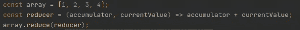
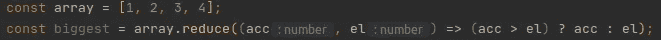
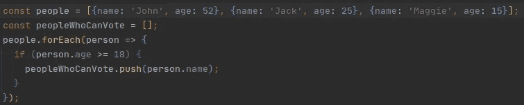
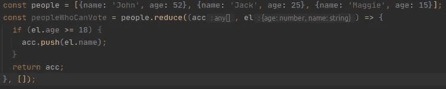

# 学习在 Javascript 中使用 Reduce()一次。

> 原文：<https://medium.com/analytics-vidhya/learn-to-use-reduce-in-javascript-for-once-39645aed0668?source=collection_archive---------22----------------------->

也许你有时会看到。reduce()函数就像一些你可能永远不会用到的超级函数。你大错特错了。

也许你会看到这样一些例子:

你认为这是一个有用的特性，但是，只是在某些特定的情况下。你完全错了。

# 回归基础

**reduce()** 方法将数组缩减为单个值。显然，reduct 函数对数组进行了归约，但这是什么意思呢？

这意味着你可以为数组的每个元素定义一个函数，最后只得到一个输出。下面的例子展示了如何获取数组中最大的元素:

# 性能

reduct 函数的描述如下:

> arr.reduce(回调(累加器，实际值[，索引[，数组]])[，initialValue])

乍一看，这似乎有点令人困惑的宣言。这是什么回调？蓄电池呢？让我们看看:

## 回收

对数组中的每个元素执行的函数。这是一个函数，你可以用它来处理数组。

## 蓄电池

该值累加所有回调返回值。这意味着在循环的每次交互中，你必须返回累加值。

## 实际值

它是正在处理的当前值。它是每个交互中数组的每个元素。

## 索引

它是正在处理的值的当前索引。

## 排列

它是原始数组。

## 基础资料

它是累加器的初始值。如果这个值没有设置，这个字段从数组的第一个元素获取值，而实际值从第二个元素开始。

好了，我们有了属性，但是，我们如何使用优化代码的方法呢？

# 神奇之处:用例

这种功能最重要的特征之一是它们的灵活性。你可以返回任何你想要的:布尔值，字符串，数字，数组，甚至是一个对象。

我将给出一个例子:您正在处理一个二维数组，其中包含姓名和年龄值:

> const people =[{姓名:约翰，年龄:52}，{姓名:杰克，年龄:25}，{姓名:玛吉，年龄:15}]

我们想提取一个数组，里面只有这些人的名字，他们可以在下一次选举中投票。我们可以使用像 forEach 这样的函数，并通过推送在另一个变量中设置值，看起来像这样:

而在 reduce 函数的情况下是这样的:

我们可以创建更复杂的条件来减少函数，但最重要的是要记住，在循环的下一次迭代中总是返回 de accumulator。

# 结论

我认为 reduce 是一个强大的函数，它允许将数组转换为您想要的任何值，我认为 Javascript 开发人员学习使用它很重要，因为这可以在专业代码中产生不同。