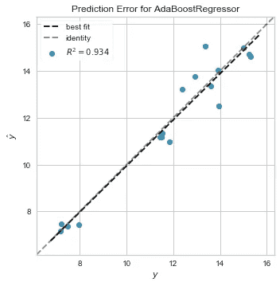

# 学习使用 TPOT:一个自动化工具

> 原文：<https://medium.com/analytics-vidhya/learn-to-use-tpot-an-automl-tool-4c52148c2bc9?source=collection_archive---------8----------------------->

在本文中，我将分享我基于 TPOT(基于树的管道优化工具)的一些见解。我将通过我使用的一个数据集来解释这个工具。

# 什么是 TPOT？

TPOT 代表基于树的管道优化工具。它用于解决或给出机器学习问题的思路。这有助于我们探索一些我们之前在模型中没有考虑到的管道配置。它有助于我们找到解决问题的最佳算法。我们输入数据，即训练输入和训练输出。它分析数据，并告诉我们最佳的机器学习模型。


TPOT 是开源的，是 scikit 学习库的一部分。它可用于回归和分类模型。每一个库的实现和加载都是不同的。

# TPOT 的工作(使用数据集)


这就像一个**搜索算法**通常会搜索最佳算法。最终的搜索结果基本上取决于性能，即哪个算法比其他算法提供更大的准确性。它还调整了一些超参数，以获得更好的性能和评估。所以不能认为是随机搜索算法。

现在一般有两种类型的 TPOT:

*   TPOT 分类器
*   TPOT 回归者。

我们将使用一个数据集来研究它们的工作原理。

# TPOT 分类器

为此，我们获取了一个包含客户信息的银行数据集。


执行数据清理是为了将数据转换成所需的形式。在完成几个功能后，我们将数据转换成所需的形式。

响应变量:下月违约付款
探索变量:身份证、婚姻、年龄、Bill_AMT1…Bill_AMT5

```
train=df.drop('default payment next month',axis=1)
test=df['default payment next month']from sklearn.preprocessing import StandardScaler
sc=StandardScaler()
train=sc.fit_transform(train)from sklearn import model_selection
x_train,x_test,y_train,y_test=model_selection.train_test_split(train,test)
```

# 实现 TPOT 分类器

```
from tpot import TPOTClassifier
from sklearn.metrics import roc_auc_score
```

默认 TPOTClassifier 参数:

```
generations=100, 
population_size=100, 
offspring_size=None  # Jeff notes this gets set to population_size
mutation_rate=0.9, 
crossover_rate=0.1, 
scoring="Accuracy",  # for Classification
cv=5, 
subsample=1.0, 
n_jobs=1,
max_time_mins=None, 
max_eval_time_mins=5,
random_state=None, 
config_dict=None,
warm_start=False, 
memory=None,
periodic_checkpoint_folder=None, 
early_stop=None
verbosity=0
disable_update_check=False
```

我们的模型:

```
pot = TPOTClassifier(
    generations=5,
    population_size=20,
    verbosity=2,
    scoring='roc_auc',
    random_state=42,
    disable_update_check=True,
    config_dict='TPOT light'
)
tpot.fit(x_train, y_train)
```

运行模型后，我们得到了结果:


```
tpot_auc_score = roc_auc_score(y_test, tpot.predict_proba(x_test)[:, 1])
print(f'\nAUC score: {tpot_auc_score:.4f}')
```

输出:

```
0.660
```

要了解最佳模式:

```
print('\nBest pipeline steps:', end='\n')
for idx, (name, transform) in enumerate(tpot.fitted_pipeline_.steps, start=1):
    print(f'{idx}. {transform}')
```


此外，您可以执行 GridSearchCV 之类的其他算法来优化超参数。

使用 tpot 提出的算法后得到的结果


# TPOT 回归量

为此，我们考虑了 RBI 网站上的一个数据集。
我们执行了数据清理部分，并以要求的形式接收数据


响应变量:增长

```
from sklearn.preprocessing import StandardScaler
sc=StandardScaler()
df=sc.fit_transform(df)y=df[' Y-o-Y Growth in (7) (%)']
x=df.drop(' Y-o-Y Growth in (7) (%)',axis=1)from sklearn import model_selection
x_train,x_test,y_train,y_test=model_selection.train_test_split(x,y)
```

变量与响应变量的相关性


# 模型实现

```
from tpot import TPOTRegressor
from sklearn.metrics import roc_auc_scoretpot = TPOTRegressor(
    generations=5,
    population_size=50,
    verbosity=2,
)
tpot.fit(x_train, y_train)
```

运行模型后，我们得到了结果:


在使用了 TPOT 告诉我们的算法后，我们得到了很好的结果



# 关于 TPOT 的有用信息

tpot 根据一些参数来确定要搜索的管道数量

*   **世代** : int，可选(默认值:100)
    运行流水线优化过程的迭代次数。总的来说，当你给 TPOT 更多代(因此也给它更多时间)来优化管道时，它会做得更好。TPOT 将评估总人口规模+世代 x 后代规模管道(强调我)。
*   **population_size** : int，可选(默认值:100)
    每一代在 GP 种群中保留的个体数量。
    一般来说，如果你让更多的人(因此也有更多的时间)来优化渠道，TPOT 会做得更好。
*   **后代 _ 大小** : int，可选(默认:无)
    每个 GP 世代要产生的后代数量。默认情况下，后代大小=人口大小。

最新 tpot 更新中包含的算法:

```
‘sklearn.naive_bayes.BernoulliNB’: { ‘alpha’: [1e-3, 1e-2, 1e-1, 1., 10., 100.], ‘fit_prior’: [True, False] }, 
‘sklearn.naive_bayes.MultinomialNB’: { ‘alpha’: [1e-3, 1e-2, 1e-1, 1., 10., 100.], ‘fit_prior’: [True, False] }, 
‘sklearn.tree.DecisionTreeClassifier’: { ‘criterion’: [“gini”, “entropy”], ‘max_depth’: range(1, 11), ‘min_samples_split’: range(2, 21), ‘min_samples_leaf’: range(1, 21) }, 
‘sklearn.ensemble.ExtraTreesClassifier’: { ‘n_estimators’: [100], ‘criterion’: [“gini”, “entropy”], ‘max_features’: np.arange(0.05, 1.01, 0.05), ‘min_samples_split’: range(2, 21), ‘min_samples_leaf’: range(1, 21), ‘bootstrap’: [True, False] },
‘sklearn.ensemble.RandomForestClassifier’: { ‘n_estimators’: [100], ‘criterion’: [“gini”, “entropy”], ‘max_features’: np.arange(0.05, 1.01, 0.05), ‘min_samples_split’: range(2, 21), ‘min_samples_leaf’: range(1, 21), ‘bootstrap’: [True, False] }, 
‘sklearn.ensemble.GradientBoostingClassifier’: { ‘n_estimators’: [100], ‘learning_rate’: [1e-3, 1e-2, 1e-1, 0.5, 1.], ‘max_depth’: range(1, 11), ‘min_samples_split’: range(2, 21), ‘min_samples_leaf’: range(1, 21), ‘subsample’: np.arange(0.05, 1.01, 0.05), ‘max_features’: np.arange(0.05, 1.01, 0.05) },
‘sklearn.neighbors.KNeighborsClassifier’: { ‘n_neighbors’: range(1, 101), ‘weights’: [“uniform”, “distance”], ‘p’: [1, 2] }, 
‘sklearn.svm.LinearSVC’: { ‘penalty’: [“l1”, “l2”], ‘loss’: [“hinge”, “squared_hinge”], ‘dual’: [True, False], ‘tol’: [1e-5, 1e-4, 1e-3, 1e-2, 1e-1], ‘C’: [1e-4, 1e-3, 1e-2, 1e-1, 0.5, 1., 5., 10., 15., 20., 25.] }, 
‘sklearn.linear_model.LogisticRegression’: { ‘penalty’: [“l1”, “l2”], ‘C’: [1e-4, 1e-3, 1e-2, 1e-1, 0.5, 1., 5., 10., 15., 20., 25.], ‘dual’: [True, False] }, 
‘xgboost.XGBClassifier’: { ‘n_estimators’: [100], ‘max_depth’: range(1, 11), ‘learning_rate’: [1e-3, 1e-2, 1e-1, 0.5, 1.], ‘subsample’: np.arange(0.05, 1.01, 0.05), ‘min_child_weight’: range(1, 21), ‘nthread’: [1] }
```

# 限制

*   TPOT 有时需要很长时间来寻找算法。因为它搜索所有算法，应用于我们提供的数据，这可能需要很长时间。如果我们在没有任何预处理步骤的情况下提供数据，它将花费更多的时间，因为它首先实现这些步骤，然后应用算法。
*   在某些情况下，TPOT 对提供的相同数据显示不同的结果。当我们在复杂数据集上工作时会发生这种情况