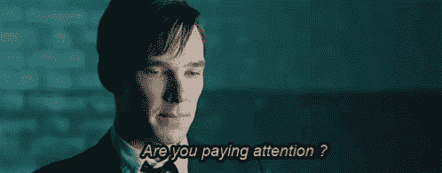
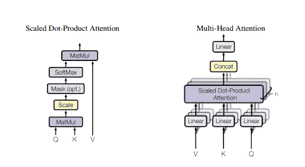
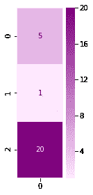
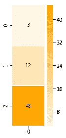
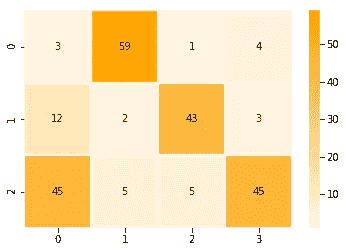
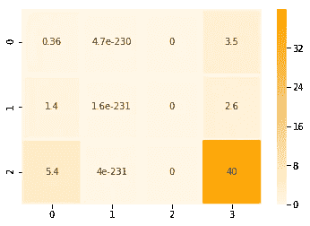
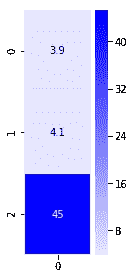

# 从零开始学习注意力机制！

> 原文：<https://medium.com/analytics-vidhya/learning-attention-mechanism-from-scratch-f08706aaf6b6?source=collection_archive---------1----------------------->

因为[注意力是你所需要的全部](https://arxiv.org/abs/1706.03762)，毫不夸张！

> “人类感知的一个重要特性是，人们不倾向于一次性完整地处理整个场景。相反，人类选择性地将注意力集中在视觉空间的部分，以在需要的时间和地点获取信息，并随着时间的推移结合来自不同注视的信息，建立场景的内部表示，指导未来的眼球运动和决策”[视觉注意力循环模型](https://papers.nips.cc/paper/5542-recurrent-models-of-visual-attention.pdf)，2014



Gif 礼遇:[谷歌](https://www.google.co.in/url?sa=i&source=images&cd=&ved=2ahUKEwi8-dKwqOzjAhWDYysKHTloC_EQjRx6BAgBEAU&url=https%3A%2F%2Ftenor.com%2Fview%2Fattention-benedict-cumberbatch-paying-attention-cumberbatch-benedict-gif-5957401&psig=AOvVaw1wuj2FNihn_hG-lxeIdXBA&ust=1565114581105181)

在这篇文章中，我将向你展示注意力是如何实现的。主要的焦点是从一个更大的模型中分离出注意力。这是因为当我们在现实世界模型中实现注意力时，很多注意力都集中在管道数据和处理大量向量上，而不是注意力的概念本身。

***我将实现注意力评分以及计算注意力上下文向量。***



[(左)缩放点积注意。(右)我们将在下面计算的多头注意力](https://arxiv.org/pdf/1706.03762.pdf)

# 注意力评分:

让我们先来看看我们将给予评分函数的输入。我们将假设我们处于解码阶段的第一步。计分函数的第一个输入是解码器的*隐藏状态(假设一个玩具 RNN 有三个隐藏节点——在现实生活中不可用，但更容易说明)*

```
dec_hidden_state = [5,1,20]
```

让我们想象一下这个向量:

```
%matplotlib inline
import numpy as np
import matplotlib.pyplot as plt
import seaborn as sns
```

让我们想象一下我们的解码器隐藏状态:

```
plt.figure(figsize=(1.5, 4.5))
sns.heatmap(np.transpose(np.matrix(dec_hidden_state)), annot=True, cmap=sns.light_palette(“purple”, as_cmap=True), linewidths=1)
```

你会得到这样的结果:



我们的第一个评分函数将对单个注释(编码器隐藏状态)进行评分，如下所示:

```
annotation = [3,12,45] #e.g. Encoder hidden state
```

让我们想象一下这个注释:

```
plt.figure(figsize=(1.5, 4.5))
sns.heatmap(np.transpose(np.matrix(annotation)), annot=True, cmap=sns.light_palette(“orange”, as_cmap=True), linewidths=1)
```



# 实施:对单个注释评分

让我们计算单个注释的点积。

> N umPy 的点()是这个操作的一个很好的候选

```
def single_dot_attention_score(dec_hidden_state, enc_hidden_state):
 #return the dot product of the two vectors
 return np.dot(dec_hidden_state, enc_hidden_state)

single_dot_attention_score(dec_hidden_state, annotation)
```

结果:927

# 注释矩阵

现在让我们来看一下一次给所有的注释打分。为此，这里是我们的注释矩阵:

```
annotations = np.transpose([[3,12,45], [59,2,5], [1,43,5], [4,3,45.3]])
```

并且可以这样可视化(每一列都是一个编码器时间步长的隐藏状态):

```
 ax = sns.heatmap(annotations, annot=True, cmap=sns.light_palette(“orange”, as_cmap=True), linewidths=1)
```



# 实现:一次给所有注释打分

让我们用矩阵乘法一步算出所有注解的分数。让我们继续使用点评分法，但要做到这一点，我们必须转置 dec_hidden_state 并将其与注释相乘。

```
def dot_attention_score(dec_hidden_state, annotations):
 # return the product of dec_hidden_state transpose and enc_hidden_states
 return np.matmul(np.transpose(dec_hidden_state), annotations)

attention_weights_raw = dot_attention_score(dec_hidden_state, annotations)
attention_weights_raw
```

现在我们有了分数，让我们应用 softmax:

```
def softmax(x):
 x = np.array(x, dtype=np.float128)
 e_x = np.exp(x)
 return e_x / e_x.sum(axis=0)attention_weights = softmax(attention_weights_raw)
attention_weights
```

# 将分数应用回注释

现在我们已经有了分数，让我们将每个注释乘以它的分数，以更接近注意力上下文向量。这是这个公式的乘法部分(我们将在后面的单元格中处理求和部分)

```
def apply_attention_scores(attention_weights, annotations):
 # Multiple the annotations by their weights
 return attention_weights * annotationsapplied_attention = apply_attention_scores(attention_weights, annotations)
applied_attention
```

让我们想象一下上下文向量的样子，因为我们已经对它应用了注意力分数:

```
# Let’s visualize our annotations after applying attention to them
ax = sns.heatmap(applied_attention, annot=True, cmap=sns.light_palette(“orange”, as_cmap=True), linewidths=1)
```



将这与之前可视化的原始注释进行对比，我们可以看到第二个和第三个注释(列)几乎被删除了。第一个注释保留了它的一些值，第四个注释是最明显的。

# 计算注意力上下文向量

现在，要生成我们的注意力上下文向量，剩下的就是将四列相加，以生成单个注意力上下文向量

```
def calculate_attention_vector(applied_attention):
 return np.sum(applied_attention, axis=1)attention_vector = calculate_attention_vector(applied_attention)
attention_vector# Let’s visualize the attention context vector
plt.figure(figsize=(1.5, 4.5))
sns.heatmap(np.transpose(np.matrix(attention_vector)), annot=True, cmap=sns.light_palette(“Blue”, as_cmap=True), linewidths=1)
```



现在我们有了上下文向量，我们可以将它与隐藏状态连接起来，并通过隐藏层传递它，以提供这个解码时间步骤的结果。

因此，在这篇博文中，我们学习了注意力评分的所有内容，对单个&所有注释评分，注释矩阵，将分数应用到注释上。我希望，将注意力的实现从一个更大的模型中分离出来，能让注意力的概念变得更加清晰。

**如果想一次把代码全部检查出来，请参考:** [**注意基础知识**](https://github.com/Garima13a/Attention-Mechanism-Basics)