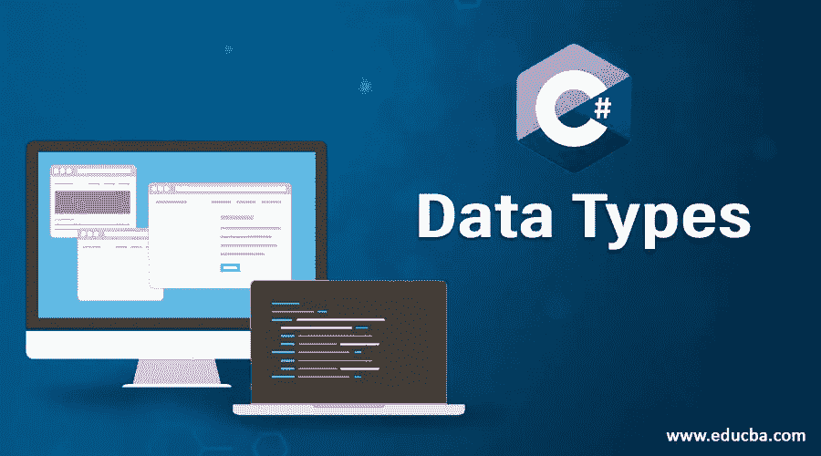
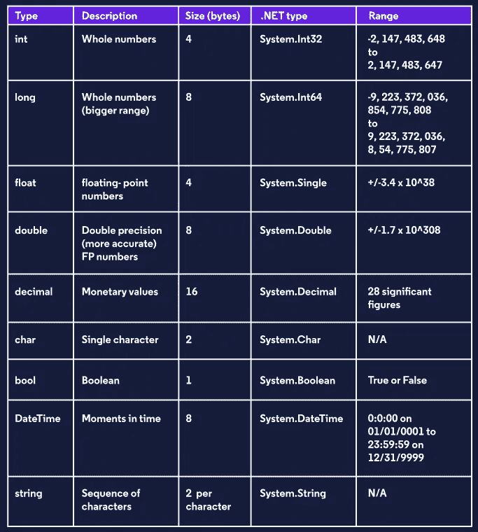

# 学习 C# —变量、数字和文本

> 原文：<https://medium.com/analytics-vidhya/learning-c-variables-numbers-and-text-b968f1c2eebf?source=collection_archive---------17----------------------->

如果我们要继续学习 C#，我们必须了解更多的基础知识，以便更好地掌握这门语言。就像其他语言一样，真正理解如何保存变量以及处理数字/文本数据是最重要的事情之一。

# 强类型语言

C#是一种强类型语言，这意味着设置变量与其他语言略有不同。对于 C#来说，要正确地识别什么被保存到我们的变量中，我们必须明确地告诉它我们保存的是什么类型的数据。C#也很挑剔，这意味着在程序运行之前，它要确保我们是在用强类型数据类型编程。这叫做静态类型化。如果我们不小心尝试从一个数字中减去文本，或者尝试用一个数字除一个句子，这将使程序停止运行！

# C#数据类型

虽然所有编程语言中都有不同类型的数据，但我们必须高度关注 C#！有些数据类型比其他类型更突出；换句话说就是我们更常用的类型。不管怎样，了解它们都很重要！这是一个很好的图表，可以分解 C#中不同的数据类型。

# 数字数据类型

int 是 integer、double、char、bool 和 string 的缩写，肯定会成为我们最常用的数据类型声明。如果你以前用过 JavaScript，你会知道要声明一个变量，我们可以在变量名前说 **let** 或 **const** ，然后设置它等于我们想要的。在这里，我们将使用上表中“类型”列中的一些单词，根据我们存储的数据来声明我们需要什么。

> string myName = " Rutger

这里有一个例子，我将一个字符串(或文本数据)保存到一个名为“myName”的变量中(注意变量名称在 **camel case** 中是如何出现的)。我们将对带有 int 或 double 的数字、带有 bool 的 true 或 false 以及带有 char 的单字母字符串做同样的处理。所有这些都是很好的了解和学习如何区分彼此。随着时间和实践的推移，至少要知道这是我们在 C#中声明的方式！

# 转换数据类型

有时我们保存的变量会想要改变数据类型；编程中什么都有可能发生！即使 C#是强类型的，也有一些方法可以做到这一点。有时数据类型可以很容易地改变，如果这样做时**没有丢失任何数据的话**。这叫做*隐式转换*。要进行显式转换，一个很好且简单的例子是使用 int(整数或整数)和 double(不像 decimal 那样占用大量内存的数据类型)数据类型。我们会这样做:

> double hereIsANumber = 4.22
> 
> int novitis this number =(int)hereis number；

总是检查你的转换是否需要显式的！

# 文本数据类型

主要的两种文本数据类型是**字符串**和**字符**数据类型。制作一根弦相当简单；您只需保存带有引用文本的变量。记住你不能在你的字符串中使用引号*，除非你用单引号将字符串括起来！*

> string sayingHi = "哦，你好！"；
> 
> string whatDidYouSay = '我想他跟我打招呼了！'；

# 串并置

字符串连接是我们将字符串加在一起的一种方式，它允许我们输入变量或其他保存的数据。这非常有利于互动，可以通过用户的个人资料与用户交流，或者发送大量电子邮件，每个收件人都会收到“个性化”的问候。要将字符串加在一起，这就是 C#中要做的全部工作:

> string favoriteSuperhero = "蝙蝠侠"；
> 
> string favoriteCity = " Gotham
> 
> 控制台。WriteLine(“我最喜欢的超级英雄是“+ favoriteSuperhero +”，他们住在“+ favoriteCity +”。”);

请注意，从我们插入的附加变量中展开句子所需的空间，并结束我们的控制台。带句点的 WriteLine。

# 字符串插值

字符串插值使这一切变得更简单，并使串联几乎没有必要。虽然知道内插法是件好事，但它确实是将变量输入字符串的黄金标准。我们所要做的就是用一个' $ '符号开始我们的字符串，并在一些花括号之间输入我们的变量。

> string favoriteSuperhero = "蝙蝠侠"；
> 
> string favoriteCity = " Gotham
> 
> 控制台。WriteLine($“我最喜欢的超级英雄是{favoriteSuperhero}，他们住在{favoriteCity}。”);

这看起来更自然，写起来更快，而且不会留下太多的空格和标点符号的错误！

# 字符串信息和操作

为了获得一些关于字符串的简单信息，我们可以询问字符串的大小或者某个字符在字符串中的位置。这是伟大的，当寻找或授权一个密码！如果我们有一个字符串保存到一个变量中，我们所要做的就是让我的变量。长度找出我们的长度！为了抓取某个字符，我们可以把我的变量。IndexOf("a ")查找字母" a "出现的位置。它将返回字符串中“a”所在位置的数值(索引从 0 开始，所以如果单词是 apple，它将为“a”索引返回 0)。

也有很多方法来操作字符串，但是一个非常简单的方法是将整个字符串大写或小写。因为我们要求程序*做*一些事情，我们必须确保我们使用括号来启动函数。为此，我们只需编写 my 变量。ToUpper()或 myVariable。ToLower()给我们一个大写或小写的字符串。注意！这给了我们另一个字符串，而不是转换我们原来保存的字符串。这些函数来自。NET 库的 C#和是内置的！

# 不断探索可能性

在 C#中，有许多其他方法来操作和转换保存数字或文本信息的变量。这只是一个介绍。记住上面图表中的数据类型，并使用这些知识进行研究！能够创建变量是了解如何使用 C#的第一个重要开端，所以请将这些知识作为重要的基础，并继续研究！