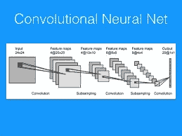
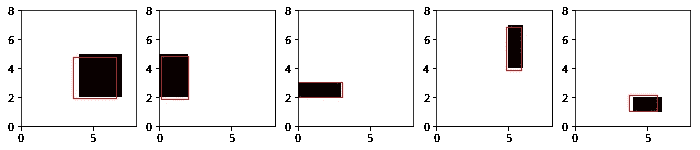
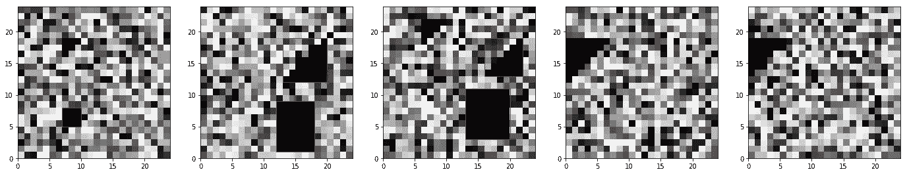
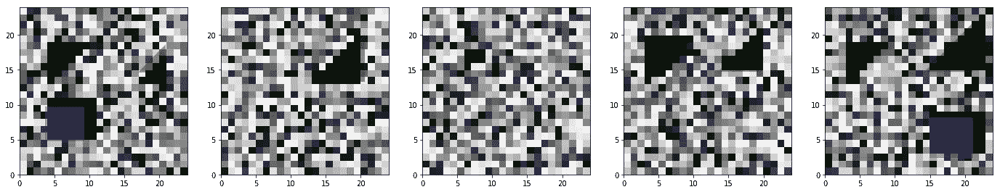

# 使用简单的 KERAS 和 PYTHON 程序学习 CNN(带图像数据)

> 原文：<https://medium.com/analytics-vidhya/learning-cnn-using-simple-keras-python-programs-7be7b9efa852?source=collection_archive---------2----------------------->



美国有线新闻网；卷积神经网络

在这里，我将尝试分享我学习 CNN 的经验。我放了简单的小例子(代码)来快速理解。Python (≥3.6)和 Keras (≥2)在后端与 Tensorflow 一起使用。Jupyter 笔记本最适合这些例子。还有呢？运行代码并享受乐趣…

## 1.手写识别

这里是下载 MNIST 数据集的地方。在训练&验证模型后，使用测试数据评估性能。GPU/更高-运行代码需要 RAM。还需要互联网连接。

```
#importing libraries
import numpy
from keras.datasets import mnist
from keras.models import Sequential
from keras.layers import Dense, Dropout, Flatten, Conv2D, MaxPooling2D
from keras.utils import np_utils
from keras import backend as K
K.set_image_dim_ordering(‘tf’)#seed input for random values
seed = 2018
numpy.random.seed(seed)#loading MNIST data & reshaping
(X_train, y_train), (X_test, y_test) = mnist.load_data()
X_train = X_train.reshape(X_train.shape[0], 28, 28, 1).astype('float32')
X_test = X_test.reshape(X_test.shape[0], 28, 28, 1).astype('float32')#data pre-processing
X_train = X_train / 255
X_test = X_test / 255
y_train = np_utils.to_categorical(y_train)
y_test = np_utils.to_categorical(y_test)
num_classes = y_test.shape[1]#function for creating deep network model
def create_model():
 model = Sequential()
 model.add(Conv2D(32, (5, 5), input_shape=(28, 28,1), activation='relu'))
 model.add(MaxPooling2D(pool_size=(2, 2)))
 model.add(Dropout(0.2))
 model.add(Flatten())
 model.add(Dense(128, activation='relu'))
 model.add(Dense(num_classes, activation='softmax'))
 model.compile(loss='categorical_crossentropy', optimizer='adam', metrics=['accuracy'])
 return model#training, validating & testing
model = create_model()
model.summary()
model.fit(X_train, y_train, validation_data=(X_test, y_test), epochs=10, batch_size=200, verbose=1)
scores = model.evaluate(X_test, y_test, verbose=1)
print("CNN Error: %.2f%%" % (100-scores[1]*100))
```

## 2.物体识别

*这里用 IMAGENET 数据集预训练的 VGG16 网络用于识别一个物体(现实生活中常见的物体)。不需要 GPU。需要互联网连接。*

```
#importing libraries
import numpy as np
from IPython.display import Image, display
from keras.applications import VGG16, imagenet_utils
from keras.preprocessing.image import img_to_array, load_img#pre-processing input
inputShape = (224, 224)
preprocess = imagenet_utils.preprocess_input#loading VGG16 with 'imagenet' pre-trained weights
model = VGG16(weights="imagenet")#displaying, loading & pre-processing test image (one needs to give path for his test image)
display(Image('./test.jpg'))
image = load_img("./test.jpg", target_size=inputShape)
image = img_to_array(image)
image = np.expand_dims(image, axis=0)
image = preprocess(image)#predicting the output
preds = model.predict(image)
P = imagenet_utils.decode_predictions(preds)
for (i, (imagenetID, label, prob)) in enumerate(P[0]):
 print("{}. {}: {:.2f}%".format(i + 1, label, prob * 100))
```

## 3.单个对象检测(带边界框)

*数据集在这里被创建。每个图像包含一个矩形作为对象。使用简单的神经网络。不需要 GPU/互联网。*

```
#importing libraries
import numpy as np
import matplotlib.pyplot as plt
import matplotlib#creating database
num_imgs = 1000img_size = 8
min_object_size = 1
max_object_size = 4
num_objects = 1bboxes = np.zeros((num_imgs, num_objects, 4))
imgs = np.zeros((num_imgs, img_size, img_size))  # set background to 0for i_img in range(num_imgs):
    for i_object in range(num_objects):
        w, h = np.random.randint(min_object_size, max_object_size, size=2)
        x = np.random.randint(0, img_size - w)
        y = np.random.randint(0, img_size - h)
        imgs[i_img, x:x+w, y:y+h] = 1\.  # set rectangle to 1
        bboxes[i_img, i_object] = [x, y, w, h]

imgs.shape, bboxes.shape#plotting sample data
i = 0
plt.imshow(imgs[i].T, cmap='Greys', interpolation='none', origin='lower', extent=[0, img_size, 0, img_size])
for bbox in bboxes[i]:
    plt.gca().add_patch(matplotlib.patches.Rectangle((bbox[0], bbox[1]), bbox[2], bbox[3], ec='r', fc='none'))#reshaping input
X = (imgs.reshape(num_imgs, -1) - np.mean(imgs)) / np.std(imgs)
X.shape, np.mean(X), np.std(X)#reshaping output
y = bboxes.reshape(num_imgs, -1) / img_size
y.shape, np.mean(y), np.std(y)#final training & testing data
i = int(0.8 * num_imgs)
train_X = X[:i]
test_X = X[i:]
train_y = y[:i]
test_y = y[i:]
test_imgs = imgs[i:]
test_bboxes = bboxes[i:]#creating deep network model
from keras.models import Sequential
from keras.layers import Dense, Activation, Dropout, Convolution2D, MaxPooling2D 
from keras.optimizers import SGD
model = Sequential([
        Dense(500, input_dim=X.shape[-1]),
        Activation('relu'),
        Dense(300), 
        Activation('relu'), 
        Dense(100), 
        Activation('relu'), 
        Dropout(0.2), 
        Dense(y.shape[-1])
    ])
model.compile('adadelta', 'mse')#training & validating
model.fit(train_X, train_y, nb_epoch=50, validation_data=(test_X, test_y), verbose=2)#predicting on test data
pred_y = model.predict(test_X)
pred_bboxes = pred_y * img_size
pred_bboxes = pred_bboxes.reshape(len(pred_bboxes), num_objects, -1)
pred_bboxes.shape#plotting the prediction
plt.figure(figsize=(12, 3))
for i_subplot in range(1, 6):
    plt.subplot(1, 5, i_subplot)
    i = np.random.randint(len(test_imgs))
    plt.imshow(test_imgs[i].T, cmap='Greys', interpolation='none', origin='lower', extent=[0, img_size, 0, img_size])
    for pred_bbox, exp_bbox in zip(pred_bboxes[i], test_bboxes[i]):
        plt.gca().add_patch(matplotlib.patches.Rectangle((pred_bbox[0], pred_bbox[1]), pred_bbox[2], pred_bbox[3], ec='r', fc='none'))
```



样本输出

## 4.多对象检测(带形状)

*数据集在这里被创建。仔细阅读评论。不需要 GPU/互联网。*

```
# by Sujoy Kumar Goswami
# 
# USE JUPYTER NOTEBOOK ONLY
#
# Python(>=3.6) & Keras(>=2.0)# importing libraries
import numpy as np
import matplotlib.pyplot as plt
import matplotlib# creating dataset
# here 0-4 black objects (different shapes with random sizes) are placed in a noisy image (24 x 24). 
# the image is divided into 4 quadrants (w.r.t. image center) & each quadrant contains 0-1 object randomly.
# 4000 such images are taken.
# the objects with rectangular & lower-triangular shapes are of our interest.
# the upper-traingular shapes are dummy.
# due to randomness few images may be blank or with upper-triangular shape (dummy object) only.
# bounding boxes of the interested objects are also saved.
num_imgs = 4000
img_size = 24
min_rect_size = 3
max_rect_size = 9
max_num_objects = 5bboxes = np.zeros((num_imgs, max_num_objects, 4))
imgs = np.random.rand(num_imgs, img_size, img_size)
shapes = np.zeros((num_imgs, max_num_objects, 1))for i_img in range(num_imgs):
    i_object = 0
    if np.random.choice([True, False]):
        width, height = np.random.randint(min_rect_size, max_rect_size, size=2)
        x = np.random.randint(0, img_size/2 - width)
        y = np.random.randint(0, img_size/2 - height)
        imgs[i_img, x:x+width, y:y+height] = 1.
        bboxes[i_img, i_object] = [x, y, width, height]
        shapes[i_img, i_object] = [0]
        i_object += 1
    if np.random.choice([True, False]):
        size = np.random.randint(min_rect_size, max_rect_size)
        x, y = np.random.randint(img_size/2, img_size - size, size=2)
        mask = np.tril_indices(size)
        imgs[i_img, x + mask[0], y + mask[1]] = 1.
        bboxes[i_img, i_object] = [x, y, size, size]
        shapes[i_img, i_object] = [1]
        i_object += 1
    if np.random.choice([True, False]):
        width, height = np.random.randint(min_rect_size, max_rect_size, size=2)
        x = np.random.randint(img_size/2, img_size - width)
        y = np.random.randint(0, img_size/2 - height)
        imgs[i_img, x:x+width, y:y+height] = 1.
        bboxes[i_img, i_object] = [x, y, width, height]
        shapes[i_img, i_object] = [0]
        i_object += 1
    if np.random.choice([True, False]):
        size = np.random.randint(min_rect_size, max_rect_size)
        x = np.random.randint(0, img_size/2 - size)
        y = np.random.randint(img_size/2, img_size - size)
        mask = np.triu_indices(size)
        imgs[i_img, x + mask[0], y + mask[1]] = 1.
        #bboxes[i_img, i_object] = [x, y, size, size]
        #shapes[i_img, i_object] = [1]
        #i_object += 1
    for i in range(i_object, max_num_objects):
        bboxes[i_img, i] = [-1, -1, -1, -1]
        shapes[i_img, i] = [-1]

imgs.shape, bboxes.shape# plotting sample input data
# see 5 randomly chosen input images. the bounding boxes of interested objects are marked red.
plt.figure(figsize=(24, 8))
for i_subplot in range(1, 6):
    plt.subplot(1, 5, i_subplot)
    i = np.random.randint(num_imgs)
    plt.imshow(imgs[i].T, cmap='Greys', interpolation='none', origin='lower', extent=[0, img_size, 0, img_size])
    for bbox, shape in zip(bboxes[i], shapes[i]):
        plt.gca().add_patch(matplotlib.patches.Rectangle((bbox[0], bbox[1]), bbox[2], bbox[3], ec='r', fc='none'))# pre-processing data
X = (imgs.reshape(num_imgs, img_size, img_size, 1) - np.mean(imgs)) / np.std(imgs)
y = np.concatenate([bboxes / img_size, shapes], axis=-1).reshape(num_imgs, -1)
X.shape, y.shape# final training & testing data
i = int(0.8 * num_imgs)
train_X = X[:i]
test_X = X[i:]
train_y = y[:i]
test_y = y[i:]
test_imgs = imgs[i:]
test_bboxes = bboxes[i:]# creating deep network model
from keras.models import Sequential
from keras.layers import Dense, Activation, Dropout, Convolution2D, MaxPooling2D, Flatten
from keras.optimizers import SGD
model = Sequential([
        Convolution2D(8, (3, 3), activation='relu', input_shape=(24, 24, 1)),
        Convolution2D(8, (3, 3), activation='relu'),
        MaxPooling2D(pool_size=(2, 2)),
        Convolution2D(8, (3, 3), activation='relu'),
        MaxPooling2D(pool_size=(2, 2)),
        Flatten(),
        Dense(3000),
        Activation('relu'),
        Dropout(0.3),
        Dense(1500), 
        Activation('relu'), 
        Dense(500), 
        Activation('relu'),
        Dropout(0.3),
        Dense(50),
        Activation('relu'),
        Dense(y.shape[-1])
    ])
model.compile('adadelta', 'mse')# training the model & validating
model.fit(train_X, train_y, nb_epoch=100, validation_data=(test_X, test_y), verbose=2)# predicting on test data
pred_y = model.predict(test_X)
pred_y = pred_y.reshape(len(pred_y), max_num_objects, -1)
pred_bboxes = pred_y[..., :4] * img_size
pred_shapes = pred_y[..., 4:5]
pred_bboxes.shape, pred_shapes.shape# plotting the predictions
# see 5 randomly chosen output predictions (in blue/ green shapes). 
# note that no upper-triangular shape has got predicted.
# accuracy could be improved by other Deep Models or/and by tuning the various associated parameters/ variables/ methods.
plt.figure(figsize=(24, 8))
for i_subplot in range(1, 6):
    plt.subplot(1, 5, i_subplot)
    i = np.random.randint(len(test_X))
    plt.imshow(test_imgs[i].T, cmap='Greys', interpolation='none', origin='lower', extent=[0, img_size, 0, img_size])
    for pred_bbox, pred_shape in zip(pred_bboxes[i], pred_shapes[i]):
        if pred_shape[0] <= 0.5:
            plt.gca().add_patch(matplotlib.patches.Rectangle((pred_bbox[0], pred_bbox[1]), pred_bbox[2], pred_bbox[3], fc='b', alpha=0.5))
        else:
            xy = ([[pred_bbox[0]+pred_bbox[2], pred_bbox[1]+pred_bbox[3]],
                    [pred_bbox[0]+pred_bbox[2], pred_bbox[1]],
                    [pred_bbox[0], pred_bbox[1]]])
            plt.gca().add_patch(matplotlib.patches.Polygon(xy, True, fc='g', alpha=0.5))
```



随机输入样本



样本随机输出

```
References:- [https://towardsdatascience.com/object-detection-with-neural-networks-a4e2c46b4491](https://towardsdatascience.com/object-detection-with-neural-networks-a4e2c46b4491)
```

**喜欢的请为帖子鼓掌，&也来分享一下。保持连接，我将很快添加更多代码…**