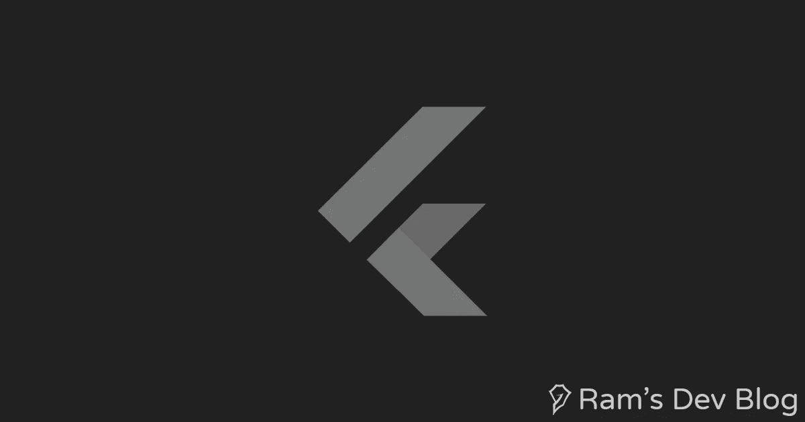
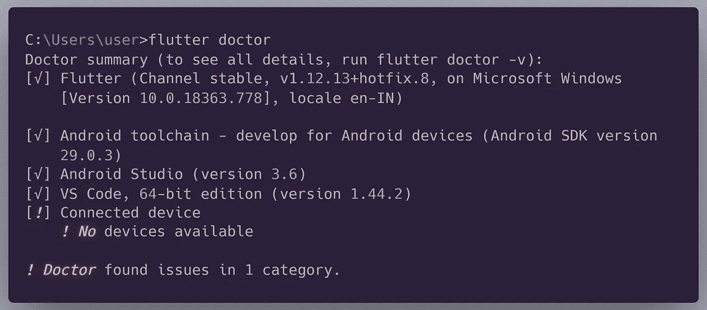

# 学习颤动

> 原文：<https://medium.com/analytics-vidhya/learning-flutter-a9c3a2150fe3?source=collection_archive---------21----------------------->

如何在扑朔迷离和理解代码中开始一个项目？



[Flutter](https://flutter.dev/) 是一款开源的移动应用 SDK，旨在帮助开发者和设计师为 iOS 和 Android 构建现代移动应用，由谷歌开发和维护。Flutter 应用是用 [Dart](https://dart.dev/codelabs/dart-cheatsheet) 编程语言编写的，可以连接 Java、Kotlin、Swift、Objective-C 等平台语言，Flutter 本身是用 C、C++、Dart、Skia(2D 渲染引擎)构建的。

# 先决条件

1.  [镖](https://dart.dev/codelabs/dart-cheatsheet)
2.  面向对象的编程概念
3.  [颤振 SDK](https://flutter.dev/docs/development/tools/sdk/releases)
4.  [Android Studio](https://developer.android.com/studio) 或 [Visual Studio 代码](https://code.visualstudio.com/download)
5.  Android 模拟器或启用 USB 调试的手机。

你可以去 [flutter 文档](https://flutter.dev/docs/get-started/install)查看如何设置 flutter。
要确认您是否安装了 flutter 并且 SDK 已经添加到 path 中，请打开您的终端并运行:`flutter doctor`



输出

如果您没有连接设备或运行模拟器，这也没什么。

# 入门指南

要创建一个 Flutter 项目:创建一个项目文件夹，在那里打开一个终端并执行:

```
flutter create tutorial
```

这里的“教程”是项目的名称。
浏览到 lib → main.dart，删除那里的所有代码，粘贴下面的代码。

*   Dart 和 Flutter 都使用[包](https://flutter.dev/docs/development/packages-and-plugins/using-packages)，这允许您使用`import`语句来使用库中您需要的类。你可能需要在大多数 flutter 应用程序中使用 material.dart。

你可以在这里找到 flutter [使用的职业的官方列表](https://api.flutter.dev/flutter/widgets/widgets-library.html#classes)。

*   Flutter 应用程序的入口点是 main 方法，它应该总是包含`runApp()`,该方法采用一个小部件，该小部件是一个包含我们应用程序所有其他部分的类。

我用的是 flutter 提供的`[MaterialApp()](https://api.flutter.dev/flutter/material/MaterialApp-class.html)`类，但是你可以选择创建自己的类，如下图所示。

```
*void* main(){
runApp(MyWidget());
}
```

因为我们的 main 方法很短，所以我们可以像这样使用 arrow 语法，使它更具可读性:

```
*void* main() => runApp(MyWidget());
```

`MyWidget()`还不存在，所以让我们制作一个无状态的小部件。

# [Widgets](https://flutter.dev/docs/development/ui/widgets-intro)

Flutter 使用各种部件来构建你的应用程序布局，你看到的所有文本、图标、按钮都是部件。小部件只是一个 Dart 类，它扩展了 flutter 类。

```
*class* MyWidget *extends* StatelessWidget{
...
...
}
```

`MyWidget`是一个从类`StatelessWidget`继承的小部件，该类是一个 Flutter 类。
查看一些[基础小工具](https://flutter.dev/docs/development/ui/widgets/basics)推荐学习。

# 布局

一个应用程序基本上有保持不变的内容，即状态和随着触发或事件而变化的内容。布局可以分为两种类型:

1.  **静态布局**:静态布局包含始终保持不变的小部件，如文本或图像。Flutter 为我们提供了 [StatelessWidget](https://api.flutter.dev/flutter/widgets/StatelessWidget-class.html) 来实现这个布局。
2.  **动态布局**:动态布局包含基于触发器或事件改变状态的小部件，比如通过按下按钮来添加待办事项列表，或者通过按下按钮或滑动手势来删除待办事项。Flutter 为我们提供了 [StatelessWidget](https://api.flutter.dev/flutter/widgets/StatefulWidget-class.html) 来实现这个布局。

我们现在将关注无状态小部件。你也可以访问 [flutter docs](https://flutter.dev/docs/development/ui/interactive) 来增加你的 flutter 应用的交互性。

# 继续使用代码

我们已经知道 widget 只是从 flutter 扩展而来的一个类。我使用了一个由 flutter 提供的 statelessWidget 类。我们将覆盖由 flutter 提供的`build`方法。

每个小部件都是用一个`build`方法创建的，每个构建方法都以一个`BuildContext`作为参数。`BuildContext`描述了你在应用程序小部件树中的位置。

我们必须在这个构建方法中返回一个小部件，我已经使用了 [MaterialApp 小部件](https://api.flutter.dev/flutter/material/MaterialApp-class.html)，它是一个可以用来开发材质设计应用的容器。
Material design 是 Google 基于材料开发的设计语言。在 [material.io](https://material.io/https://material.io/) 了解更多信息。

我在 MaterialApp 的首页使用过 [Scaffold](https://api.flutter.dev/flutter/material/Scaffold-class.html) widget。Scaffold 包含一个素材 app 的布局，如`appBar`、`body`、`floatingActionButtion`和`persistentFooterButtons`。
让我们构建一个包含 Scaffold 中所有小部件的布局。

上面的代码演示了如何使用 Flutter 创建一个简单的材质应用程序。

# 主题

你可能已经注意到`appBar`和`floatingActionButton`的颜色是蓝色的。这是因为它是 MaterialApp 类为您的小部件设置的主要颜色。您可以通过将[主题数据](https://api.flutter.dev/flutter/material/ThemeData-class.html)小部件传递给[主题](https://api.flutter.dev/flutter/material/Theme-class.html)类来更改它。使用主题数据可以应用多种样式。

现场演示我们所学的一切

现在就这样，你可以在下面找到一些我用来学习 Flutter 的资源，我会不断更新的。

**资源链接**

*   你也可以在 [Codelabs](https://codelabs.developers.google.com/?cat=Flutter) 上找到 Flutter 社区的指导教程。
*   [Awesome Flutter](https://github.com/Solido/awesome-flutter) 列出了你构建一个应用所需的所有资源。

> ***你可以在我的博客***[***dev haven . ml***](https://haven.netlify.app/)***上找到最新内容。***