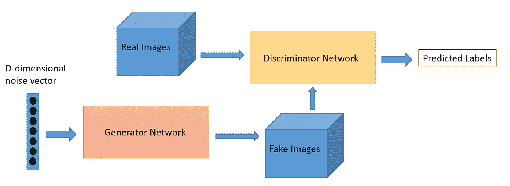

# 学习生成对抗网络

> 原文：<https://medium.com/analytics-vidhya/learning-generative-adversarial-networks-gans-6036a612a370?source=collection_archive---------14----------------------->

2014 年，蒙特利尔大学的 Ian Goodfellow 和其他研究人员在一篇论文中介绍了 gan。

# 甘是什么？

生成对抗网络(GAN)是神经网络中的一种模型，它在机器学习领域提供了很多潜力。在 GAN 中有两个神经网络:第一个是生成网络，第二个是鉴别网络。所以这个项目背后的主要概念是生成性对抗网络。甘是关于创造的东西，这是很难比较的其他深度学习领域。GAN 的主要重点是从零开始生成数据。正如我们所见，早期的 GAN 由两个网络组成，即发生器和鉴别器。

**生成对抗网络(GANs)是由两个网络组成的深度神经网络架构，两个网络相互对抗。**

**脸书人工智能研究主任 Yann LeCun 称对抗性训练是“过去 10 年中最有趣的想法”**

GANs 的潜力非常巨大，因为他们可以学习模仿任何数据。因此，使用 GAN，我们可以在任何领域创造与我们相似的世界:图像、动漫、新闻主播、演讲。

# 生成算法与判别算法

为了理解 GANs，我们需要知道生成算法是如何工作的，以及判别算法是如何简洁的，因此判别算法的工作是尝试对数据进行分类。
这种情况的一个标准例子是电子邮件，给定电子邮件中的所有单词，鉴别器所做的是预测该消息是否是垃圾邮件。在这个例子中，垃圾邮件是标签之一，电子邮件的单词是组成输入数据的特征。如果我们把这个问题表述为数学问题，那么标签称为 y，特征称为 x。公式 p (y|x)用于表示“给定 x 时 y 的概率”。

生成算法试图回答的主要问题是:它们假设这封电子邮件是垃圾邮件，而判别模型关心特征(x)和标签(y)之间的关系。
因此，如果我们考虑生成算法，它们与鉴别器相反。他们不是预测标签，而是预测给定某个标签的特征。
区分生意经和辨别力的最佳方式如下:

*   判别模型学习类别之间的范围
*   生成模型对各个类的分布进行建模

# GANs 如何工作

我们知道这些算法属于无监督学习领域
生成式对抗网络由两个模型组成:

第一个模型称为生成器，其目标是生成与真实数据相似的新数据。生成器可以创建数据，鉴别器检查数据是真是假。

第二个模型叫做鉴别器。该模型的目标是识别输入数据是真的还是假的-属于原始数据集-或者是由生成器生成的假数据。因此，歧视者就像一个警察，试图检测工作是真是假。

当训练开始时，生成器产生假数据，鉴别器很快学会辨别这是假的。

训练后，生成模型可用于按需创建新的可信样本。

gan 有非常具体的用例，开始时可能很难理解这些用例。

# 这些模型是如何相互作用的？

在提出这个框架的原始论文中，可以认为生成器有一个对手，即鉴别器。因此，这意味着生成器需要学习如何操作以及如何创建数据，以使鉴别器不再能够区分真假或假的。这两个模型之间的竞争提高了他们的知识，直到生成器创建真实的数据

# 训练 GAN 的基本步骤

I .采样噪声集数据和真实数据集。每个尺寸为 m。

二。根据这些数据训练鉴别器。

三。采样大小为 m 的不同噪声子集

四。根据这些数据训练发电机。

动词 （verb 的缩写）从步骤 1 开始重复。

**以下是甘采取的步骤:**

*   **所以生成器接收随机数并返回图像。**
*   **生成的图像与实际数据集进行比较，并输入鉴别器。**
*   **然后鉴别器获取真实和虚假图像，并像逻辑回归一样返回 0 和 1 之间的概率和数字。1 代表真，0 代表假。**

所以我们有两个反馈回路:

*   鉴别器与图像的基本事实处于反馈回路中。
*   发生器与鉴别器在一个反馈回路中。

这是整个系统的图片:

生成性对抗网络基本图(来源:“Pathmind”)

正如我们所见，两者都是动态的。鉴别器网络是一个标准的卷积网络，可以对馈送给它的图像进行分类，生成器是逆卷积网络。

**目标函数**

GAN 被定义为一个极小极大对策，其目标函数如下。

# GAN 问题

许多 GAN 模型面临一个巨大的问题:

I .有时模型不能结合非收敛性。
二。发电机崩溃，这就是为什么产生有限的样本数据三的真实性。鉴别器和发生器之间的不平衡导致数据过拟合。对超参数选择高度敏感。

鉴别器和生成器(来源:“Pathmind”)

# 氮化镓的应用

*   生成人脸照片(Tero Karras 等人在其 2017 年题为“[GANs 的渐进增长以提高质量、稳定性和变化](https://arxiv.org/abs/1710.10196)”的论文中演示了人脸的可信现实照片的生成。)
*   生成逼真的照片(Andrew Brock 等人在其 2018 年题为“[高保真自然图像合成的大规模 GAN 训练](https://arxiv.org/abs/1809.11096)”的论文中，展示了使用他们的技术 BigGAN 生成的合成照片，这些照片实际上与真实照片无法区分。)
*   生成卡通人物(Jin 等人在其 2017 年题为“[利用生成对抗网络实现自动动漫人物创建](https://arxiv.org/abs/1708.05509)”的论文中演示了训练和使用 GAN 来生成动漫人物(即日本漫画人物)的面部。)
*   图像到图像的翻译(Phillip Isola 等人在其 2016 年题为“[使用条件对抗网络进行图像到图像的翻译](https://arxiv.org/abs/1611.07004)”的论文中演示了 GANs，特别是他们用于许多图像到图像翻译任务的 pix2pix 方法。)**最有趣的论文**——(朱俊彦在他们 2017 年题为“[使用循环一致的对抗网络进行不成对的图像到图像翻译](https://arxiv.org/abs/1703.10593)”的论文中介绍了他们著名的[循环根](https://junyanz.github.io/CycleGAN/)和一系列令人印象深刻的图像到图像翻译示例。)

以下示例演示了四种图像转换情况:

*   从照片到艺术绘画风格的转换。
*   马到斑马的翻译。
*   照片从夏天到冬天的翻译。
*   将卫星照片翻译成谷歌地图视图。

2017 年使用 CycleGANTaken 从不配对的图像到图像的翻译执行的四个图像到图像的翻译的例子。(来源:机器学习掌握)

*   文本到图像的翻译(张寒等人在他们 2016 年题为“ [StackGAN:利用堆叠生成对抗网络进行文本到照片的逼真图像合成](https://arxiv.org/abs/1612.03242)”的论文中演示了 GAN 的使用，特别是他们的 StackGAN 从简单对象(如鸟和花)的文本描述中生成逼真的照片。)
*   语义图像到照片的翻译(廷-王春等人在其 2017 年题为“H [高分辨率图像合成和使用条件甘的语义操作](https://arxiv.org/abs/1711.11585)”的论文中，演示了在给定语义图像或草图作为输入的情况下，使用条件甘来生成照片真实感图像。)
*   照片到表情符号(Yaniv Taigman 等人在 2016 年发表的题为“[无监督跨域图像生成](https://arxiv.org/abs/1611.02200)”的论文中，使用 GAN 将图像从一个域翻译到另一个域，包括从街道号码到 MNIST 手写数字，从名人的照片到他们所谓的表情符号或小卡通脸。)
*   超分辨率(Christian Ledig 等人在其 2016 年题为“[使用生成式对抗网络的照片级单图像超分辨率](https://arxiv.org/abs/1609.04802)”的论文中，演示了使用 GAN，特别是他们的 SRGAN 模型，来生成像素分辨率更高，有时高得多的输出图像。)
*   视频预测(Carl Vondrick 等人在其 2016 年题为“[生成具有场景动态的视频](https://arxiv.org/abs/1609.02612)”的论文中描述了使用 GANs 进行视频预测，特别是成功预测高达一秒的视频帧，主要针对场景的静态元素。)

# 摘要

在这篇文章中，你发现了一个温和的介绍生成敌对网络。比如什么是 GAN，生成和判别算法，GAN 如何工作，模型交互，基本步骤，GAN 问题和应用

在我的下一篇文章中，我将简要描述定义 GAN 的数学方法以及提高图像到图像翻译的对抗网络的模型效率和循环一致性的一些步骤。

## 感谢阅读！

随时给我发信息。

Twitter:aamirjarda
LinkedIn:aamirjarda
insta gram:aamirjarda

感谢 Sarfaraz Jarda 帮助审阅这篇文章！

你有什么问题吗？
在下面的评论里提出你的问题，我会尽力回答。