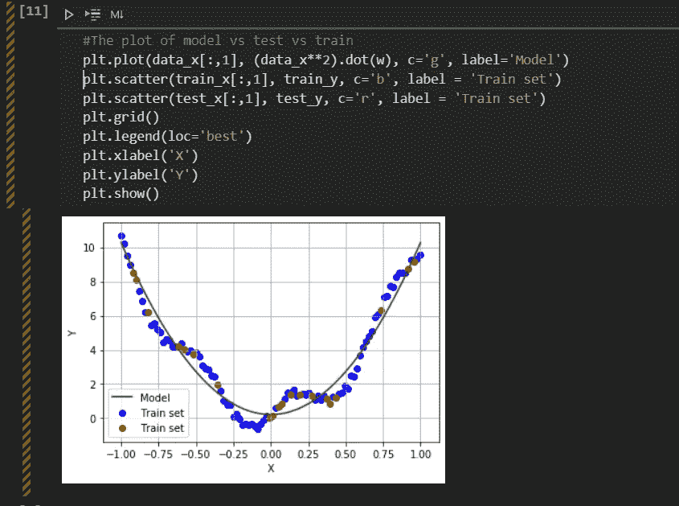

# 使用 Numpy Python 学习线性回归

> 原文：<https://medium.com/analytics-vidhya/learning-linear-regression-using-numpy-python-ad60ee5b889?source=collection_archive---------8----------------------->


> 用 Numpy python 实现线性回归算法的方法。在开始使用内置库解决数据集问题之前必须知道。

在这里，我将带您了解线性回归算法的基本实现。如果你了解这个算法的理论方面，并且正在使用 python 从头开始寻找它的实现，那么这篇文章就是为你准备的。即使你不知道，我也建议你在开始编码之前，先看看我之前的一篇关于线性回归的文章。

[](/analytics-vidhya/linear-regression-machine-learning-algorithm-detailed-view-657beac3d2f1) [## 线性回归:机器学习算法详细视图

### 如果你已经开始沉浸在机器学习的世界中，线性回归是最受欢迎的算法之一…

medium.com](/analytics-vidhya/linear-regression-machine-learning-algorithm-detailed-view-657beac3d2f1) 

简单来说，步骤如下:

1.  假设假设，我们将在训练数据集上找到一个或多个自变量/预测变量 *(x)* 的因变量/目标变量 *(y)* 之间的关系。
2.  用随机实数初始化假设参数的权重。
3.  分别初始化学习率( **α)** 和斜坡力矩及停止条件的容许值。
4.  计算成本和梯度，同时更新所有模型参数权重，以减少实际值和预测值之间的误差。
5.  不断更新权重值，直到达到停止条件(公差值)，这将为我们提供最佳解决方案，从而缩小实际目标和预测目标之间的差距。


让我们开始实施

## 第 1 部分:创建一个模拟数据集并在其上执行一些 EDA:

使用 numpy linspace 函数创建 100 个点，然后用随机生成的数据创建一个假设，然后为 data_x 创建一个二维数组，以简化我们的矩阵乘法。

```
**Hypothesis : hθ(x) = θ1*x1 + θ0
Here, i am taking example for generating linear random data of :
        data_y = 29 * data_x + 30 * np.random.rand(100,1)
Weights will be θ1 and θ0 which we will find through gradient descent method.**
```

## 第 2 部分:绘制数据集:

这段代码将显示一个特色数据图，由于一些随机性，我们看到数据并不完全在一条线上，但它几乎遵循线性路径。

## 第 3 部分:创建训练，测试数据:

作为示例，我再次使用 numpy 来拆分数据，但是您也可以试验 sklearn.model_selection 的 train_test_split()函数。

## 第 4 部分:梯度计算功能

接下来是误差线性回归计算、成本函数、梯度下降计算的主要逻辑实现。

## 第五部分:寻找假设的权重

这是本文开头定义的第五步，我们初始化随机权重、alpha 值和停止条件。

我们不断更新权重，直到满足容差条件，volla 达到我们的最终权重。

公布最终的方程和更新的权重！！！

## 第 5 部分:实际对比预测对比假设图

最后，一些图像使理解更好，所以蓝点是训练数据，而红点代表训练集。最后绿线是我们发现的假设，以最终方程的形式，用它你可以预测新的点。

这是线性函数的简单例子，但是如果你的假设不是线性的呢？在这种情况下，上面的代码很少改变，即使处理非线性函数也非常健壮。

我会给你一些提示，但让你自己试一试。

```
In Part 1 : Replace data_y with a non-linear function let's say
***data_y = np.sin(data_x) + 0.1 * np.power(data_x,2) + 0.5 * np.random.rand(100,1)***In Part 4 : Replace y_estimate and gradient with assumed hypothesis
 ***y_estimate = (x**2).dot(w).flatten()
 gradient = -(1.0/len(x)) * error.dot(x**2)***This is just an example, you can try your own linear and non-linear hypothesis and see the prediction. For above changes , the final plot will look like as shown below:
```



非线性假设图

我希望这篇文章能帮助你更好地理解线性回归算法。将与您见面，敬请期待新算法！！继续学习！！注意安全。！:)