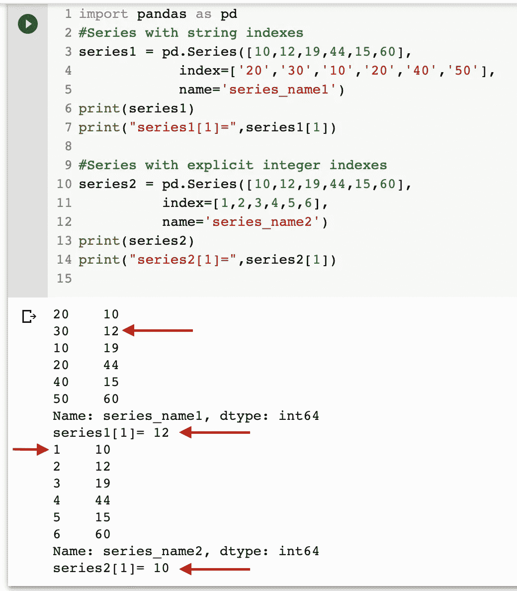
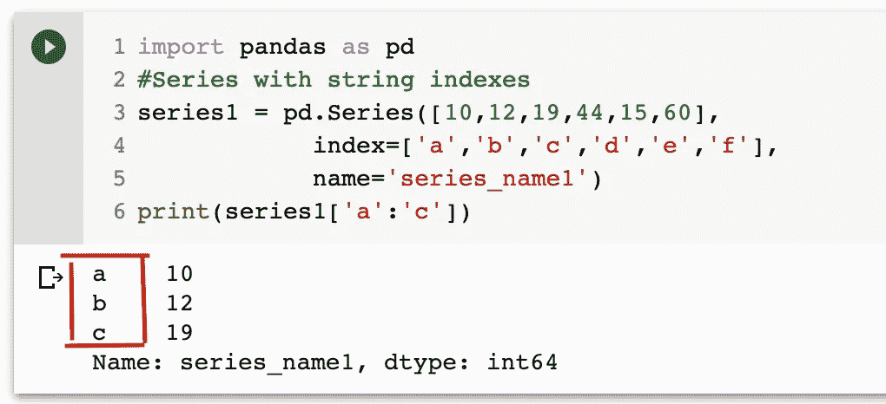
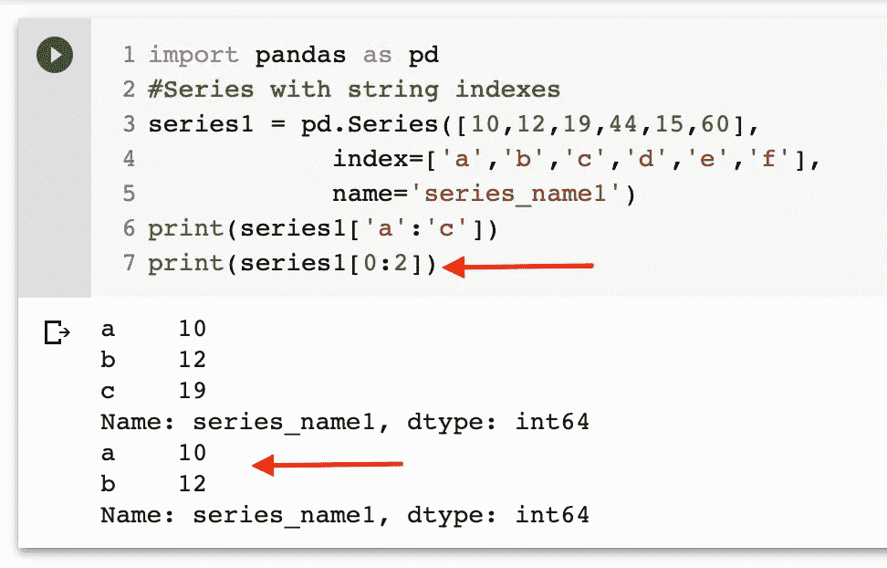
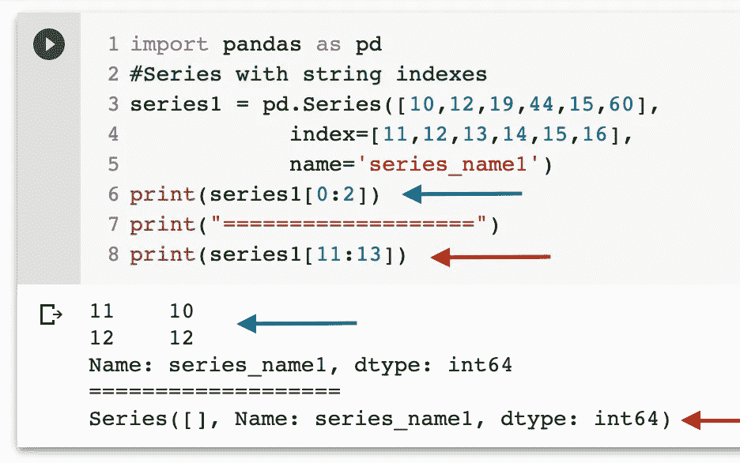

# 学习熊猫。系列(第 4 部分)(为什么我们需要单独的索引器(loc，iloc..)?)

> 原文：<https://medium.com/analytics-vidhya/learning-pandas-part-4-series-why-we-need-separate-indexers-loc-iloc-c081047f3a79?source=collection_archive---------40----------------------->


[M. B. M.](https://unsplash.com/@m_b_m?utm_source=medium&utm_medium=referral) 在 [Unsplash](https://unsplash.com?utm_source=medium&utm_medium=referral) 拍摄的照片

在《学习熊猫》的第 4 部分中，我们将探讨为什么我们需要索引器在`Pandas.Series`中进行索引。如果你直接跳到这里，你可以通过下面的链接查看第三部分:

[](/@milankmr/learning-pandas-a-to-z-part-3-series-elements-access-914d7a21ff7f) [## 学习熊猫(第三部分)(系列元素访问)

### 系列是熊猫的积木，让我们一起去骑行探索吧。

medium.com](/@milankmr/learning-pandas-a-to-z-part-3-series-elements-access-914d7a21ff7f) 

> **我们所说的索引和索引器是什么意思？**

```
In Simple terms , 
**Indexing** means selecting all or some data from Series .
***Indexers*** *are the* attributes that explicitly expose ways for indexing .
```

为什么我们需要索引器？这是一个非常真实的问题，为什么我们需要单独的索引器属性，而我们可以只使用 Series 对象和与它们相关联的索引，如下所示:

```
import pandas as pd
seriesObj = pd.Series([10,12,19,44,15,60],
            index['20','30','10','20','40','50'],
            name='series_name')seriesObj['30'] --> 12 
seriesObj[1] --> 12 
```

**如上例所示，我们能够使用系列索引和隐式整数索引选择“12”..**

问 **问题**这有什么问题？你能发现吗？在你滚动寻找答案之前，先思考一下..


本·怀特在 [Unsplash](https://unsplash.com?utm_source=medium&utm_medium=referral) 上的照片

希望你得到了答案，让我们一起探讨同样的问题。为了探究这个问题，我们将创建另一个带有数字索引的序列。

```
import pandas as pd
**#Series with explicit string indexes** series1 = pd.Series([10,12,19,44,15,60],
            index=['20','30','10','20','40','50'],
            name='series_name')**#Series with explicit integer indexes**
series2 = pd.Series([10,12,19,44,15,60],
          index=[1,2,3,4,5,6],
          name='series_name')series1[1] --> 12
series2[1] --> 10
```

正如你在上面的例子中看到的，我们有两个系列:

`**series1**` **是显式字符串索引**，`**series2**` **是显式整数索引。**

> 显式是指我们在创建序列时提供了索引，正如您所知，我们可以在不提供索引的情况下创建序列，从而自动生成从 0 到 len-1 的序列。

**回答**，以下是问题:

```
In Case of **explicit integer indexes** , Operation such as **series2[1]** will use the explicit integer indexes and value corresponding to **index value 1 is 10**In Case of **explicit non integer indexes** , Operations such as **series1[1]** will use implicit integer indexes and **value corresponding to index 1 is 12**
```



隐式和显式索引的索引问题

> **这是关于在没有索引器的情况下进行索引的问题，我们也在切片过程中观察到问题，在没有索引器的情况下进行切片有一个奇怪的部分，让我们讨论一下。**

**→切片** :-切片是一种机制，我们可以从不同的数据结构(如序列、数据帧等)中提取基于范围的子集。

类似于索引，我们可以用显式和隐式索引进行连续切片，让我们用下面的例子检查一下。

```
**#Slicing with non integer Explicit index**import pandas as pd
#Series with string indexes
series1 = pd.Series([10,12,19,44,15,60],
                    index=['a','b','c','d','e','f'],
                    name='series_name1')print(series1['a':'c'])
```



熊猫系列中使用非整数显式索引的切片

在上面的例子中，我们使用非整数显式索引进行切片，我们从索引`**‘a’ to ‘c’ both included**`获得输出。现在，让我们使用隐式整数索引对同一系列进行切片。



使用隐式索引进行切片

现在，对于使用隐式索引的切片，我们从 0:2 获得输出，这里的`**“2” is exclusive**`用于输出。

> **注意:-切片与索引相比的另一个区别在下面用例子解释:**



根据上面示例的输出:

```
We got the same output for the series when we used integer indexes for the series for which explicit integer indexes were present . 
```

T

> 以上可能看起来令人困惑，是的，当不使用“iloc”和“loc”时，需要记住多条规则。

我希望你已经得到了这个问题的答案，让我们总结一下:

```
To solve these potential issues and confusion with explicit integer indexes and slicing , Pandas provides separate location indexer attribute like "iloc" and "loc" 
```

> 简而言之，iloc 和 loc 索引器是我们上面所有混乱和规则的救星😉


Victor Grabarczyk 在 [Unsplash](https://unsplash.com?utm_source=medium&utm_medium=referral) 上拍摄的照片

希望你能从这篇文章中学到一些有趣和新的东西。请分享您的想法和反馈，以便我们可以改进和帮助其他学习者。

快乐学习！！！