# 学习熊猫。系列(第五部分)。为索引和切片而探索的 loc)

> 原文：<https://medium.com/analytics-vidhya/learning-pandas-part-5-series-loc-explored-for-indexing-and-slicing-6447c5d7298c?source=collection_archive---------43----------------------->


马库斯·斯皮斯克在 [Unsplash](https://unsplash.com?utm_source=medium&utm_medium=referral) 上拍摄的照片

在学习熊猫的第 5 部分中，我们将在`**Pandas.Series**`中探索用于索引和切片的`**loc**`索引器。如果您直接跳到这里，您可以查看第 4 部分，了解我们为什么需要索引器:

[](/@milankmr/learning-pandas-part-4-series-why-we-need-separate-indexers-loc-iloc-c081047f3a79) [## 学习熊猫(第 4 部分)(系列—为什么我们需要单独的索引器(loc，iloc..)?)

### 为什么 iloc 和 loc 是熊猫索引和切片的首选？一开始可能会很困惑，但是相信我，你…

medium.com](/@milankmr/learning-pandas-part-4-series-why-we-need-separate-indexers-loc-iloc-c081047f3a79) 

> `**.loc**` **属性是指用于索引和切片的显式索引，这意味着它是基于索引标签而不是元素的位置。**

```
import pandas as pd
series1 = pd.Series([10,12,19,44,15,60],
          index=[11,12,13,14,15,16],
          name='series_name1')print(series1.loc[11])Output:
10series2 = pd.Series([10,12,19,44,15,60],
          index=['a','b','c','d','e','f'],
          name='series_name2')print(series2.loc['a'])Output:
10
```

在上面的例子中`**11**` 是索引标签而不是位置索引。

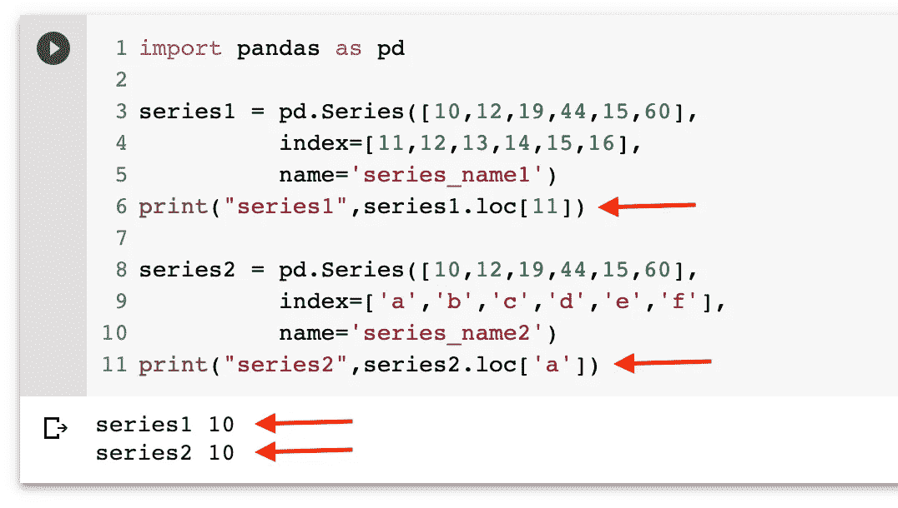

使用 loc 索引器的串行访问

> 如果**我们试图访问不存在的标签索引，它将引发** `**key error**` **:-如下图所示，我们试图访问值为** `**1**` **的标签索引，1 不可用作标签索引。**

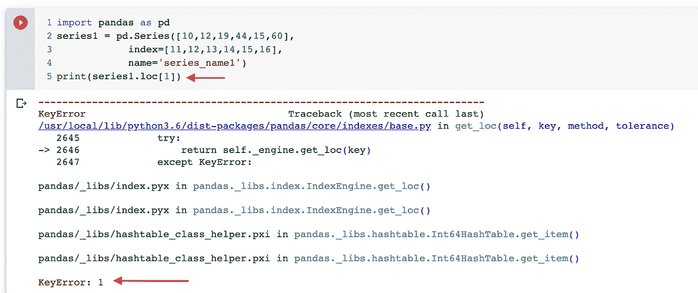

当索引标签不存在时，在序列中使用 loc 时出现键错误

问 **问题**:现在我们知道`**.loc**`属性指的是显式索引，如果我们在创建序列时不提供显式索引会怎么样？

是的，你猜对了，无论我们是否创建，序列中总是存在索引，所以它仍然引用生成的索引，而不是基于位置的索引，尽管它看起来像是基于位置的，因为索引是从 0 到 len-1 生成的。

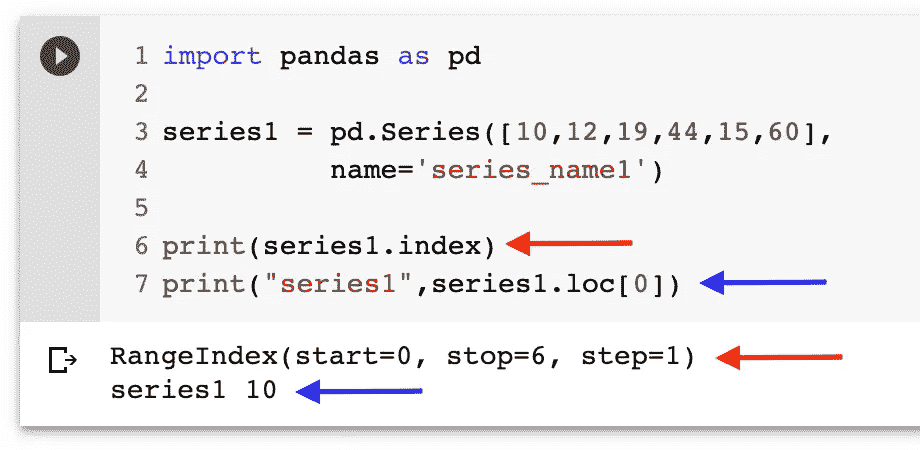

具有不带显式索引的序列的 loc 属性

现在，如果你在一个序列中有重复的索引，你将得到从属性返回的序列

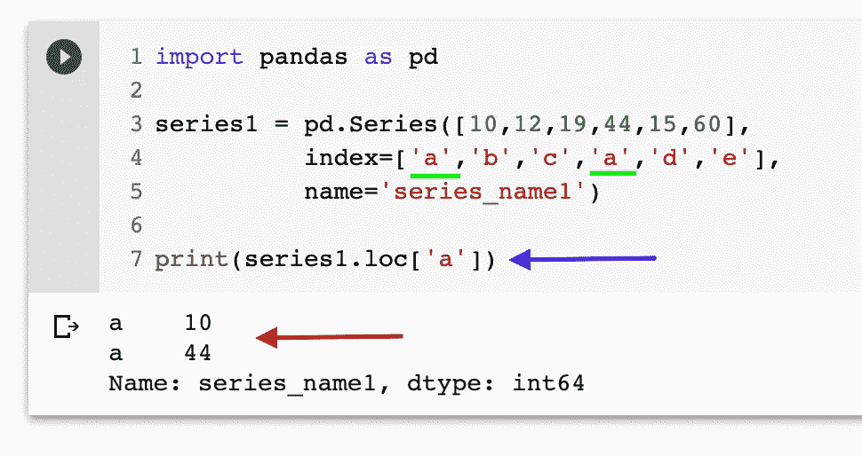

`.loc`在具有重复索引的序列上

> **花式索引用。loc:如果您想一次为多个不连续的索引选择值，您可以使用花式索引，您可以传入您想要获取数据的索引列表(我们可以使用连续切片)**

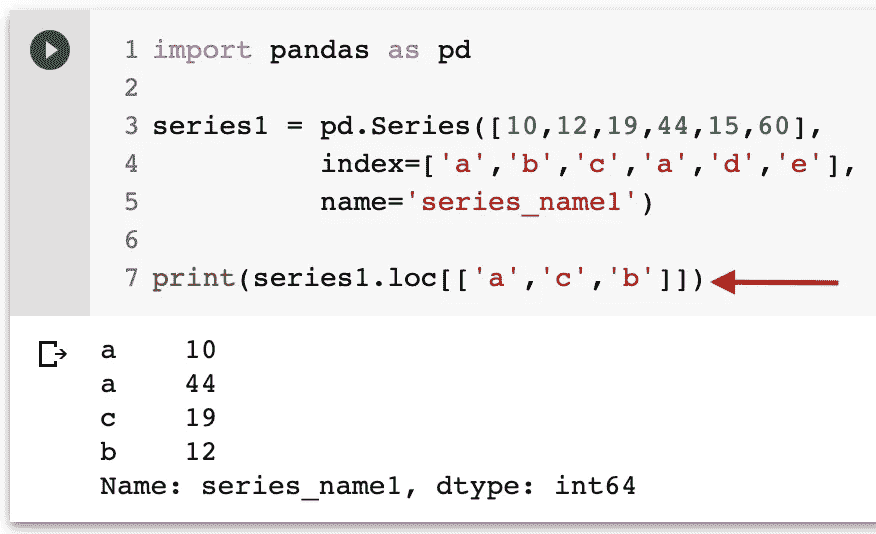

花式索引。熊猫系列锁定

C

让我们用一个问题来理解可调用索引:-

**问题** :-假设我们想从系列中选择数据，其值满足某些条件，如值> 12

**回答** :-我们可以使用 python 中的 lambda 函数将 callable 作为索引器，如下所示，`**we may also use the boolean array which is discussed after this .**`

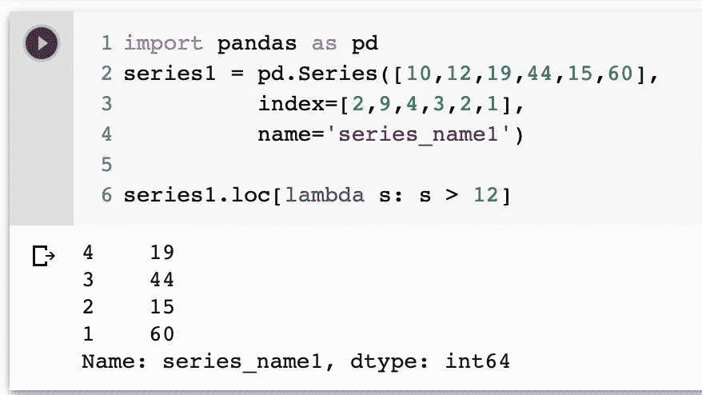

熊猫系列中的可调用索引器

B 布尔数组作为系列的索引器:-我们可以使用布尔数组作为索引器，将选择数组中值为真的索引。

```
import pandas as pd
series2 = pd.Series([10,12,19,44,15,60],
          index=[2,4,1,3,6,5],
          name='series_name2')bool_array = [True,False,True,True,False,True]
series2.loc[bool_array]#indexes 4,6 are false so the corresponding data are not present in output2    10 
1    19 
3    44 
5    60 
Name: series_name2, dtype: int64
```

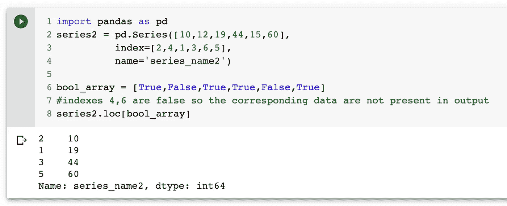

如果我们进一步了解 series 对象上的操作，我们会发现，对于 series 对象上的逻辑操作，我们会得到布尔数组作为输出，它可能会进一步用作索引器。让我们看看同样的例子。

```
import pandas as pd
series2 = pd.Series([10,12,19,44,15,60],
          index=[2,4,1,3,6,5],
          name='series_name2')bool_array = series2 > 15
print(bool_array)
print(series2.loc[bool_array]) --> output where data_value > 15#one-liner
print(series2.loc[series2>12])--> output where data_value > 12
```

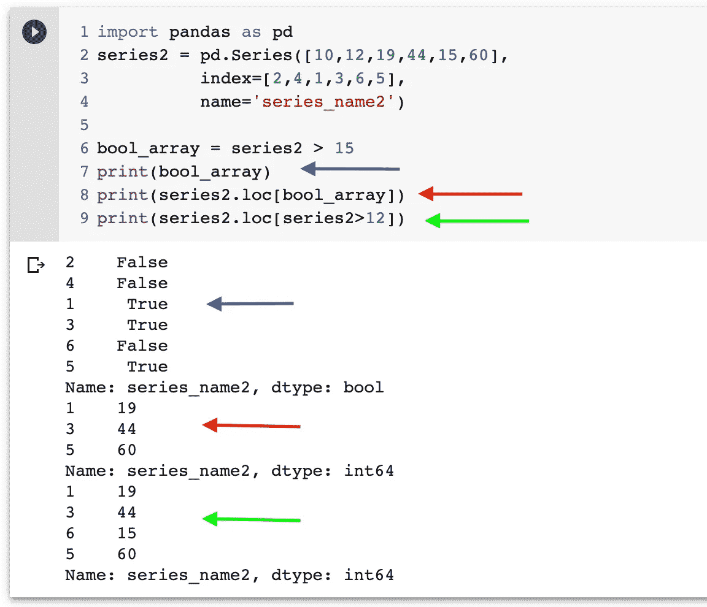

这和索引有点关系。loc 属性串联，我们开始了解`**slicing using .loc attribute**`

→ **切片** :-切片是一种机制，我们可以从不同的数据结构(如序列、数据帧等)中提取基于范围的子集。

> 与...一致。位置属性是指 `**explicit labeled indexes**` **中的序列和非位置/隐式索引:**

**切片格式→**[开始]:[结束][:步长] →开始、结束和步长为整数，方括号表示可选值和

**开始和结束包含在使用** `**.loc**`标记的索引切片中

**使用字符串标记的索引进行切片** :-在下面的示例中，我们从值为‘a’的索引开始，一直移动到找到索引‘d’为止，并且两者都包含在内。

```
import pandas as pd
series1 = pd.Series([10,12,19,44,15,60],
          index=['a','c','d','e','b','f'],
          name='series_name1')print(series1.loc['a':'d'])
print(series1.loc['a':'f':2])
```

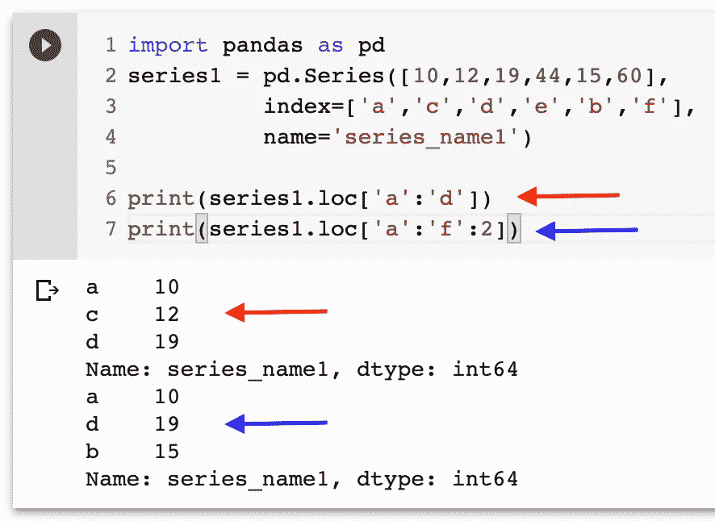

**使用整数标记索引进行切片:**

```
series2 = pd.Series([10,12,19,44,15,60],
          index=[2,4,1,3,6,5],
          name='series_name2')print(series2.loc[2:4])
```

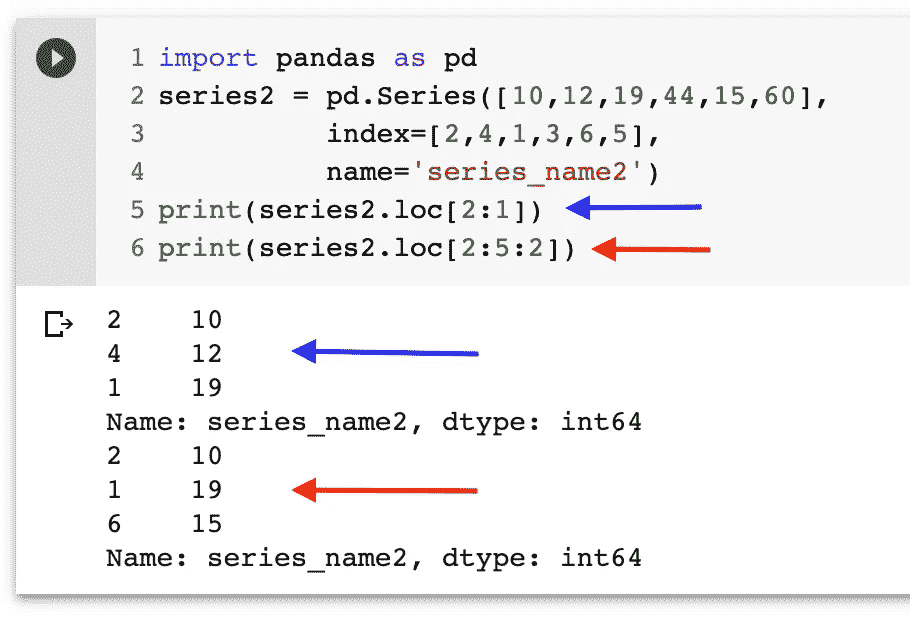

如果 index 不存在，我们尝试使用`**.loc**`进行切片，我们会得到类似于 indexing with 的`**key error**`。通信线路（LinesofCommunication）

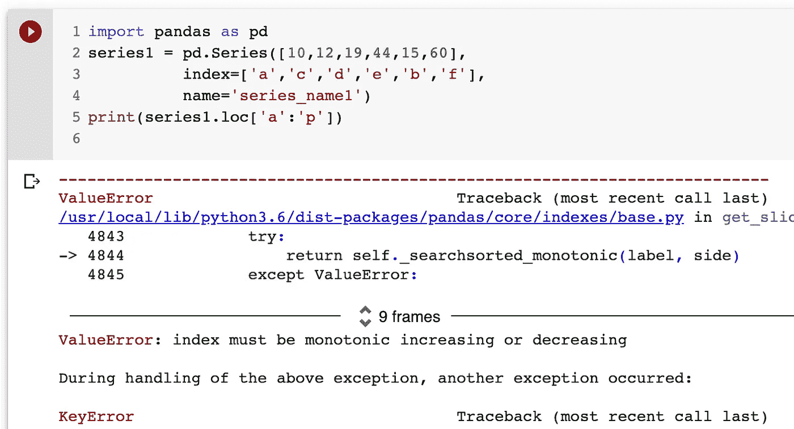

O

`**If we don’t provide any value for start , it start with the first index**`和

`**if we don’t provide end , it will consider last index as end**`。

```
import pandas as pd
series1 = pd.Series([10,12,19,44,15,60],
          index=['a','c','d','e','b','f'],
          name='series_name1')print(series1.loc[:'d'])
print(series1.loc['e':])
```

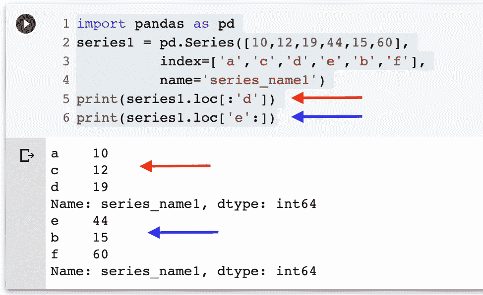

感谢您的阅读，我希望您今天学到了一些新东西，在数据科学领域有很多与索引和切片相关的内容，但这是一个良好的开端😄

在系列的下一部分，我们将了解`**.iloc attribute**`，敬请期待快乐学习！！