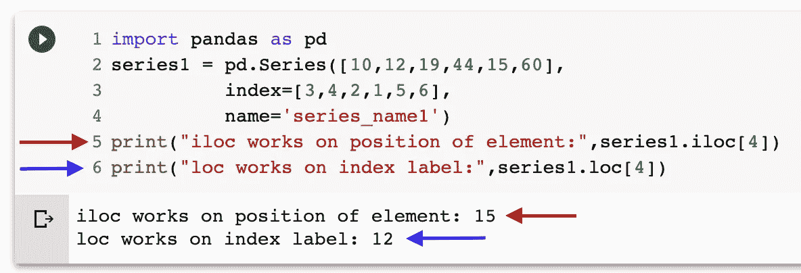
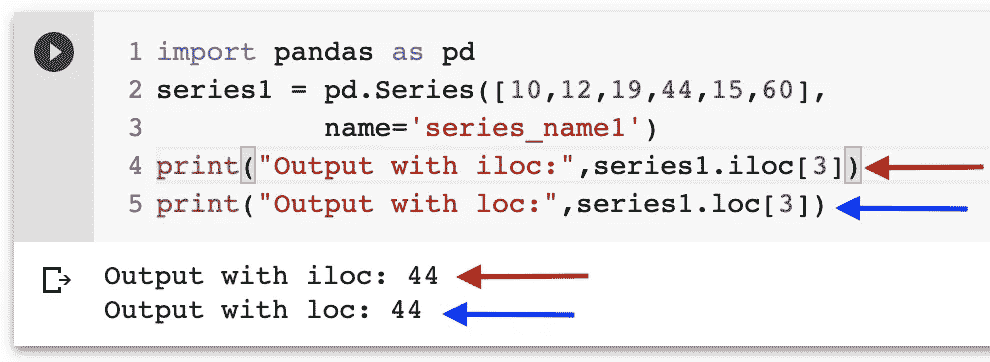
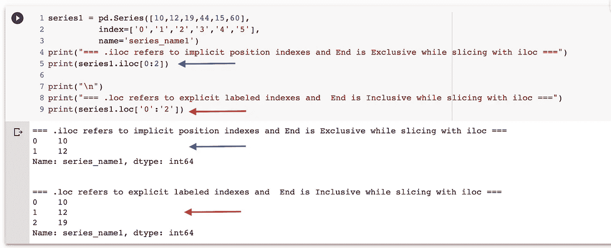
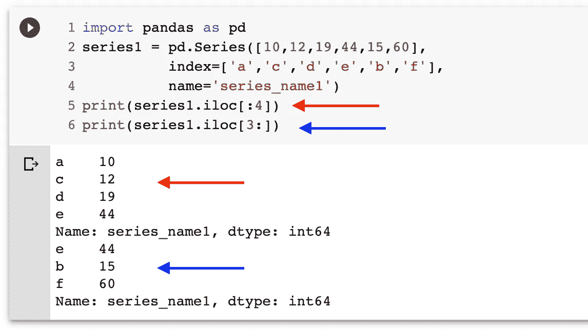

# 学习熊猫。系列(第六部分)。iloc 探索了|。iloc 与 loc)

> 原文：<https://medium.com/analytics-vidhya/learning-pandas-part-6-series-iloc-explored-iloc-vs-loc-8204825b3a42?source=collection_archive---------33----------------------->

> 在学习熊猫的第 6 部分中，我们将在`**Pandas.Series**`中探索用于索引和切片的`**iloc**`索引器。如果你直接跳到这里，你可以查看`[**Part-4**](/@milankmr/learning-pandas-part-4-series-why-we-need-separate-indexers-loc-iloc-c081047f3a79)`来了解为什么我们需要索引器和`[**Part-5**](/@milankmr/learning-pandas-part-5-series-loc-explored-for-indexing-and-slicing-6447c5d7298c)`用于`.**loc**`索引器:

一边学习。iloc，我们也会`compare the same with .loc along the way`，所以，不如过一遍系列的`[**Part-5**](/@milankmr/learning-pandas-part-5-series-loc-explored-for-indexing-and-slicing-6447c5d7298c)`。


马库斯·斯皮斯克在 [Unsplash](https://unsplash.com?utm_source=medium&utm_medium=referral) 上拍摄的照片

> `***.iloc***` ***属性是指*** `***implicit position indexes***` ***进行索引和切片，意思是基于数据元素的位置而不是索引标签。***

```
import pandas as pdseries1 = pd.Series([10,12,19,44,15,60],
                    index=[3,4,2,1,5,6],
                    name='series_name1')print("iloc works on position of element:",series1.iloc[4])
print("loc works on index label:",series1.loc[4])Output:
**iloc works on position of element: 15** 
**loc works on index label: 12**
```

> `**series1.iloc[4]**`，4 为`position of the element`，位置从 0 开始，到 len-1 结束，与数组相同。
> 
> `**series1.loc[4]**`，4 是系列的`index label` 。



iloc 系列处理元素的位置

> ***如果我们试图访问大于 len-1 的位置/索引，我们将得到* IndexError:单位置索引器越界**

```
import pandas as pd
series1 = pd.Series([10,12,19,44,15,60],
          index=[3,4,2,1,5,6],
          name='series_name1')series1.iloc[6]Output:
**IndexError: single positional indexer is out-of-bounds**
```

上例中有`total 6 elements and implicit position index exist from 0 to 5`。我们试图访问不存在的索引 6，因此出现索引错误(越界)。

Q 问题:-在哪个场景中`**output of loc and iloc will be same ?**`它是非常直的，只要在滚动答案之前思考一下。


尼基塔·卡恰诺夫斯基[在](https://unsplash.com/@nkachanovskyyy?utm_source=medium&utm_medium=referral) [Unsplash](https://unsplash.com?utm_source=medium&utm_medium=referral) 上的照片

答:是的，你说得对！！如果我们不提供显式索引，而用两者创建一个系列输出。loc 和。系列的 iloc 将是相同的**，因为隐式索引总是从 0 到 len-1 出现。**

```
import pandas as pd
series1 = pd.Series([10,12,19,44,15,60],
          name='series_name1')print("Output with iloc:",series1.iloc[3])
print("Output with loc:",series1.loc[3])**Output with iloc**: 44 
**Output with loc**: 44
```



如果未定义显式索引，loc 和 iloc 会为一个系列生成相同的输出

> `***Fancy Indexing with .iloc***`

```
import pandas as pd
series1 = pd.Series([10,12,19,44,15,60],
          index=[3,4,2,1,5,6],
          name='series_name1')***series1.iloc[[1,4,2]]***1    12 
4    15 
2    19 
Name: series_name1, dtype: int64
```

`***Note:- Keep in mind that with iloc 1,4 and 2 are position indexes not label indexes***`

B 使用布尔数组作为 iloc 系列的索引器:-我们可以使用布尔数组作为索引器，将选择数组中值为真的索引。

```
import pandas as pd
series1 = pd.Series([10,12,19,44,15,60],
          index=[3,4,2,1,5,6],
          name='series_name1')print("======Output With iloc=======")
print(series1.iloc[[True,False,True,False,True,False]])print("======Output With loc========")
print(series1.loc[[True,False,True,False,True,False]])======**Output With iloc**=======
**3    10 
2    19 
5    15** 
Name: series_name1, dtype: int64======**Output With loc**========
**3    10 
2    19 
5    15** 
Name: series_name1, dtype: int64
```

因此，它与的相同。作为索引器的布尔数组的 loc 属性，你猜对了:`**output of both .loc and .iloc with boolean array will be same .**`

> **这个**是带`**.iloc**`属性的系列索引的开端，让我们开始了解`**slicing using .iloc attribute**`

→ **切片** :-切片是一种机制，我们可以从不同的数据结构(如序列、数据帧等)中提取基于范围的子集。

> *S* ***李慈同。iloc 属性是指序列中的*** `***implicit position indexes***` ***，而不是标记的指标:***

**切片格式→**[开始]:[结束][:步长] →开始、结束和步长为整数，方括号表示可选值。

**使用时有两个主要区别。iloc 与相比。位置:**

1.  。iloc 使用隐式位置索引，其中 as。loc 使用显式标签索引。
2.  另一个主要区别是在`**.iloc [end] is exclusive**`而`**[end] is inclusive in case of .loc**`正如我们在上一篇 [**第 5 部分**](/@milankmr/learning-pandas-part-5-series-loc-explored-for-indexing-and-slicing-6447c5d7298c) 中讨论的

让我们看看下面的例子:

```
import pandas as pd
series1 = pd.Series([10,12,19,44,15,60],
          index=['0','1','2','3','4','5'],
          name='series_name1')print("=== .iloc refers to implicit position indexes and End is Exclusive while slicing with iloc ===")
print(series1.iloc[0:2])
print("\n")
print("=== .loc refers to explicit labeled indexes and  End is Inclusive while slicing with iloc ===")
print(series1.loc['0':'2'])
```

输出:-因此，如上面的代码所示，对于。我们从位置`**index 0 to 1 because [end] →2 is exclusive for .iloc**`出发，前往。loc 我们从`**‘0’ to ‘2’ becasue [end] →’2' is inclusive for .loc**`移动到**。**

```
=== .iloc refers to implicit position indexes and End is Exclusive while slicing with iloc === 
0    10 
1    12 
Name: series_name1, dtype: int64 === .loc refers to explicit labeled indexes and  End is Inclusive while slicing with iloc === 
0    10 
1    12 
2    19 
Name: series_name1, dtype: int64
```



[end]包含。锁定并独占。iloc

O

`**If we don’t provide any value for start , it start with the first index**`和

`**if we don’t provide end , it will consider last index as end**`。

```
import pandas as pd
series1 = pd.Series([10,12,19,44,15,60],
          index=['a','c','d','e','b','f'],
          name='series_name1')print(series1.iloc[:4]) **#will stop at index 3 coz 4 is exclusive**
print(series1.iloc[3:]) **#will start from index 3 coz 3 is inclusive**Output:
**a    10 
c    12 
d    19 
e    44** 
Name: series_name1, dtype: int64 **e    44 
b    15 
f    60** 
Name: series_name1, dtype: int64
```



切片时的默认开始和结束索引。iloc

所以这是一个开端。在本系列的下一部分，我们将探讨更多的系列属性，并将涵盖一些重要的系列方法！！

希望你喜欢这篇文章，今天学到了一些新东西。不断探索，不断学习！！！