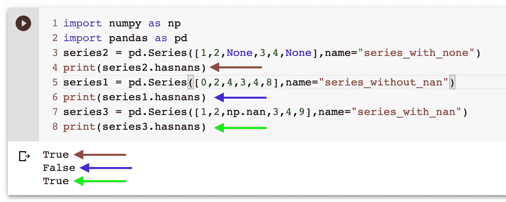
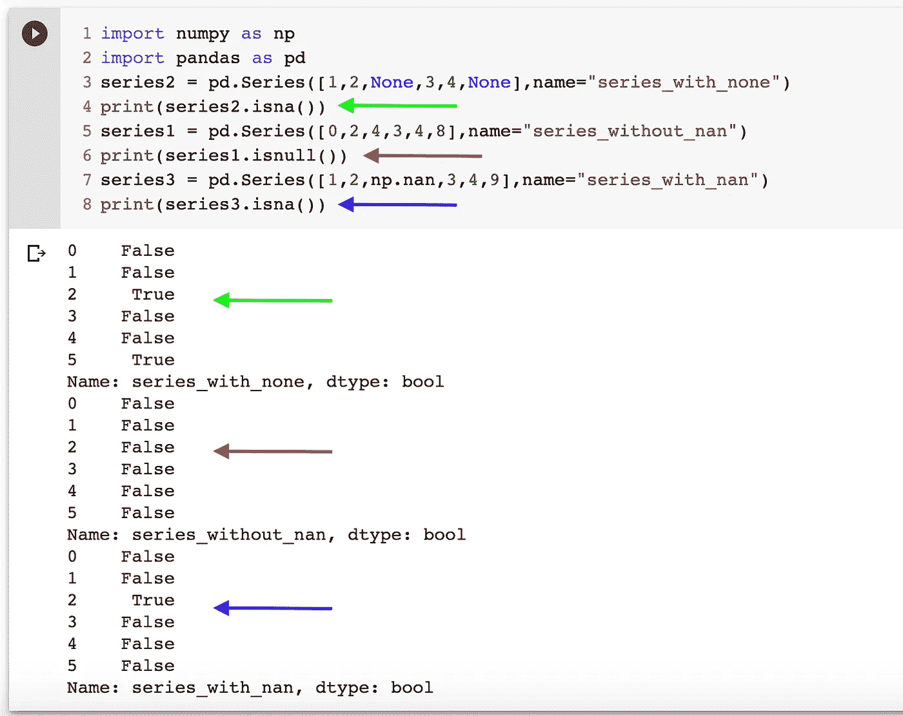
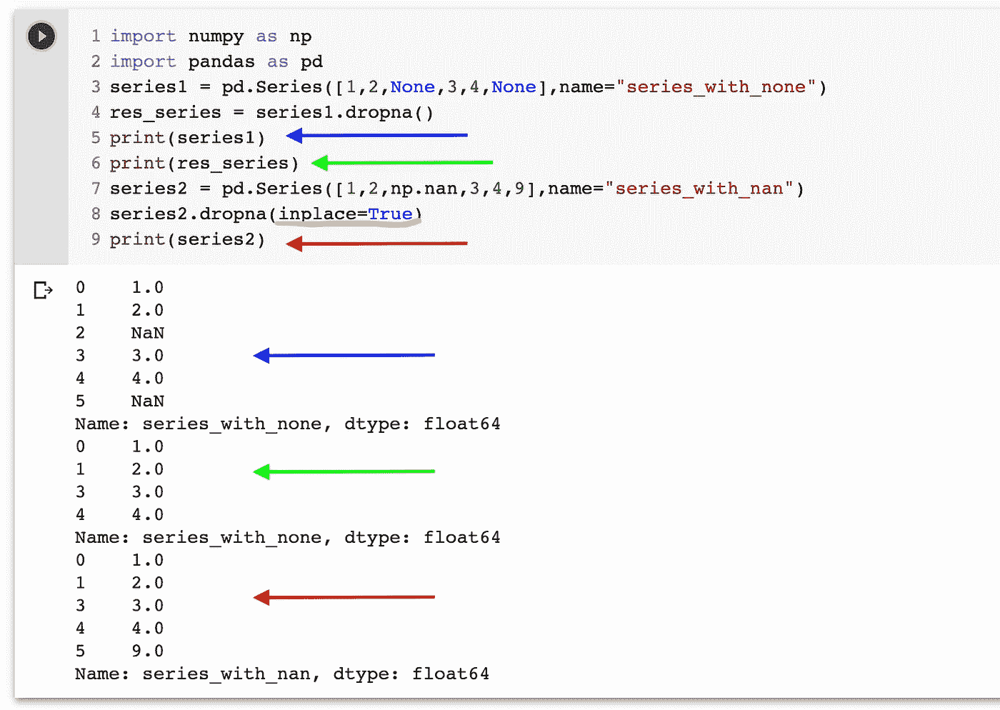
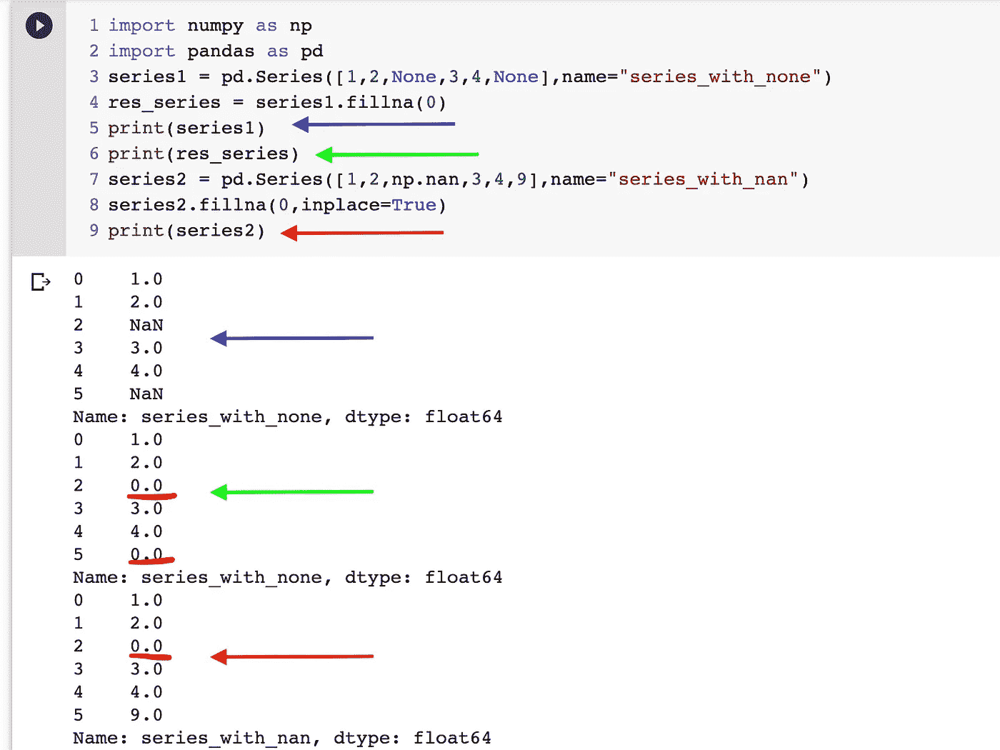
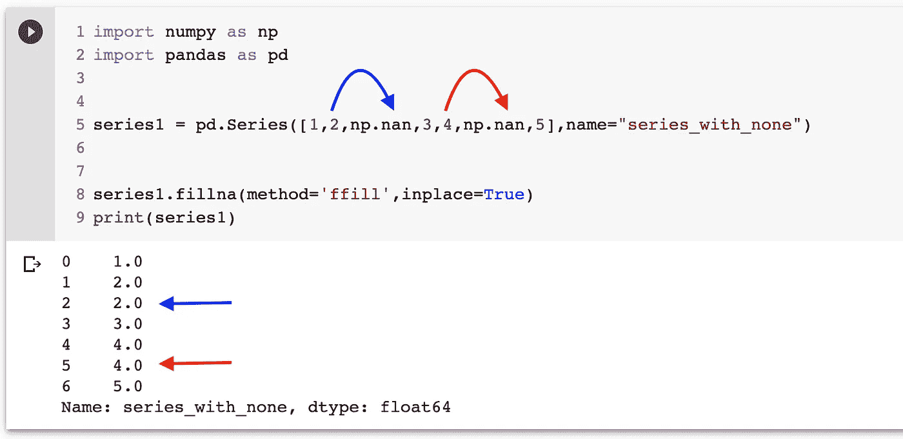
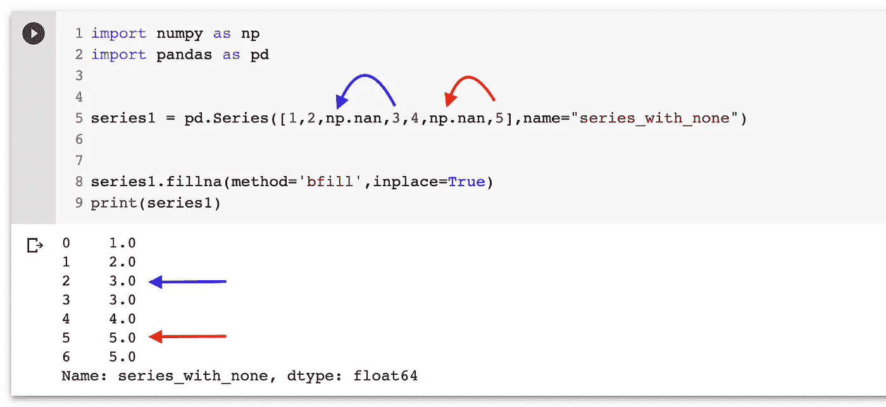
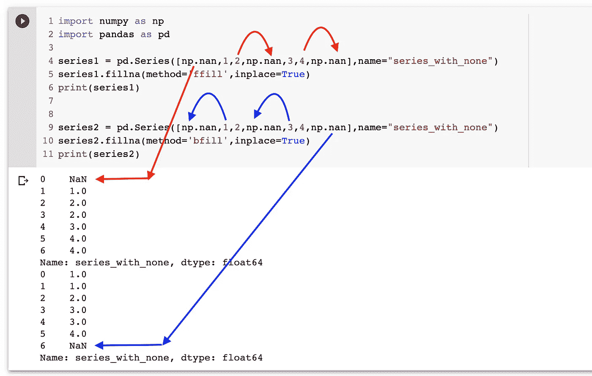

# 学习熊猫。系列(第 7 部分)(处理系列中的 NaN/缺失数据)

> 原文：<https://medium.com/analytics-vidhya/learning-pandas-series-part-7-handling-nan-missing-data-in-series-57f5d888c2f?source=collection_archive---------24----------------------->


凯文·Ku 在 [Unsplash](https://unsplash.com?utm_source=medium&utm_medium=referral) 上拍摄的照片

*在学习熊猫的第 7 部分，我们将探索* `***Pandas.Series***` *处理 NaN 的属性和方法。如果你直接跳到这里，你可能会勾选*`[***Part-6***](/@milankmr/learning-pandas-part-6-series-iloc-explored-iloc-vs-loc-8204825b3a42)`[](/@milankmr/learning-pandas-part-6-series-iloc-explored-iloc-vs-loc-8204825b3a42)**为* `[***iloc and loc comparison***](/@milankmr/learning-pandas-part-6-series-iloc-explored-iloc-vs-loc-8204825b3a42)`*

*→数据分析的一个重要步骤是处理数据集中的缺失数据。在 Pandas 中，缺失数据由 NaN 或 None 交替表示。**在这里阅读更多关于 None 和 NaN 的内容:***

*[](/@milankmr/none-v-s-nan-in-python-numpy-nan-explored-318f4cb6df66) [## Python/Numpy | NaN 中无 v/s NaN 探索

### None v/s Nan，对于新手来说可能比较混乱，大家一起探讨一下吧。您将学习 NaN 基础知识，并将…

medium.com](/@milankmr/none-v-s-nan-in-python-numpy-nan-explored-318f4cb6df66) 

**检查序列是否有 NaN :** 要检查序列是否有 NaN 或缺失数据，我们可以使用“`**hasnans**`”，

```
import numpy as np
import pandas as pdseries2 = pd.Series([1,2,None,3,4,None],name="series_with_none")
print(series2.hasnans)series1 = pd.Series([0,2,4,3,4,8],name="series_without_nan")
print(series1.hasnans)series3 = pd.Series([1,2,np.nan,3,4,9],name="series_with_nan")
print(series3.hasnans)Output:
True
False
True
```



熊猫系列之哈斯南斯

**检测序列中哪些值是 Missing/NaN/Null**:您可以使用 isnull()或 isna()在 NaN 索引上将布尔数组设置为 True。 `**isnull and isna both are aliases of each other**`

同样，您可以使用`**notnull() or notna()**` 来获取现有值，它们正好是`**isnull() and isna()**`的逆运算

```
import numpy as np
import pandas as pdseries2 = pd.Series([1,2,None,3,4,None],name="series_with_none")
print(series2.isna())series1 = pd.Series([0,2,4,3,4,8],name="series_without_nan")
print(series1.isnull())series3 = pd.Series([1,2,np.nan,3,4,9],name="series_with_nan")
print(series3.isna())
```



检测熊猫的 NaN 和缺失数据。系列

现在，我们知道了如何在一个系列中找到 NaN，让我们看看如何从系列中删除 NaN。

`**dropna()**`可用于从系列中删除 NaN:-dropna 默认情况下倾向于不变性，为了在系列本身中进行更改，我们可以使用 param `**inplace=True**` **，**下面是有和没有 inplace 的示例。

```
import numpy as np
import pandas as pdseries1 = pd.Series([1,2,None,3,4,None],name="series_with_none")
res_series = series1.dropna()
print(series1)
print(res_series)series2 = pd.Series([1,2,np.nan,3,4,9],name="series_with_nan")
series2.dropna(inplace=True)
print(series2)
```

在上面的示例中，我们没有对 Series1 使用 inplace=True，因此它不会被更改，并且我们已经将结果保存在 res_Series 中，但是对于 Series2，更改是在 series 本身完成的，请检查下图中的输出:



series.dropna 带和不带在位参数

有时，我们不想从序列中删除 NaN，而是希望用一些计算值(如序列的平均值)替换所有 NaN，用一些值替换序列中的 NaN，我们可以使用`**fillna()**` **。**类似的就地参数规则也适用于 fillna()。！

```
import numpy as np
import pandas as pdseries1 = pd.Series([1,2,None,3,4,None],name="series_with_none")
res_series = series1.fillna(0)
print(series1)print(res_series)series2 = pd.Series([1,2,np.nan,3,4,9],name="series_with_nan")
series2.fillna(0,inplace=True)
print(series2)
```



带和不带在位参数的 Fillna

F

为了填充前面的值，我们可以使用`**method = ‘bfill’**`

为了填充下一个值，我们可以使用`**method = ‘ffill’**`

```
import numpy as np
import pandas as pdseries1 = pd.Series([1,2,np.nan,3,4,np.nan,5],name="series_with_nan")
series1.fillna(**method='ffill'**,inplace=True)
print(series1)
```



向前填熊猫。系列

```
import numpy as np
import pandas as pdseries1 = pd.Series([1,2,np.nan,3,4,np.nan,5],name="series_with_nan")
series1.fillna(**method='bfill'**,inplace=True)
print(series1)
```



倒填熊猫。系列

P 使用“bfill”和“ffill”的问题:当使用相同的值时，我尝试了一个用例，其中序列中的第一个/最后一个值是 NaN，我们使用“ffill/bfill”，让我们检查相同的值

```
import numpy as np
import pandas as pdseries1 = pd.Series([**np.nan**,1,2,np.nan,3,4,np.nan],name="series_with_none")
series1.fillna(method='ffill',inplace=True)print(series1)series2 = pd.Series([np.nan,1,2,np.nan,3,4,**np.nan**],name="series_with_none")
series1.fillna(method='bfill',inplace=True)
print(series2)
```

在上面的系列中，第一个和最后一个值是 NaN，当试图用 bfill 和 ffill 填充时，我们观察到以下情况:



ffill 和 bfill 的问题

根据 ffill 和 bfill 的定义，您可能已经观察到了两种情况下的输出，`**first value is still NaN for ‘ffill’**`和`**last value is still NaN for ‘bfill’**` 。

> **要处理上述问题，您可以根据需要应用 bfill 和 ffill 后，使用** `**fillna(0,inplace=True)**` **在第一个/最后一个位置填充具体值即可！！*** 

*感谢您的阅读，我们可以从处理 NaN 值开始。*

*熊猫还有更多。系列，但现在我将在这里结束这个系列，并将继续学习实际上更有用的 dataframe。*

*如果我得到一些有趣的东西，我会继续发表系列文章。*

*快乐学习！！*

**

*照片由[内森·杜姆劳](https://unsplash.com/@nate_dumlao?utm_source=medium&utm_medium=referral)在 [Unsplash](https://unsplash.com?utm_source=medium&utm_medium=referral) 上拍摄*