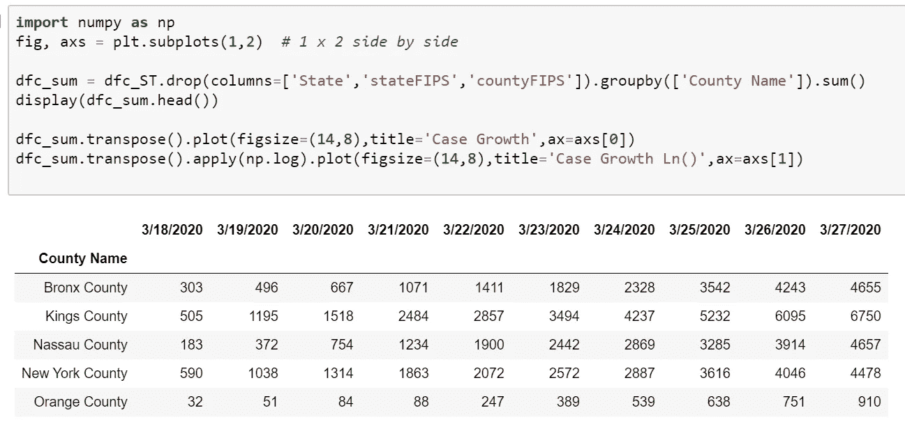
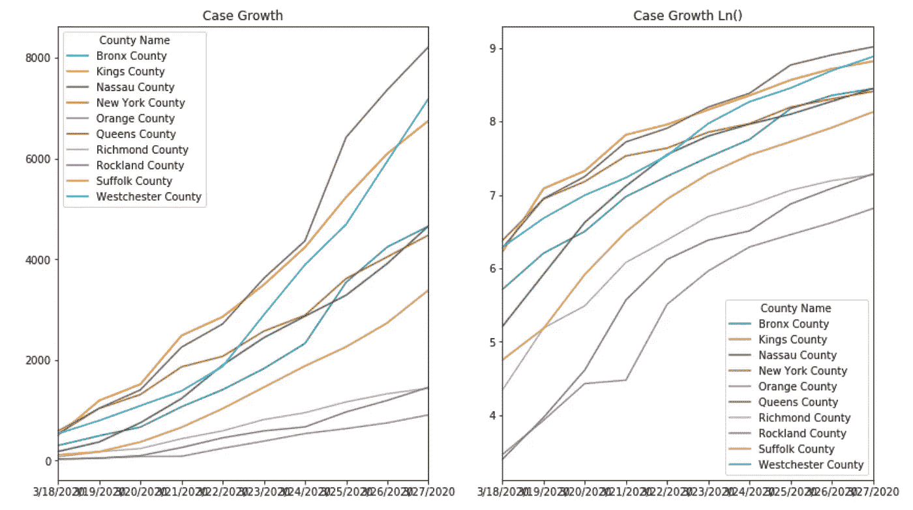

# 通过 COVID 分析了解熊猫

> 原文：<https://medium.com/analytics-vidhya/learning-pandas-via-covid-analysis-79228efb5413?source=collection_archive---------13----------------------->

## 数据工程、科学和分析的又一指南

在 [Unsplash](https://unsplash.com?utm_source=medium&utm_medium=referral) 上[科学高清](https://unsplash.com/@scienceinhd?utm_source=medium&utm_medium=referral)拍摄的照片

即使是人为的，项目在有目标的情况下也能更好地运作。“**我想绘制艾滋病感染率和增长率图，并与标准普尔 500 指数进行比较。让我们开始吧！**

成为一名(黑客)数据科学家或拥有公开的新冠肺炎和纽约证券交易所数据集+ Python 熊猫的 Quant 真的很容易。

(完整的笔记本在[我的 github](https://github.com/dougfoo/machineLearning/blob/master/covid/COVID-Pandas-Intro.ipynb) [0]中可用)，我已经采取了更容易查看的屏幕帽，但很难复制粘贴！)

# **第一步:安装 Python**

下载 Python 和 Jupyter 笔记本附带的 Anaconda 。会假设你能搞清楚这部分。

# 步骤 2:提取数据集

约翰·霍普斯金[1]是被广泛引用且相对稳定的全球数据。*有时会有缺失数据，在这种情况下，他们会复制最后一个值——除了每日变化分析之外，其他都没问题。*

USAfacts [2]是一个较新的逐县汇总。*也有一些数据缺口，但区域层面的细分非常有用。*

标准普尔 500 指数价格可以在 Yahoooooo [3]上找到。

我们将在 Jupyter 笔记本中使用所有三个数据集——一个基于 web 的 Python 运行时/编辑器。

*pd.read_csv(path)* 是一个灵活的 csv 函数，用于本地文件或 web URIs。它返回一个解析过的**data frame***(DFC)*—Panda 的内存表结构。

一旦加载 *dfc.head(3)* 打印表格的前 3 行—整个表格 *(dfc.shape)* 为 1564 行* 69 列。

# 第三步:基本切片和切块

Pandas DataFrames 允许您按行、列或两者进行切片/查看，以显示或创建已加载 CSV 文件的子集。按位置切片很容易— *dfc.iloc[rowstart:end，colstart:end]* 返回一个子集。

使用 *dfc.loc[start:end，start，end]按行名(索引)或列名切片。*如果你只是想要一个特定的列，你也可以使用快捷键 *dfc['ColName']或*。将 display()环绕在您想要输出的任何内容周围。

# 步骤 4:过滤、排序和连接

过滤有点不太直观，让我们解释一下下面的每一行:

*   创建类似于*filter = DFC[' State ']= ' NY '*的过滤表达式
*   传入 DataFrame: *dfc[filter]* 以返回子集
*   使用列片，将前 5 列和后 10 列合并到一个新的 DataFrame 中，使用:*PD . concat([DFS 数组])*
*   使用相同的过滤技术过滤最后一列(2020 年 3 月 23 日)计数> 500 的地方+使用 *df.sort_values()* 方法排序。

信不信由你，上面的教程大部分都是你入门需要知道的！下一步是一些真正有趣的情节。

# 步骤 5:用 Pandas 和 Matplotlib (pyplot)绘图

熊猫最棒的一点是它很好的整合了基本的绘图。这就像打电话给*一样简单。在任一数据帧*上绘制()。

我们可以用 group by 'State '、sum()构建一个按美国各州排名靠前的视图，并像以前一样应用其他切片和排序:

我们知道纽约的病例数很突出—让我们确认一下。右边是 log(e)归一化，使异常值更具可比性。

我们可以用 USAfacts 数据集很容易地挖掘纽约的各个县。只需将 groupby 更改为“县名”并重新运行:

纽约市真的很痛苦..

# 第六步。使用约翰·霍普斯金数据进行全局分析

我们将切换到另一个数据集进行全局分析。约翰·霍普斯金有一个很好的时间序列数据集。我还添加了《标准普尔 500 时报》,这样我们就可以将一些事情叠加在一起。

使用前面介绍的基础知识:read_csv、切片、排序、分组+这个" ***pd.merge*** "方法—我们创建一个新的合并的 S & P 500 + COVID 数据集。一旦我们有了这种时间序列格式，我们就可以很容易地绘制它:

好吧，不简单——但是输出非常好。它用左边的横条和 y 轴覆盖了标准普尔 500 价格。右侧是以 y 轴表示的前 10 个国家的线形图。全局聚合是红色虚线，第二个基准轴位于最右侧。

看起来很严重。我不做预测，但很明显，这个事情正在快速发展(阿尔比埃特与 S&P500 没多大关系)。看看一些新兴市场..截至 3 月 27 日，有 10 个国家的增长速度超过了我们…

另一个比较 3 个国家增长率的很酷的图表非常容易制作:

# 第七步。结束游戏

结束前的最后一件事(本文的结束不是人类的结束)——你也可以很容易地“地理地图”(代码和各种方法见笔记本):

现在就到此为止——祝大家好运！在外面注意安全…

# 参考资料:

*   [0] — **本文代码/笔记本**，在 [GitHub](https://github.com/dougfoo/machineLearning/blob/master/covid/COVID-Pandas-Intro.ipynb) 上
*   [1]— **约翰·霍普斯金日报**，上 [GitHub](https://github.com/CSSEGISandData/COVID-19.git)
*   [2] — **美国事实**美国地区数据，关于[USAfacts.org](https://usafacts.org/visualizations/coronavirus-covid-19-spread-map/)
*   [3] — **S & P 500** 数据，[雅虎财经](https://finance.yahoo.com/quote/%5EGSPC/history?p=%5EGSPC)
*   [4] —强烈推荐**熊猫 10 分钟教程**，[pydata.org](https://pandas.pydata.org/pandas-docs/stable/getting_started/10min.html)
*   [5] — **布莱斯的**网站，我从那里窃取想法，[ro-z.net](https://ro-z.net/assets/covid19quickanalysis.html)
*   [6] —半实时**全球跟踪器**，[世界计数器](https://www.worldometers.info/coronavirus/)