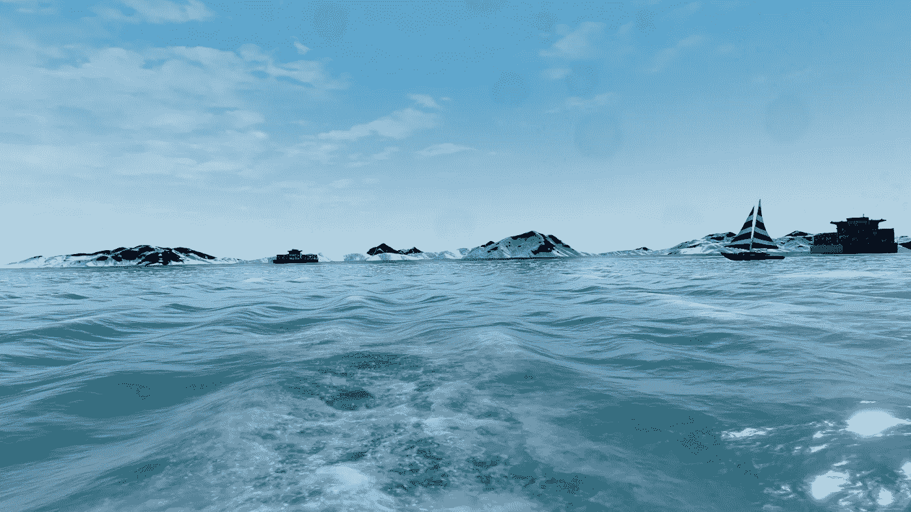
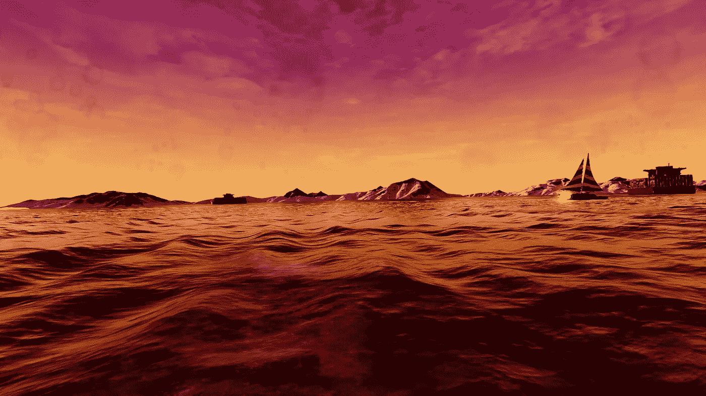
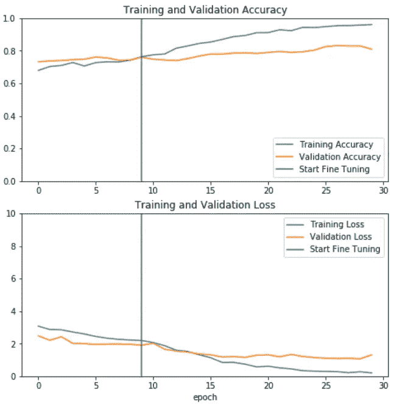

# 3D 模拟的学习参数

> 原文：<https://medium.com/analytics-vidhya/learning-parameters-of-3d-simulations-2d4591b47826?source=collection_archive---------15----------------------->

我简要看了一下 http://ailivesim.com/提供的一些数据。 **AIliveSim** 建立了一个模拟工具，在非常真实的 3D 环境中训练和测试代理。

他们的一些海上模拟给我留下了深刻的印象。来自模拟 3D 环境的快照看起来非常真实。这包括逼真的海浪，以及反射和相机镜头上最终的水花。

白天拍摄的模拟快照。

黄昏时拍摄的模拟快照。

# 从图片中预测参数

定义特定模拟的参数有很多。你可以在下面看到其中的一些:

> 【SeasonDefaultSettings】
> 树叶密度=1.707774
> 季节=夏季
> enable Rain = false
> Randomize = true
> Rain = NoRain
> enable leaves = false
> ground wetness type = Dry
> …

在这些参数中，存在数字参数，例如:一天中的时间、雾量、降雨量、太阳亮度等。我决定分析是否有可能从一张图片中预测出任何参数。这对于从*任何真实图片*中估计新模拟的参数可能是有用的。我从**开始，从一张图片**中预测时间。

我得到了一组在不同时间拍摄的模拟图像的数据集:**从早上 5 点到下午 6 点**。每一次，都有大致相同数量的图片。换言之，目标标签是均匀分布的。这可能使训练分类器更容易。

# 图像的迁移学习

我发现了这个使用 **Keras** 和**tensor flow 2.0**:[https://www . tensor flow . org/tutorials/images/transfer _ learning](https://www.tensorflow.org/tutorials/images/transfer_learning)的**迁移学习**的便捷教程。在本教程中，迁移学习用于在 **ImageNet** 上定制预训练的模型**。他们的目标任务是区分“猫图片”和“狗图片”。同样，我使用预先训练的模型来区分白天拍摄的照片和黎明或黄昏拍摄的照片。我白天的代理是“上午 11 点至下午 3 点之间拍摄的照片”。更具体地说，我的二元分类问题有两类:**

*   第一类:上午 11 点至下午 3 点之间拍摄的照片；
*   第 0 类:上午 5 点至 11 点之间拍摄的照片，以及下午 3 点至 6 点之间拍摄的照片。

对上述笔记本的主要修改在于**从 Google Drive 加载我自己的图片。**为此，我编写了一个脚本，让**将**图像的大小调整为 160x160 像素，并让**将它们的标签**添加到文件名中。例如，`d4321a23_raw_13.0.png`是下午 1 点拍摄的调整过大小的图像的输出。我把脚本放在这里:[https://github.com/simoroma/PythonMLUtils](https://github.com/simoroma/PythonMLUtils)。图像一旦调整到 160x160，就不会占用太多空间，可以方便地传输到 Google Drive。我还修改了上面的笔记本，直接从 Google drive 加载图片。这里有:[https://github.com/simoroma/TransferLearningOnImages](https://github.com/simoroma/TransferLearningOnImages)。如果你提供自己的图片，你可以在 **Google Colab** 上尝试一下(只需点击在 Colab 中打开)。Google Colab 也为这类实验提供了基本的 GPU。

我用了 1000 张图片进行训练，500 张图片进行验证。训练集中的图像是从与验证集不同的模拟中获得的。在不同的模拟集上验证结果应该是对分类器概括能力的更好的估计。

# 初步结果

[T](https://www.tensorflow.org/beta/tutorials/images/transfer_learning) 顶部的图显示了每个时期的**训练和验证精度**。

使用用于**特征提取的预训练网络获得第一个时期的结果，**图的第二部分显示了**微调的结果。**

**特征提取:**预训练的网络不是为了这个任务而重新训练的，而是仅仅用于提取特征。在提取的特征上训练的分类器被添加到网络的顶部，以根据我们的特定任务定制它。

**微调:**使用新图像对整个网络或网络的某些部分进行微调。

我们看到，当我们开始微调时，训练集上的预测**准确性增加了**相当多。另一方面，**验证精度缓慢增加**。对于网络来说，预测一天中的时间似乎是一项具有挑战性的任务，尽管如此，该模型肯定会选择一些模式来预测它。

# 洞察力

这只是一个分析的起点。在继续深入分析之前，我只想分享一些初步见解:

*   将 1 级定义为“上午 11 点至下午 3 点之间拍摄的照片”似乎有所帮助。其他设置包括选择不同的时间范围。尽管如此，该模型似乎表现更差；
*   我还测试了另一组雾和海的颜色设置为常量的图片。这似乎实际上并没有改善模型；
*   当然，最好将这项任务视为一个回归问题。该网络可以将一天中的时间作为数值来学习。为此目的更换笔记本并不太困难；
*   如前所述，验证集中的模拟不同于训练集中的模拟。使用相同的模拟并没有真正的帮助；
*   在同一台笔记本电脑上的不同运行之间，准确性结果有很大的差异。我没想到会有这么大的变化，这肯定是需要调查的事情；
*   我们可以使用`model.evaluate`来检查我们的模型在不同场景下的性能。尽管结果似乎与`model.fit`的输出不匹配。我没有深究它，但它似乎仍然是一个开放的问题在 Keras:【https://github.com/keras-team/keras/issues/6977[。](https://github.com/keras-team/keras/issues/6977)

# 摘要

我展示了一个关于从单幅图片中提取参数的初步分析。图片是由 **AIliveSim** 通过 3D 模拟获得的。如果使用**转移学习**，似乎完全可以从图片中学习参数。

以下脚本也是将这些技术应用到您自己的图像的良好起点:

*   Python 脚本给**调整图像尺寸**和**添加它们的标签**它们的文件名[https://github.com/simoroma/PythonMLUtils](https://github.com/simoroma/PythonMLUtils)；
*   我在 Colab 使用的从 **Google Drive 加载图片的笔记本:**[https://github.com/simoroma/TransferLearningOnImages](https://github.com/simoroma/TransferLearningOnImages)；
*   原 Google 关于图像的迁移学习教程:[https://www . tensor flow . org/tutorials/images/transfer _ learning](https://www.tensorflow.org/tutorials/images/transfer_learning)。