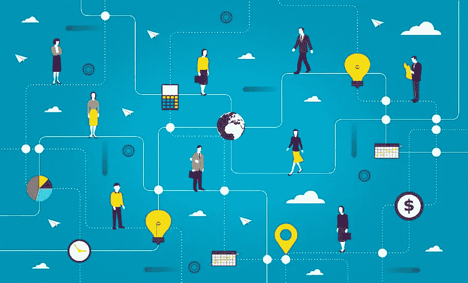
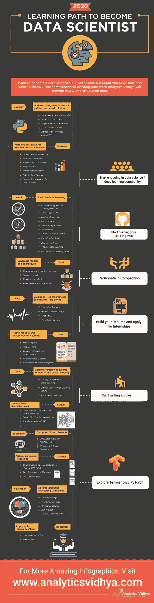

# 2020 年成为数据科学家的学习之路

> 原文：<https://medium.com/analytics-vidhya/learning-path-to-become-a-data-scientist-in-2020-ab047133611?source=collection_archive---------12----------------------->

学习路径无疑是我们在新年伊始策划的最受欢迎和最受欢迎的资源之一。我们最近收到了大量询问，询问我们何时发布 2020 年的学习路径。

现在，我们很高兴为我们的社区呈现 2020 年的第一条学习路径！

> 【2020 年的学习路径是以结构化的方式收集的最全面的终极资源。这条学习之路面向任何想在数据科学领域发展的人。因此，无论你是大一新生，有几年的工作经验，还是中级专业人员，这条数据科学学习道路都适合你。

*今年，在去年我们受到热烈欢迎的基础上，我们扩大了这些学习途径的范围。我们将发布 4 条不同的学习路径，每条路径都侧重于您在学习旅程中所处的位置:*

*   [*2020 年成为数据科学家和机器学习大师的学习之路*](https://www.analyticsvidhya.com/blog/2020/01/learning-path-data-scientist-machine-learning-2020/?utm_source=medium&utm_medium=Learning-Path-Medium)
*   [*2020 年掌握深度学习的学习路径*](https://www.analyticsvidhya.com/blog/2020/01/learning-path-data-scientist-machine-learning-2020/?utm_source=medium&utm_medium=Learning-Path-Medium)
*   [*自然语言处理学习路径*](https://www.analyticsvidhya.com/blog/2020/01/learning-path-nlp-2020/?utm_source=medium&utm_medium=Learning-Path-Medium)
*   [*计算机视觉学习路径*](https://www.analyticsvidhya.com/blog/2020/01/computer-vision-learning-path-2020/?utm_source=medium&utm_medium=Learning-Path-Medium)

# 为什么您应该参加这一数据科学学习途径

外面有太多的学习资源。我相信任何试图从不同来源进行研究的人都会理解这一点。无论你在职业生涯中处于什么位置，这对任何刚起步的人来说都是难以承受的。

因此我们创造了这些学习路径。

我们消除了在数据科学、机器学习、深度学习、自然语言处理(NLP)和计算机视觉上浏览数百种资源的痛苦、时间和努力。我们的目标是为您提供最好的学习资源，帮助您简化数据科学学习之旅。

# 您可以在此访问 2020 年成为数据科学家的完整和最全面的[学习路径。您需要在课程平台上注册才能注册。这将使您能够在机器学习过程中跟踪您所学的内容。](https://courses.analyticsvidhya.com/courses/a-comprehensive-learning-path-to-become-a-data-scientist-in-2020?utm_source=blog&utm_medium=learning-path-data-scientist-machine-learning-2020)

# 摘要—2020 年成为数据科学家的学习之路

下面总结了使用此学习途径您可以学到的内容(以及您应该遵循的步骤):

*   **数据科学和 Python 入门:**成为数据科学家之旅的开始！了解数据科学家的工作，与数据科学相关的各种术语，并开始熟悉 Python 编程语言
*   **统计与数学:**数据科学的中坚力量。您将涉及的一些关键概念是概率、推断统计，并掌握如何执行探索性数据分析(EDA)。这也将包括线性代数的基础知识(另一个核心的机器学习主题)
*   **机器学习基础:**欢迎来到机器学习的世界！本节将向您介绍基本的机器学习算法和技术，包括线性回归、逻辑回归、决策树、朴素贝叶斯、支持向量机(SVM)等等
*   **集成学习:**是时候深入研究高级机器学习主题了。了解什么是集成，不同的集成技术，并开始处理数据集以获得动手实践经验
*   **时间序列:**这个空间中比较复杂的话题之一。这本身就值得一整节，所以我们还包括了一个实践项目，让你熟悉各种时间序列概念以及它们在现实世界中的工作方式
*   **矩阵代数与推荐系统:**你会问为什么是矩阵代数？嗯，没有它，你不可能真正认真地学习推荐引擎是如何工作的！因此，这一部分将在六月份的学习路径中介绍，主要是关于这两个趋势和相关概念。这将涵盖维度缩减技术，如主成分分析(PCA)以及推荐引擎项目
*   **神经网络(和深度学习):**是的，深度学习是数据科学学习路径的一部分。鉴于深度学习应用的快速兴起和采用，这可能是你作为数据科学家角色的一个非常相关的部分。您将学习神经网络，还将学习一个流行的深度学习框架 Keras(您可以根据自己的喜好选择其他框架，如 PyTorch)
*   **计算机视觉:**计算机视觉无疑是业内需求最大的深度学习领域。在你熟悉了上面的部分之后，深入研究不同种类的计算机视觉问题，并且边做边学
*   **自然语言处理(NLP):** 任何行业最热门的领域。各行各业都在争先恐后地寻找最好的 NLP 人才——这是开始在 NLP 工作的好时机！从 Google 的 BERT 到脸书的 RoBERTa，开始熟悉最新的 NLP 框架

**如上所述，您可以在这里** **访问完整的数据科学学习路径** [**。立即注册，开始您的机器学习之旅！你可以在一年中追踪你的进展，检查里程碑，一点点接近你的梦想角色。**](https://www.analyticsvidhya.com/blog/2020/01/learning-path-data-scientist-machine-learning-2020/?utm_source=medium&utm_medium=Learning-Path-Medium)

我们还提供了这种数据科学学习途径的图解版本，下面描绘了逐月的情况。你可以把它打印出来，作为检查清单。如果你尽了最大努力并遵循这条学习路径，你将在 2020 年底前开始破解数据科学面试。

*你可以在这里* *下载高清版的信息图* [*。*](https://discuss.analyticsvidhya.com/t/a-comprehensive-learning-path-to-become-a-data-scientist-in-2020/87673)

你也可以在分析 Vidhya 的 Android 应用上阅读这篇文章

*原载于 2020 年 1 月 6 日*[*https://www.analyticsvidhya.com*](https://www.analyticsvidhya.com/blog/2020/01/learning-path-data-scientist-machine-learning-2020/)*。*