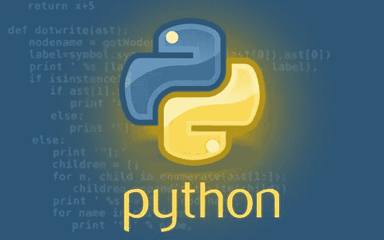

# 使用 Python 学习编程基础

> 原文：<https://medium.com/analytics-vidhya/learning-programming-fundamentals-using-python-de42d505bb77?source=collection_archive---------16----------------------->

探索 Python 中的数据类型。

[来源](https://ourcodeworld.com/articles/read/734/why-is-python-the-future-of-programming)

# 背景

我是一名自学成才的开发人员，2019 年 3 月开始学习编码。我刚刚获得化学硕士学位，在找工作的时候，我偶然发现了编程，并且没有回头看。我尝试过许多不同的学习编程的方法，我在这里分享一些我认为是…