# 学习 Python 进行数据可视化

> 原文：<https://medium.com/analytics-vidhya/learning-python-for-data-visualization-5c2969f16f21?source=collection_archive---------12----------------------->

在我的第一个数据可视化项目中，我深入研究了 Zillow 提供的房价数据集。这个特殊的数据集具有按邮政编码排列的三居室房屋的平均值。

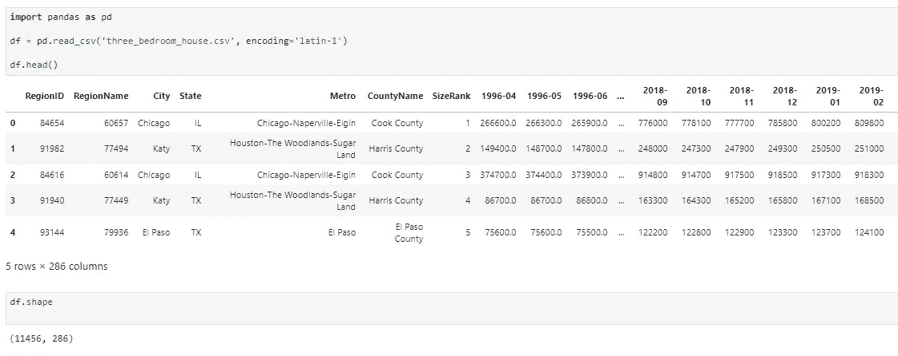

正如你所看到的，这些列还包括从 1996 年到 2019 年每个月的平均月房价。

我对这个项目的目标是:

1.  创建一个可视化的图表，标出美国每个家庭每月的平均花费。
2.  找出美国在 2007/2008 年房市崩盘中受打击最严重的城市。
3.  创建一个包含数据集中每个邮政编码的 choropleth 地图。

清理数据时，我采取的第一步是删除除邮政编码和每月价格之外的所有功能。

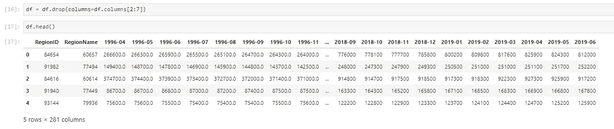

然后，我转置了数据框，并将索引设置为“日期”。这允许我隔离每个邮政编码，以便在列级别上执行进一步的操作。

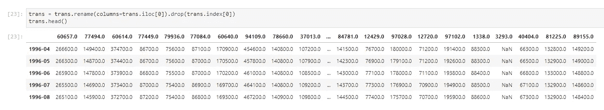

创建一个“百分比变化”栏可以让我看到每个区域的每日波动。我还绘制了这个数据，以便更好地理解这个数据集中的差异。

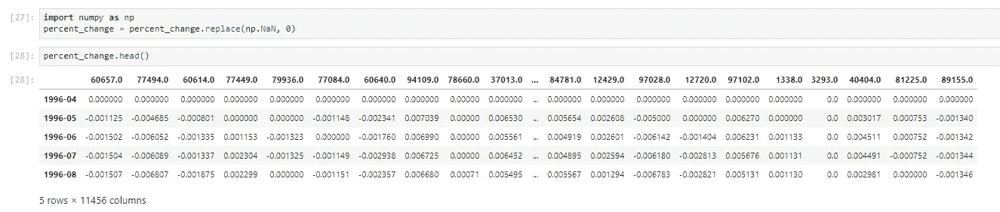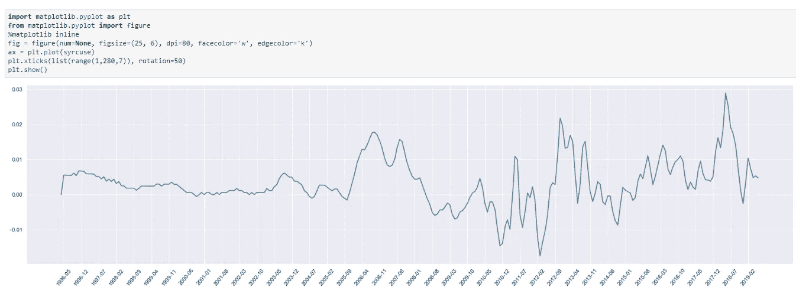

现在，这是事情变得有点棘手的部分。我的目标是获得从记录数据的第一天开始，房产价值增加的百分比。这意味着在 1996 年 3 月，所有财产价值将被设置为 0%,并每月增加/减少。

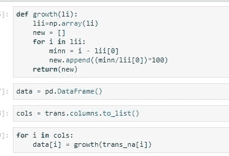

在 for 循环中调用的这个简单函数接受数据集的整个列，保存列中的第一个值，然后计算每个值相对于第一个值的变化百分比。for 循环对我们的数据框中的每一列执行此操作，然后将结果保存为新数据框中的一个新列，称为“data”。

收集完这些数据后，我提取了每个时间段的平均值，并绘制了图表。

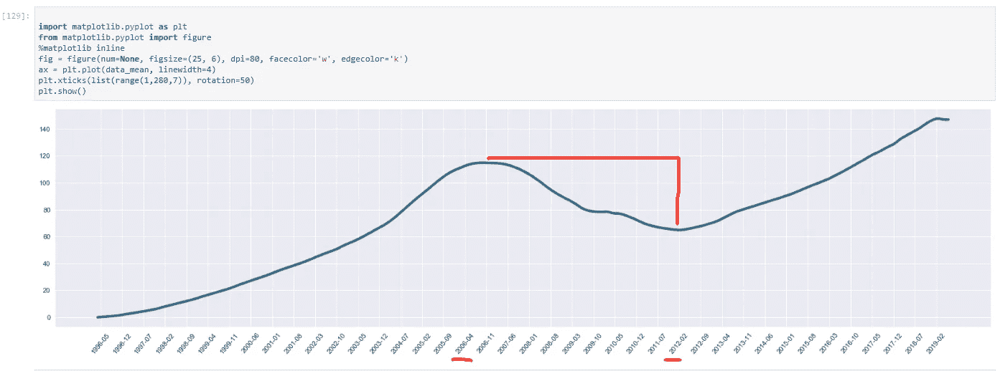

根据这组数据，房地产市场在 2006 年开始下跌，并在 2012 年初趋于平稳。根据这张图表，我想找出美国在房地产危机中受打击最严重的地区。

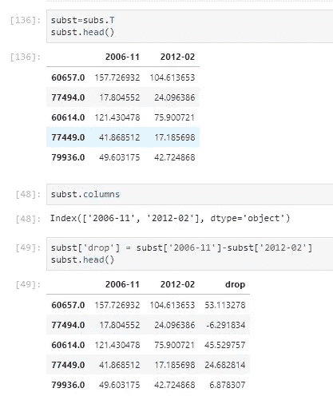

“subst”是一个包含两列的数据框(2006–11 和 2012–02)。隔离这两列后，我用 2012 年减去 2006 年，创建了一个新列。这个名为“drop”的新列让我可以看到在这段时间内每个邮政编码下降的百分比。我只需按“下降”列对数据框进行排序，就可以查看下降百分比最高的区域。对这个数据框进行排序后，我发现了以下内容:

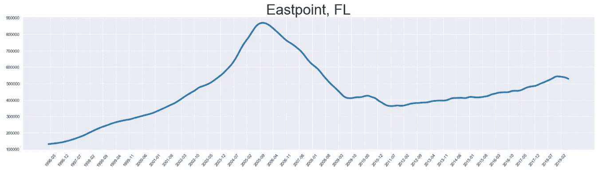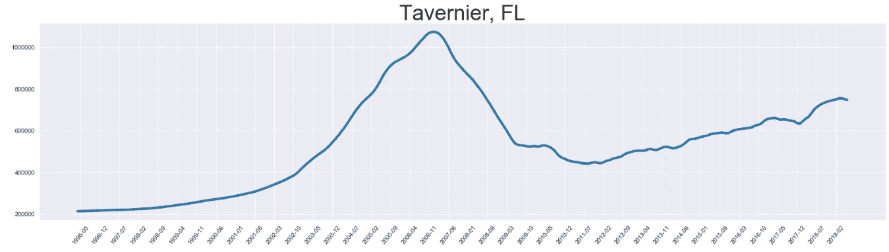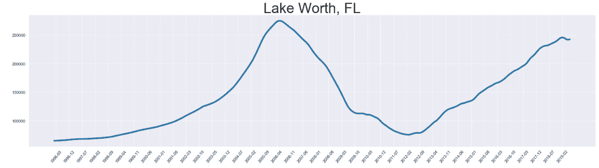

佛罗里达州的邮政编码出现在房市危机中受打击最严重的前 50 个地区。自 2012 年以来，佛罗里达州的许多地区尚未恢复。

这个项目的最后一部分是最耗时的。创建一个一段时间内每个邮政编码的动画分布图比我想象的要困难得多。我最终使用了一个名为 Geopandas 的库，我在网上找到了一个. shp 文件，上面有美国每个邮政编码的多边形坐标和形状。

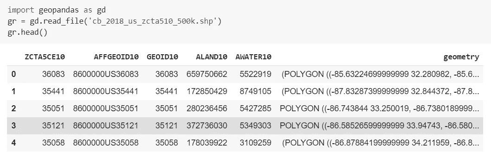

我清理了这些数据，然后将其与我之前的数据集合并。一旦数据被清理和组织，我开始绘图。

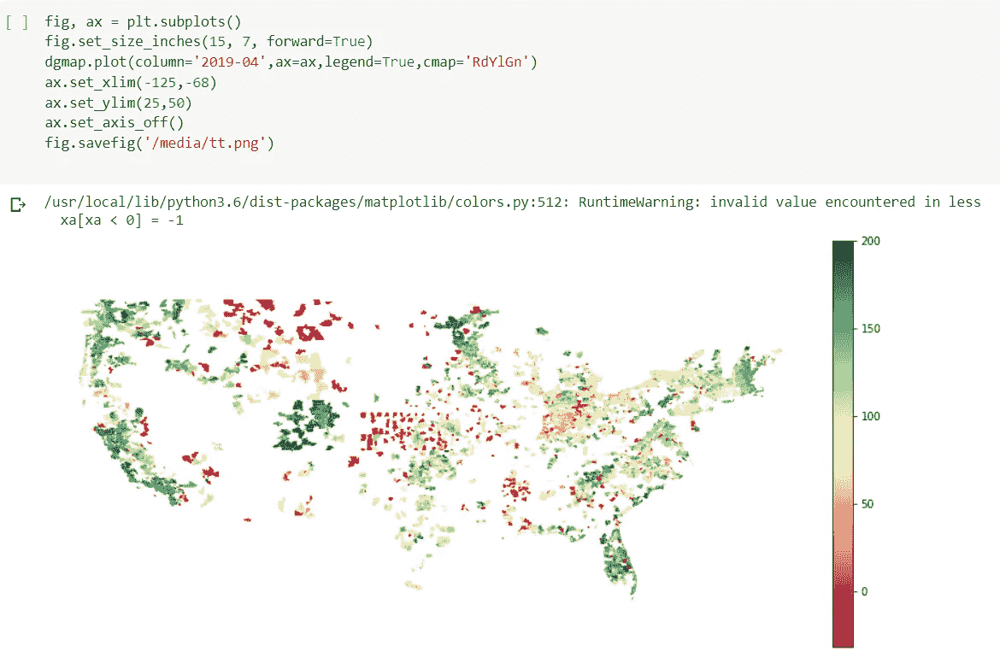

这里有几点需要注意。默认情况下，绘制 geopandas 地图时，每个国家都有一个空白区域。我必须控制 X 和 Y 轴，以便将美国大陆与世界其他地区隔离开来。另外，你可能会注意到地图上有很多空白。这是因为我正在处理的数据集并不包含美国的所有邮政编码。以后想找一个完整的数据集，看一看剧情。

试图给这张地图添加动画不是一件容易的事情。Geopandas 不提供任何动画功能，所以我找到了一个替代解决方案。这个过程有点笨拙，但它的工作。

我首先创建了一个 for 循环，它将为每个时间段创建一个图，然后将该图作为图像保存在一个文件夹中。

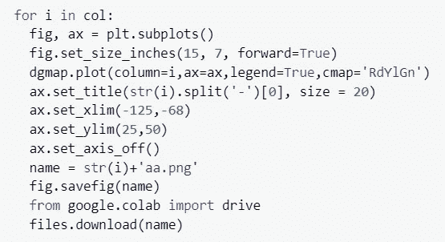

运行这段代码需要一段时间，因为它必须绘制 14，000 个坐标 283 次。

然后，我使用 OpenCV2 编写了一个 python 脚本来收集文件夹中的所有图像，然后将其转换为 MP4 文件。

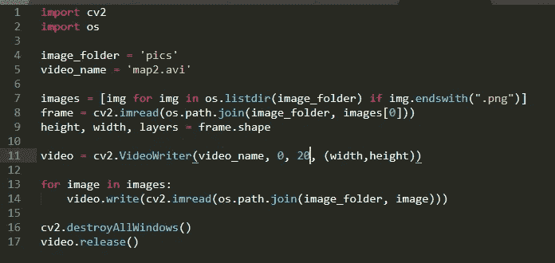

最终产品看起来像这样:

横条上的数字代表房屋价值增加的百分比，最大值为 200%。

该项目的目的不是发现任何关于住房市场的新的革命性见解。我的主要目标是证明，仅仅学习 Python 一个月，仍然可以完成很多事情。如果您对这个数据集有任何疑问，或者想要学习 python 时的最佳实践的提示，请随时联系我！