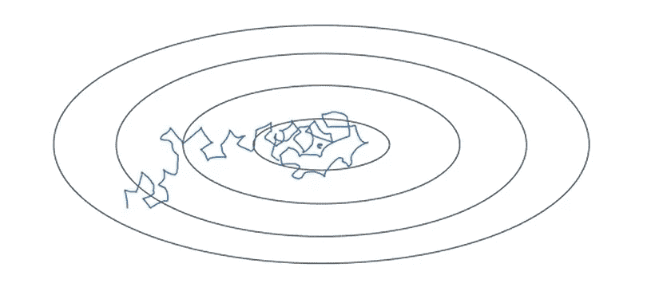

# 深度学习中的学习速率衰减和方法

> 原文：<https://medium.com/analytics-vidhya/learning-rate-decay-and-methods-in-deep-learning-2cee564f910b?source=collection_archive---------2----------------------->

当使用随机或小批量梯度下降和恒定学习速率训练神经网络时，我们的算法通常以有噪声的方式(MBGD 中噪声较小)收敛于最小值，并最终远离实际最小值振荡，为了克服这种情况，研究人员提出了一种建议，即随着时间的推移衰减学习速率，这有助于网络收敛于局部最小值并避免振荡。

通过这篇文章，我试图给你一个简单的直觉，关于使用**学习率衰减**及其各种方法来优化和推广你的神经网络。

# 学习率衰减

学习率衰减是一种训练现代神经网络的技术。它开始以较大的学习速率训练网络，然后慢慢地减少/衰减它，直到获得局部最小值。根据经验观察，这有助于优化和推广。

## 它是如何工作的？

以恒定学习速率收敛的算法(有噪声，用蓝色表示)

算法收敛，同时学习率随时间衰减(噪音较小，用绿色表示)

在我们具有恒定学习速率的第一幅图像中，我们的算法在朝着最小值迭代时所采取的步骤是如此嘈杂，以至于在某些迭代之后，它似乎在最小值周围徘徊，并且实际上没有收敛。

但是在第二张图中，学习率随着时间的推移而降低(用绿线表示)，由于学习率最初很大，我们仍然有相对较快的学习，但是随着趋向最小值，学习率变得越来越小，最终在最小值附近的更小区域中振荡，而不是远离最小值。

## **学习率衰减(常用方法):**

> *" α* =(1/(1+ *十进制数*×*epoch number))***α*0 "

> 1 个时期:1 次通过数据
> 
> α:学习率(当前迭代)
> 
> α0:初始学习率
> 
> decayRate:方法的超参数

为了更直观，让我们举一个上面方法的粗略例子:

假设α0 = 0.2，衰减率=1，那么对于每个时期，我们可以检查学习率α的下降:

纪元 1: alpha 0.1

纪元 2:阿尔法 0.067

纪元 3:阿尔法 0.05

纪元 4:阿尔法 0.04

这是将学习率衰减应用于训练神经网络的一种典型方法(通常使用)，希望我能够为您提供对该主题的直观感受，让我们检查更多学习率衰减的方法。

# 其他方法

1.  **指数衰减:**

> "α = ( decayRate^(epochNumber) )*α0 "

该函数将指数衰减函数应用于所提供的初始学习速率，使得学习速率随时间呈指数衰减。

这种方法的十倍体总是小于 1，0.95 是从业者最常用的。

**2。离散楼梯:**

图片来自 [mc.ai](https://mc.ai/learning-rate-decay-and-methods-in-deep-learning-3/)

在这种方法中，学习率在每隔一定的时间间隔后以一些不连续的步骤降低，例如，每隔 10 秒，学习率降低一半。

**3。基于纪元编号:**

> "α = ( k/ √epochNumber )* α0 "

在这种方法中，我们取某个常数“k ”,并将其除以纪元编号的平方根。

**4。基于小批量:**

> "α = ( k/ √t)* α0 "

在这种方法中，我们取某个常数“k ”,并将其除以小批量的平方根。(此方法仅用于小批量梯度下降。)

**5。手动衰减:**

在这种方法中，实践者手动检查算法的性能，并且手动每天或每小时等地降低学习速率。

# 结论

学习率衰减是一种优化和推广深度神经网络的先进技术，其方法在深度学习领域得到了广泛应用，一些深度学习 API 框架如 *KERAS* 已经内置了对这些方法的支持。希望这篇文章对你们有所帮助。

感谢阅读🙂

*演职员表:吴恩达*

*参考:* [*改进深度神经网络-* 超参数调优](http://www.coursera.org/learn/deep-neural-network) …