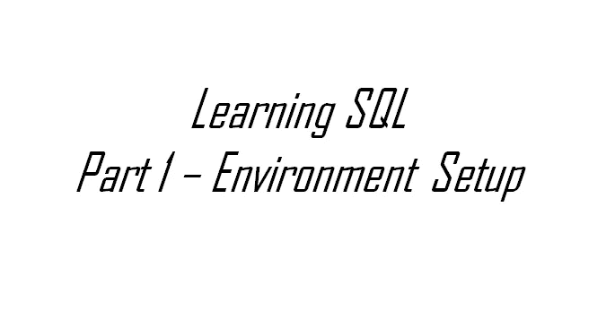

# 学习 SQL，第 1 部分—设置您的环境

> 原文：<https://medium.com/analytics-vidhya/learning-sql-part-1-setup-your-environment-145c590e550e?source=collection_archive---------30----------------------->

经常有人问我，SQL 作为一种编程语言，对于那些希望建立数据分析或 BI 技能的人来说有多容易理解。我的回答永远是非常！我相信任何有兴趣的人都可以学习 SQL。下一个问题通常是从哪里开始，我希望这将有所帮助。这是一个系列的第一篇文章，在这个系列中，我将用简短的文章向您介绍 SQL 的基础知识。