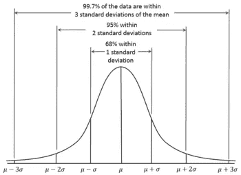
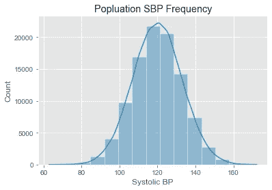
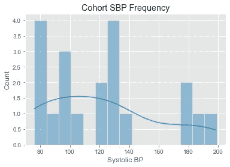
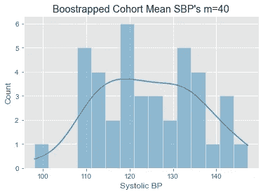
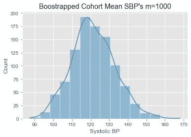
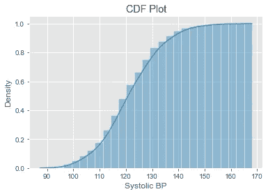

# 学习中心极限定理和自举:实践方法。

> 原文：<https://medium.com/analytics-vidhya/learning-the-central-limit-theorem-and-bootstrapping-a-hands-on-approach-78da7cad0438?source=collection_archive---------0----------------------->


[hdhut.blogspot.com](http://hdhut.blogspot.com/2012/07/top-37-most-beautiful-mountains.html)

# 理解中心极限定理，自举，以及为什么你应该关心…

> “**中心极限定理** ( **CLT** )确立了，在某些情况下，当[个独立随机变量](https://en.wikipedia.org/wiki/Statistical_independence)相加时，它们的正常归一化和趋向于[个正态分布](https://en.wikipedia.org/wiki/Normal_distribution)(非正式的一个“*钟形曲线*”)，即使原始变量本身不是正态分布。该定理是概率论中的一个关键概念，因为它意味着适用于正态分布的概率和统计方法可以适用于许多涉及其他类型分布的问题。”
> 
> —维基百科

对于医疗提供者、数据科学家和统计学家来说，中心极限定理类似于万有引力定律；这是一个基本的真理，直到一些重要的假设被违反(见这里的一些讨论)。我个人对这个定理的定义比上一个稍微实用一些:

> 中心极限定理指出，从单个总体中抽取的有限方差样本的聚合度量(平均值、中值、标准偏差等)的分布遵循正态分布。



资料来源:https://en.wikipedia.org/wiki/Normal_distribution

这个定理对医学有多重要？嗯，我们为病人考虑的每一个生物物理变量(生命体征、实验室、心电图等。)基于这个定理定义为正常或异常。考虑一下我们在每次患者就诊时使用的最基本的测量方法之一，核心温度。一般来说，如果一个人的核心温度在人群平均核心温度的 2 个标准偏差之内，那么他就被认为是无热的。我们知道整个人类的真实平均温度吗？当然不是。那么我们如何知道总体均值和标准差呢？我们必须假设总体样本的均值和方差遵循基于中心极限定理的正态分布，然后我们可以使用基本统计学来定义正态分布。顺便说一句，什么是正常的核心温度？37 C 对吧？不完全是，在这里阅读更多[……](http://infection-prevention-news.3m.com/what-is-the-normal-core-temperature-of-the-human-body/)

如果您对统计学不太熟悉，或者您是一名新的数据科学家，那么本文的剩余部分可能有助于您理解什么是中心极限定理，以及通过编写一些基本代码来理解它的作用。

```
# Standard imports and using random seed 42import numpy as np
import random as ran
import seaborn as sns
import matplotlib.pyplot as plt
from scipy import stats
plt.style.use('ggplot')
ran.seed(42)
np.random.seed(42)
%matplotlib inline
plt.style.use('ggplot')
```

让我们用一些正态分布的假数据来回答一个临床问题。假设我们有一个人口，我们想知道人口的平均收缩压(SBP)。让我们把人口总数定为 10 万人。我们还假设每个人的 SBP 在 70:180 之间，平均值为 120，标准差为 13。这是我们的数据。

```
# Generating synthetic population data with normalized distributionpopulation_sbp = np.random.normal(loc=120.0, scale=13, size=100000)print('Mean SBP for synthetic population:{}'.format(round(np.mean(population_sbp),2)))sns.histplot(population_sbp, kde=True, bins=15).set(title="Popluation SBP Frequency", xlabel="Systolic BP")Mean SBP for synthetic population: 120.01
```



正态分布 N=100，000 的合成 SBP

现在，假设我们有一个人口暴露(人口统计，药物，疾病等。)的兴趣。我们想知道他们的 SBP 在统计学上是否不同于其他人群。

```
# Pulling out a cohort of interest (N=20)
# Maybe everyone on a stimulant medicationcohort_bp = [ran.randint(70,200) for i in range(20)]print('Mean SBP for synthetic cohorot: {}'.format(round(np.mean(cohort_bp),2)))sns.histplot(cohort_bp, kde=True, bins=15).set(xlabel='Systolic BP', title="Cohort SBP Frequency")Mean SBP for synthetic cohort: 121.4
```



来自我们队列的数据显示 SBP 的频率

不错！121.4 接近 120.01，所以我们可以有把握地说，没有区别，曝光不会增加你的 SBP。但是等等，我们确定吗？

## 输入引导程序:

Bootstrapping 是一种重新采样的形式，在这种形式中，我们从一个样本中随机获取数据，并进行替换，没有偏见。换句话说，我们使用我们的原始亚群体重复进行我们的实验，以获得我们的数据集内的方差的更准确的想法。让我们通过它来更好地理解为什么它如此有用。

```
# Bootstrapping to generate an idea of variance in our cohort
# n=5, m=40 (repeating 40 times)pop_mbp40 = [np.mean(ran.choices(cohort_bp, k=10)) for k in range(40)]print('Mean SBP of multiple "Experiments" using bootstrapping of cohort: {}'.format(round(np.mean(pop_mbp40),2)))sns.histplot(pop_mbp40, bins=15, kde=True).set(xlabel='Systolic BP', title="Boostrapped Cohort Mean SBP's n=40")plt.show()Mean SBP of multiple "Experiments" using bootstrapping of cohort: 124.37
```



这看起来更像之前的正态分布，但是看看我们现在的平均 SBP；124.37 和 120.01 不一样。也许他们在统计学上是不同的群体。

当统计学家谈论大型数据集的价值时，这正是他们所指的。通过自举，我们选择了一个很小的群体，并从本质上扩大了它。如果我们增加到 1000 次实验呢？

```
# Bootstrapping to generate an idea of variance in our cohort
# n=5, m=1000 pop_mbp1000 = [np.mean(ran.choices(cohort_bp, k=10)) for k in range(1000)]print('Mean SBP of multiple "Experiments" using bootstrapping of cohort: {}'.format(round(np.mean(pop_mbp1000),2)))sns.histplot(pop_mbp1000, bins=15, kde=True).set(xlabel='Systolic BP', title="Boostrapped Cohort Mean SBP's m=1000")plt.show()Mean SBP of multiple "Experiments" using bootstrapping of cohort: 121.44
```



或者，如果您喜欢查看累积分布函数(CDF):

```
# Seaborn makes this really easy:sns.histplot(pop_mbp1000, cumulative=True, kde=True, stat='density').set(xlabel='Systolic BP', title="CDF Plot")
```



这就是我们所知道的…SBP 的群组平均值为 121.4，而人口平均值为 120.01。通过使用更大的样本进行自举，我们对得到的实际均值更有信心。样本为 40 人时，我们的平均值与样本为 1000 人时相差甚远。那么他们是统计上不同的群体吗？快速 t 检验可以告诉我们。

```
print(stats.ttest_1samp(pop_mbp1000, np.mean(population_sbp)))Ttest_1sampResult:
statistic=3.873384345624399, pvalue=0.0001143212951836694print(stats.ttest_1samp(pop_mbp1000, np.mean(population_sbp))[1] < 0.05)True
```

因此，我们有 95%的把握认为，这两组之间的平均 SBP 存在差异。现在我们可以定义我们在亚群体中有多少确定性意味着什么。

```
# Lets get the confidence interval for our sub-population mean:print(np.percentile(pop_mbp10000, [2.5, 97.5]))[ 99.3 145.5]
```

这就是…在这种情况下，我们拒绝零假设，即 121.4 的子群体平均值与 120.01 的总体平均值没有不同，95%置信区间[CI] = 99.3，145.5，p < 0.05\. Note that the CI in our case is huge.

In reality, when we have a biophysical measures that follow a normal Gaussian distribution, assuming a large enough sample size to identify differences, things become as simple as performing a 1 sample T-Test like this:

```
cohort_bp_larger = [ran.randint(70,200) for i in range(100)]print(np.mean(cohort_bp))
print(stats.ttest_1samp(cohort_bp, np.mean(population_sbp)))130.57
Ttest_1sampResult:
(statistic=2.686738162089129, pvalue=0.008463715048549163)
```

Hopefully this has been a beneficial, clarifying, and entertaining look at the Central Limit Theorem and the idea of bootstrapping. At worst, hopefully it has peaked some interest in understanding the topics addressed in a little more depth.

Link to GitHub repository with full code: [Central_Limit](https://github.com/p-easter/Medium_CLT/blob/d1304df24af06ffab8c44b25926b1ecd5d452f16/README.md)