# 学习伟大的“盖茨比 JS”——初学者指南——第一部分

> 原文：<https://medium.com/analytics-vidhya/learning-the-great-gatsby-js-a-tutorial-for-beginners-part-i-1735307c7bc7?source=collection_archive---------22----------------------->

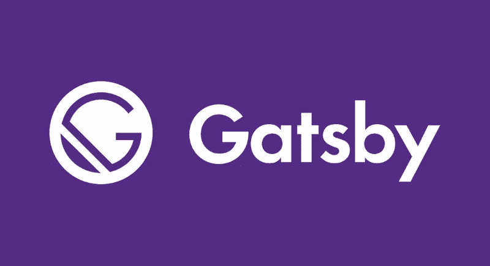

来源:[https://stevencotterill.com/](https://stevencotterill.com/)的文章

所以，我们到了。在我们开始之前，我知道我已经有一段时间没有坐下来写些有意义的东西了，但是不管怎样，我们还是来了。

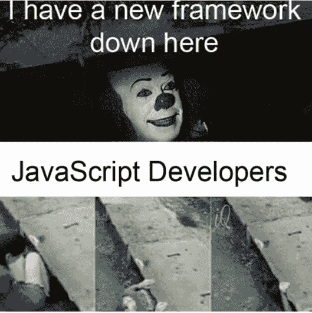

一直以来，我都在探索各种不同的框架，JavaScript 和 Python 的库。我看了很多视频教程，也自己做了很多项目。我刚刚开始学习 React，这个人人都在谈论的神奇图书馆。不管怎样，我偶然发现了各种其他主要基于 React 的框架和库。不知怎么的，我去了 Gatsby.js 官方网站 的文档，做了一些很新的东西。我没有像往常一样一头扎进视频教程，而是尝试了一下他们提供的[初学者教程-文档](https://www.gatsbyjs.com/tutorial/)，并欣然接受。

在我们进一步讨论之前，我假设你熟悉 React，即使你不熟悉，Gatsby.js 也非常熟悉 React，你也可以从中挑选一两件关于 React 的东西😄

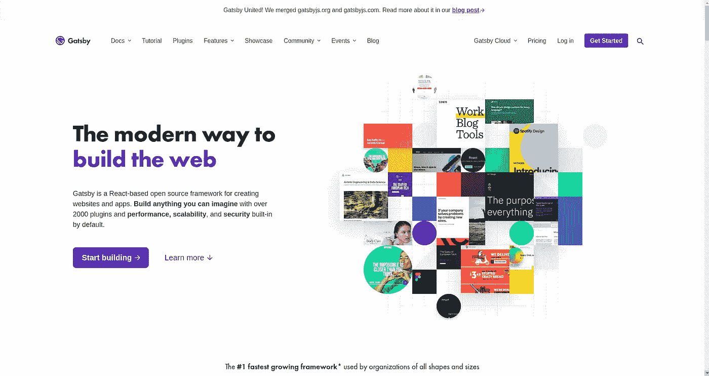

在[https://www.gatsbyjs.com/](https://www.gatsbyjs.com/)登陆页面

那么，为什么是 Gatsby.js 呢？这个基于 React 的框架有什么独特之处？一个简单的谷歌搜索会产生类似这样的结果:

> Gatsby 是一个基于 React 的、GraphQL 驱动的静态站点生成器。

# 什么是静态站点？

自从现代网络出现以来，性能一直是设计网站或 web 应用程序时的主要考虑因素。当一个网站要求 ***无服务器交互*** 无论如何，网络上托管的内容按原样提供给用户，这被称为静态站点。

或者简单地说，它可以是一个包含固定内容的站点。几个用例，包括事件列表、作品集页面和博客等等。

# 为什么是静态站点？

你为什么喜欢静态网站呢？在动态网站的情况下(需要客户端-服务器交互),因为挑战包括缓慢的加载时间、安全缺陷和托管成本等。没有服务器可以降低这些风险。静态站点生成器是用来高效开发静态站点的工具。

# 最后，盖茨比是如何工作的？

Gatsby.js 与其他网站的不同之处在于它处理数据的方式。在 Gatsby.js 中，由于我们不关心服务器，数据可能来自项目中的几种类型的文件——markdown、CSV、JSON，也可能来自外部服务，如 NetlifyCMS、Medium，甚至是 CMS，如 Drupal 和 Wordpress。为了让这成为可能，Gatsby.js 有一个非常酷的 ***插件架构，*** 随着我们的发展，这真的会派上用场。

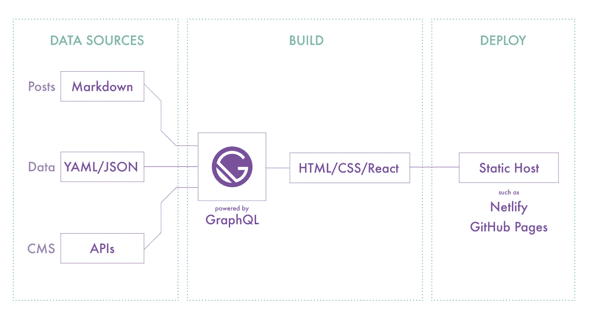

来源:[https://github.com/gatsbyjs/gatsby](https://github.com/gatsbyjs/gatsby)

# 哦，但是 GraphQL 呢？

当您使用 Gatsby 构建站点时，您可以使用这种称为“GraphQL”的查询语言来访问您的数据。这是用`queries`完成的，查询是你需要的数据的表示。查询如下所示:

它将会回来，

请注意查询签名如何与返回的 JSON 签名完全匹配。这是可能的，因为在 GraphQL 中，您查询的是表示可用数据的`schema`。现在不要担心模式来自哪里，Gatsby 负责为您组织所有的数据，并通过一个名为 GraphiQL 的工具使其可被发现。GraphiQL 是一个 UI，它允许您 1)在浏览器中对您的数据运行查询，2)通过数据类型资源管理器深入研究您可用的数据结构。

现在，我们都准备好了！让我们开始吧！！！

# 先决条件和环境设置

*   需要 HTML、CSS 和 JavaScript 知识，重点是 ES6 语法和 JavaScript 类。
*   React 和 GraphQL 的基础知识也是一个优势。

## 检查是否安装了以下设备，

*   `[Node](https://www.gatsbyjs.com/tutorial/part-zero/#install-nodejs-for-your-appropriate-operating-system)`
*   `[Git](https://www.gatsbyjs.com/tutorial/part-zero/#install-git)`

为了让 Gatsby 站点变得简单，让我们安装**Gatsby CLI**

`npm install -g gatsby-cli`

好了，我们都准备好了！

# 创建我们的第一个盖茨比网站！

打开你选择的编辑器，启动终端。我们将使用通过 CLI 提供给我们的入门模板。

1.  开始使用:

在终端中键入以下命令

`gatsby new hello-world https://www.github.com/gatsby/gatsby-starter-hello-world`

> 注意: ***hello-world*** 是一个任意的名字，基本上就是你的名字，你可以自由选择你喜欢的标题。

这将把一堆文件夹和文件带到你的目录中。

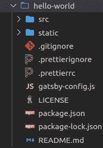

> 注意:在。prettierignore，。prettierrc 出现在这里是因为我在我的 VSCode 中安装了一个名为[**pretty**](https://prettier.io/)的扩展，让我的 js 文件看起来“更漂亮”

如果您熟悉 React，您会发现项目结构中的相似之处。以及我们通常只使用 src 文件夹的事实。

2.转到这个目录

`cd hello-world`

3.启动开发人员服务器

`gatsby develop`

这个命令将启动我们机器上的本地开发服务器。您将能够在这里看到您的新网站并与之互动，就像您使用 React app 一样。

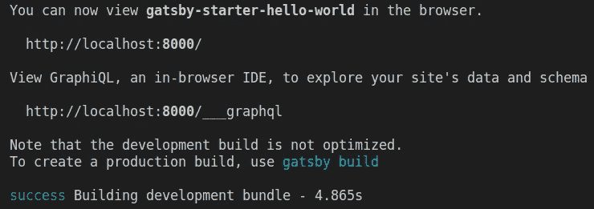

您的终端看起来会像这样

按照建议，让我们看看 [https://localhost:8000/](https://localhost:8000/)

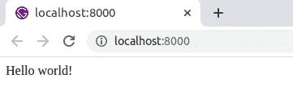

琢磨着 ***“你好世界！”*** 正在显示？这是因为 index.js 文件位于 hello-world 项目的 src 目录的 pages 文件夹中。要使这一点可见，请尝试更改 index.js 文件并亲自查看。

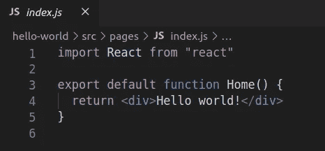

hello-world>src >页面> index.js

就在那里！👯你的第一个盖茨比网站，在你的本地主机上运行。

接下来，我们将详细了解如何定制我们的页面。

# **使用页面组件:**

之前我们看到 index.js 位于 pages 文件夹中。任何存在于`src/pages/*.js`中的 react 组件都将成为一个页面！

让我们通过添加一个新文件`src/pages/about.js`来创建一个新页面！

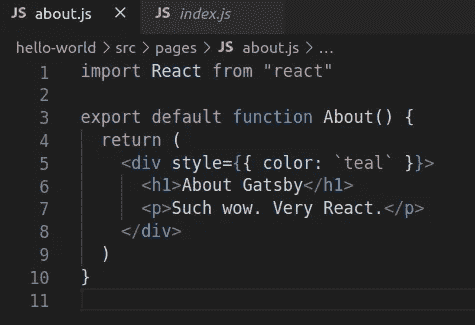

现在导航到***https://localhost:8000/about***

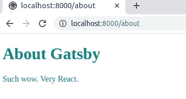

我知道，就是这么简单却非常有效。

嗯，你可以问我，这些都很酷，但是 ***的造型怎么样？***

# **盖茨比中的造型:**

要在 Gatsby 中添加 css 文件，您所要做的就是，

在文件夹中创建 css 文件，如果你想，这完全取决于你。

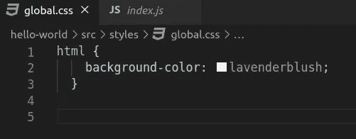

要让这个 css 工作起来很神奇，你需要做更多的事情，为了让盖茨比知道这个 css 文件的存在，你需要在项目的根目录下创建一个新文件`gatsby-browser.js`。然后添加以下代码:

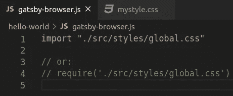

现在，重新启动开发服务器并转到本地主机！

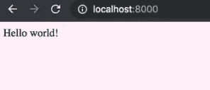

Yass，还有很多其他的样式方法，比如 CSS 模块，CSS-in-JS 等等。，你可以尝试所有的:D

# 盖茨比中的插件:

插件只是以一种非常简单直接的方式添加或修改功能。他们的网站上有数百个为盖茨比制作的插件，由社区成员维护。你也做了一个。

对于这一节，让我们安装并实现一个 Gatsby 插件。

1.  创建新网站:

`gatsby new plugins-and-data https:/github.com/gatsbyjs/gatsby-starter-hello-world`

然后放入 cd

`cd plugins-and-data`

2.现在，让我们安装插件，为此我想使用“柯克汉姆”主题，排版和漂亮的 CSS-in-JS，“ [*情感*](https://emotion.sh) ”。

`npm install --save gatsby-plugin-typography typography react-typography typography-theme-kirkham gatsby-plugin-emotion @emotion/core`

为了让 Gatsby 了解这个插件，我们将弄乱这个项目根目录中的 gatsby-configure.js。添加以下几行。

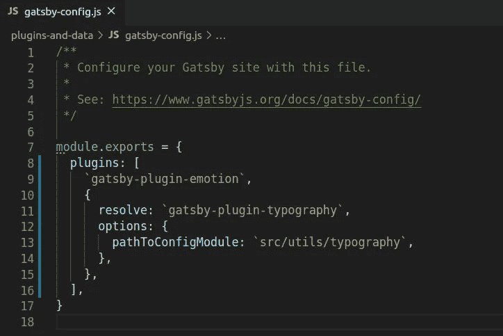

接下来，typography.js 需要一个配置文件，我们将在 src 中创建一个名为“utils”的文件夹，并在那里添加一个“typography.js”。然后，将以下内容添加到该文件中。

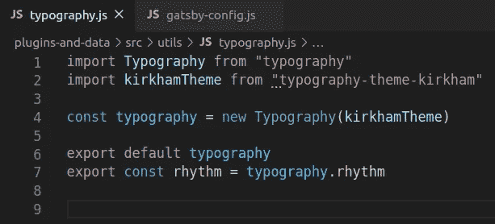

对于第二个站点，让我们有一个可以被所有其他页面使用的好的布局组件。在 src 中创建一个文件夹“components ”,并创建一个 layout.js 文件。我们将在这里使用“情感”。在那里添加下面几行。

为了链接各个页面，我们使用了《盖茨比》的核心链接。

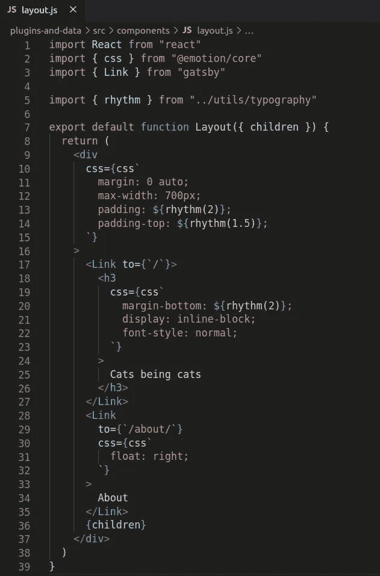

然后，about.js，

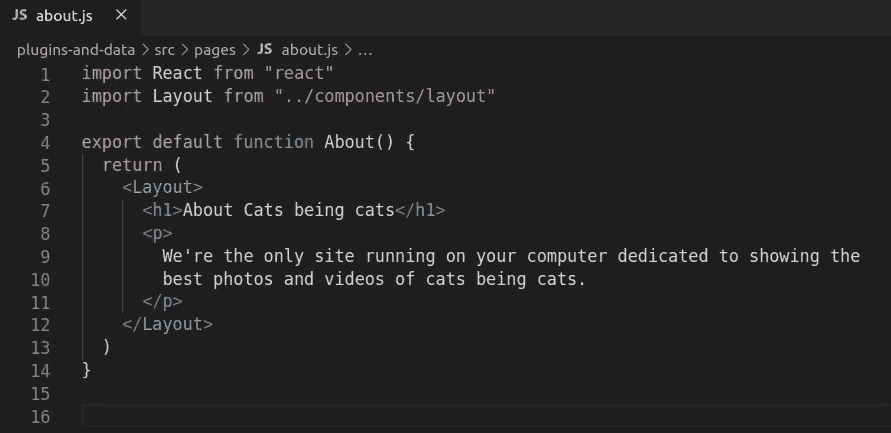

接下来，index.js，

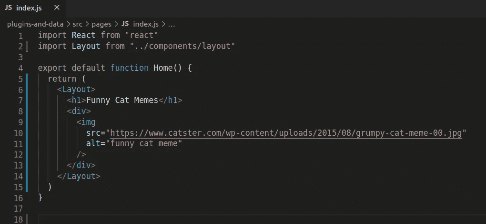

现在，让我们像往常一样使用`gatsby develop`启动开发服务器

并在 8000 端口打开本地主机！！

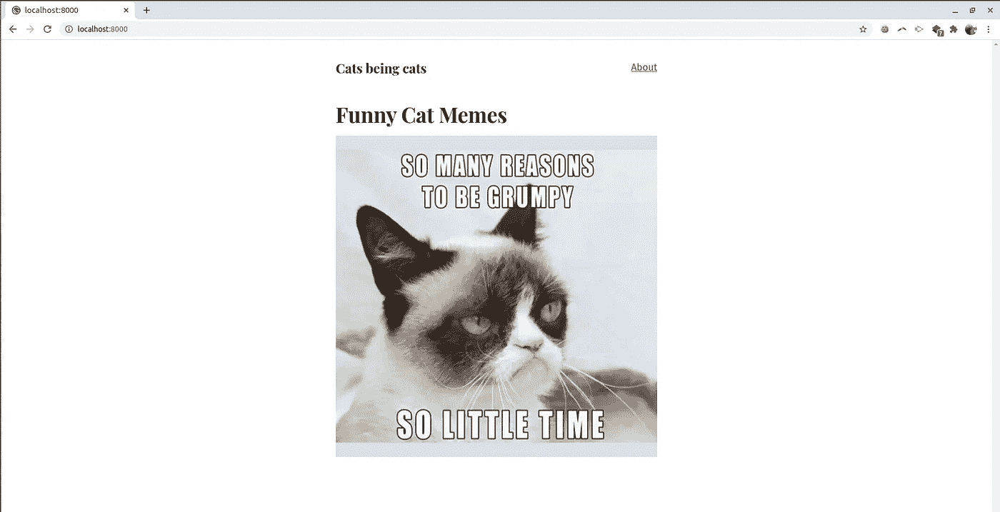

亚斯，给你！你的第一个使用插件的盖茨比网站！！！！！😍

如果你已经走了这么远，给自己一点鼓励吧！你今天学到了一些新东西。

这个帖子到此为止！接下来，我们将了解如何使用 GraphQL 来获取我们的数据！！以及如何使用新的插件将 markdown 文件渲染成 HTML 格式，应该会很令人兴奋！！！请继续收听**第二部分**！！！！

你喜欢你读到的东西吗？

按住**拍手**按钮，请随意分享你的想法和创意。