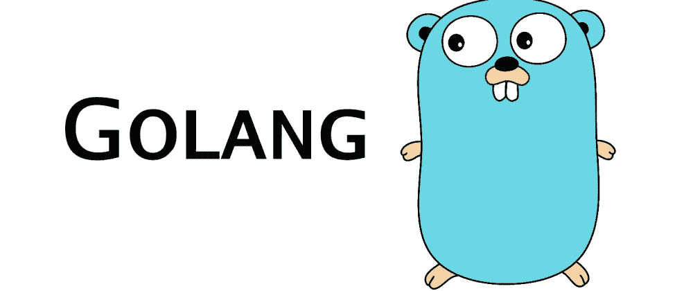
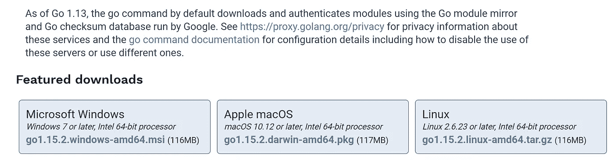
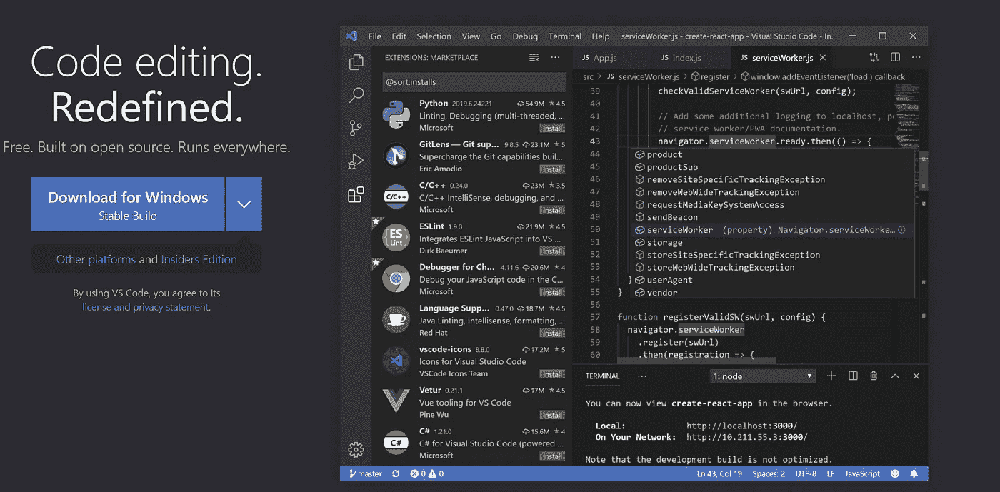
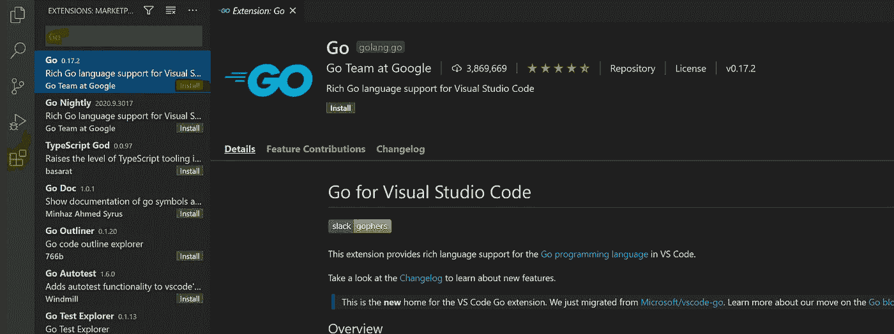
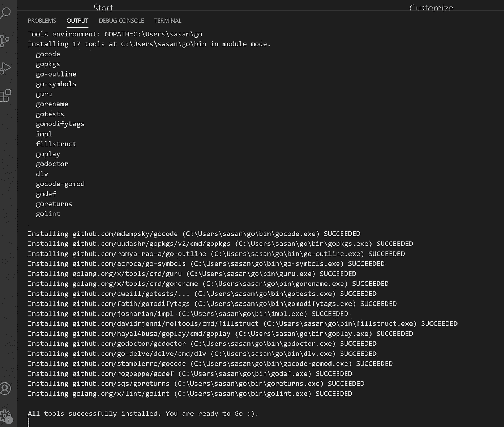
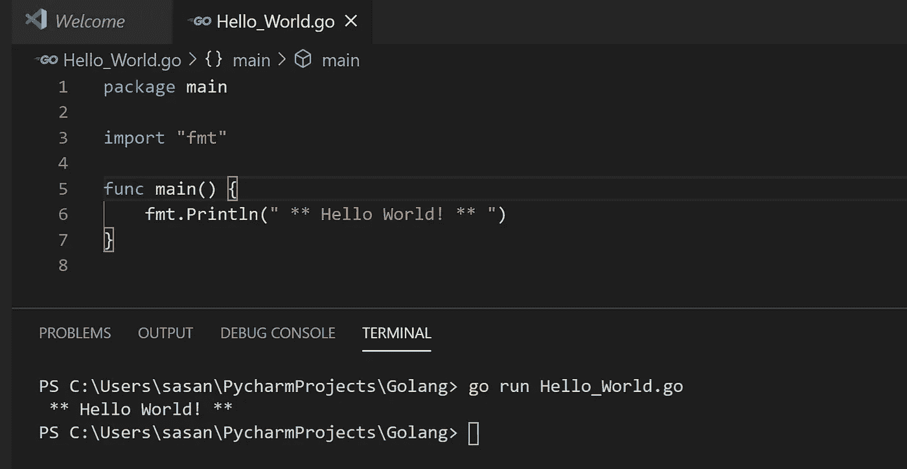
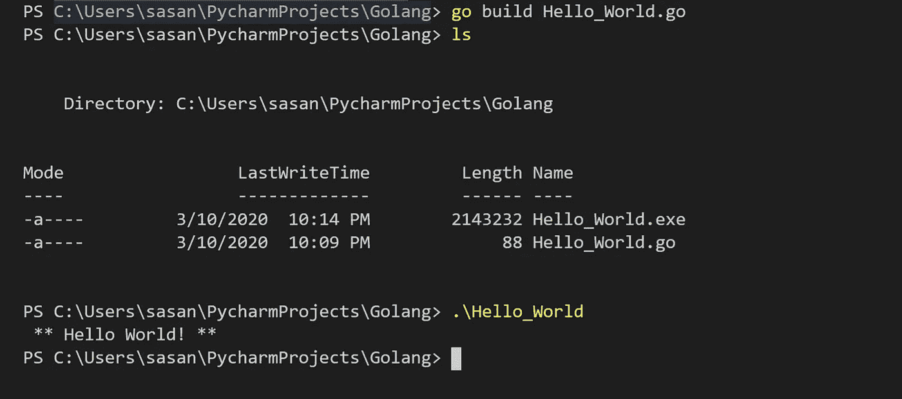
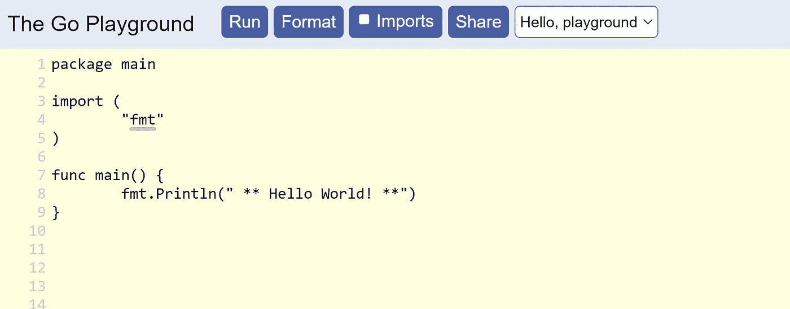

# “你好世界！”用 Go。

> 原文：<https://medium.com/analytics-vidhya/learning-to-code-with-go-hello-world-with-go-db5367aae5e3?source=collection_archive---------22----------------------->

这篇文章是针对那些有兴趣学习谷歌的一种令人敬畏的编程语言——“***Go***”的开发人员。在下面这个使用 **Go、**的“Hello World”示例中，我将向您展示如何安装 Go 环境、编码并执行“Hello World”二进制文件的详细步骤，最后，使用***golang***playground 与他人共享您的代码。



## 什么是[围棋](https://golang.org/)？

下面是 Go 开发团队如何在他们的主页[页面](https://golang.org/)上描述这种语言。

> “Go 是一种开源编程语言，可以轻松构建简单、可靠、高效的软件。”

嗯，这有点含糊不清，不是吗？让我再解释一下，如果你想要学习一种简单的编程语言，一段编译速度快、执行速度快，并且可以很容易地将你的工作分发给其他人的代码，那么 Go 就是适合你的编程语言。

围棋编程语言由 3 位聪明的谷歌工程师开发——“*罗伯特·格里斯默****肯·汤普森**罗布·派克**。 ***Go*** 编程语言的一些关键目标是:***

*   ***易学易编码。***
*   ***快速编译。***
*   ***自动释放未使用的内存(垃圾收集)***
*   ***内置的并发性(同时执行多项任务的软件)。***
*   ***支持多核处理器。***

***我将在以后的文章中介绍这种语言的更多细节和特性。让我们启动并运行 Go 环境。***

## ***安装 Go 环境***

***Go 语言不需要运行时来部署应用程序，但是，您需要下载开发环境来编写程序。***

***在这篇文章中有 7 个简单的步骤来运行你的第一个 ***Go*** “你好世界”，忍耐一下。***

1.  *****为您的平台(WINDOWS、MAC 或 LINUX)安装 GO*****

***[](https://golang.org/dl/)***

***第一步是得到一个开发环境。只要在你的浏览器地址栏中点击【https://golang.org/dl/】或者点击上面的链接，你就可以开始了。主屏幕应该马上给你你想要的东西。当我在我的机器上运行 Windows 10 时，列出了我的操作系统的相应版本的 ***Go*** 。继续，下载并安装它。***

***2 **。检查 GIT*****

***这个设置的要求之一是在您的机器上安装 Git。打开命令提示符，键入命令“git–version ”,它应该会返回如下内容。如果您没有看到这个输出，那么继续安装 git。***

***遵循此处的说明[。](https://git-scm.com/book/en/v2/Getting-Started-Installing-Git)***

```
*C:\Users\sasan>git --version
git version 2.28.0.windows.1*
```

***3.**安装你选择的文本编辑器*****

***[](https://code.visualstudio.com/)***

***微软 visual studio code 是拥有 ***Go*** 扩展的优秀文本编辑器之一，在 **Go** 社区非常活跃。有许多文本编辑器支持 ***Go*** 编程，所以你可以随意选择文本编辑器。点击上图下载 visual studio 代码，或者直接使用[链接](https://code.visualstudio.com/)下载。***

***4.**安装 VISUAL STUDIO 代码的 GO 扩展**。***

******

***我们将通过按下命令 **Ctrl + Shift + X** 或者简单地点击如上图所示的扩展图标并在搜索框中键入 ***Go*** 来获得 VS 代码的 Go 扩展。***

***我们在这个设置中还有一个步骤，VS 代码的扩展依赖于各种开源工具，这些工具为编程提供了格式化、文档和其他好的特性。从 VS 代码中按功能键— **F1** ，输入命令“ ***Go:安装/更新工具*** ”，选择所有插件，点击安装，等待，直到你看到下图。***

******

***5.**创建一个名为 *HELLO_WORLD 的文件。G* O*****

***在你的机器上创建一个新的文件夹，命名为“ **Golang** ”一些有趣的名字。现在在目录中创建一个新文件，并将其命名为“Hello_World.go”***

***写下以下内容:***

```
*package mainimport "fmt"func main() {
	fmt.Println(" ** Hello World! ** ")
}*
```

***不要太担心缩进，只要你保存文件，编辑器就会处理好的。现在让我们来理解代码。***

***典型的 ***走*** 文件布局是由***

1.  ***包装条款(主要包装)***
2.  ***任何导入语句(导入“fmt”)***
3.  ***实际逻辑。(fmt。Println(" ** Hello World！** "))***

*****包装*****

```
*package main*
```

***每个 ***Go*** 文件都以一个包子句开始。那么，什么是包裹呢？***

***任何 ***Go*** 程序中的第一个非注释行必须是一个包声明。每个 ***Go*** 文件都属于一个包，包是 ***Go*** 用来组织代码的地方。***

***我们所有的代码都位于名为 ***main*** 的包中在这个例子中，我们通常不会把我们所有的代码都放在一个单独的包中。 ***Go*** 程序被分成多个包，每个包专注于一个功能领域。***

***每个包都包含相关的函数和数据类型。 ***Go*** 中有 3 种类型的包——自己创建的包，其他人创建的第三方包，标准库中的包。在这种情况下，我们使用特殊的包`main`，如果要直接运行这个代码(通常从终端运行)，就需要这个包。***

***简而言之，行“package main”表示文件“Hello_World.go”中所有剩余的代码都属于“main”包。***

*****导入*****

```
*import "fmt"*
```

***指定代码所依赖的包的方法是通过导入。如果没有导入包，您将无法访问该包中的代码。这与 Python 和 Java 不同，在 Python 和 Java 中，导入一个包仅仅意味着您可以通过一个较短的名称来引用包中的代码。***

***Python 和 Java 都允许从包中导入单个项目。例如，在 Python 中从集合包导入计数器是通过运行下面的命令。***

```
*from collections import counter*
```

***Go 不允许您只从包中导入一个项目，而是通过导入包来访问包中的所有内容。***

***要导入一个包，我们使用关键字“ ***import*** ”，后跟包的位置路径，要么在标准库内，要么在我们的 ***Go*** 路径内。***

***只导入这段代码所需的包是一个很好的做法。***

*****参考功能*****

***我们引用包中的函数和变量，使用包名后跟一个点和函数名。功能“ ***println*** ”顾名思义就是在终端或网络浏览器上打印输出。***

***6.**运行“HELLO WORLD！”在端子**上***

***键入命令“go run Hello_World.go ”,然后自己查看输出。***

******

***如果你想创建一个二进制文件，输入命令“go build Hello_World.go ”,然后按照下面的屏幕截图操作。***

******

***恭喜你！你先做了一个 ***再做*** 的二进制。***

***7.**运行“HELLO WORLD！”在戈朗游乐场*****

******

***我想再给你看一样东西，一个你可以测试和分享你的 Go 代码的网站。***

***打开你的浏览器，进入[播放](https://play.golang.org/)或者点击上面的图片。这就是 ***围棋运动场*** 每当你有一个想测试的想法时，你可以用它而不是建立一个项目，很棒，不是吗？***

***Go Playground 还会在你点击格式化按钮时为你格式化代码。***

***还有一个更酷的把戏是 ***Go*** 游乐场能做的。它可以生成一个唯一的 [URL](https://play.golang.org/p/k6Ti0Gru39h) ，允许你与其他人分享你的代码片段。点击 ***分享*** 按钮，旁边会弹出一个带网址的文本字段。你可以复制这个[网址](https://play.golang.org/p/k6Ti0Gru39h)并与其他人分享，或者只是再次回到[网址](https://play.golang.org/p/k6Ti0Gru39h)。***

******Go*** 显然表示他们打算让这些联系永远持续下去。***

***今天到此为止。如果你喜欢这篇文章，如果它对你有任何帮助，请随意喜欢它。***

***如果你认为这篇文章对某人有很大帮助，请随意分享。***