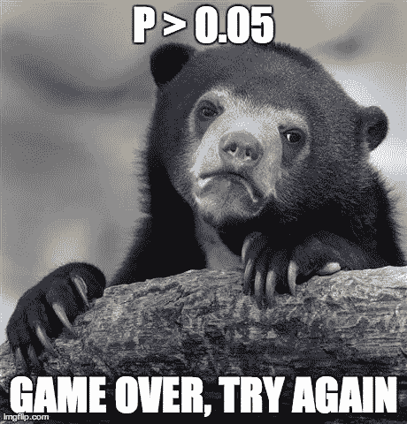
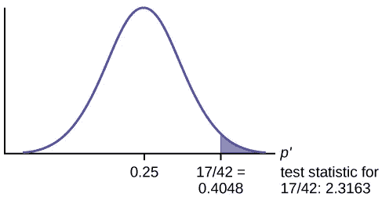
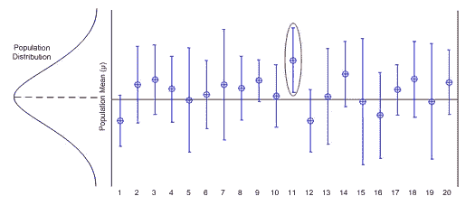
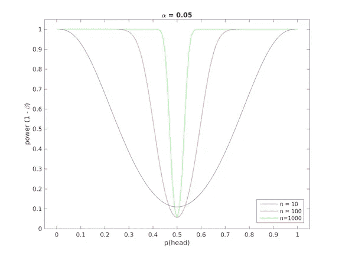
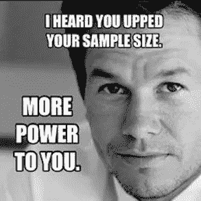

# 从《统计学做错了》一书中得到的启示

> 原文：<https://medium.com/analytics-vidhya/learnings-from-the-book-statistics-done-wrong-part-i-c7316cb4aa95?source=collection_archive---------14----------------------->

## 避免统计中的误解

这篇文章总结了我从这本令人惊叹的书《错误的统计》的前四章中学到的一些核心概念。

正如书名所示，这本书解释了统计分析中的一些核心概念，以及在过去的几年里这些概念是如何被错误解读的，甚至是世界顶级期刊的作者和**有什么方法可以避免这种情况。**

对于每一章，我都写了概念部分和其他名为重要注释的部分。概念部分通过例子解释了一些概念， ***重要注释包含了一些最有用的提示，书中给出了一些要点。***

让我们开始-

> ***第 1 章-统计推断简介***

本书的大部分内容是关于统计分析，以衡量由于做出一些改变而产生的差异，例如，改变包装是否会增加产品的销量，改变用户界面背景是否会增加访问者花费的时间，这种药物是否会对患者的平均睡眠时间产生副作用，等等。所以，下面的大部分概念在所有的章节里都会用到(如果你觉得很熟悉可以跳过一些段落)。

*   **概念**—

我们想衡量一个特定的改变对最终结果的影响(比如改变 UI 背景对用户所花时间的影响)，我们将数据分成两组，将经历改变的那组被称为**实验组**，另一组是**对照组。**

因此，对于我们的例子，将被显示改变的 UI 背景的用户组将在**实验组中，而**其他的将在**控制组**中，他们将被显示正常的背景。下一个目标是发现这两组用户花费的时间之间是否有显著差异，我们需要对此进行假设检验。

H ***假设检验***——假设检验本身需要许多独立的帖子，但要保持简短，并与上面的例子相关。

一旦我们收集了两组的数据，我们执行一个测试，以了解数据中显示的两组平均花费时间之间的差异纯粹是由于运气/随机性造成的*概率是多少。**这种概率被称为 p 值**，如果它低于一个阈值**(比如 0.05)** ，我们就说我们拒绝我们的假设，即两组之间的差异只是由于运气/随机性。*

***(直觉上，这意味着我们假设造成差异的唯一因素是运气，但数据显示，如果只有不到 5 %的可能性导致如此大的差异，我们推断我们假设的假设有问题，我们拒绝我们假设的假设，即零假设)。***

*假设不存在因改变 UI 而产生的差异是这里的 ***零假设*** ，而 ***替代假设*** 是 UI 颜色改变对用户花费的时间有影响。*

**

*   ****重要提示-****

*在进行假设检验时，我们计算由于纯粹的运气/随机性而得到这个或更多极端结果的概率。这需要注意，实验设计应该没有外部因素的影响，以避免错误的结论。在我们的例子中，用户应该是随机分布的，这确保了组中没有人口统计学偏见。*

*书中一个很好的例子-*

*假设我们想测试两种不同作物的生长速度是否不同，并且两种作物都生长在两个不同的地区，那么外部因素如土壤条件、水分含量和其他环境因素都存在，我们可能会得到误导性的结果。一个更好的方法是将这些区域分成更小的块，随机分配两种作物。*

# *p 值*

*p 值是最容易被误解的话题之一，只要在谷歌上搜索“p 值误解”,你会发现很多文章，甚至还有维基百科的页面！*

> ***给定变量的 p 值是获得该值或更多极值的概率(假设没有影响而不是随机性，即零假设为真)***

**

*如上图所示，17/42 的 p 值是获得**值 17/42 或更极端**的概率，这是 x=17/42 **(蓝色显示)**后概率分布函数下的面积。 ***不是得到值 17/42 的概率。****

> *p 值不是替代假设为真的概率，或者换句话说，不是零假设为假的概率。(在下面的第 4 章中会有更多的介绍)。*

*C 它会是我们收集的样本的平均值吗？但这只是我们收集的样本，我们不能说这是用户界面上的访问者的时间。*

*置信区间的作用来了，我们不是给出点估计，而是提供一个包含总体参数的置信区间。Like- **总体均值的 95 %置信区间为【12，16】分钟。***

****要点***—*

****但是对于总体来说有 95 %的置信区间意味着什么呢？****

*请看下图，显示了总体平均值的 20 . 95%置信区间估计值。人口的实际平均数用虚线标出。*

*在 20 个置信区间中，有一个(红色标记的)不包含总体的实际平均值。*

**

*图片来自[propharma.com](https://www.propharmagroup.com/blog/understanding-statistical-intervals-part-1-confidence-intervals/)*

> **推断出了一些东西？**

****置信区间的正确解释是，如果我们进行几个实验，估计总体均值的 95 %置信区间，那么其中的 95 %(这里是 20 个中的 19 个)将具有真实的总体参数。****

*它不应该被解释为我们有一个 95 %置信区间，那么这个区间包含真实总体参数的概率是 95 %。(如果是这种情况，那么上图中标记为红色的区间应该有 95 %的概率包含总体参数，但是作为 ***您可以看到它不包含真正的平均值*** )。*

**

**alpha(此处为 0.05)基本上就是* ***错误率*** *，这实际上意味着在 100 次实验中有 5 次你会得出错误的结论，错误率从来不是针对单次实验定义的！详细答案你可以在这里找到**

> ****第二章统计动力和动力不足统计****

****

****用一个更简单的例子更容易直观地联系起来，比如你有两个不同的硬币，一个是公平的，另一个是正面概率为 0.6。你不知道哪一个是有偏见的，所以你抛了一个硬币 10 次，这取决于你的运气。你可能得到 7 个正面和 3 个反面，但很有可能你得到 7 个正面，公平的硬币(计算:)，以及有偏见的硬币，这里你很难区分硬币的偏见和纯粹的运气在 10 次翻转中，你将区分的概率被称为这个实验的力量。****

******效果越差威力越小******

****很明显，影响越小或偏差越小，越难检测，这意味着统计功效越小。抛硬币的功率曲线如下所示，如果你画一条垂直线，它将在 0.1 和 0.2 之间切割 ***10 次抛的曲线，100 次抛将为 0.5，但对于 1000 次抛实验，它接近 1。*******

****100 次投掷似乎是一个好数字，但是 ***仍然有 50 %的时间我们会得出错误的结论(幂是 0.5)！*******

********

****图片来自图书统计做错了****

****即使是发表在顶级期刊上的结果也低估/忽略了统计的力量，其中包括错误的结论，即特定的设计没有危险[1]，错误的结论，即特定的药物没有副作用[2]等等。****

*******要点*******

********

****收集更多的数据显然会使你的研究更有力，但收集越来越多的数据并不总是容易的。另一方面，与其说这个结果基于 p 值在统计上无关紧要，不如说应该给出影响的置信区间(比如这个变化的 95 %置信区间是[x，y])，如果这个区间包含 0，那么可以很有把握地说这个变化没有任何统计上的显著影响。较窄的区间有助于得出结论，而较宽的区间不会告诉你足够的信息来得出一些结论。****

******注**-一种被称为参数估计准确性(AIPE)的流行技术允许您选择样本大小，以使置信区间在 99%的时间内是窄的(或者 95 %这个阈值被称为保证)。尽管 AIPE 仍然很不寻常。****

> ****第三章:伪复制:明智地选择你的数据。****

****这一章主要谈论一些简单而有用的关于统计测试的数据收集的观点。****

****正如第一章所讨论的，数据被随机分配到实验组或对照组，这是至关重要的。随机化允许我们消除组间的偏差。****

****伪复制基本上是从单个/相关来源重复收集数据，例如，在测试药物对患者的效果时，不是收集 1000 名患者的数据，而是收集 50 名患者 20 天的数据(这具有自相关)，另一个例子可能是神经科学家可能测试来自同一动物的多个神经元，声称具有数百个神经元的大样本量，而他实际上是从单个动物收集的(这样的数据具有遗传偏差，因此我们假设测试的唯一因素可能是随机性的假设失败)。****

****仔细的数据收集显然可以避免伪复制，但是一个简单的解决方案可以简单地平均掉相关的数据点。有统计方法来量化依赖性[3]，这有助于避免伪复制的影响。****

> ******第四章。p 值和基本利率谬误。******

****假设你进行假设检验来了解一种药物的效果，p 值是 0.05，这是否意味着这种药物有效的概率是 0.95？p 值是零假设(这里是药物无效)为假的概率吗？****

> *****三思而后行！*****

*******基率谬误***—****

****假设我正在测试 100 种潜在的癌症药物。这些药物中只有 10% **(称为基础率)**实际起作用，但不知道是哪种；我必须进行实验来找到它们。在这些实验中，我将寻找 p*<0.05，证明该药物具有显著的益处。*****

*****如果实验的 ***统计功效为 0.8*** ，我将能够正确识别 10 种药物中的 8 种，假设α为 0.07 那么我列表中的假阳性将在 5 左右。我现在有 13 种药物被确定为有效，其中 8 种实际有效，大约是 68 %!*****

*******但是我们的问题“p 值为 0.05 是否表示这种药物有 95 %的概率有效？”*******

****从上面的例子中你可以推断出答案是否定的。一个 p 值告诉我们获得我的数据的概率或者更极端的由于运气。它确实*而不是*告诉了 ***我的药物治疗有效的概率*** 。一个小的 *p 值是*更强的证据，但是为了计算药物有效的**确切的** ***概率，你需要将基础率计算在内。*******

****将 p 值误解为零假设的概率为假被称为**基础率谬误。**在上面的例子中，成功癌症药物的基础率较小，我的假阳性接近真阳性，使 ***us 的概率为 0.68，如果基础率较低，情况可能会更糟。*******

****这可能是美国预防服务部队在 2009 年停止推荐 40 岁以下女性接受乳房 x 光检查的原因[5]。****

> ****感谢我的朋友 Yash 和 Tushar 的评论。希望你们都喜欢阅读它，留下一些掌声，如果你发现一些令人困惑的事情，请评论下来，并关注下一章的帖子:)。****

****参考-****

****[1].e .豪尔。"显著性检验造成的伤害."事故分析&预防 36，第 3 期(2004):495–500。DOI:*10.1016/s 0001-4575(03)00036–8*****

****[2].R. Tsang，L. Colley 和 L.D. Lynd。"在随机对照试验中，统计能力不足以检测不良事件发生率的临床显著差异."*临床流行病学杂志* 62，第 6 期(2009):609–616。DOI:*10.1016/j . jclinepi . 2008 . 08 . 005*。****

****[3].D.M. Primo，M.L. Jacobsmeier 和 J. Milyo。《用混合水平数据估计国家政策和机构的影响》*国家政治&政策季刊* 7，第 4 期(2007):446–459。DOI:*10.1177/153244000700700405*。****

****[4].L.V .赫奇斯。"更正聚类的显著性检验."《教育与行为统计杂志》 32，第 2 期(2007):151–179。DOI:*10.3102/1076998606298040*。****

****[5].街区 LD，贾伦斯基议员，吴，贝内特 WL。2009 年美国预防服务工作组推荐后 40-49 岁女性中乳房 x 线摄影的使用。J Gen 实习医师。2013;28(11):1447–1453.10.1007/s 11606–013–2482–5。[ [PMC 自由篇](https://www.ncbi.nlm.nih.gov/pmc/articles/PMC3797359/)[[考研](https://www.ncbi.nlm.nih.gov/pubmed/23674077) ] [ [交叉引用](https://dx.doi.org/10.1007%2Fs11606-013-2482-5) ] [ [谷歌学术](https://scholar.google.com/scholar_lookup?journal=J+Gen+Intern+Med&title=Mammography+use+among+women+ages+40%E2%80%9349+after+the+2009+U.S.+Preventive+Services+Task+Force+recommendation&author=LD+Block&author=MP+Jarlenski&author=AW+Wu&author=WL+Bennett&volume=28&issue=11&publication_year=2013&pages=1447-1453&pmid=23674077&doi=10.1007/s11606-013-2482-5&) ]****