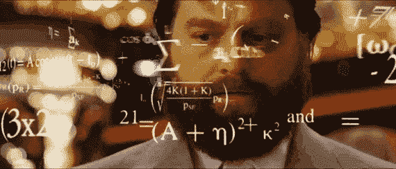
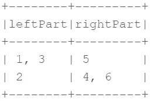

# Leetcode:难度问题变得简单。

> 原文：<https://medium.com/analytics-vidhya/leetcode-hard-level-problems-made-easy-5d568dfe44bc?source=collection_archive---------10----------------------->



让我们来谈谈一个简单而强大的工具——二分搜索法。有些人可能低估了它，认为它是一个原始的工具，但事实是，它被用于大量的应用程序中。让我们看几个现实生活中的例子:

1.  简单的老派字典搜索(不是数据结构)。

对于一本 1000 页的字典，我们只需要大约 10 次检查就可以找到一个特定的单词。你们中的一些人，已经足够大了，可以使用它。算法看起来是这样的:

*   在中间的某个地方打开字典。
*   将页面上第一个单词的首字母与我们要搜索的单词的首字母进行比较。
*   如果我们要搜索的单词的第一个字母在字母表中页面的第一个字母下面，那么上面的所有页面都会被删除，反之亦然。
*   重复直到找到该单词。

2.**求一个数的平方根。**

3.**三元搜索。**

4. **3D 游戏开发。**

二分搜索法用于根据 3D 位置或相机识别要显示的空间细分。

**最后，解题。**

先说一个 [' **两个排序数组的中值'**](https://leetcode.com/problems/median-of-two-sorted-arrays/) 问题。总的运行时间复杂度应该是 O(log (m+n))。

首先，我们需要定义中位数。

```
The median is the value separating the higher half from the lower half of a data sample.
```

如果数据集中的元素计数是奇数，则排序数组的中值将是中间的元素:

A=[1，2，3，4，5，6，7，8，9]；

中位数(A)= 5；

如果元素的数量是偶数，中值将是两个中心元素的平均值:

A=[1，2，3，4]；

中位数(A)=(2+3)/2 = 2.5；

因此，在这里我们可以看到中位数的主要特征:

```
(1) Median divides a set into two equal length subsets, where one subset is always higher than the other.
```

我们可以通过合并这两个数组来解决这个问题，这将导致 O(n+m)的复杂度。但是，这并不符合 O(log(m+n))的要求。

我们已经对数组进行了排序，复杂度为 O(log(m+n))，这应该会给我们一个解决方案的提示——二分搜索法。让我们试着在这里采用二分搜索法算法。

我们有两个数组 nums1 和 nums2 的输入。nums1 = [1，3，5]

nums2 = [2，4，6]，n=len(nums1)，m = len(nums 2)；

我们需要为 nums1 找到 I，为 nums2 找到 j，它将数组分成两部分:i ->使用二分搜索法算法选择

j =(n+m+1)/2-I；

len(left nums 1)+len(left nums 2)= = len(right nums 1)+len(right nums 2)；

max(left nums 1)< min(right nums 2)；

max(left nums 2)< min(right nums 1)；



我们发现了这样的索引后:

如果((n+m) mod 2==0)

中位数=max(nums1[i-1]，nums[j -1])+min(nums1[i]，nums2[j])

else median=max(nums1[i-1]，nums[j-1])

我们还需要确保 n<=m 或者 j 可以是负数。

让我们编写代码:

```
public double FindMedianSortedArrays(int[] nums1, int[] nums2)
{
   if (nums1.Length > nums2.Length)
   {
       int[] temp = nums1;
       nums1 = nums2;
       nums2 = temp;
   } int n = nums1.Length, m = nums2.Length;
   int middle = (n + m + 1) / 2;
   int low = 0, high = nums1.Length;
   while (low <= high)
   {
       int i = (low + high) / 2;
       int j = middle - i;
       if (i > low && nums1[i - 1] > nums2[j])
       {
           high = i - 1;
       } else if (i < high && nums2[j - 1] > nums1[i])
       {
           low = i + 1;
       }
       else
       {
           int maxLeft;
           if (i == 0) maxLeft = nums2[j - 1];
           else if (j == 0) maxLeft = nums1[i - 1];
           else maxLeft = Math.Max(nums1[i - 1], nums2[j - 1]);
           if ((m + n) % 2 != 0) return maxLeft; int minRight;
           if (i == n) minRight = nums2[j];
           else if (j == m) minRight = nums1[i];
           else minRight = Math.Min(nums1[i], nums2[j]);
           return (minRight + maxLeft) / 2.0;
       }
   } return 0;
}
```

第二个问题是， [**“在旋转排序数组 II 中求最小值。”**](https://leetcode.com/problems/find-minimum-in-rotated-sorted-array-ii/) 正如我们在描述中看到的，数组可能包含重复项。

下面是一个数组旋转的示例:

[0, 2, 5, 6, 7, 7, 8, 10, 11] -> [7, 8, 10, 11, 0, 2, 5, 6, 7];

[0, 10, 10, 10] -> [10, 0, 10, 10];

首先，我们需要把问题简单化。尝试找到没有重复的数组的解决方案，然后调整有重复的数组的解决方案。

A = [4，5，6，7，0，1，2]；

正如我们所看到的，最小的元素总是第一个比前一个小的元素。这里，i = 4。A[i]是数组中最小的元素，A[I]<= A[i-1].

Now, we need to apply a binary search algorithm to find that element:

1.  start = 0, end = A.length.
2.  Get a middle element middle = (start+end) / 2.
3.  If middle+1 < end and A[middle] >A[中间+1]然后我们找到了解。返回一个[中+1]。
4.  如果 middle-1 > start 和 A[middle] < A[middle-1] than we found the solution. Return A[middle].
5.  If we haven’t found the solution, we need to decide where to search.
6.  If A[middle] > A[end]比 start = middle+1。转到步骤 2。
7.  如果 A[start] > A[middle]，那么 end = middle-1。转到步骤 2。
8.  否则返回一个[start]。

现在，只要我们有了非重复数组的解决方案，它就可以适用于包含重复元素的数组。

A = [10，1，10，10]；

解决方案大致相同，但有一些额外的检查:

1.  开始= 0，结束= A.length。
2.  检查 start == end 或 start == end — 1，然后返回 min(A[start]，A[end])。
3.  得到一个中间元素 middle = (start+end) / 2。
4.  如果 middle+1< end and A[middle] >A【middle+1】那么我们就找到了解。返回
5.  a[中+1]。
6.  如果 middle-1 > start 和 A[middle] < A[middle-1] than we found the solution. Return A[middle].
7.  If we haven’t found the solution, we need to decide where to search.
8.  If A[middle] > A[end]比 start = middle+1。转到步骤 2。
9.  如果 A[start] > A[middle]，那么 end = middle-1。转到步骤 2。
10.  如果 A[start] == A[middle]和 A[middle] == A[end]，那么我们需要递归地搜索两个半部分[start，… middle]和[middle+1，…end]并返回这两个结果中的最小值。
11.  否则返回一个[start]。

和代码:

```
public int FindMin(int[] nums) 
{
    return FindMinRecursive(nums, 0, nums.Length - 1);
}

public int FindMinRecursive(int[] nums, int start, int end) 
{
    if (start == end ||start == end - 1) 
    {
        return Math.Min(nums[start], nums[end]);
    }
    int middle = (start + end) / 2;
    if (middle - 1 > 0 && nums[middle] < nums[middle - 1]) {
        return nums[middle];
    }
    if (middle + 1< nums.Length && nums[middle + 1] < nums[middle])
    {
        return nums[middle + 1];
    }
    if (nums[end] < nums[middle])
    {
        return FindMinRecursive(nums, middle+1, end);
    }
    if (nums[middle] < nums[start]) {
        return FindMinRecursive(nums, start, middle);
    }
    if (nums[middle] == nums[end] && nums[end] == nums[start])
    {
        return Math.Min(FindMinRecursive(nums, middle + 1, end), 
            FindMinRecursive(nums, start, middle));
    }

    return nums[start];
}
```

PS。如果您使用 C#，出于性能原因，您应该使用类型标识符而不是“var”。

我希望这能让你了解二分搜索法的用途。

