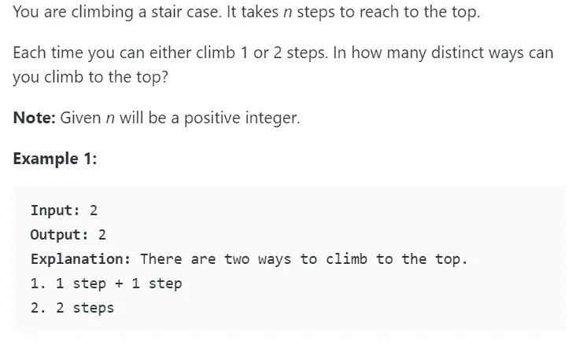
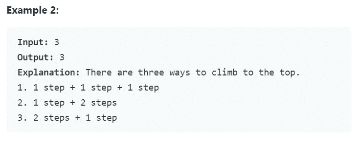
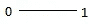
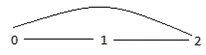
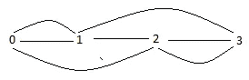
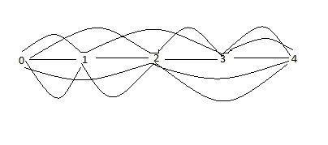
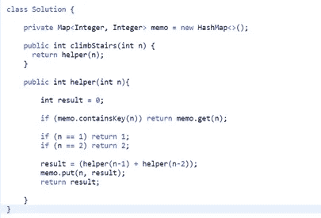
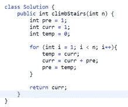
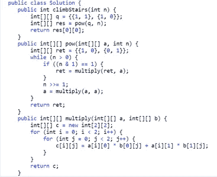
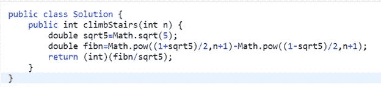

# Leetcode: Q70 —爬楼梯[简单]

> 原文：<https://medium.com/analytics-vidhya/leetcode-q70-climbing-stairs-easy-444a4aae54e8?source=collection_archive---------2----------------------->

# 分析:

基本上，这个问题是要求你找到所有可能的组合，这些组合将带你到达顶峰，同时限制你一次只能爬 1 步或 2 步。因此，在每一个阶段，你要么选择踩下它，要么跳过它，这就是动态编程的原理。

现在让我们看一些例子，看看我们是否能找到一种模式。

**例 1: 1 步**

当你只有一步的时候，你只能以一种方式到达顶端，那就是从一楼到一楼。

**例 2: 2 步骤**

如果你有两个步骤，你可以通过 0–1–2 或 0–2 直接到达顶端，因此有两条路径。

你从 0 开始，你有两个选择，要么迈出第一步，要么不迈出第一步。如果你决定迈出第一步，你会走到第一步，然后你必须迈出下一步，这一步会把你带到顶端，在这种情况下是第二步。这给了你第一种方法。

现在回到如果你决定不采取第一步。在这种情况下，你直接跳到第 2 步，这将给你另一种方法。

**例 3: 3 步**

让我们看看你什么时候有三个步骤。你从 0 开始，你有两个选择，要么进行第一步，要么不进行。如果你决定迈出第一步，接下来你必须为第二步做出同样的决定。要么采取第二步，要么不采取。如果你做了第二步，你的下一步是第三步，这是一条路。

如果你决定不走第二步，你可以直接跳到第三步，因为你可以一次走两步，这是你的第二条路。

第三条路径是当你决定跳过第一步时，直接跳到第二步，然后再跳到第三步。

**例 4: 4 步**

让我们再看一个例子。通过对示例 1-3 进行类似的分析，我们可以推断出您可以通过 5 种不同的方式到达第 4 步的顶端。

**我们在这里注意到的模式是，n 是(n-1)和(n -2)的和。这是斐波那契数列！**

# 解决方案 1:带记忆的递归——时间:O(n)，空间:O(n)

在这个解决方案中，我们将定义一个散列表来存储我们计算的值，这样我们就不必再次重新计算它们(记忆的概念)。

我们已经创建了一个助手函数来进行递归调用。

我们的基本情况是 n == 1，我们返回 1，n == 2，我们返回 2。

由于记忆，这个解的时间复杂度是 O(n)。

由于递归堆栈的使用，该解决方案的空间复杂度也是 O(n)。

运行时间:1 ms，比爬楼梯的 Java 在线提交快 100.00%。

内存使用:33.2 MB，不到爬楼梯 Java 在线提交的 5.26%。

# 解决办法 2:自下而上的方法，使用变量——时间 O(n ),空间 O(1)

在这个解决方案中，我们将尝试利用自底向上的方法，这样我们可以将空间复杂度从 O(n)降低到 O(1)。这里我们只需要三个变量和一个 for 循环。

这个解的时间复杂度是 O(n)。

这个解的空间复杂度是 O(1)。

尽管您可能会注意到 LeetCode 的内存使用结果没有显示出改进，但就复杂性而言，从 O(n)到 O(1)有很大的改进。

运行时间:0 ms，比爬楼梯的 Java 在线提交快 100.00%。

内存使用:33.1 MB，不到爬楼梯 Java 在线提交的 5.26%。

# 解决方案 3:使用矩阵乘法，Binets 方法—时间:O(logn)，空间:O(1)

LeetCode 确实展示了一个使用矩阵乘法将时间减少到 O(logn)的解决方案，但在我看来，这样的解决方案不会被访问者所期望，因为这些是数学概念，而不仅仅是编程。

更多详情请访问 Leetcode 网站。

* *以下解决方案来自 LeetCode，发布在此以供参考。

这个解决方案的时间复杂度是 O(logn ),因为我们只遍历 logn 位。

这个解的空间复杂度是 O(1)。

运行时间:0 ms，比爬楼梯的 Java 在线提交快 100.00%。

内存使用:33 MB，不到爬楼梯 Java 在线提交的 5.26%。

# 解决方案 4:使用公式—时间:O(1)，空间:O(1)

LeetCode 使用斐波那契数公式展示了一个更加优化的解决方案，在我看来，面试官不会期望你知道这个，因为它是纯数学的。如果他们真的在寻找这个解决方案，他们可能会帮你解决这个问题。

更多详情请参考 LeetCode。

* *以下解决方案来自 LeetCode，发布在此以供参考。

这个解的时间复杂度是 O(1 ),因为我们只是使用一个公式。

这个解的空间复杂度也是 O(1)。

运行时间:0 ms，比爬楼梯的 Java 在线提交快 100.00%。

内存使用:33.2 MB，不到爬楼梯 Java 在线提交的 5.26%。