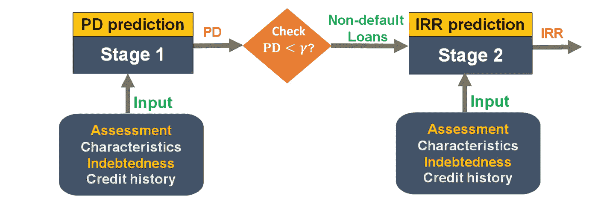

# 使用机器学习的新贷款模型

> 原文：<https://medium.com/analytics-vidhya/lending-models-using-machine-learning-d59d57f28ad7?source=collection_archive---------4----------------------->

目前存在巨大的资金缺口。全球仍有 17 亿成年人无法获得金融服务。

今天地球上最富有的八个人拥有的财富相当于最贫穷的一半人口。将近 30 亿 T2 人每天靠不到两美元生存。

鸣谢:斯文·施雷伯([https://www.raten-kauf.com/](https://www.raten-kauf.com/))

出现这种情况的主要原因是巨大的进入壁垒。

你知道当你试图得到你的第一份工作，并被告知要获得“更多的工作经验”，但你不能在没有先找到工作的情况下做到这一点。获得贷款、信贷或银行账户也是如此。没有资金支持，你做不了什么。

## **点对点(P2P)**

这就是点对点(P2P)的用武之地。P2P 贷款是一种不通过传统银行或信用合作社向个人借款的选择。允许个人以可承受的利率获得低成本快速贷款。P2P 服务(通常是一个网站)是一个撮合贷款人和借款人的中心市场，使得这个过程对每个参与者来说都相对容易。

想开自己的公司，需要贷款吗？简单。

生活在埃塞俄比亚想拿到自己的第一笔贷款买房？更简单。

P2P 贷款利率可能低得惊人。即使你的信用并不完美，你也可以通过这些在线贷款机构获得一笔可负担的贷款。

许多个体户或低收入家庭没有通过常规的银行贷款筛选。甚至还有像 [Nova Credit](https://www.novacredit.com/) 这样的公司，他们正在采取一种新的方法，将社交信号+与其他评分相比等替代数据点作为你的“信用评分”。

尽管获得贷款和进入金融市场变得容易多了，但还是有很多低效率的因素在起作用。尤其是如果我们将银行或其他机构从等式中剔除的话。例如:

*   投资者必须做大量的分析，看看这是否也是他们应该投资的地方。
*   通过查看“风险”水平，贷方更容易知道贷款是否会违约(此人不会还钱)。这是根据借款人违约的可能性来定义的，也称为违约概率(PD)。
*   作为借款人，你希望找到最能支持你的最佳投资者。
*   当前的信用评分模型完全忽略了提供贷款人的主要需求，即预测他们通过投资可能获得的利润。另一方面，利润评分可以通过投资盈利能力预测来满足这一需求，但 rofit 评分完全忽略了类别不平衡问题。而忽略阶层失衡问题显著影响盈利能力预测的准确性。

## 机器学习 P2P 模型

目前的基础设施很难解决这些问题，但多亏了技术，我们可以将这种方法大众化。

问题是:

*   阶段 1 被公式化为分类问题，旨在将贷款分为**非违约**(成功偿还贷款)或**违约**(未偿还贷款)。
*   阶段 2 是一个回归问题，旨在预测贷款的内部收益率。也就是内部收益率。要理解 IRR，你可以这样想:如果一项投资实现了 20 %的 IRR，这意味着该项投资的价值每年增长 20%。

**这些是贷款时考虑的主要因素:**

(1)贷款特征(如贷款金额、用途)，

(2)借款人特征(如年收入、住房状况)，

(3)借款人评估(如 FICO 分数、利率、等级)。

(4)借款人负债(如债务收入比)。

(5)信用记录

这正是**机器学习**发挥作用的地方。机器自动完成这一过程的能力。

**机器学习**是人工智能的子集。它着眼于不使用显式指令，而是使用模式和推理来执行特定任务的系统。

这种新模式是一种两阶段评分方法，帮助贷款人在 P2P 借贷市场选择最佳贷款进行投资。它将能够接受将贷款分类为**非违约**或**违约的输入。然后，预测贷款的内部收益率和利润，给你一个投资的建议。**

让我们来看看这是如何工作的！！

# 概括和记忆

当我们还是小孩子的时候，我们就开始通过观察日常事件来形成我们的知识。

比如海鸥会飞，鸽子也会飞。我们擅长记忆这些不相关的事实。但是如果我们必须记住世界上超过 800 万个物种，这将变得更加困难。你可能不会在日常生活中看到它们，也不会记住它们所有的名字，也不会知道它们能不能飞。

这就是所谓的记忆，即从过去的数据中学习特征的频繁交互。

鸽子会飞——记忆

**泛化**帮我们解决了这个问题。现在我们可以说有翅膀的动物会飞。我们可以将所有这些稀疏的观察总结成一种知识的表示- >动物有没有翅膀。我们现在可以把这条规则推广到动物身上。但这并不适用于所有情况，这仍然有其自身的局限性。比如企鹅有翅膀但是不会飞。

泛化是指利用过去数据中从未或很少出现的新特征交互。

企鹅不会飞——只是一概而论无济于事。

记忆和概括都有局限性，但是如果我们能把这两种想法结合起来会怎么样呢？！

这种两阶段方法基于谷歌开发的广泛和深度学习算法。宽深结合，就成了记忆例外的概括。这将是有翅膀的动物能飞，但企鹅不能飞。

# 广泛学习——记忆

现在回到 P2P 模式。在我们的例子中，记忆强调过去特征的频繁共现，并在训练模型中利用它们的相互作用。

接受原始特征，如𝐱1 是信用评分，x2 是贷款目的。我们的交互项是可能影响输出的特性，因为一个变量依赖于另一个变量的值。我们的相互作用项和(𝐱1，𝐱2)是这种情况下的输入。y 是我们的预测输出，它可能是贷款状态(已批准、待定)或 IRR。

# 深度神经网络

概化是指利用历史数据中从未或很少出现的新要素交互。

在我们进入深度学习模型之前。让我们回顾一下神经网络及其工作原理。

神经网络中的基本计算单元是神经元[节点或单元]。它接收一堆输入，然后给你一个输出。每个输入都有一个相关的*权重(w)* ，该权重根据其相对于其他输入的重要性进行分配。该节点将一个函数应用于其输入的加权和，以给出一个输出。

一堆节点(圆圈)可以创建一个层。

*我们的模型包含:*

*   **输入层:**这一层是信使。它将信息传递给下一层(大多数时候是隐藏层)。
*   **隐藏层:**所有有趣的计算都在这里完成，它们执行计算，然后将权重(信息)从输入层转移到下一层(另一个隐藏层或输出层)。没有隐藏层的神经网络是可能的。
*   **输出层:**这里我们最后使用一个激活函数，它映射到所需的输出格式(例如用于分类的 softmax)。
*   **激活函数:**给定输入，节点的**激活函数**定义该节点的输出。例如，标准的计算机芯片电路可以被视为激活功能的数字网络，激活功能可以是“开”(1)或“关”(0)，这取决于输入。
*   **学习法则:**这是老师。它基本上修改神经网络的参数，以使网络的给定输入产生有利的输出。他们可以控制权重和阈值。就像老师作为监督者，在他们的课堂上控制着我们的很多学习。

好的，明白了吗？这是**一个标准的神经网络模型**。现在，让我们回到我们的模型。

# 实值嵌入

**嵌入方法**将**符号**表示(即单词、表情符号、分类项目、日期、时间、其他特征等)转换成*有意义的*数字(即捕捉符号间潜在**关系**的实数)。

在神经网络中，嵌入是有用的，因为它们可以*减少一串数字的维度*，并且*在转换空间中的类别中有意义地表示*它们。我们称之为连续向量。

例如，使用神经网络嵌入，我们可以在维基百科上获取超过 37，000 篇图书文章，并在一个**向量**中仅使用 50 个数字来表示每一篇文章(该向量具有数量级和大小)。

对于我们的 P2P 借贷模型，我们可以在给定任何特征交互的情况下概括我们的预测，特别是数据中缺失的交互(例如，信用评分和汽车贷款借款目的)，这在广泛学习中是不可能的。

对于 x1 和 x2，我们有相同的输入，但现在我们的输入经过实值嵌入，它能够通过将其他项目与嵌入空间中彼此接近的输入进行匹配，来概括关于此人的许多信息(偿还贷款的可能性，过去的协议)。

嵌入将更像是自动提取的高级特征，能够很好地描述我们的输入。

# 广度和深度学习模型

## 两阶段评分

有两个阶段的评分方法筛选出的人，并找到最佳匹配给予贷款。

*   **第 1 阶段**使用年收入、住房情况、工作年限、信用记录等 PD 特征预测贷款利润。
*   在第 1 阶段和第 2 阶段之间有一个检查点，以便在给定预测利润的情况下评估贷款状态。利润大于阈值参数𝛾的贷款被识别为违约贷款(更有可能不还钱)并被过滤掉。
*   其余 14 笔预测为非违约状态(更有可能偿还)的贷款被移至第 2 阶段。
*   **在阶段 2** 中，使用 IRR 特征预测非违约贷款的 IRR。给定预测的 IRR，贷方将能够选择具有最高 IRR 的贷款并投资于这些贷款。

这是一个非常酷的模型，完全改变了我们做决定的方式。

查看这个[谷歌博客](https://ai.googleblog.com/2016/06/wide-deep-learning-better-together-with.html)了解更多！

如果你对人工智能、金融或区块链世界有所了解，并愿意与我聊天，我很乐意联系:【alishbai734@gmail.com】*。*

*领英:[https://www.linkedin.com/in/alishba-imran-/](https://www.linkedin.com/in/alishba-imran-/)*

*推特:[https://twitter.com/alishbaimran_](https://twitter.com/alishbaimran_)*

*简讯报名:[eepurl.com/dPJpzP](https://t.co/O2V41aifEa?amp=1)*