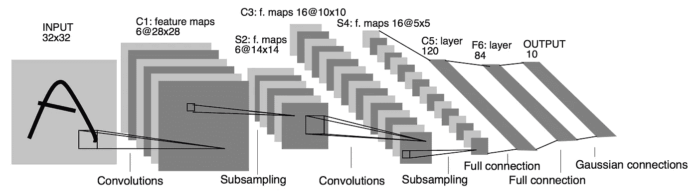
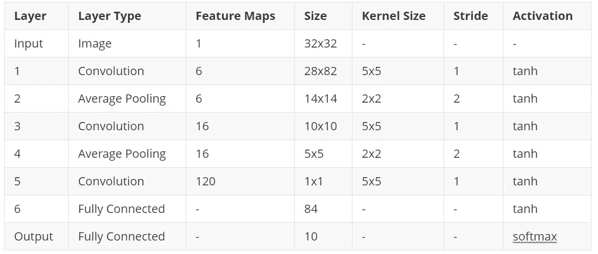

# LeNet-5:协进化神经网络体系结构

> 原文：<https://medium.com/analytics-vidhya/lenet-5-covolution-neural-network-architecture-23b93f75fe01?source=collection_archive---------11----------------------->

[**研究论文【http://yann.lecun.com/exdb/publis/pdf/lecun-98.pdf】-**](http://yann.lecun.com/exdb/publis/pdf/lecun-98.pdf)

**作者** -:扬·勒昆、莱昂·博图、约舒阿·本吉奥和帕特里克·哈夫纳

Lenet-5 是小型网络，它包含深度学习卷积层、池化层、全连接层的基本模块。它是其他深度学习模型的基础。 ***LeNet-5 共七层*** 。这里我们将深入分析 LeNet-5。要了解卷积和池层如何工作，请参考[https://medium . com/@ ommore 524/basic-of-Convolution-neural-network-d 618 D2 ba 4 efb](/@ommore524/basic-of-convolution-neural-network-d618d2ba4efb)。

图一。LeNet-5 架构

S **逐步指导理解完整架构-:**

图二。架构摘要

> *输入层* -:首先是输入层。它将接受大小为 32*32 的图像作为输入。

1.  使用大小为 5×5 的 6 个特征图对输入图像 is 执行第一卷积运算。它将从图像中提取 6 种不同的特征。该图层的输出特征图大小将为 28 * 28(32–5+1 = 28→卷积运算计算如下)。
2.  刚好在第一卷积层之后执行汇集操作。在所有 6 个特征图上使用核大小 2*2 执行 pooing。这一层将负责提取主要属性。在这里，他们主要采用平均池。这一层的输出特征地图大小将是 14 * 14(28/2→汇集操作是这样的)
3.  再次卷积运算用内核大小为 5*5 和 16 的特征图。这里我们可以说，我们正在努力学习特性的特性。输出要素地图的大小将为 10 * 10(14–5+1 = 10)。
4.  同样，平均池操作是在我们从先前卷积层获得的完整的 16 个特征图上执行的，核大小为 2*2，步长为 2。该图层的输出要素地图大小为 5*5 (10/2)
5.  我们再次使用核大小为 5*5 和 120 的特征图执行卷积运算。这将再次从前一层提取 120 个不同的特征。输出要素地图的大小将为 1 * 1(5–5+1)
6.  在我们执行展平操作之后，所有的矩阵都被转换成一个数组 exp。[1,0,1,1,1].这一层的批量大小是 84，即神经网络输入层具有接收 84 个输入的能力。
7.  在输出层有 10 个输出单元。这表明这些神经网络能够预测 10 个不同的类别。Lenet-5 是为预测 MNIST 数据类(0–9 个数字)而开发的。完整的体系结构在隐藏层使用 tanh 激活函数，在输出层使用 softmax 激活函数。

**缺点:** (i)隐层使用了一个使用指数运算的双曲正切函数。所以，网络更复杂。这增加了训练时间。由于消失梯度问题，存在数据丢失。(ii)体系结构小(iii)没有标准化概念(iv)相同的内核大小 5*5。

**参考文献:**

 [## 卷积神经网络基础

### 卷积神经网络(CNN)是一类广泛应用于图像识别和图像处理的神经网络

medium.com](/@ommore524/basic-of-convolution-neural-network-d618d2ba4efb) 

[https://medium . com/@ ommore 524/基本卷积神经网络-d618d2ba4efb](/@ommore524/basic-of-convolution-neural-network-d618d2ba4efb)