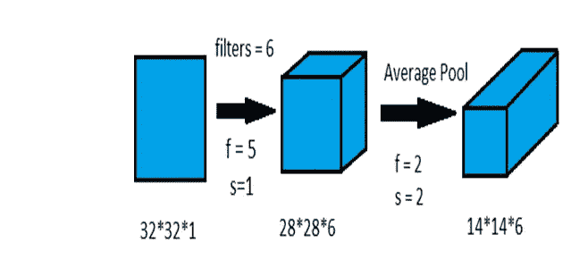
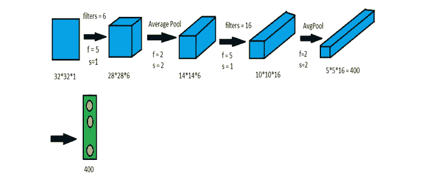

# LeNet 架构

> 原文：<https://medium.com/analytics-vidhya/lenet-architecture-document-recognition-ed971ab2a23f?source=collection_archive---------14----------------------->

## 数字识别概念介绍

由 [engMRK](https://engmrk.com/wp-content/uploads/2018/09/LeNet_Original_Image.jpg) 上 [Muhammad Rizwan](https://engmrk.com/author/admin/) 拍摄的照片

LeNet 是图像识别领域的一大突破。它是最古老的卷积神经网络之一，由 Yann LeCunn 早在 1995 年在其研究论文中提出。在那些日子里，他想出了这个 LeNet 模型来寻找代表美国邮政服务的邮政编码的手写数字。

## LeNet 结构的组件:

1.定义大小的输入图像

2.与特定大小和填充的核或特征一起使用的卷积层

3.卷积层中使用的滤波器符合要求

4.平均最大池用于特定的大小、步幅和填充

## 卷积层 1

它是使用多个卷积和平均池层构建的。我们采用由数字组成的大小为 32*32 的输入灰度图像作为图像。我们引入一个 5*5 大小的核，填充为 0，并将其与输入图像进行卷积。我们使用 6 个滤波器或内核来生成 28*28*6 的卷积层。图像步幅取为 1。

输入图像= 32*32

内核大小= 5*5

内核数量= 6

填充= 0

步幅= 1

因此，conv1 的大小=[n+2p-f+1]/s =[32+0–5+1/1]= 28

因此 conv1 = 28*28*6

## 平均池 1

现在我们用 2*2 的内核大小和步长=2 进行平均池化。它导致图像像素减少到 14*14。

输入图像= 28*28

内核大小= 2*2

步幅= 2

所以 conv1 的大小= [n+2p-f+1] / s

= [28+0–2+1/2]

=最低值(13.5)

= 14

因此，平均池 1 大小= 14*14*6

## **卷积层 2**

现在我们生成一个 5*5 内核大小的卷积层，取内核为 16，步长=1。它导致图像像素减少到 10*10*16。

输入图像= 14*14

内核大小= 5*5

内核数量= 16

填充= 0

步幅= 1

因此，conv2 的大小=[n+2p-f+1]/s =[14+0–5+1/1]= 10

因此 conv2 = 10*10*16

## 平均池-2

现在我们用 2*2 的内核大小和步长=2 进行平均池化。它导致图像像素减少到 5*5。

输入图像= 10*10

内核大小= 2*2

步幅= 2

所以 conv1 的大小= [n+2p-f+1] / s

= [10+0–2+1/2]

=底值(4.5) = 5

因此，avg-pool-2 的大小= 5*5*16

## **连接层 1 的输入**

现在，在第二次平均汇集之后，我们将所有像素展开到连接的第 1 层的输入神经元中。我们提供 400 个神经元作为连接层 1 的输入。

## 第二、第三连接层的生成，以及 softmax 输出。

我们接收连接的第 2 层的 120 个输入。这些输入被处理并产生 84 个输入到连接的第 3 层。84 个输入组合在一起成为一个 softmax，它产生由 10 个标签组成的输出分类器。softmax 生成 10 个输出，因为我们必须在文档识别过程中识别从 0 到 9 的 10 个数字。

Mnist 是由大约 70000 幅图像组成的数字图像数据集，其中 60k 被保留用于训练模型，10k 被保留用于测试模型。我们创建一个 LeNet 模型，并将其应用于 Mnist 数据集，以便根据数字的标识对其进行分类。

因此，最初我们提取 Keras 模型中可用的 Mnist 数据集。然后，我们将数据集分成训练和测试模型，并将输出标签或类的详细信息保存在 NumPy 数组中。

然后，我们创建一个 Lenet 架构，它将使用预测图像的标签分类对输入图像进行分类。在 Lenet 架构中，我们创建了一个 Keras 模型对象，并将其应用于 Keras 顺序模型。

我们将输入图像作为训练和测试图像提供给架构，并在 Lenet 架构上训练模型，以基于接收到的输入对图像进行分类。我们可以通过增加历元使用输入图像进行训练来达到模型的精度。

在模型的训练之后，我们将输入传递给模型，以便基于测试图像来测试预测。在这里，我们将一个测试图像作为 9 进行传递，在对图像应用模型分类预测之后，我们接收到的输出是 9。

希望这有助于你通过上面的例子更好地理解这个概念。

感谢阅读！！

如果感兴趣，请参考我的 GitHub 上的代码

[https://github.com/charanraj2411/Digit-Recognition](https://github.com/charanraj2411/Digit-Recognition)