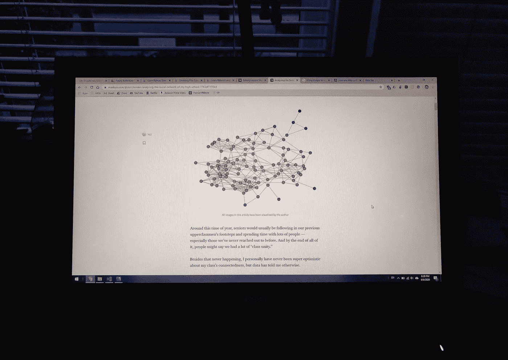
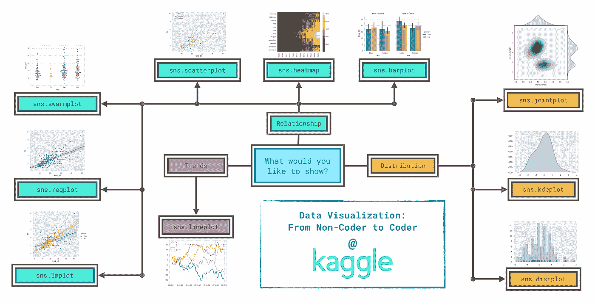
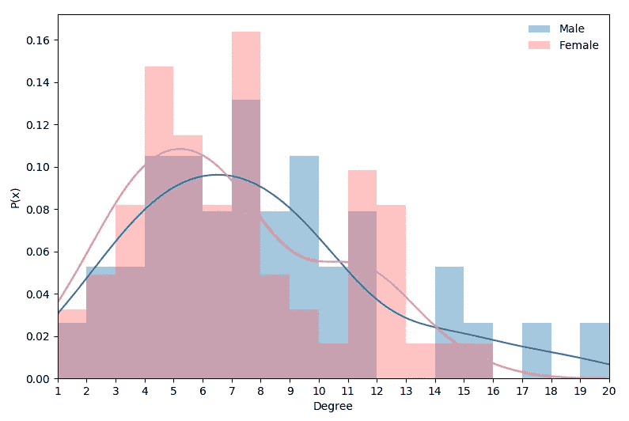

# 从我的第一个数据科学项目中获得的经验

> 原文：<https://medium.com/analytics-vidhya/lessons-from-my-first-data-science-project-4d3bae8add55?source=collection_archive---------32----------------------->

## 看看我的过程和对其他初学者的建议。

作者照片

我最近发表了一篇关于我高中的社交网络的文章，它要求我经历一个正常的数据科学项目的过程。对于其他初学者，我想分享我学到的一些重要的东西，以及除了浮华的结果之外，这个过程到底是什么样子的。

你不必读我以前的文章来阅读这篇文章，但我会把它留在这里，以防你感到好奇。

 [## 分析我高中的社交网络

### 我从我高中高三班背后的数据中学到的。

medium.com](/@alecchendev/analyzing-the-social-network-of-my-high-school-7763df719363) 

# 清洗和重新格式化

这方面会根据您的数据情况而有所不同，但我收到了原始数据，我认为我花在清理和重新格式化数据上的时间与可视化数据的时间一样多。当我学习基本的数据技能时，数据通常是为了练习而精心挑选的，但在真实的个人项目中往往不是这样。

在我的项目中，我必须编写代码来纠正名称的拼写，删除某些值，匿名，并将数据重新格式化为多个文件，以适应某些库。

我不仅要清理数据，还要多次回到数据中，只有这样我才能准确地想象出我想要的东西。

如果你有真正吸引人的数据，这一部分可能会非常有趣，但即使是这样，也可能会令人沮丧。清理和重新格式化需要大量的工作，而且也没有明显的回报。这使得在你开始处理任何更炫的数据科学的东西之前，必须满足这个工作门槛。我在这里能提供的所有建议只是习惯它，并且随着你继续下去，随着你越来越熟悉它，这个门槛会变得越来越小。

# 形象化

大约一个月前，我将我的竞赛表现可视化，以看到我在竞争性编程方面的进步。这是我第一次尝试像 matplotlib 这样的可视化库，回过头来看，那些图感觉几乎是原始的。如果你把这些图表和我最近的比较，你会发现这个项目真的帮助我扩展了我的可视化能力。在这个过程中，我学到了一些我认为是可视化的关键概念。

清理和重新格式化第二部分
这部分是因为我并不十分熟悉我正在使用的所有功能，但是我不得不无数次地查阅数据，以准确提取我可视化所需要的内容。数据永远不会适合所有的可视化方法或算法，因此这是另一次认识到数据科学不仅是分析数据，也是操纵数据。

我认为制定一个计划总是一个好主意，但是当你学习新的东西时，更重要的是要有灵活性。随着我对我所做的了解越来越多，我开始在我最初的计划中添加和删除一些东西，到最后，我的大部分最终视觉效果都是我没有计划制作的。

**如何制作一个好的视觉效果** 制作一个好的视觉效果比看起来简单。80%都归结于几个关键因素，即功能、比例和颜色。

功能仅仅意味着你的数据以一种清晰地显示你想要它显示的方式被可视化。想想你希望看到你的视觉效果的人能从中学到什么。扪心自问，他们会学吗？数据的实际绘制大部分是由您使用的工具自动完成的，所以您在这里的主要工作只是选择正确的图表来显示它。虽然这个流程图是针对 seaborn 函数的，但是它给出了一个很好的概述。

来源:[从 kaggle 的数据可视化课程中选择绘图类型和自定义样式](https://www.kaggle.com/alexisbcook/choosing-plot-types-and-custom-styles)子部分。我强烈推荐。

拥有合适的比例会让你的图表看起来更干净，更有意图。即使它的可读性与默认或草率的比例，它只会提高整体视觉一千个百分点，有东西间距很好。

两个示例图表，一个比例不佳，另一个故意留有间距。作者形象化了。

最后，颜色会把你的数字变成艺术。选择一个好的调色板不仅会让图表看起来很酷，还可以帮助说明某些组成部分代表什么或者视觉比较什么。这是一篇精彩的文章，介绍了在数据可视化中使用颜色的有趣概念和资源。

 [## 为数据可视化寻找正确的调色板

### 虽然现在很容易找到好的调色板，但是为数据可视化找到合适的调色板却是…

blog.graphiq.com](https://blog.graphiq.com/finding-the-right-color-palettes-for-data-visualizations-fcd4e707a283) 

我个人喜欢在谷歌上使用默认的颜色选择器，我喜欢酷酷的颜色给我调色板的灵感。大多数时候，我会尝试一些颜色，但通常结果都还不错。

我尽量让每一部分都简短，因为这些想法有点直观，但是做好这几件事会给你的视觉质量带来最大的回报。剩下的更细微和更高级的造型会有所帮助，但远没有那么多。

# 写作

当谈到实际写你的数据时，我认为要记住的最重要的概念是，人们是在为自己阅读。如果你坚持你想分享的最有价值的想法，它会成为一篇更好的文章。

> “我意识到我写的更多的是解释图表背后的统计数据，而不是在上下文中解释它们。”

我知道你的项目中包含了所有这些工作，但是你从中获得的如此多的额外知识很可能不属于这篇文章。在我最初的草稿中，我在这篇文章中包含了很多信息，到最后，我完全改变了它，并删除了两张我认为很酷但没有其他图那么有价值的图。

其中一张图是我想象出来的，但在我的最后一篇文章中没有提到。它比较了社会网络中男性和女性关系的分布。

你在讲一个故事，把所有的东西组织成有凝聚力的、有洞察力的、简洁的东西是一项很难做好的技能。

当我进行想象的时候，我开始感到厌倦，因为我可能没有那么多要说的。但当我开始写作时，不得不解释一切，这让我看到了赋予视觉意义的数字的背景。即使它看起来并不多，如果你使用它，并把它放在上下文中，它会让你大吃一惊。

我关于写作的最后一点可能是最重要的。拥有所有这些数据的全部意义在于凭经验向人们展示你所说背后的真相，所以要确保你所说的*就是你所说的*。包括所有重要的警告，对读者透明。最糟糕的事情是，因为你忘记承认数据中的漏洞，而让出色的分析失去可信度。

# 最后的想法

既然我们已经接近这篇文章的结尾，那就出去做点实际的事情吧。无论这是你的第一个项目还是第五十个项目，不要成为仅仅阅读数据科学的牺牲品，并实际开始做它。

如果你想回顾一下要点，我在下面做了一个总结。

## 摘要

清理和重新格式化——在进入项目最有趣的部分之前，你还有很多工作要做。一次比一次简单，但每次都要做。

视觉化——当视觉化时，带着一个计划去做，但是期待它改变，它可能会变得更好。对于视觉效果本身，记住功能、比例和颜色将为你的视觉效果提供最大的价值。

写作——写作可能是最具挑战性的部分，但也非常重要。首先要记住你是一个讲故事的人，而数学、统计学和计算机科学正是当今让你能够讲故事的东西。帮助你的读者理解足够多，这样他们就可以直观地理解你在说什么，**而不需要知道背后的所有工作。**