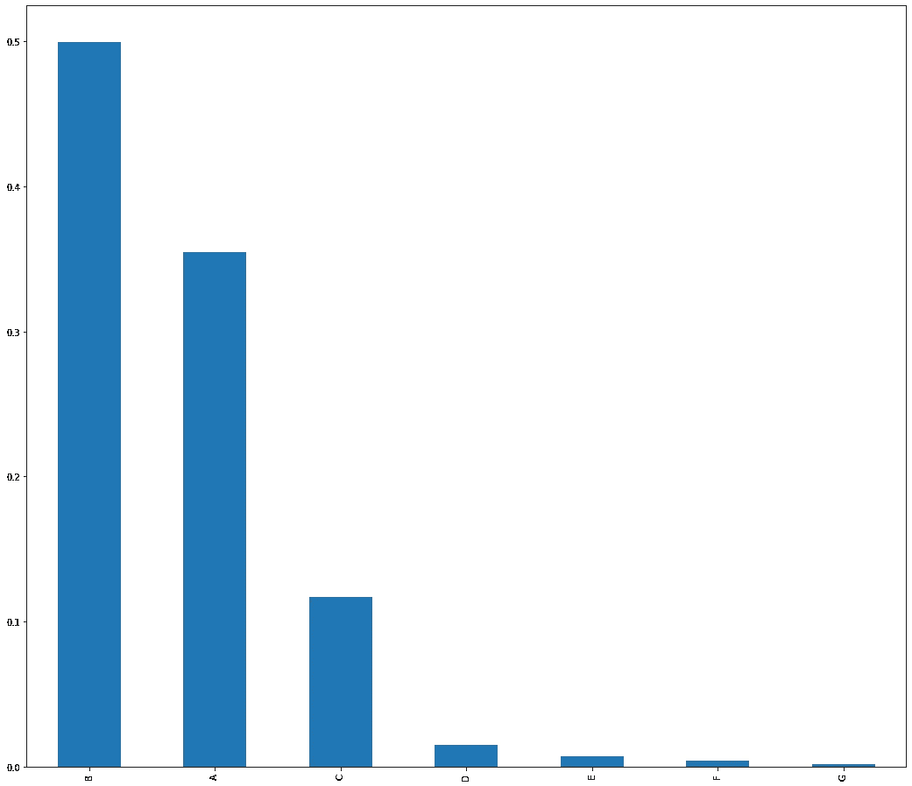
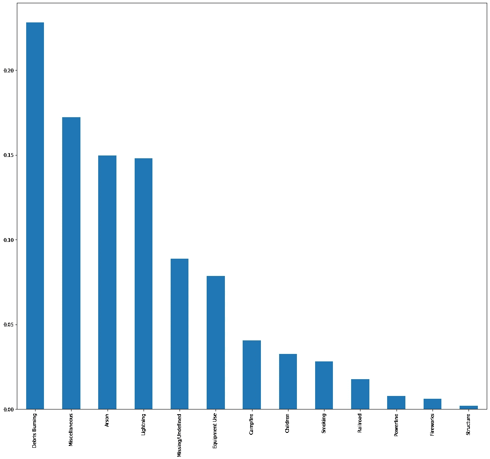

# 让它燃烧？

> 原文：<https://medium.com/analytics-vidhya/let-it-burn-8547c8a74f89?source=collection_archive---------15----------------------->

照片由[迈克尔在](https://unsplash.com/@michaelheld?utm_source=medium&utm_medium=referral) [Unsplash](https://unsplash.com?utm_source=medium&utm_medium=referral) 上抱着

你有没有因为火灾导致道路堵塞而陷入漫长的令人沮丧的交通中？或者不得不取消你的假期计划，因为目的地离最近着火的地方很近，或者不得不穿越它？感觉令人失望不是吗？

野火是任何在森林和其他荒地，如灌木或草丛中燃烧的意外火灾。它们不仅破坏景观，而且根据火势的大小，排放大量的烟雾污染着火地点附近的大气。

# **数据集**

在这个帖子里，我用过 188 万次美国野火。该数据出版物包含 1992 年至 2015 年发生在美国的野火的空间数据库。这是最初为支持国家火灾程序分析(FPA)系统而产生的出版物的第三次更新。野火记录是从联邦、州和地方消防组织的报告系统中获得的。这个数据集可以在 kaggle 上找到，也可以从[这里](https://www.kaggle.com/rtatman/188-million-us-wildfires)下载。

# **数据探索**

现在，让我们来看看数据集中的以下几点，并根据我们从现有数据中看到的内容来回答这些问题。

*   野火随着时间的推移
*   按大小点火
*   野火原因
*   按地理划分的野火

# **问题**

*   火灾的主要原因是什么？
*   哪些州的事故数量最多，是什么原因造成的？
*   事故通常发生在一年中的什么时候？
*   通常会看到哪种类型的火灾？
*   控制火势的天数以及各州如何应对？

# **野火随时间推移**

野火随着时间的推移

平均而言，我们可以看到事件数量接近 70，000 起，而 2006 年的事件数量似乎最高，约为 11，000 起。让我们试着从`DISCOVERY_DOY`中提取月份信息，并找出哪个月报告的事故数量最多。稍后让我们看看我们是否在不同地区发现任何淡季野火。

看起来大多数事件都发生在春天或夏天。考虑到秋天后干燥树叶的数量和夏天的炎热，这确实是有道理的。

# **按规模划分的野火**

野火的规模

大约 85%的事故是由 A 级和 B 级单独引起的！！很高兴看到 G 类事故最少，不到总事故的 10%,这是一个好迹象。

以下是对以上每个类别所代表的规模的快速浏览

*A =大于 0 但小于或等于 0.25 英亩，B = 0.26–9.9 英亩，C = 10.0–99.9 英亩，D = 100–299 英亩，E=300 到 999 英亩，F=1000 到 4999 英亩，G=5000+英亩*

在我们深入探讨之前，让我们快速检查一下火灾原因和人口统计方面的统计数据。

# **野火原因**

按原因分类的野火

好好好！！就像我们之前推断的那样，我们看到近 25%的事件是由`Debris Burning`引起的，其次是`Miscellaneous`、`Arson`和`Lightning`。这四个原因本身约占事故总数的 70%。

# **按地理划分的野火**

各州的野火

`California`的火灾占 1992 年至 2015 年报告的火灾总数的近 10%，其次是`Georgia`和`Texas`

我们现在已经看到了主要原因、事故数量、主要火灾类别以及受野火影响最严重的州的概况。我们现在可以深入研究，试图找到问题的答案。

让我们试着在美国地图上标出上述信息，这样我们就可以看到各州是如何受到野火影响的。

看起来大多数事件来自美国南部、东南部和西部的州。

更深入地说，下面是基于不同州县的事故数量图。

很明显，GA、TX、FL 和 CA 的大部分地区都没有受到野火的影响，只有某些县受到影响。

现在我们已经了解了哪些州报告的事故数量最多，以及一段时间内事故的主要原因，让我们看看不同的州是否有不同的火灾原因和事故的时间表

很明显，在 GA 发生的大部分事故都是由于`Debris Burning`和`Arson`造成的。而在 CA，大多数火灾的原因是未知的，其次是`Equipment Use`和`Lightning`活动。在德克萨斯州，`Debris Burning`再次成为主要原因，其次是未知和`Equipment Use`。让我们来看看这些州基于大小的火灾等级是如何变化的。

A 级、B 级和 C 级事故占各州事故的大多数，占事故的 4%以上。

通过绘制上图所示的火灾类别和原因之间的热图，我们可以看出，A、B 类火灾的主要原因是`Arson`、`Miscellaneous`、`Lightning`、`Debris Burning`和`Equipment Use`

# **控制野火的日子**

到目前为止，我们已经看到了火灾的主要原因，以及火灾在各州造成的破坏和火灾通常发生的时间。现在，让我们看看各州准备得有多充分，他们能多快地控制火势。由于我们有很多关于`CONT_DATE`的缺失值，让我们试着看看我们能从现有值中推断出什么。

注意:由于数据集中缺少值，这可能不准确。

平均而言，`Lightning`引发的火灾持续时间最长，为 3 天，而`Debris Burning`引发的火灾最少，不到半天。

从图表中我们可以看到，像得克萨斯州、佐治亚州等事故发生率较高的州控制火灾的速度更快，平均不到一天，而加利福尼亚州平均一天。另一方面，阿拉斯加控制火势的时间最长，平均为 11 天。会不会是因为这个州人口少，所以没人及时通知当局？但愿我们有数据集中的人口数据来回答这个问题！

正如所料，我们可以看到，G 类和 F 类的平均灭火天数最多，分别为 35 天和 15 天，而 A 类和 B 类的平均灭火天数最少，不到 2 天

为了结束我们的分析，让我们通过使用地理坐标绘制热图来看看事情在一段时间内是如何变化的。

啊！看到野火在一段时间内是如何发生的看起来很棒，不是吗？？

# 摘要

*   近 25%的事故是由碎片燃烧引起的，其次是杂项、纵火和闪电
*   加州、乔治亚州和德克萨斯州的火灾数量最多，在乔治亚州发生的大多数事故都是由于碎片燃烧和纵火造成的。而在加州，大多数火灾的原因不明，其次是设备使用和闪电活动。在得克萨斯州，碎片燃烧再次是主要原因，其次是未知和设备使用。
*   上述各州的大多数事件发生在春季和夏季
*   A 级和 B 级是主要的火灾类型
*   虽然数据可能不准确，但 G 类和 F 类控制火灾的平均天数最多，分别为 35 天和 15 天，而 A 类和 B 类最少，平均不到 2 天。
*   由闪电引起的火灾持续时间最长，即 3 天，由碎片燃烧引起的火灾最少，不到半天。
*   像得克萨斯州、佐治亚州等事故发生率较高的州控制火势的速度更快，平均不到一天，而加利福尼亚州平均一天。另一方面，阿拉斯加控制火势的时间最长，平均为 11 天。