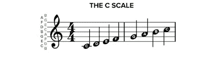
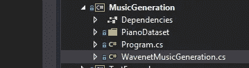
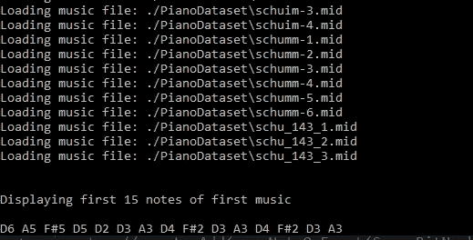
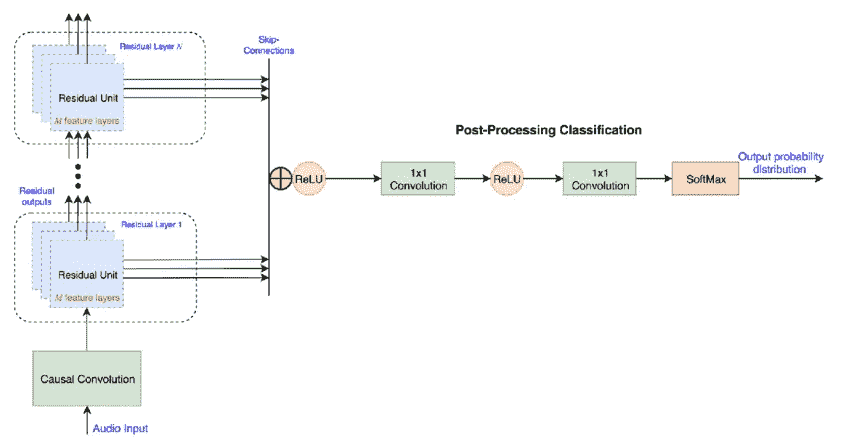
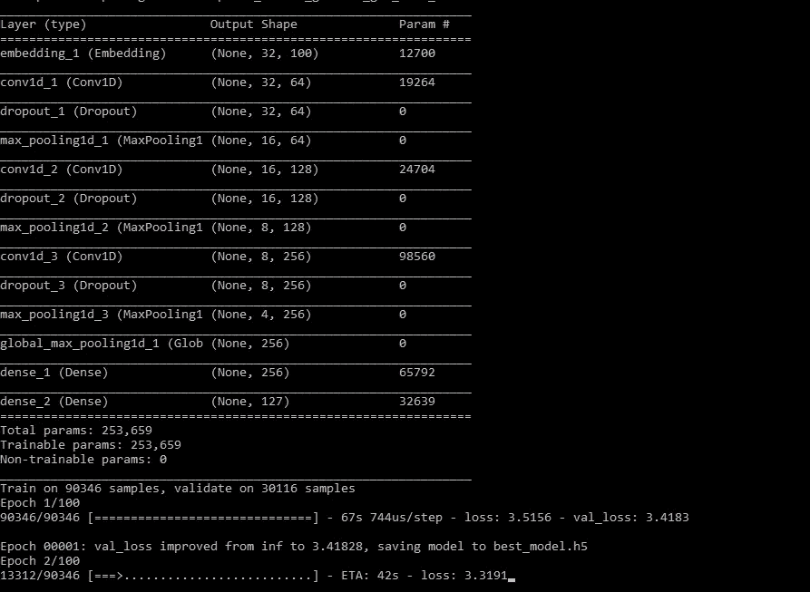
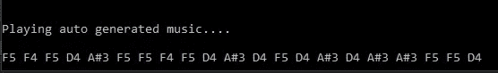

# 让机器播放一些音乐

> 原文：<https://medium.com/analytics-vidhya/let-machine-play-some-music-1a86216df7a4?source=collection_archive---------32----------------------->

随着人工智能的进步，机器将能够播放音乐，这不是一个笑话。我不确定音乐会有情感和同情，而这可能很容易取代人类。无论如何，在这篇博客中，我将向你展示我们如何利用深度学习来创作音乐。当然，为了让它自己产生，你需要先教会它们。

首先，我们需要对音乐的基本结构有所了解。如果我们以钢琴为例，即使是最业余的音乐家也会注意到的第一件事是一系列按键——一些黑色，一些白色——当敲击时会发出不同的声音或音符。这些音符的组合，被称为钢琴上的和弦，是至少三个音符一起演奏，有时在某些情况下会更多。歌曲是用调写的，也就是所谓的调号，这样你就可以从自己的根音开始。例如，c 大调和弦是根音 C(和弦的根音)，三度音程音 E，五度音程音 g。



现在，为了教机器演奏音乐，我们需要将这些音符输入它的大脑。我们如何得到这些笔记？？？这是我们将要使用以 MIDI 格式下载的音乐的地方。MIDI 是一种通信标准，允许数字音乐设备使用同一种语言。 **MIDI** 是乐器数字接口的简称。这是一种允许计算机、乐器和其他硬件进行通信的协议。

这里有一些我们将用于训练目的的钢琴曲的例子:【https://github.com/SciSharp/Keras.·NET/tree/master/Examples/music generation/piano dataset

我们将把完整的代码分成 3 个部分:

1.  数据准备
2.  模特培训
3.  音乐一代

首先在 Visual Studio 中创建一个新的控制台项目。将以下 nuget 包添加到您的项目中:

1.  喀拉斯。NET:[https://www.nuget.org/packages/Keras.NET](https://www.nuget.org/packages/Keras.NET)
2.  梅兰查尔。DryWetMidi:[https://www.nuget.org/packages/Melanchall.DryWetMidi](https://www.nuget.org/packages/Melanchall.DryWetMidi)

Keras 将用于建立深度学习模型，用于训练和预测下一个音符。而梅兰查尔。DryWetMidi 用于数据准备和播放生成的音符。下载所有的 midi 文件并放在项目的 PianoDataset 文件夹中。创建一个新的 C#类“WavenetMusicGeneration.cs”。



# 数据准备

打开“WavenetMusicGeneration.cs”并添加以下字段。

```
public class WavenetMusicGeneration
 {
        static int no_of_timesteps = 32; //No. of notes to teach per step
        static NDarray train_x = null; // Training notes set
        static NDarray train_y = null; // Next note to play 
        static int output = 127; //Max number of notes a piano have
 }
```

我们需要一个函数来读取 MIDI 文件并获取笔记列表。

```
private static Note[] ReadMidi(string file)
 {
            Console.WriteLine("Loading music file: " + file);
            var mf = MidiFile.Read(file);
            return mf.GetNotes().ToArray();
}
```

我们要使用的下一个功能是读取这些下载的训练音乐文件并组合音符。现在这些音符是字符串格式的，所以我们将使用音符的数字版本，因为最后的机器理解数字。

```
public static void PrepData()
{
            //notes array list declaration
            List<Note[]> notes_array = new List<Note[]>();

            //Get all the file list
            var files = Directory.GetFiles("./PianoDataset");

            //Loop through the files and read the notes, put them in the array
            foreach (var file in files)
            {
                notes_array.Add(ReadMidi(file));
            }

            //Show first 15 notes for the first music file
             Console.WriteLine("Displaying first 15 notes of first music");
            foreach (var n in notes_array[0].Take(15))
            {
                Console.Write(n.ToString() + " ");
            }

            //Declare X and Y which will hold the training set
            List<float> x = new List<float>();
            List<float> y = new List<float>();

            //Loop through the notes and prepare X and Y set.
            foreach (var notes in notes_array)
            {
                for (int i = 0; i < notes.Length - no_of_timesteps; i++)
                {
                    var input = notes.Skip(i).Take(no_of_timesteps).Select(x => Convert.ToSingle(x.NoteNumber)).ToArray();
                    var output = Convert.ToSingle(notes[i + no_of_timesteps].NoteNumber);
                    x.AddRange(input);
                    y.Add(output);
                }
            }

            // Finally convert them to numpy array format for neural network training.
            train_x = np.array(x.ToArray(), dtype: np.float32).reshape(-1, 32);
            train_y = np.array(y.ToArray(), dtype: np.float32);
}
```

准备功能的输出:



# 教模特

现在到了真正的部分，建立一个大脑的小部分，并教他们音乐。我们将使用 WaveNet 架构的变体(更简单的版本)。WaveNet 是一个用于生成原始音频的深度神经网络。它是由伦敦人工智能公司 DeepMind 的研究人员创造的。我们要重用架构生成音乐:)。在继续下一步之前，你可以谷歌一下 WaveNet 的更多信息。



下面是构建模型并使用之前准备的数据集对其进行训练的代码。

```
public static void BuildAndTrain()
{
            //Model to hold the neural network architecture which in this case is WaveNet
            var model = new Sequential();
            // Starts with embedding layer
            model.Add(new Embedding(output, 100, input_length: 32));

            model.Add(new Conv1D(64, 3, padding: "causal", activation: "tanh"));
            model.Add(new Dropout(0.2));
            model.Add(new MaxPooling1D(2));

            model.Add(new Conv1D(128, 3, activation: "relu", dilation_rate: 2, padding: "causal"));
            model.Add(new Dropout(0.2));
            model.Add(new MaxPooling1D(2));

            model.Add(new Conv1D(256, 3, activation: "relu", dilation_rate: 4, padding: "causal"));
            model.Add(new Dropout(0.2));
            model.Add(new MaxPooling1D(2));

            //model.Add(new Conv1D(256, 5, activation: "relu"));
            model.Add(new GlobalMaxPooling1D());

            model.Add(new Dense(256, activation: "relu"));
            model.Add(new Dense(output, activation: "softmax"));

            // Compile with Adam optimizer
            model.Compile(loss: "sparse_categorical_crossentropy", optimizer: new Adam());
            model.Summary();

            // Callback to store the best trained model
            var mc = new ModelCheckpoint("best_model.h5", monitor: "val_loss", mode: "min", save_best_only: true, verbose: 1);

            //Method to actually train the model for 100 iteration
            var history = model.Fit(train_x, train_y, batch_size: 32, epochs: 100, validation_split: 0.25f, verbose: 1, callbacks: new Callback[] { mc });

            // Save the final trained model which we are going to use for prediction
            model.Save("last_epoch.h5");
}
```

训练过程有点耗时，但如果你给了 GPU，那么它会快 10 倍。培训产出如下:



# 创作新音乐

现在有趣的部分来了，我们将使用这个模型生成音符。使用下面的功能生成新的音符

```
public static List<int> GenerateNewMusic(int n = 20)
{
            //Load the trained model
            var model = Model.LoadModel("last_epoch.h5");
            //Get a random 32 notes from the train set which we will use to get new notes
            var ind = np.random.randint(0, train_x.shape[0]);
            var random_music  = train_x[ind];

            //Build the prediction variable with sample 32 notes
            List<float> predictions = new List<float>();
            predictions.AddRange(random_music.GetData<float>());

            //Loop through N times which means N new notes, by default its 20
            for (int i = 0; i < n; i++)
            {
                // Reshape to model adaptaed shape
                random_music = random_music.reshape(1, no_of_timesteps);
                //Predict the next best note to be played
                var prob = model.Predict(random_music)[0];
                var y_pred = np.argmax(prob, axis: 0);

                //Add the prediction and pick the last 32 to predict the next music note
                predictions.Add(y_pred.asscalar<float>());
                random_music = np.array(predictions.Skip(i + 1).ToArray());
            }

            //Finally skip the first 32 sample notes and return the rest N new predicted notes.
            return predictions.Skip(no_of_timesteps - 1).Select(x=>(int)x).ToList();
}
```

播放这些音符的功能。我们使用计算机上的默认播放设备，并发送将产生钢琴声音的 MidiEvent。

```
private static void PlayNotes(List<int> notes)
{
            List<List<MidiEvent>> musicNotes = new List<List<MidiEvent>>();
            var playbackDevice = OutputDevice.GetAll().FirstOrDefault();
            foreach (var note in notes)
            {
                Note n = new Note(SevenBitNumber.Parse(note.ToString()));
                Console.Write(n + " ");
                playbackDevice.SendEvent(new NoteOffEvent(SevenBitNumber.Parse(note.ToString()), SevenBitNumber.MaxValue));
            }
}
```



调用上述所有函数的最终主函数:

```
static void Main(string[] args)
{
            WavenetMusicGeneration.PrepData();
            WavenetMusicGeneration.BuildAndTrain();
            var notes = WavenetMusicGeneration.GenerateNewMusic(20);
            Console.WriteLine("\n\nPlaying auto generated music....\n");
            PlayNotes(notes);
}
```

太棒了，对吧？但是你的学习不止于此。有很多方法可以进一步提高模型的性能:

*   我们可以微调预先训练好的模型来构建一个健壮的系统
*   尽可能多地收集训练数据，因为深度学习模型在较大的数据集上表现良好

示例代码:[https://github.com/SciSharp/Keras.NET/tree/master/Examples/music generation](https://github.com/SciSharp/Keras.NET/tree/master/Examples/MusicGeneration)

*原载于 2020 年 5 月 3 日*[*【https://www.tech-quantum.com】*](https://www.tech-quantum.com/let-machine-play-some-music/)*。*