# 让我们在深度学习中激活你的激活(功能)

> 原文：<https://medium.com/analytics-vidhya/lets-activate-your-activation-function-in-deep-learning-c6f715bcbe57?source=collection_archive---------15----------------------->

在这个技术时代，深度学习是解决自动化问题的一种非常好的方法。每天产生的数据量非常大。为了正确使用这些数据，我们可以使用机器学习和深度学习来解决许多重大问题。

图片来源:[http://RES . cloud inary . com/yumyoshojin/image/upload/v1/pdf/future-data-2019 . pdf](http://res.cloudinary.com/yumyoshojin/image/upload/v1/pdf/future-data-2019.pdf)

深度学习主要是利用人工神经网络来建立模型和解决问题。首先我们需要知道:

# 什么是人工神经元？？

人工神经元是[人工神经网络](https://searchenterpriseai.techtarget.com/definition/neural-network)中的连接点。像人体的生物神经网络一样，人工神经网络具有分层的架构，每个[网络节点](https://searchnetworking.techtarget.com/definition/node)(连接点)都具有处理输入并将输出转发给网络中其他节点的能力。在人工和生物架构中，节点被称为神经元，连接由突触权重来表征，突触权重代表

这种联系。随着新数据的接收和处理，突触权重发生变化，这就是学习发生的方式。

现在我们引入一个新概念，即激活函数，它有助于在给定一个或一组输入的情况下定义节点的输出。一个标准的计算机芯片电路可以被看作是一个由**激活功能**组成的数字网络，激活功能可以根据输入“开”(1)或“关”(0)。

激活功能就像一个电子开关，向另一个神经元发送响应。有许多类型的激活功能。我们讨论了在观想的深度学习问题中，你需要选择哪一个。

一个非常依赖激活函数的模型。如果你在一个非线性的问题上应用线性函数，你的模型将会很差并且不精确。

激活功能的类型主要有两类:

1.线性函数

2.非线性函数

这里我们讨论各种激活函数，如 relu，sigmoid，Linear，Tanh。

*   **Relu(整流线性激活功能:**

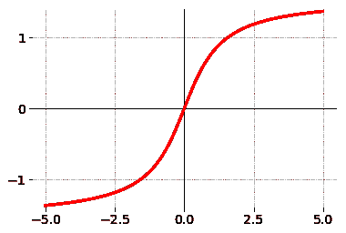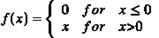

整流线性激活函数是分段线性函数，如果为正，它将直接输出输入，否则，它将输出零。它已经成为许多类型的神经网络的默认激活函数，因为使用它的模型更容易训练，并且通常可以实现更好的性能。

*   **乙状结肠:**

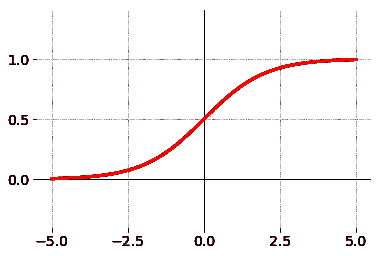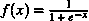

它也是一个非线性函数，具有 S 形曲线，称为 sigmoid 曲线，函数称为 sigmoid 函数。

sigmoid 函数的标准选择是第一张图中所示的逻辑函数，由公式定义。

它是一个为所有实输入值定义的有界、可微分的实函数，并且在每个点都有一个非负导数。sigmoid“函数”和 sigmoid“曲线”指的是同一个对象。

*   **双极:**

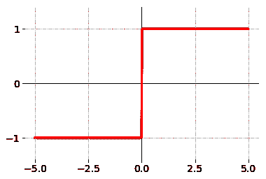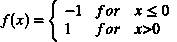

**双极激活函数**用于将一个单元(神经元)的**激活**电平转换为输出信号。由于能够将输出信号的幅度范围压缩到某个有限值，它也被称为传递**功能**或压缩**功能**。

*   **双曲正切(TanH):**

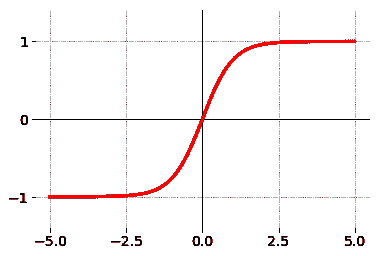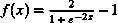

双曲正切函数是 DL 中使用的另一种 AF，它在 DL 应用中有一些变体。双曲正切函数称为双曲正切函数，是一种更平滑的零中心函数，其范围在-1 到 1 之间。

*   **指数线性单位，ELU**

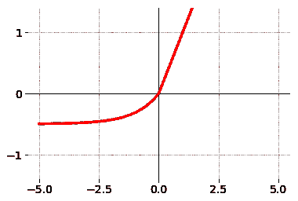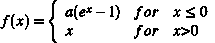

**指数线性单元**或其广为人知名字 **ELU** 是一种倾向于更快地将成本收敛到零并产生更准确结果的函数。…对于非负输入，它们都是恒等函数形式。另一方面， **ELU** 变得缓慢平滑，直到其输出等于-α，而 RELU 急剧平滑。

*   软加软件

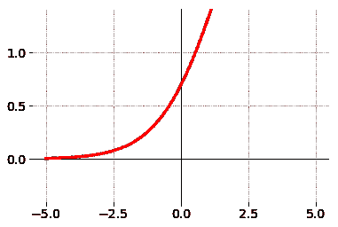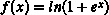

softplus 是比 sigmoid 和 tanh 更新的函数。这是 2001 年首次推出的。Softplus 是传统函数的替代品，因为它是可微的，而且它的导数很容易证明。

*   分段线性

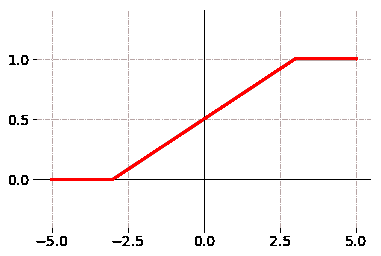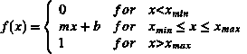

在数学和统计学中，**分段线性**，PL 或分段函数是定义在实数或其一段上的实值函数，其图形由直线段组成。它是一个**分段**定义的函数，它的每一段都是一个仿射函数。

这方面的总代码如下

# 结论:

所以神经网络激活功能是深度学习的关键组成部分。激活函数决定了深度学习模型的输出，其准确性，以及训练模型的计算效率——这可以建立或破坏一个大规模的神经网络。激活函数对神经网络的收敛能力和收敛速度也有很大影响，或者在某些情况下，激活函数可能会首先阻止神经网络收敛。

因此，明智地选择您的激活:

***来源我用:***

1.  [https://github.com/siebenrock/activation-functions](https://github.com/siebenrock/activation-functions)
2.  【https://arxiv.org/pdf/1811.03378.pdf 号
3.  谷歌
4.  达克达克戈