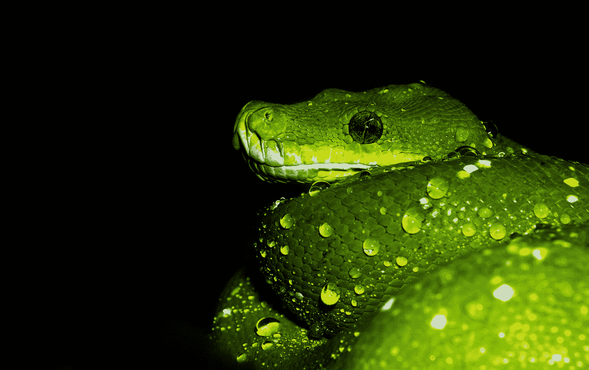

# 我们用 Python 来装修吧！

> 原文：<https://medium.com/analytics-vidhya/lets-decorate-in-python-666c105df2f6?source=collection_archive---------11----------------------->

## 编码

## 或者我如何出版我的第一个 pip 包

戴维·克洛德在 [Unsplash](https://unsplash.com?utm_source=medium&utm_medium=referral) 上的照片

Python 很牛逼。我在数据科学和人工智能相关的课程中一直在使用它，我真的很喜欢它。

你可以用 Python 制作任何种类的软件。它在 DS 和 AI 中最著名的用法是在 Django 和 Flask 中用于基于 web 的应用程序…