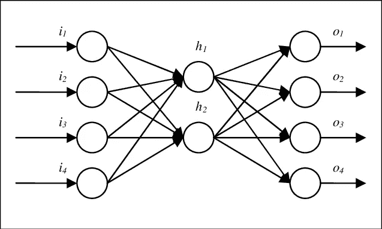

# 自动编码器和风格转换

> 原文：<https://medium.com/analytics-vidhya/lets-discuss-encoders-and-style-transfer-c0494aca6090?source=collection_archive---------11----------------------->

自动编码器和风格转移小指南。

欢迎大家！这是我在一个月内完成*深度学习纳米学位*的旅程中的第八篇文字！我已经完成了该学位总共六个模块中第三个模块的 73%。今天的话题包括*自动编码器*，他们做什么和什么是*风格转移。*

## **第 10 天**

今天第一课的名字是*自动编码器*。我希望在明天之前完成整个模块。


# 自动编码器

编码器本质上是为完成特定工作而设计和训练的神经网络。现在，在进入真正的内容之前，让我告诉你有两种类型的编码器，编码器&解码器。

> 不同的是，这些编码器学习新的算法来有效地完成工作，而不是由人类编码。
> 
> 通常，整个模型是通过减少/最小化输入和输出之间的差异来构建的。这样，中间层将是输入数据的压缩表示。


## 编码器

这是自动编码器的第一部分。它的作用是，基本上缩短了图像的数据。它获取图像，将其传递到一组卷积层和最大池层。卷积层用于识别模式并将权重保存在新矩阵中。然后，对其应用最大池以缩短其大小，并重复该过程，直到我们有了一个包含识别图像所需信息的小矩阵。

> 使用编码器的关键是，它能够以保持重要特征的方式压缩图像。然后这些可以用来在他们所学的知识上建立新的信息。

## 解码器

这是自动编码器的第二部分。这和编码器的工作完全相反。它接收一个图像并对其进行一些操作以增加其大小/尺寸。

现在，我们知道这些是什么，我们可以谈得更深入一点。

## MLP 自动编码器

编码器的基本工作是将图片压缩成矢量。**为什么有用？**让我们举一个例子。让我们假设你需要送一个朋友这个模型。现在，发送一个已经训练好的带有权重的模型可能会造成混乱，但是当你从编码器传递图像时，图片的大小会减小，但它仍然具有那些重要的特征。然后，您可以轻松地发送它们。上传到云时也是如此。我们可以通过使用这个来大幅减小图像的大小。由于这些缩短的图像包含了所有的特征，它们可以通过将信息传递给解码器而被重新创建。

> 我们只需要最小化测试损失，而不是验证损失。所有层都是 ReLU，最后一层是 Sigmoid，用于将它们转换成概率。



MLP 自动编码器

## 卷积层自动编码器

这里，在这种方法中，我们在编码和解码部分使用卷积层。这比使用标准 MLP 要好，因为我们知道 CNN 通常比 MLP 更擅长处理图片。

现在，编码器的过程很简单。当我们在解码过程中到达池层时，主要部分就出现了。现在，我们基本上要扭转这里的 MaxPool 效应，姑且称之为 ***UnPooling*** 。有许多技术可以执行这一步，下面我们来谈谈 ***最近邻*** 算法如何帮助我们。在这种情况下，我们只需复制一个单元格的值，并将其粘贴到未缓冲层的相应单元格中。这是可以的，但是在现实世界中，数据是相当混乱的，简单地复制这些值无法得到令人满意的模型。因此，我们可以*学习*如何取消图层。


CNN 自动编码器

## 转置卷积层

这些也被称为 ***解卷积层*** 。它有可学习的参数。解码器使用转置卷积层来*增加*输入层的宽度和高度。它们的工作原理与卷积层几乎完全相同，但顺序相反。PyTorch 为我们提供了一个创建图层的简单方法，使用这个函数' [***nn。conv transpose 2d***](https://pytorch.org/docs/stable/nn.html#convtranspose2d)’。


去 CNN

## 进展

输入层中的*步距*导致转置卷积层中的*步距*更大。例如，如果您有一个 3x3 内核，输入层中的一个 3x3 补丁将减少到卷积层中的一个单元。相比之下，输入层中的一个单元将在转置卷积层中扩展为 3×3 路径。

使用最近邻法时，我们需要采取的方法是放大图像。比方说，我们取一个 2 乘 2 的图像，然后，我们把它变成 4 乘 4 的区域。为了应用这一点，我们在 forward 函数中使用不同的语法。

```
F.upsample(input, scale_factor, mode='nearest')
```

这都是为了自动编码器。我们现在继续吧。

# 风格转移

***神经风格转移*** 是指*操纵*数字图像或视频，以采用另一幅图像的外观或视觉风格。NST 算法的特点是使用*深度神经网络*来执行*图像变换*。


风格转移示例

当我们使用一个 *CNN* 时，我们输入图像，然后图像被转换成特征图。而且，功能地图越来越注重内容表现，而不是彩色图片中的细节。当我们研究我们模型的 *CNN* 层时，我们发现每一层都越来越多地存储着越来越复杂模式的信息。一个 *CNN* 图层的深度实际上是该图层中特征地图的数量。

> 后面的层有时也称为内容表示。

## 风格

风格可以想象成一幅画的*笔触*，纹理、颜色、图案等等。

## 过程

为此，我们有两个图像，内容图像和样式图像。 *CNN* 看风格图像的风格和内容图像的内容。新形象是这两者的产物。新图像的对象取自内容图像的对象或内容，颜色和纹理取自样式图像。这意味着*样式转移*只是创建了两张图像的*混合。*

## *内容损失*

*当我们保存内容图像中的内容并将其应用到我们的图像后，我们计算这个损失。它基本上是内容图像的内容与结果图像有多少不同的数字表示。它是内容图像的内容与目标图像之间的损失，在等式中分别用 *Cc* & *Tc* 表示。请注意，‘*conv*’是我们想要从中获取权重的卷积层。*

```
*#Theory
Content_Loss = 1/2 np.sum(Tc - Cc)**2#Actual Code Representation
content_loss = torch.mean((target_features['conv'] - content_features['conv'])**2)*
```

*当我们创建图像时，我们的目标是尽量减少损失。这里，我们不是在训练 CNN，我们只是以一种方式改变输出图像，使其风格与风格图像的风格相匹配。*

> *我们使用 CNN 作为特征提取器，并使用反向传播来最小化内容损失。*

## *格拉姆矩阵*

*图像的*样式表示*依赖于特征和各个层之间的*样式相关性*。为了理解这一点，让我们考虑以下情况。*

*假设我们从一个 4x4 的矩阵开始。和深度为 8 的卷积层。因此，我们希望找到 8 个特征图之间的关系。我们展平特征地图。通过这样做，我们将 3d conv 层转换为 2d 值矩阵。这个矩阵将是 8x16。然后我们将得到的矩阵乘以它的转置，16x8。生成的 gram 矩阵(8×8)包含关于该层的非本地化信息。非本地化是即使图像被打乱，信息仍然存在。*

> *Gram 矩阵将是一个正方形矩阵，其宽度和高度等于所讨论的卷积层的深度。*

**

*格拉姆矩阵*

## *风格丧失*

*这指的是内容图像的样式与结果图像有多大不同的数字表示。在其中，我们找到了风格和目标 gram 矩阵之间的均方差。它是风格图像的风格与目标图像的风格之间的风格损失，在等式中分别用 *Ss* & *Ts* 表示。请注意，这里的' *a* 是每层的数值个数。公式如下。请注意'*Target _ gram*'&'*Style _ Gram*'分别是目标&样式图像的 Gram 矩阵。*

```
*#Theory
Style_Loss = a * np.sum(Weights * (Ts - Ss)^2)#Actual Code Representation
style_loss += style_weights['conv'] * torch.mean((target_gram - style_gram)**2) / (d * h * w)*
```

**权重*是样式权重，给出或多或少给每个层的样式损失的权重。这将代表每一层对我们最终的风格图像的影响程度。我们也将风格损失正常化。*

## *全损*

*现在，为了计算，我们将这两个求和如下。*

```
*Total_Loss = (*a* * Style_Loss) + (*B ** Content_Loss)*
```

*我们将这些损失与一些常数相乘，使它们在输出图像中相当相等。我们通常也保持样式损失不变， *a* ，比内容损失大得多，只是为了让更多的样式融入其中。*

> *Alpha/Beta 比率越小，您看到的风格效果就越好。然而，如果我们认为 Beta 比 Alpha 大得多，那么我们将得到一个只包含样式而不包含内容的图像。*

**

*风格转移的结果图像*

*这是我一天能走的路。我还完成了第二个项目，用迁移学习建立的“狗的品种分类器”。首先从零开始构建它，然后实现迁移学习来导入 VGG16，这是一个非常好的体验。正如你所看到的，我对模型的准确性非常满意，尽管我花了近 7 个小时在 Mac Air 上进行训练。下一集再见！*

**

*模型精度*