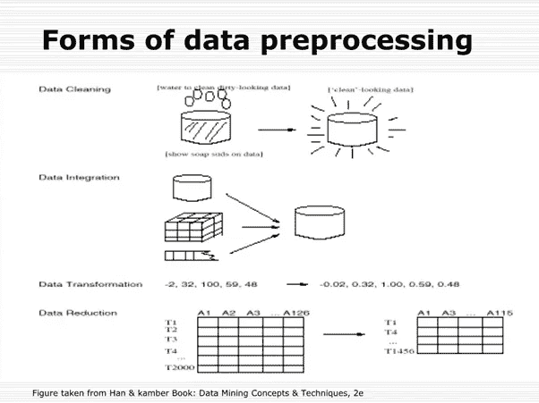
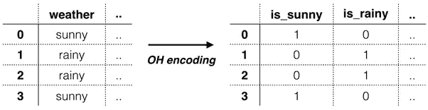

# 让我们深入研究数据预处理

> 原文：<https://medium.com/analytics-vidhya/lets-dive-into-data-preprocessing-e2284977e9c4?source=collection_archive---------31----------------------->

生活在当今时代，我们每天都要面对成千上万的数据。当我们早上醒来开始新的一天时，我们大多数人做的第一件事就是查看智能手机，看看“有没有我没有阅读的重要邮件？”或者我们查看我们的社交媒体，看看“我的朋友今天过生日吗？”还是我们在智能手机上查看新闻，看看“今天有什么热点？”这些都是数据应用的例子。你能想象如果面对之前没有处理过的原始数据吗？

# **什么是数据预处理**

> “一个简单的定义是，数据预处理是一种数据挖掘技术，将从不同来源收集的原始数据转化为更适合工作的更清晰的信息。换句话说，这是一个初步的步骤，需要将所有可用的信息进行组织、分类和合并。”

原始数据可能会有缺失或不一致的值，并且会呈现大量冗余信息。原始数据最常见的问题可以分为三类:

**缺失数据:**您也可以将此视为不准确的数据，因为不存在的信息会造成可能与最终分析相关的缺口。当收集阶段出现问题时，丢失的数据通常会出现，例如导致系统停机的故障、数据输入错误或生物识别使用问题等。

**有噪声的数据:**这一组包括你能在数据集中找到的错误数据和离群值，但那只是无意义的信息。在这里，您可以看到由人为错误、罕见异常、错误标签以及数据收集过程中的其他问题造成的噪音。

**数据不一致:**当你以不同的格式和文件保存具有相似数据的文件时，就会发生不一致。不同格式的重复、名称代码中的错误或缺少数据约束通常会导致不一致的数据，这就引入了在分析之前必须处理的偏差。

如果你不注意这些问题，最终的结果将会被错误的观点所困扰。对于更敏感的分析来说尤其如此，这些分析更容易受到小错误的影响，比如当它用于新领域时，原始数据的微小变化都会导致错误的假设。

# **为什么我们需要数据处理**

到目前为止，您肯定已经意识到为什么数据预处理如此重要。由于错误、冗余、缺失值和不一致都会损害集合的完整性，因此您需要解决所有这些问题，以获得更准确的结果。想象一下，你正在训练一个机器学习算法，用一个错误的数据集来处理你的客户的购买。系统可能会产生偏差和偏离，从而导致糟糕的用户体验。

因此，在将这些数据用于您想要的目的之前，您需要尽可能地对其进行组织和“清理”。有几种方法可以做到这一点，这取决于你要解决的是什么样的问题。理想情况下，您可以使用以下所有技术来获得更好的数据集。下图将帮助你理解数据预处理的步骤。

**数据清理**

您的集合肯定会有缺失和有噪声的数据。这是因为数据收集过程并不完美，所以你会有许多不相关的和遗漏的部分。处理这个问题的方法叫做数据清理。

我们可以把这个分成两组。第一个包括**对抗**丢失数据的方法。在这里，您可以通过删除空值和离群值来选择**忽略**数据集的缺失值部分(称为元组)。只有当您处理一个在同一个元组中有多个缺失值的大型数据集时，这才是可行的。

在其他情况下，您可以采取的最佳方法是用**填充**缺失的值。怎么会？通过手动输入值或使用通过属性 **mean** 赋值的计算过程，或通过计算**最可能值**。手动方法要精确得多，但是它会花费大量的时间，所以由您来决定哪种方法是最好的。

但是，如果我们要进行线性回归或支持向量机，我们该如何处理数据呢？答案是通过使用转换。我们将具有分类值的数据转换成数值。这种技术被称为“一次热编码”，过程是这样的。

**数据转换**

处理完上面提到的问题后，数据预处理进入转换阶段。在这一阶段，您需要将数据转换成适当的结构，以便进行分析。这可以通过几种技术来实现，包括:

**归一化:**在预定义的范围内缩放数据值。

**属性选择:**使用给定的属性，创建新的属性来进一步组织数据集，并帮助进一步的数据分析。

**离散化**:在这里，您用区间或概念级别替换数值属性的原始值。

**概念层次生成:**最后，你把你之前建立的层次带到更高的层次(例如，把值带到更一般的类别)

**数据还原**

筛选海量数据集可能是一项耗时的任务，即使对于自动化系统也是如此。因此，是时候用数据简化来拯救世界了。使用数据简化，我们可以将数据集限制为最重要的信息，从而提高存储效率，同时减少与使用这些数据集相关的金钱和时间成本。

数据缩减是一个复杂的过程，涉及几个步骤，包括:

**数据立方体聚集:**数据立方体是由数据组织产生的值的多维数组。为此，您可以使用聚合操作来为一组值(例如给定地区的日平均温度)导出单个值。

**属性子集选择:**选择属性意味着只使用最相关的，其余的将被丢弃。要选择子集，您可以定义一个最小阈值，所有属性都必须达到该阈值才能被考虑。低于该阈值的每个属性都会被自动丢弃。

**数量缩减:**为了获得更易于管理的数据集，您可以使用数量缩减，这是一种数据缩减技术，用数据的较小表示来替换原始数据。

**维数缩减:**最后，您可以通过使用数据编码机制来包装集合，以进一步缩减其大小。与所有压缩方法一样，您可以选择有损或无损，这取决于您的特定需求，以及您是希望完整地检索原始信息，还是能够承受某些部分的损失。

通过处理所有这些阶段并结合这些技术，您可以放心，您将在工作中使用的数据集将是一致的，并且比您不麻烦这样做时更好。建议是，您总是要经历一个数据预处理阶段，这样您就能得到更强、更准确的结果。

# **接下来是什么？**

它在这里发布了！我们将发现一个项目使用泰坦尼克号数据集来实践我们的数据预处理知识。

谢谢，请继续收听:)