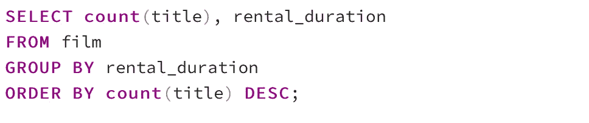
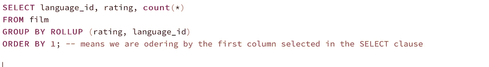
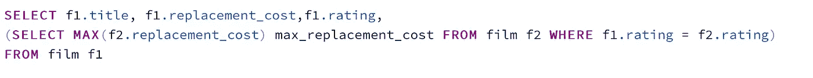
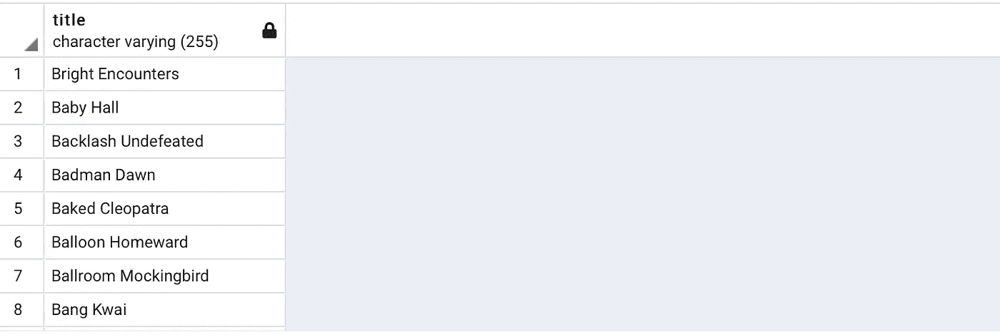

# 让我们用 SQL-PostgreSQL 做一些数据分析

> 原文：<https://medium.com/analytics-vidhya/lets-do-some-data-analysis-with-sql-postgresql-71a861e23619?source=collection_archive---------4----------------------->

在这篇文章中，我将通过使用下面的表编写一些有趣的 **SQL** 查询来教你如何进行数据分析，这些表是 DVD_Rental 数据库的一部分。

*演员* ( **演员 id** ，名，姓)

*电影* ( **film_id** ，片名，描述，上映年份，语言 _id，出租 _ 时长，出租 _ 费率，替换 _ 费用，评级)

*语言* ( **语言 _id** ，名称)

*类别* ( **类别 id** ，名称)

f*ILM _ category*(**film _ id，category_id** )

f*ILM _ actor*(**film _ id，actor_id** )

我使用 PostgreSQL - pgAdmin，打开查询工具开始编写 SQL 查询。

我准备了 35 个问题，涵盖了不同的主题，如分组依据、排序依据、有趣的运算符和函数、子查询、连接、子查询、聚合函数、多维数据集、汇总、先取、限制、存在、窗口函数(如 lead()、lag()、first_value()、rank()、percent_rank()、partition over()等)。我将向您介绍我是如何回答这些问题的，并提供查询输出的示例。对于一些问题，我会提供不止一个解决方案。我们开始吧。

1) **选择每个演员的名和姓。该查询将导致选择 2 列。**

2) **选择演员的全名。该查询应该产生 1 列。**

**注意事项**:

**||** 是一个**串联运算符**。

**full_name** 这里称为**别名**，这是我们喜欢的列命名方式。

我们可以在关键字**后面写一个**别名**作为**或者不写**作为**。

如果您喜欢使用带有空格的别名，请用**双引号**将它括起来

如“全名”。

选择名字以“D”开头的演员。

**解决方案 1** :像操作器一样使用**。**

**和“D%”一样，**是指以“ **D** ”开头的名字，后面是其他名字。

**和“d%”一样，**是指以“ **d** ”开头的名称，后面是其他名称。

**或**是一个逻辑运算符，它结合了两个条件，如果两个条件中至少有一个为真，则允许选择名称。

**解决方案 2** :使用 **ILIKE** 操作器

**ILIKE** 忽略大小写，因此它将检索名字以 **d 或 D.** 开头的演员

**4)选择所有按名字升序排序的演员信息。**

**ORDER BY** 默认情况下会对结果进行升序排序。

数出独特演员的名字

**DISTINCT** 将选择唯一的名字。

**Count** (column_name)是一个聚合函数，它将计算特定列的行数。在这种情况下，它只计算唯一的名字。

演员表有 **200 个演员**，其中只有 **128 个**是**唯一的**名。

让我们看看这些演员有多少个独特的全名。

结果是 **200 个**全名中的 **199 个唯一全名**。这意味着 **2 个演员** **共用**他们的全名。

根据影片的租借期限来计算影片的数量。电影表中的租借指的是 DVD 可以被租借多长时间。

203 部电影的租借期限为 4 天，212 部电影的租借期限为 6 天，等等。

以上，没有排序，让**根据**租赁 _ 持续时间**排序**。

默认情况下，排序是升序，让我们根据租赁持续时间将**排序为**，而将**排序为降序**。为了做到这一点，我们将添加关键字 **DESC** 。

让**按**计数(标题)**降序排列**，

**7)选择最大替换成本**

**Max** (column_name)是一个**集合函数**，它将为特定列选择最大值。

选择替换成本最高的电影名称。

在上面的查询中，选择的部分是 **WHERE 子句**中的**子查询**，它将选择 film 表中的最大 replacement_cost，我们之前发现它是 29.99。然后，我们将为那些替换成本等于最大替换成本(29.99)的电影选择标题和替换成本。

**9)为电影表中的电影选择唯一的不同分级。**

**解决方案 1** :使用**区别**。

**方案二**:使用**由**分组。

两个查询都将显示以下结果:

**10)选择每个等级下的电影数量。**

**11)将前 20 部电影的语言从英语改为意大利语。**

电影表中的所有电影原本都有一个 l**language_id = 1**，而 **English** 就是 language _ id 为 1 的语言。我会把一些电影改成意大利语的。我需要先从**语言**表中弄清楚**语言 _id** 和**意大利语**有什么关系。

我们在 film 表中有 1000 部电影，现在在前面的 update 语句之后，该语句将所有 film_id ≤ 20 的电影的 language_id 更新为等于 2(意大利语 id)。英语电影数量应为 980 部，意大利语电影数量应为 20 部。让我们在下一个问题中检查一下。

**12)选择按语言分组的电影数量**

这里的结果证实了我们在前一个问题中的陈述。

选择大部分电影所属的语言。

基于我们在前一个问题中看到的，Language_id ( **1)** 有 980 部电影，Language_id ( **2** )有 20 部电影，所以这里的结果应该是**英语语言**。

这里我们需要一个**子查询**，它将首先选择具有最高电影计数的 language_id，这将返回 **1** 。然后，我们选择语言名称，它的 language_id 与子查询检索到的 id 相等，应该是英语。

**13)选择电影标题、替换成本和分级，以及电影所属分级中电影的平均替换成本。**

在上面的查询中，我使用窗口函数 **OVER (PARTITION BY )** 来选择每个分级类别中电影的平均替换成本。因此，我将显示每部电影的标题、替换成本、评级以及该电影所属评级的平均替换成本。这很有用，这样您就可以将该电影的 replacement_cost 与该电影的相同分级类别中的其他电影进行比较。

我使用了 **AVG** (column_name)，这是一个计算平均值的**聚合函数**。我使用了 **ROUND()** 函数将结果四舍五入到**小数点后两位。**

我可以通过编写以下查询获得相同的结果，其中我通过 SELECT 子句中的子查询获得电影评级的平均 replacement_cost。

**14)选择意大利电影的收视率和平均替换成本。**

我在 **WHERE 子句**中使用了一个**子查询**来从语言表中获取意大利语言 id。我得到了所有的评级，并平均了意大利电影的每个评级的替换成本。

统计电影表中替换成本最高的电影。

200 部电影中有 53 部电影的重置成本为 29.99，这是最大的重置成本。

统计电影表格中每种语言的电影数量。(请注意，我们只有英语和意大利语的电影)。

解决方案 1:使用**内部连接。**

**JOIN** 将连接两个表中具有匹配 language_id 的行，然后选择指定的列。因为两个表都有 language_id，所以我对两个表都使用了 alias(f 代表电影表，l 代表语言表)来区分两者。

统计语言表中 6 种语言(英语、意大利语、法语、普通话、日语和德语)下的电影数量。

**解决方案 1** :使用**右连接**。

因此，上面的查询将自然地连接两个表中的行，其中来自 film 的 language_id 与来自 language 的 language _ id 匹配。下一步是检查**右侧**的表中是否有任何 language_id，即没有出现在连接结果中的**语言**，并将其添加到结果中。在这种情况下，语言表有 **3 种额外语言**。因此它们将被添加到结果中，并且**计数**将为 **0** 。

**方案二**:使用**左连接**。

因此，上面的查询将自然地连接两个表中的行，其中来自 film 的 language_id 与来自 language 的 language _ id 匹配。下一步是检查**左边**的表中是否有任何 language_id，也就是没有出现在连接结果中的**语言**，并将其添加到结果中。在这种情况下，语言表有 **3 种额外语言**。因此它们将被添加到结果中，并且**计数**将为 **0** 。

这两种解决方案都会产生以下结果:

**18)统计按语言 id 和分级分组的电影数量，并按语言 id 升序对结果进行排序。**

**19)选择 language_id，评级，并统计每个 language_id 下的电影数量，汇总 language_id 和评级，然后按语言 id 排序。**

在上面的查询中，我们按 language_id 和 rating 分组，选择 language_id 和 rating 以及每个组下的电影数。 **Rollup** ()然后给出额外信息，即每个 language_id 的总计数()，而不考虑评级。您可以在下面看到，language_id 1 的 movie_count 是 980，language_id 2 的 movie _ count 是 20。无论分级或 language_id 如何，电影总数(1000)也将被计算。

在下面的查询中，我在汇总后交换了列的顺序。查看以下输出有何不同。该汇总将忽略 language_id 并计算每个分级的总数，然后忽略两者并计算电影的总数，而不考虑它们的 language_id 和分级。

**20)选择 language_id，评分并统计每个 language_id 下的电影数量，然后对 language_id 和评分进行立方，并按语言 id 对结果进行排序。**

在上面的查询中，我们按 language_id 和 rating 分组，选择 language_id 和 rating 以及每个组下的电影数。 **Cube** ()要做 ROLLUP()做过的事情，然后添加额外的信息。因此，它将给出每个 language_id 的总计数()，而不考虑评级。您可以在下面看到，language_id 1 的 movie_count 是 980，language_id 2 的 movie _ count 是 20。除此之外， **Cube** ()将提供每个分级的电影总数()，而不考虑 language_id (178 部电影属于“G”，210 部电影属于“NC-17”，194 部电影属于“PG”，223 部电影属于“PG-13”，195 部电影属于“R”)。 **Cube** ()还将提供电影的总计数()，而不考虑 language_id 和等级，即电影表(1000)行中的行数。

**21)选择电影标题、租赁价格以及租赁价格打八折的新列。**

您可以使用 **ROUND** ()函数对结果进行舍入，使用 **TRUNC** ()函数去除小数部分，或者使用 **CEIL** ()函数返回大于等于结果的最小整数**值**。

选择标题、替换成本、等级以及该等级下的最大替换成本。

**解 1:** 得到一个评级类别下的最大重置成本。我们可以将 **MAX()** 与窗口函数**一起使用 OVER PARTITION。**

在第一个解决方案中，我按照评级进行了分区，并使用 **MAX()** 函数获得了最大值。

**解 2** :得到一个评级类别下的最大重置成本。我们可以在分区上使用 **first_value** ()和窗口函数**。**

在第二个解决方案中，我按照评级进行了划分，按照替换成本降序进行了排序，并选择了将成为最大值的第一个值。所以它会给出和第一个解一样的结果。

**解决方案 3:** 在**选择子句**中使用**子查询**。

所有三种解决方案都会产生以下结果:

结果样本

**23)为每部电影选择其标题、替换成本、分级以及同一分级中前一行电影的替换成本。**

正如你在上面看到的，因为我们没有第一部电影的“G”评级中的**前一部**电影，所以**延迟为零**。

24) **为每部电影选择其标题、替换成本、分级以及同一分级下一行中该电影的替换成本。**

正如你在上面看到的，因为在最后一部电影的“NC-17”评级中，我们没有在之后的**电影，所以**的领先优势是零**。**

**25)将胶片表格中的行分成 4 个桶或 4 个订单组。**

**NTILE** ()将添加一列，该列将有一个值代表每一行的组号。由于我要求 4 组 **NTILE** (4)，NTILE 列的值将从 1 到 4。

为了查看这 1000 部电影是如何在四组中分配的，我做了以下工作:

**26)为每部电影选择其标题、租赁费率以及由 language_id 划分的下两行的租赁费率。**

由于在查询中我们要求 2 个行的**领先，最后两个**行**有一个**空**滞后，因为在它们**之后没有可用的 2 行**。**

**27)为每部电影选择其标题、租赁费率以及由 language_id 划分的前两行的租赁费率。**

由于在查询中我们要求 2 行的领先，前两行**有一个 **null** 滞后，因为在它们的**之前没有 2 行可用。

**28)按评分显示排名，并按 rental_rate 排序结果。**

前 55 部电影的租赁费率为 4.99，因此所有 55 部电影将具有相同的等级，等于 **1** ，电影 56 具有不同的租赁费率 2.99，因此等级从 **56** 开始，以补偿所有共享相同等级 1 的前 55 部电影。

**29)按评级显示百分比排名，按替换成本排序结果。**

上面给出的是百分比等级而不是等级**。**

**30)使用 with 语句创建“temp_table”表，该表包含标题以“B”或“B”开头的所有电影。然后从“临时表”中选择所有信息。**

在本例中，您将看到带有语句的**，语句 **ILIKE** 将允许我们选择以 b 开头的标题，而不考虑其大小写(大写或小写)。**

选择除“PG-13”或“G”级之外的所有电影。

**解决方案 1** :使用**成员运算符(NOT IN)** 并列出您想要从结果中排除的评级。

**解决方案 2** :使用**隶属操作符(IN)** 并列出您想要包含在结果中的评级。

**解决方案 3** :使用**不等于(< >)运算符**，并列出您想要从结果中排除的评分。

**解决方案 4** :使用**等号(=)运算符**，并列出您想要包含在结果中的评分。

从 1 到 20 中选择 actor_id 为的演员。

**解决方案 1** :使用操作器之间的**。**

**解决方案 2** :使用**比较运算符** ≥ and ≤。

**33)选择超过 5 个字母的演员的名字。**

**长度**()会统计字符数。

**34)选择语言标识和语言名称，这些语言标识在电影表中包含电影。**

在上面的查询中，如果子查询(SELECT * FROM film f，其中 l.language_id = f.language_id)的结果意味着存在**将评估为 **true** 和 **language_id，将返回 name。****

**以下是该查询的另一种解决方案:**

****

**选择演员表中的前 5 行。**

**解决方案 1:使用极限。**

****

**解决方案 2:首先使用 FETCH。**

****

**两种解决方案都将获得 actor_id 从 1 到 5 的前五个 actor。**

**我希望你对这篇文章感兴趣，并且我能够以一种好的和清晰的方式展示这个主题。**