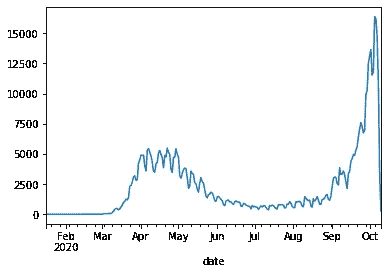

# 使用 Python 熊猫了解新冠肺炎数据集。

> 原文：<https://medium.com/analytics-vidhya/lets-get-to-know-you-understanding-your-data-set-using-python-pandas-8ad7f4e7b1e9?source=collection_archive---------26----------------------->

我从这个迷你项目中学到的最重要的事情是:

> 了解数据的结构。

我使用的是从 data.gov.uk 网站下载的 CSV 格式的 Covid19 UK 数据。此数据按日期与案例相关。

1.  **初期进口**

导入熊猫作为 pd #数据处理，CSV 文件(如 pd.read_csv)

将 numpy 作为 np #导入数学计算

% matplotlib inline #绘制线形图

**2。数据下载。**

我已经把这些数据下载到我的 Kaggle 账户里了。在这里，我从我的 Kaggle 帐户访问这些下载的数据。使用 head()命令，我只想看看这些数据是什么样子的。

**3。问:这个数据的大小是多少？**

该数据有 975 行和 2 列，即日期和案例。

**4。问:获取更多关于这些数据的信息？**

Info()命令显示日期有 975 个非空值，事例有 975 个非空值。没有空值。如果我们看数据类型的日期，它是一个对象。我们需要将其更改为日期数据类型。

**5。问:如何更改日期数据类型？**

我们使用 pd.to_datetime()将数据类型转换为 date。如您所见，info()已更新，显示了更新的数据类型。

**6。问:这个数据的开始和结束日期是什么？**

按日期对值排序后，很明显数据是从 2020 年 1 月 16 日到 2020 年 10 月 10 日。

**7。问:有重复的吗？**

所以有 269 个不同的日期。这意味着该数据集中有重复的日期。许多案例将有预期的重复值，所以我们不需要担心案例。

**8。问:重复日期的索引号是多少？**

对于每个重复的日期，我们都有一个值为 **True** 的布尔序列。这证实了索引位置重复日期。我们需要找到一种方法，将所有的复式记账日期合并为一个日期，并在一个日期将它们各自的案例相加。

9。问:哪些日期是重复的？

使用。loc[]命令，我们将查看索引 971 到 974，看看哪个日期是重复的。

10。问题: **一个特定的日期被重复了多少次？**

在这里，我们可以看到 2020–02–28 用不同的案例条目复制了 4 次。我们将不得不在一天之内把那些案例条目加起来。

11。问:我们如何在一个日期内将这些案例条目相加？

我们在日期上使用 groupby，在一个日期上使用 sum()将它们的案例条目相加。我们得到一个新的 groupby 对象。

12。 **问题:新的 groupby 对象看起来怎么样？**

groupby 返回新对象显示现在有 269 个唯一值。

13。问:如何绘制这些新准备好的数据？

我从这个项目中学到的是，从不同的角度阅读你的数据是很重要的。希望这些问题能帮助你理解和准备数据以获得更好的结果。