# 让我们看看人力资源数据集

> 原文：<https://medium.com/analytics-vidhya/lets-have-a-look-at-hr-data-set-2f5f42610e13?source=collection_archive---------22----------------------->

在这篇博文中，我将对 HR 数据集进行一些基本的探索性数据分析，这个数据集被世界各地的许多人使用。它提供以下信息:员工姓名、员工编号、州、邮政编码、出生日期、年龄、性别、婚姻描述、公民描述、西班牙裔/拉丁裔、种族描述、雇佣日期、终止日期、终止原因
雇佣状态、部门、职位、工资率、经理姓名、员工来源、绩效得分。

我将向您解释如何检查列中的变量以及任何数据集的每一行和每一列中的类别的基本代码。

**第一步:将数据导入 Jupyter 笔记本**

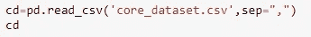

**步骤 2:检查行数和列数**

**第三步:检查数据集中的数据类型**

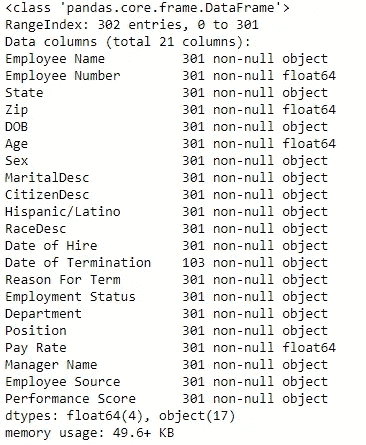

**步骤 4:检查每列的缺失值**

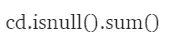

**步骤 5:检查特定列的统计数据**

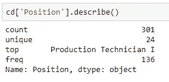

它给出了特定列中位置的最高计数以及频率

**步骤 6:检查特定数据栏中不同物种的计数数量**

我们使用“value_counts()”

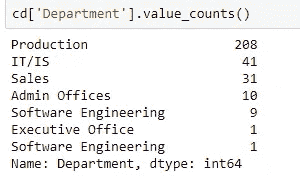

不同部门的总人数

**Step-7:如果我们想知道不同列组合的统计数据**

我们使用“groupby()”函数。我们可以计算中位数，平均值，标准差，合计等。

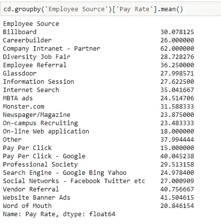

步骤 8:如果我们想从数据中删除任何无用的列

我们使用“drop()”函数

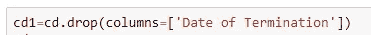

我们也可以添加多个名称。

现在让我们看看数据可视化:

1)导入库:

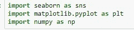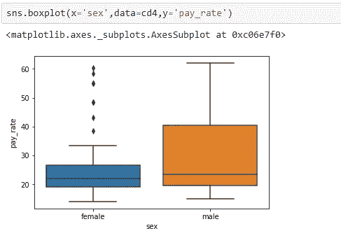

从方框图中我们可以看出，男性的工资率比女性高。我们可以看到异常值更多地出现在女性身上。

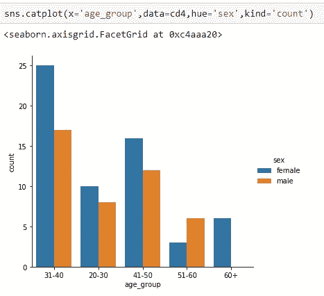

31-40 岁的年龄组更多地在公司工作，与男性相比，女性更多。由于妇女在工作部门高度发达，51-60 岁年龄组的女性较少。60 岁以上的人不再工作，这是一个有趣的事实。

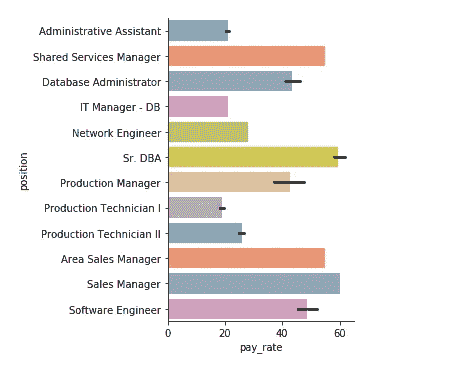

它显示了雇员的职位和工资率之间的关系

高级数据库管理员和下一级共享服务经理的工资较高，行政助理、IT 经理数据库、生产技术员-1 的工资较低。

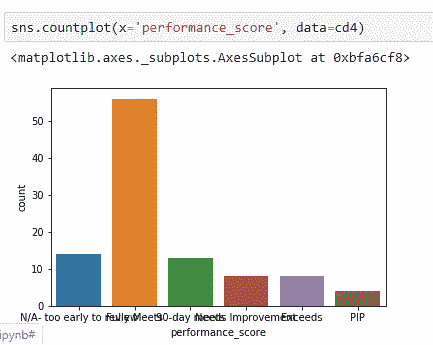

此图表显示在绩效评分中达到完全符合的最大员工数。

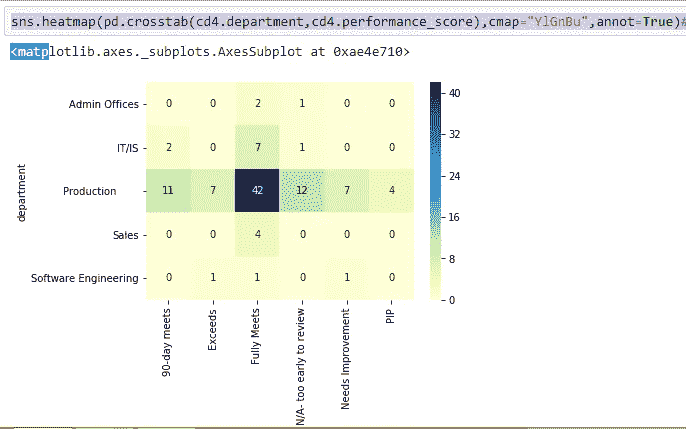

我们对分类数据使用热图。我们可以观察到生产部门的人员完全符合绩效分数。