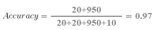
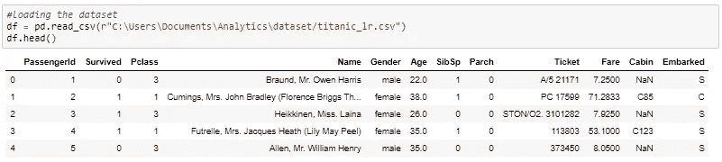
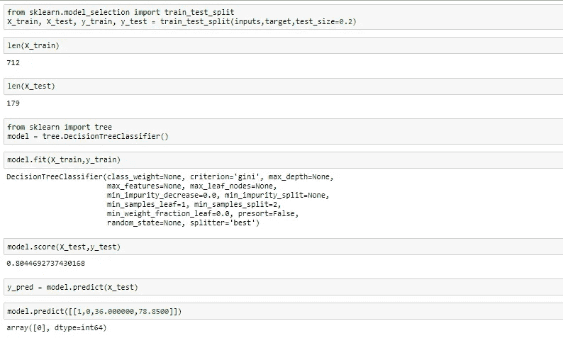

# 让我们把“混乱矩阵”变得不那么混乱吧！！

> 原文：<https://medium.com/analytics-vidhya/lets-make-the-confusion-matrix-less-confusing-43cb1a15cba4?source=collection_archive---------8----------------------->

> “怀疑是好的。困惑是极好的。提问很牛逼。所有这些都是扩展心灵智慧的尝试。”
> ― **马诺亚罗拉**

在一个分类问题中，指定性能评估通常是很重要的。当不同错误分类的成本相差很大时，这可能是有价值的。分类准确度也是显示分类器正确识别对象的程度的度量。

当涉及到可视化分类器的性能时，混淆矩阵也称为列联表或误差矩阵。矩阵的列表示预测类的实例，行表示实际类的实例。(注意:也可以反过来。)

> ***混淆矩阵显示了你的分类模型在做预测时混淆的方式。***

# 混乱矩阵

[混淆矩阵](/analytics-vidhya/hypothesis-testing-a-way-to-accept-or-reject-your-hypothesis-using-p-value-d550b127fd1e)由预测值和实际值组成

在这个混淆矩阵中，绿色背景是“正确的”单元格:

1.  **真阴性(TN):** 分类器预测的值是假的，实际上是假的。
2.  **真阳性(TP)** :分类器预测的值为真，即实际为真。

红色背景是“错误”单元格:

1.  **假阴性(FN)** :分类器预测的值是假的，实际上是真的。这也被称为第二类错误。
2.  **假阳性(FP)** :分类器预测的值为真，实际为假。这也称为 I 型误差。

# 混淆矩阵的需要是什么？

让我们考虑一个新冠肺炎病毒的例子，假设你想预测有多少人在出现症状之前感染了病毒，并把他们从健康人群中隔离出来。我们的目标变量的两个值将是 COVID 正值和非 COVID 正值。

你可能会想，当我们有准确性来检查我们的结果时，为什么我们还需要一个混淆矩阵。让我们先检查一下我们的准确性！！

负类有 1000 个数据点，正类有 30 个数据点。这是我们计算精确度的方法:

总的结果值是:

TP = 20，TN = 950，FP = 20，FN = 10

所以，我们的模型的准确性是:

这里我们的准确率是 97%，还不错！但是它给出了错误的结果。

我们的模型说“它可以在 97%的时间里预测 COVID 阳性的人”。然而，它正在做相反的事情。它能以 97%的准确率预测出 COVID 阳性的人，而 COVID 阳性的人却在传播病毒！

你认为这是衡量我们结果的正确方法吗？？？难道我们不应该衡量我们可以正确预测多少阳性病例来阻止传染性 COVID 的传播吗？或者，在正确预测的案例中，有多少是阳性案例来检查我们模型的可靠性？

这就是我们遇到**精确度和召回的双重概念的地方。**

# 精确度与召回率

## 精确

> Precision 告诉我们被我们诊断为携带病毒的患者中**实际上**携带病毒的比例。

**精度计算方式:**

## **召回**

> 回忆告诉我们实际感染病毒的患者中有多少比例被我们预测为感染了病毒。它应该尽可能高。

**召回的计算方法:**

> **注意:回忆告诉你能找到多少+ve。**
> 
> **Precision 告诉你在你预测的+ve 中有多少垃圾。**

# **F1 得分**

实际上，当我们试图提高模型的精确度时，召回率会下降，反之亦然。F1 分数在一个值中捕捉了这两种趋势。

**F1 得分= 2*(精度*召回率/精度+召回率)**

> 这是对测试准确性的一种衡量。它同时考虑了测试的精确度和召回率，使用调和平均值来计算分数。

# **更多公式**

1.  **真阳性率(灵敏度)**

TPR =TP/(TP+FN)

**2。假阳性率(特异性)**

FPR = TN/(TN+FP)

# 混淆矩阵使用 scikit-在 Python 中学习

我用过最有用的 python 库 scikit——学习解释混淆矩阵。

该数据集可在 Kaggle 上获得，即泰坦尼克号数据集。

# 评估算法

真阳性是 97

真阴性是 47

假阳性是 12

假阴性是 23

## 现在可以使用性能指标评估模型

## 获得 F 分数

# 参考链接

1.  You-tube link: [机器学习基础混淆矩阵](https://www.youtube.com/watch?v=Kdsp6soqA7o&t=2s) by [statquest](https://www.youtube.com/results?search_query=%23statquest) 。
2.  [https://machine learning mastery . com/confusion-matrix-machine-learning/](https://machinelearningmastery.com/confusion-matrix-machine-learning/)
3.  书:[https://www . oreilly . com/library/view/machine-learning-quick/9781788830577/35 D1 aa 26-9a 98-4fd 0-ada 0-af 922 e 84579d . XHTML](https://www.oreilly.com/library/view/machine-learning-quick/9781788830577/35d1aa26-9a98-4fd0-ada0-af922e84579d.xhtml)

我希望你一定清楚困惑矩阵，非常感谢你的阅读。