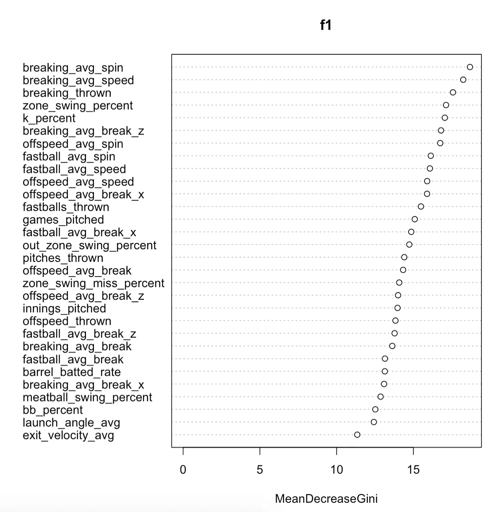

# 我们来做模特吧！利用随机森林预测 UCL 重建

> 原文：<https://medium.com/analytics-vidhya/lets-model-using-random-forest-to-predict-ucl-reconstruction-6185ebdc853e?source=collection_archive---------25----------------------->

[来源](https://i.pinimg.com/originals/24/4a/70/244a70a7916bf9b411deb294af95076c.jpg)

# **概述**

对于我的下一个分析，我将试图确定与尺骨侧副神经重建(又名 UCL 或汤米·约翰)密切相关的潜在因素，然后组装一个模型，使用这些因素来预测手术候选人。

这项分析的目的是对职业改变伤害背后的原因提供额外的研究，允许棒球界采取预防措施，帮助球员减少他们尺骨侧副神经严重受伤的机会。

为了实现这个目标，我将利用被称为*随机森林算法*的最先进的建模技术。虽然我将在本文的后面提供关于该模型如何工作的深入解释，但 random forest 是少数几个通过简单易懂的计算创建惊人准确预测的建模框架之一。

像大多数数据科学项目一样，我花了大部分时间收集、处理和创建数据特征，以提高预测能力。我将从解释从各种来源收集的原始数据开始这一分析。

# **数据**

为了获得这一分析的数据，我使用了两个来源:1)棒球专家的数据库和 2)接受 UCL 重建的球员名单，可以在这里找到。

链接的 UCL 文档包含了大量关于接受手术的个人的信息。文档的创建者有一个 Twitter 句柄，@MLBPlayerAnalys，如果你对棒球研究感兴趣，我建议你关注一下！

棒球专家数据集包含各种不同的指标，从标准的*局次投球*到更高级的指标，如突破投球的*水平突破*。如果您对本分析中使用的所有变量感兴趣，可以在[这里](https://docs.google.com/spreadsheets/d/1qR0sOntDc0FKfaLCuM_2vsW4gLHyyrTd8NnsGSj9iXI/edit?usp=sharing)找到 csv 的链接。我的目标是在下载莎凡特的数据时广撒网，希望找出可能导致 UCL 重建的意想不到的潜在因素。

另一个关键的注意事项是 savant 数据包含了从 2015 年开始的所有投球手，这些投球手投出了至少 100 个击球手。显然，这个玩家列表将包含有和没有 UCL 重建的个人，强调了利用 tj 数据集的重要性。

下面是未清理的原始数据集的示例。

TJ 数据—显示 11/42 个变量

棒球专家数据—显示了 11/34 个变量

# **处理**

为了处理数据，我开始从*汤米约翰框架*中移除所有不必要的变量(我将此称为 tj)，留下以下四个变量:球员、位置、级别和年份。

从这里开始，我需要执行多种子集化技术，以满足以下参数:

1.  2015 年以后的选手。由于 Statcast 数据只能追溯到 2015 年，因此需要匹配这些年份。因此，我需要删除 tj 数据中 2015 年之前的所有实例。
2.  仅限投手。因为 tj 数据包含了所有做过手术的球员的信息，所以数据只需要过滤给投手。
3.  MLB 水平。tj 数据包含 MLB 和 MILB 的数据，因此只需要过滤 MLB 的数据。

最后，我需要添加一个功能，说明如果球员汤米约翰手术。因为 tj 数据中的每个球员都做过手术，所以添加这个特征相对简单。我把这个变量命名为“tj_history”，给所有接受过手术的玩家取值 1(所以整个数据集都得到了 1)。完全清理和更新的 tj 数据帧可在下面找到。

更新的 tj 数据—显示所有变量

现在 tj 数据已经清理完毕，可以与 baseball savant 数据合并了，这个过程非常类似于用 SQL 查询执行的 join。数据连接后，我完成了以下步骤:

1.  完成了“tj_history”功能，给所有没有进行 UCL 重建的玩家一个 0(所以如果玩家名字*没有在 tj 集合中列出*，但是*在 savant 集合中列出*，他们没有 tj，给他们一个 0)
2.  将每个 NA 替换为各自列的平均值
3.  改变变量名以帮助解释

这些步骤结束了我的分析的数据处理部分。完全清理的数据框如下。

合并数据框-显示 10/35 个变量

# **探索**

为了更好地理解新形成的数据框架，我用 ggplot2 整理了一些简单的条形图。这些图表的目的是让我们了解数据中的一些关键特征，让我们在建模之前做出推断。请记住，1 表示自 2015 年以来患有汤米-约翰的个人，而 0 表示他们没有做过手术。

因此，正如你所看到的，数据集包含了近 2200 名没有接受手术的球员，以及不到 400 名接受了手术的球员。

上面的图表显示，自 2015 年以来，手术几乎没有偏差。2018 年是 UCL 受伤最严重的一年，尽管幅度很小。

这张图表显示了平均快速球速度和 UCL 外科手术之间的差异。如上图所示，UCL 手术的最高数量发生在 indivudal 在 90 度左右的时候

有趣的是，平均快速球超过 100 英里/小时的 5 个人中有 2 个人撕裂了他们的 UCL。虽然这是一个小样本，但如果能看到更多数据的结果会很有趣。

# 兰登森林解释道

现在我们已经研究了数据，我们可以继续建模了。为了让你明白我们使用的是什么类型的模型，我将给出一个随机森林的简要概述。

随机森林算法是一种机器学习技术，可用于回归和分类问题。在我们的例子中，我们利用算法进行*分类。*

分类仅仅是确定一个观察值属于哪一组，或者在这个分析中，一个投手会有 UCL 重建吗？换句话说，与需要回归的定量预测或预测问题相比，我们回答的是“是”或“否”的问题。

随机森林与传统的决策树有许多相似之处。决策树很容易理解，人们可以通过下图很好地理解决策树的迭代。

简单决策树— [来源](https://mail.google.com/mail/?tab=im&authuser=0)

随机森林和决策树的主要区别在于随机森林使用许多不同的决策树。所以，把随机森林算法想象成一堆决策树一起工作来得到最终的解决方案。

不需要太多的技术，由于随机性和不相关的树，随机森林非常有效。这减少了误差并产生了准确的结论。

如果你想了解更多关于随机森林算法的知识，这里有一篇[写的很棒的文章](https://towardsdatascience.com/understanding-random-forest-58381e0602d2)。

# 可变重要性

在 R 中使用随机森林非常高效和简单。虽然可以使用多种选项来运行随机森林，但我更喜欢“random forest”包。

为了衡量模型的准确性，我将数据分为训练集和测试集。虽然 random forest 已经通过树分割进行了随机抽样，但我总是确保分割数据是一种良好的做法。

既然数据已经被分割，我需要确定树的最佳数量，或者在树的每个节点上可以分割的变量的数量。为了实现这一点，我使用了交叉验证，这一点我不会在本文中讨论。运行交叉验证的结果如下。

交互效度分析

正如您所看到的，交叉验证确定了最佳的 mtry = 5，或者每个节点拆分五个变量

正如在我的分析的概述部分提到的，随机森林的一个关键特性是它能够识别自己的可变重要性。该算法在遍历每个变量时计算这个变量，可以通过“randomForest”包中的“varImpPlot”函数找到它。模型的变量重要性标识如下。

随机森林的可变重要性

所以如上图，与 UCL 重建关联度最高的变量是 *breaking_avg_spin* 。换句话说，在突破球上有高旋转率的投手有最高的风险得到 UCL 重建。

另一个有趣的发现是 *zone_swing_percent* 与手术的高度相关性。有人可能会认为，由于经常暴力的手臂动作，与指挥斗争的投手会有更大的伤害他们的 UCL 的风险。然而，这个模型陈述了相反的情况，通过 *zone_swing_percent* 变量的重要性可以看出。

# **模型精度**

在训练集上运行该模型后，下一步是确定总体准确性。虽然对于随机森林可以使用多种精度度量，但我将使用 AUC，即曲线下面积。

AUC 本质上决定了一个模型在确定 1 和 0 方面的成功程度，考虑到该模型的主要目标是预测 1 和 0(TJ 与否)，这是一个完美的拟合。

为了计算这个精度指标，我需要使用来自原始数据分割的*测试集*。接下来，我利用 R 的“预测”功能，计算 ROCR，并计算 AUC。如果你想知道更多关于这个过程，我很乐意去更深入！

模型的 AUC 如下:

所以，你可能想知道，什么是好的 AUC？AUC 区间如下所示。

[来源](https://www.researchgate.net/figure/An-example-of-ROC-curves-with-good-AUC-09-and-satisfactory-AUC-065-parameters_fig2_276079439)

正如你所看到的，这个模型在预测 TJ 手术方面测试“良好”,考虑到有限的数据和整体观察，这是非常酷的。

# 结论

完成这个分析后，我想强调几个可以提高整体模型准确性的关键特性。

1.  *更多数据*。虽然我有足够的观察来创建一个成功的模型，但添加更多的数据将有助于整体准确性。Statcast 数据只能追溯到 2015 年，最终限制了整体观察。当棒球开始时(希望很快！！)我将能够增加数据，提高准确性。
2.  *投手历史*。由于公众可获得的数据有限，这是一个挑战。然而，拥有每个人的投球历史，例如在 HS 和/或大学水平的投球局数，将显著提高准确性。
3.  *身体特征*。将运动员的身高、体重和手臂位置等变量添加到模型中会很有趣。虽然我不确定每个变量对 UCL 重建风险的影响程度，但看看随机森林计算出的变量重要性会很有趣。

…分析到此结束！我希望你学到了一些东西，并有一些自己的外卖。如果你想看我的代码，我把它贴在了 github 上，你可以在这里找到。

想法？

-jms