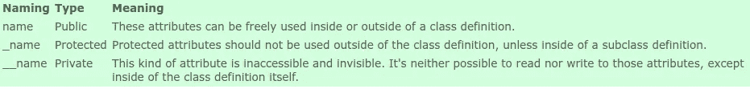

# 让我们用 Python 来哎呀！！

> 原文：<https://medium.com/analytics-vidhya/lets-oops-in-python-e5ae53e14b5?source=collection_archive---------0----------------------->

当我们开始学习 python 时，我们不会从学习 OOPs 开始，尽管 Python 在我们编写的每一条语句中都遵循面向对象的编程范式。这就是激发我写这篇文章的原因，关于 Python 如何绑定我们在 OOPs 范式中所做的一切，而我们甚至没有意识到。

但是在我们开始之前，我们需要复习一下什么是糟糕。

在本文中，我们将主要关注 OOPs 的四个支柱以及 python 如何利用它们:

*   包装
*   抽象
*   遗产
*   多态性

***但是我们不是要讨论类和对象吗？***

哦，对了，我们怎么能忽略基础呢？

**类和对象**

假设你有一辆汽车的基本模型，这个模型可以根据你选择的输入进行修改，同样的基本模型可以用来制造各种不同的汽车。法拉利和 Maruti 800(印度家用车)的基本结构相同，但在名称、颜色、最高速度、成本等方面有所不同。

这就是类和对象之间的关系。类是蓝图，对象是类的实例。让我们用一段代码来理解这一点。

```
class Car():
    def __init__(self,name,color, base_price):
        self.name = name
        self.color = color
        self.base_price = base_price

    def cost(self):
        return self.base_price + 20000

ferrari = Car('Ferrari','red',20000000)
maruti = Car('maruti-800','white',200000)
```

上面的代码片段使用 Car 类创建了两个对象，即 ferrari 和 maruti。关键字 **self** 创建了一个类的实例，通过它我们可以访问它的属性(name、color 和 base_price)和方法(cost)。现在，您可以轻松地访问如下属性

```
ferrari.name returns Ferrari
maruti.name returns maruti-800
```

这就是 OOPs 的强大之处，我们编写了一段代码(类),并根据输入内容按照我们的要求重用代码。

__init__ 方法类似于一个构造函数，在创建该类的对象时初始化。

# 包装

让我们讨论第一个支柱。封装是 OOPs 中最容易理解的概念。

> 封装是将数据和对该数据进行操作的相关方法包装到一个单元中，以便限制对某些组件的直接访问。

因此，在上面的代码示例中，我们看到了类 Car，该类包装了一些属性(名称、颜色和 base_price)以及一个对这些属性进行操作的方法。

# 抽象

你见过你奶奶的收音机吗，你只需按一个键，歌曲就会改变，而你甚至不知道收音机系统的内部细节。这正是抽象的含义

> 数据抽象=数据封装+数据隐藏

python 中的数据隐藏可以通过使用 public、protected 和 private 属性和方法来实现。



Python 中的属性类型

```
class Abstraction():def __init__(self):
        self.pub = "i am public atrribute and can be accessed from anywhere"
        self._prot = "i am a protected attribute and can be accessed by my subclass and not from outside the class"
        self.__priv = "i am a private attribute and i am invisible and inaccessible">>>x= Abstraction()
>>>x.pub
"i am public atrribute and can be accessed from anywhere"
>>>x._prot
"i am public atrribute and can be accessed from anywhere"
>>>x.__priv
Traceback (most recent call last):
      File "<stdin>", line 1, in <module>
      AttributeError: 'X' object has no attribute '__priv' 
```

现在让我们逐一讨论这些属性:

**Public:** 这些属性可以自由使用，随处可得。

**Protected:** 它们以一个' _ '为前缀，只有当我们创建这个类的子类时才应该使用它们。

**Private:** 它们以双下划线“__”为前缀，不能在类外访问。上面的错误跟踪非常有趣。上面写着 **'AttributeError: 'X' object 没有属性' __priv ' '，**但是我们知道这是一个谎言，这就是 python 处理私有属性的方式。

**有办法访问这些私有属性吗？**

嗯，**‘有志者事竟成’**。

你可以这样访问它们:
>>>x . _ Abstraction _ _ priv
但是你要不惜一切代价避免这种做法。

# **继承**

> **继承**是一个类获取另一个类的属性的机制。例如，一个孩子继承了他/她父母的特征。通过**继承**，我们可以重用现有类的字段和方法。因此，**继承**促进了可重用性，并且是 OOPs 的一个重要概念。

让我们看一段代码来解释这一点:

```
class Person:
    def __init__(self, first, last):
        self.firstname = first
        self.lastname = last def Name(self):
        return self.firstname + “ “ + self.lastnameclass Employee(Person):
    def __init__(self, first, last, staffnum):
        Person.__init__(self,first, last)
        self.staffnumber = staffnum def GetEmployee(self):
        return self.Name() + “, “ + self.staffnumberx = Person(“Marge”, “Simpson”)
y = Employee(“Homer”, “Simpson”, “1007”)>>>print(x.Name())
"Marge Simpson">>>print(y.GetEmployee())
"Homer Simpson, 1007"
```

这里，Employee(子类)类通过将父类(Person)作为参数传递给子类 Employee(Person)来继承 Person(父类/超类/基类)类的方法和属性。然后我们在 Employee 类的 __init__ 方法内部初始化 Person 类的 __init__ 方法。这些使得代码重用变得容易。

Python 还通过将不同的类作为参数传递来支持多重继承，这有时可能会导致'**菱形问题'，**

[](https://www.python-course.eu/python3_multiple_inheritance.php) [## Python 教程:多重继承

### Python 中的面向对象编程:涵盖多重继承、钻石问题、MRO 和多态

www.python-course.eu](https://www.python-course.eu/python3_multiple_inheritance.php) 

# 多态性

最后，我们已经达到了我们的最后和第四个支柱多态性。

在计算机编程中，多态性指的是使用具有相同名称但不同签名(参数类型、参数顺序和参数数量)的方法的艺术。)

Python 是隐式多态的，也就是说，我们可以对列表、字符串和数字使用相同的方法名。

```
class addition():
     def __init__(self,first,last):
         self.first = first
         self.last = last

     def add(self):
         return self.first + self.last>>>x= addition([1,2,4],[5,6,7])
>>>x.add()
[1,2,3,4,5,6]
>>>y= addition(“King”,”Kong”)
>>>y.add()
“King Kong”
>>>z= addition(1,2)
>>>z.add()
3
```

因此，这里我们使用相同的方法来处理列表、字符串和数字。

代码来源:[https://www . python-course . eu](https://www.python-course.eu/)