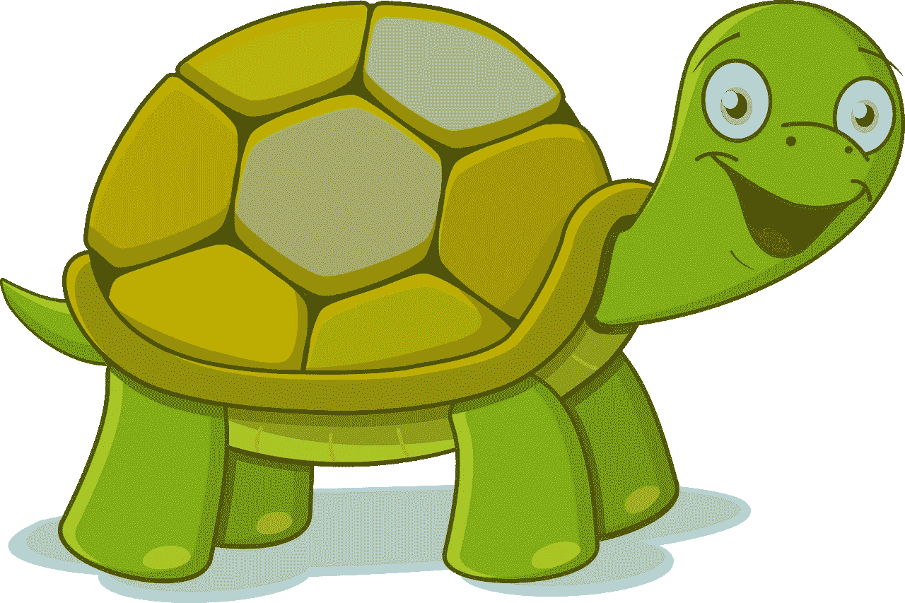
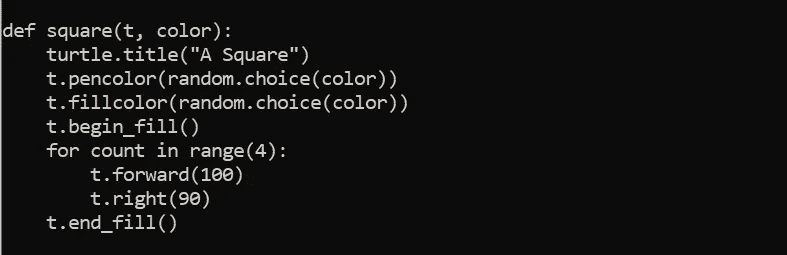
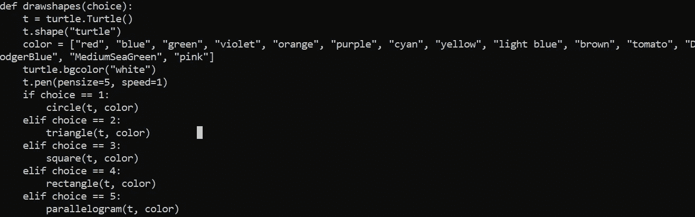
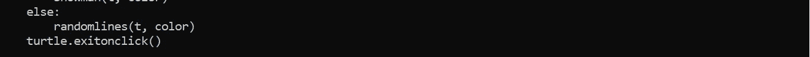
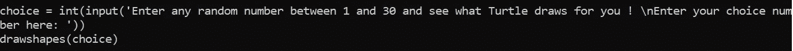

# 让我们和乌龟一起玩游戏

> 原文：<https://medium.com/analytics-vidhya/lets-play-a-game-with-turtle-6d033a31c42a?source=collection_archive---------19----------------------->

你是否厌倦了繁重的办公室工作，在那里编码不再有趣？

只工作不玩耍让你变得迟钝了吗？

不如我们试着用代码重新点燃我们的友谊？为什么孩子们应该拥有所有的乐趣:D

让我们通过用 Python 开发一个简单的游戏来玩玩 Turtle 吧。

这个游戏怎么样👇🏽

游戏的演示视频

有一天，我蹒跚学步的侄女正在学习形状，我有了这个游戏的想法，你猜 1 到 30 之间的任何一个数字，这个游戏就会随机出现一个形状。

我和我的侄女一起尝试过，尽管这是一个基于命令行的游戏，还没有用户界面，但当乌龟为她画出形状时，她仍然很喜欢，我是一个快乐的阿姨:)

**先决条件**—Python 基础知识

我将我的游戏开发分为两个阶段

# **第一阶段**

开发将绘制形状的 python 模块。

1.  进口甲鱼
2.  为要绘制的形状定义模块

代码解释-

a.我将“t”和“color”作为参数进行传递，我将在第二阶段对此进行解释。

b.我们定义屏幕的标题。在这里，它是一个“正方形”

c.我们接下来定义钢笔颜色。你可以硬编码你选择的颜色。在这里，我声明了一个名为 color 的数组，其中保存了我最喜欢的颜色，并且我从这个颜色数组中随机选取了钢笔颜色。

d.接下来，我们指定填充正方形的颜色。

e.begin_fill 和 end_fill 标记需要填充颜色的区域。

f.我让乌龟向前移动 100 度，然后右转 90 度。因为我们在这里做一个正方形，我重复这个步骤的次数是 4。每次迭代占正方形的一边。

3.您可以对其他形状重复同样的操作。样品形状请参考[我的代码](https://github.com/sinha8190/turtleonthego/blob/master/shapes.py)

# 第二阶段

现在是时候调用我们准备好的各种形状模块了。

1.  定义主函数。该功能包含-

a.Turtle 对象(t) —这作为参数传递给被调用的形状绘制模块。

b.形状(方形/箭头形/圆形/乌龟形/三角形/经典型)

c.颜色——对于颜色，我创建了一组我喜欢的颜色。这作为参数传递给被调用的形状绘制模块。

d.屏幕的背景颜色

e.笔的大小和绘图的速度。速度范围从 0 到 10。

f.基于用户输入的选择调用形状绘制模块。

g.作为 else 循环，我在屏幕上放了一个随机涂鸦的模块。这样，如果用户输入任何超出输入指定范围的数字，用户都不会出错。取而代之的是，乌龟会说‘它不知道该画什么’，还会在屏幕上乱涂一些线。

f.默认情况下，一旦 turtle 完成绘图，屏幕就会关闭。为了防止这种情况，我们使用 turtle.exitonclick()。这样，只有当用户触摸屏幕时，屏幕才会消失。

页（page 的缩写）s-Turtle 的库提供了预置的图形，如圆形和圆点，可以用单行代码绘制。

例如 turtle.circle(50)，turtle.dot(20)

2.为命令行创建输入

在你的脚本末尾添加以下内容—

这里，选择变量是用户输入的输入数字。当调用 drawshapes 函数时，我已将此作为参数传递。根据输入的选择，将调用相应的形状模块。

这里有完整的代码👇🏽

 [## sinha8190/turtleonthego

### 这个库是关于在 python - sinha8190/turtleonthego 中使用 turtle 创建有趣的形状的

github.com](https://github.com/sinha8190/turtleonthego/blob/master/shapes.py) 

这是一个非常基础的 python 游戏。我会逐渐增加形状，让它变得更有趣。

你可以玩更多的形状/图案和颜色。你甚至可以用 turtle 创建基本的动画。玩得开心！

如果你有兴趣了解更多关于 Turtle 的信息，请看下面的**参考资料**:

 [## 用乌龟画简单的图 Python 编程入门

### “Turtle”是一个类似画板的 python 特性，可以让你命令一只乌龟在上面画画！你可以用…

opentechschool.github.io](https://opentechschool.github.io/python-beginners/en/simple_drawing.html#:~:text=%E2%80%9CTurtle%E2%80%9D%20is%20a%20python%20feature,can%20move%20the%20turtle%20around.)  [## Python 海龟入门指南-真正的 Python

### 在这个循序渐进的教程中，您将在一个简单的交互式工具的帮助下学习 Python 编程的基础…

realpython.com](https://realpython.com/beginners-guide-python-turtle/)  [## Python Turtle 编程教程

### Turtle()创建一个 turtle 对象。forward(distance)这个方法将乌龟向前移动指定的距离…

www.tutorialsandyou.com](https://www.tutorialsandyou.com/python/turtle-programming-tutorial-in-python-5.html)