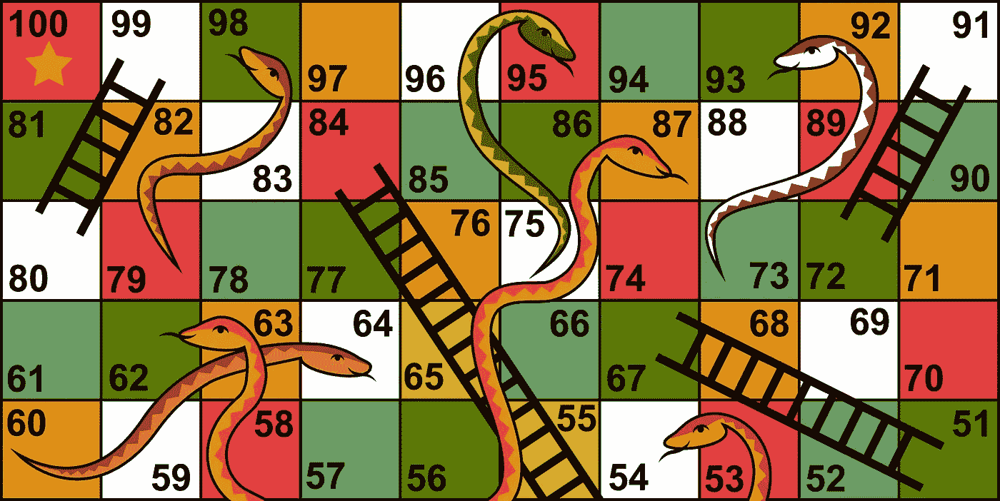

# 🐍蛇和梯子

> 原文：<https://medium.com/analytics-vidhya/lets-play-snake-and-ladders-620cb7f217bc?source=collection_archive---------18----------------------->



大家好，今天我们要解决一个著名的**编程面试问题**，这个问题在很多公司都被问到过，比如巨头**亚马逊，微软，D . E . Shaw**等等。

《蛇梯》是一个大问题，我强烈建议你在继续阅读之前先看一遍。

[](https://www.geeksforgeeks.org/snake-ladder-problem-2/) [## 蛇和梯子问题- GeeksforGeeks

### 给定一条蛇和一个梯子板，找出到达目的地或最后一个格子所需的掷骰子的最少次数…

www.geeksforgeeks.orgr](https://www.geeksforgeeks.org/snake-ladder-problem-2/) 

在这个问题中给你一个**棋盘**的中的 **N 个格子，每个格子代表三种类型的东西{ **空**、**梯**、**蛇** }。你是玩家，你最初站在 1 号单元格，现在你必须玩游戏，以最少的掷骰子数到达最后一个单元格。**

**例如**我们的电路板看起来像这样

```
 [-1,-1,-1,-1,-1,-1] **END**
      [-1,-1,-1,-1,-1,-1]
      [-1,-1,-1,-1,-1,-1]
      [-1,35,-1,-1,13,-1]
      [-1,-1,-1,-1,-1,-1]
**START** [-1,15,-1,-1,-1,-1]
```

在 board -1 中，这里意味着您可以安全地进入该单元格，但是如果单元格的值不是-1，则意味着将会有**蛇**或**梯子。**如果某个单元格的值越来越接近终点，这意味着它是一个梯子，否则它就是一条蛇。

在这种情况下，掷骰子的最少次数是 4 次。

但是怎么做呢？🙄

所以答案是，最初你在底部的单元 1，现在你掷一个正面为 1 的骰子，你在上面找到了一个梯子，然后你掷正面为 2 的骰子，到达 17 号方块，蛇咬了你，然后你下到 13 号方块，然后你掷正面为 1 的骰子，通过梯子到达 35 号方块，之后你只需要再掷一个正面为 1 的骰子，然后你到达目的地。

**如果板子的大小是 1000 或更大，人类很容易得到最小化的答案吗？**

不😶

这是进入画面的程序。我们可以编制程序，这样我们的计算机就可以很容易地计算它。

让我们写代码吧

```
vector<int> board(size+1);     //replace size with the size of board
vector<bool> vis(size+1,false);  //keep track of each cell
```

用-1 值初始化电路板，其中-1 代表没有阶梯或蛇形线的单元。

```
for(int i=1;i<=board.size();i++)
board[i]=-1;
```

现在，从梯子的用户那里获取输入，并将它们存储到板上。假设用户以下面的形式{a，b}给你输入，这意味着在单元格 a 中存储值 b。

```
cin>>a>>b;
board[a]=b;
```

类似地，也接受蛇的输入。

**主代码现在开始**

创建一个成对队列来存储单元信息，每个信息将包括到目前为止最后遍历的具有最小投掷的单元号。

```
queue<array<int,2>> q;
q.push({1,0});
vis[1]=true;
```

我们已经用初始位置 1 初始化队列，最小投掷骰子数为 0，并使**相对于**为真。

```
 while(!q.empty())
        {
            array<int,2> top=q.front();
            q.pop();

            int ind=top[0];

            if(ind>=size)
            {
                cout<<top[1]<<endl;
                break;
            }
         }
```

因此，到目前为止，我们已经用初始位置初始化队列，并在队列不为空或找到最后一个单元时遍历队列。

```
 for(int i=ind+1; i<size+1 && i<=(ind+6);i++)
            {
                if(vis[i]==false)
                {
                    array<int,2> temp;
                    temp[1]=top[1]+1;
                    vis[i]=true;

                    if(board[i]!=0)
                    {
                        temp[0]=board[i];
                    }
                    else
                    temp[0]=i;

                    q.push(temp);
                }
            }
```

现在我们已经用条件**I<size+1&&I ≤( ind+6)**初始化了一个 for 循环，因为从一个特定的位置可以前进到 6 个单元格，所以我们尝试了所有的可能性，并使掷骰子的次数比先前掷骰子的次数增加 1，即**(新掷骰子的次数=先前掷骰子的次数+1)** ，并检查在掷骰子之后我们是否在一个特定的位置，如果该位置的值为-1，那么我们将 top[0]作为 I，否则我们将 top[0]作为棋盘

**所有代码一起**

```
 vector<int> board(size+1,-1);
        vector<bool> vis(size+1,false); for(int i=0;i<size;i++)
        {
            int a,b;
            cin>>a>>b;
            board[a]=b;
        }

        queue<array<int,2>> q;
        q.push({1,0});
        vis[1]=true;

        while(!q.empty())
        {
            array<int,2> top=q.front();
            q.pop();

            int ind=top[0];

            if(ind>=size)
            {
                cout<<top[1]<<endl;
                break;
            }

            for(int i=ind+1; i<size+1&& i<=(ind+6);i++)
            {
                if(vis[i]==false)
                {
                    array<int,2> temp;
                    temp[1]=top[1]+1;
                    vis[i]=true;

                    if(board[i]!=0)
                    {
                        temp[0]=board[i];
                    }
                    else
                    temp[0]=i;

                    q.push(temp);
                }
            }
        }
```

# 暂时就这样吧！

希望这篇文章对想学习编程的人或者想提升技能的人有所帮助。