# 让我们在 PowerBI 中处理数据

> 原文：<https://medium.com/analytics-vidhya/lets-play-with-data-in-powerbi-cbcb0cac0f1a?source=collection_archive---------10----------------------->

众所周知，Power BI 是微软的一项商业分析服务，它有助于提供交互式可视化和商业智能功能，其界面简单到足以让最终用户创建自己的报告和仪表板，因此我为初学者准备了这篇博客，以帮助他们理解 Power BI 的基本概念。这个博客将让你对 Power BI 有足够的了解，从这里你可以把自己带到更高的专业水平。我将尝试创建关于天空运输数据的多种交互式可视化报告。在介绍如何使用 PowerBI 之前，让我们首先了解我们将尝试进行分析的业务目标，因为我们都知道，在业务分析中，了解关键目标要重要得多。无论我们处理数据分析还是业务分析，首先发现主要业务目标并理解它是通过本报告进一步实现目标的第一步，我将尝试设计具有基本可视化集的仪表板，其中我的数据来源是 sky transport 数据集(您可以从这里下载数据集—[https://github . com/himan Shi 798/power bi/blob/main/Sky % 20 Transport % 20 corp . xlsx](https://github.com/himanshi798/POwerBi/blob/main/Sky%20Transport%20Corp.xlsx))以开发仪表板来显示 Sky Transport 可视化的顶级简要概述，这将包括以下要点:

总里程、收入、成本的关键绩效指标

按运输州列出的收入与里程

航运城市的收入与里程

总行程与按行程类型划分的行程

按运输州列出的旅行百分比

收入里程与总里程

因此，我们将对 KPI、表格以及如何使用真实业务数据可视化有所了解，但首先让我们从 PowerBI 的简介开始。

# PowerBI

Power BI suite 提供多种软件、连接器和服务——Power BI 桌面、基于 Saas 的 Power BI 服务以及适用于不同平台的移动 Power BI 应用。业务用户使用这些服务集来消费数据和构建 BI 报告。Power BI 桌面应用程序用于创建报告，Power BI 服务(软件即服务— SaaS)用于发布报告，Power BI 移动应用程序用于查看报告和仪表盘。

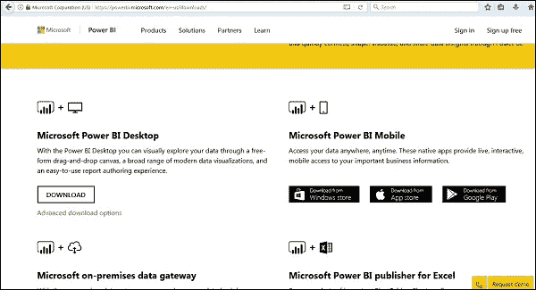

Power BI 包括以下组件

*   **Power BI Desktop**—用于在数据集上创建报告和数据可视化。
*   **Power BI Gateway**—您可以使用 Power BI 本地网关，通过连接到您的本地数据源来保持您的数据新鲜，而无需移动数据。它允许您查询大型数据集，并从现有投资中获益。
*   **Power BI 移动应用**—使用 Power BI 移动应用，您可以随时随地与他们的数据保持联系。Power BI 应用可用于 Windows、iOS 和 Android 平台。
*   **Power BI 服务**—这是一项云服务，用于发布 Power BI 报告和数据可视化。

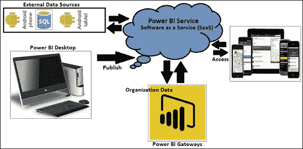

# 数据源

Power BI 支持大范围的数据源。你可以点击获取数据，它会显示所有可用的数据连接。它允许您连接到不同的平面文件、SQL 数据库和 Azure 云，甚至是 web 平台，如脸书、谷歌分析和 Salesforce objects。它还包括 ODBC 连接，用于连接未列出的其他 ODBC 数据源。PowerBI 中的一些可用数据源是平面文件、SQL 数据库、OData Feed、空白查询、Azure 云平台、在线服务、空白查询、其他数据源如 Hadoop、Exchange 或 Active Directory。要在 Power BI desktop 中获取数据，您需要单击主屏幕中的获取数据选项。它首先向您展示最常见的数据源。然后，单击“更多”选项查看可用数据源的完整列表。

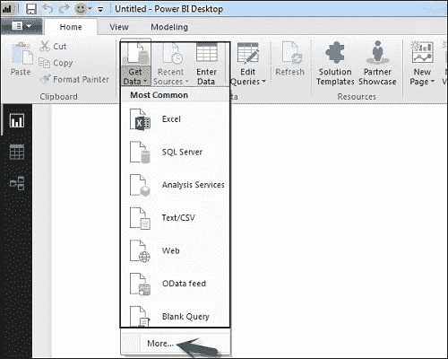

当你点击“更多..”选项卡如上面的截图所示，您可以看到一个新的导航窗口，在左侧显示了所有可用数据源的类别。您还可以选择在顶部执行搜索。

以下是列出的各种**数据源**

# 全部

在此类别下，您可以看到 Power BI desktop 下所有可用的数据源。

# 文件

当您单击“文件”时，它会显示 Power BI desktop 支持的所有平面文件类型。要连接到任何文件类型，请从列表中选择文件类型，然后单击连接。您必须提供文件的位置。

# 数据库ˌ资料库

当您单击数据库选项时，它会显示您可以连接到的所有数据库连接的列表。

要连接到任何数据库，请从列表中选择一个数据库类型，如上图所示。单击连接。

您必须传递服务器名称/用户名和密码才能连接。您也可以使用高级选项通过直接 SQL 查询进行连接。您还可以选择连接模式-导入或 DirectQuery。

**注意**——您不能在一份报告中同时使用导入和直接查询模式。

# 导入与直接查询

**DirectQuery** 选项限制了数据操作的选项，数据停留在 SQL 数据库中。DirectQuery 是实时的，不需要像在导入方法中那样安排刷新。

**导入**方法允许执行数据转换和操作。将数据发布到 PBI 服务时，限制为 1GB。它消耗数据并将数据推送到 Power BI Azure 后端，数据每天最多可以刷新 8 次，并且可以设置数据刷新计划。

# 使用 DirectQuery 的优势

*   使用 DirectQuery，您可以在大型数据集上构建数据可视化，这在 Power BI desktop 中是不可行的。
*   DirectQuery 不应用任何 1GB 数据集限制。
*   使用 DirectQuery，报告总是显示当前数据。

# 使用 DirectQuery 的限制

*   使用 DirectQuery 时，返回数据的行数限制为 1 百万行。您可以执行更多行的聚合，但是，结果行应该少于一百万行才能返回数据集。
*   在 DirectQuery 中，所有的表都应该来自一个数据库。
*   当在查询编辑器中使用复杂查询时，它会引发错误。要运行查询，您需要从查询中删除错误。
*   在 DirectQuery 中，只能在一个方向上使用关系筛选。
*   它不支持对表中与时间相关的数据进行特殊处理。

# 蔚蓝的

使用 Azure 选项，可以连接到 Azure cloud 中的数据库。以下截图显示了 Azure 类别下的各种可用选项。

# 在线服务

Power BI 还允许您连接到不同的在线服务，如 Exchange、Salesforce、Google Analytics 和脸书。

以下屏幕截图显示了在线服务下的各种可用选项。

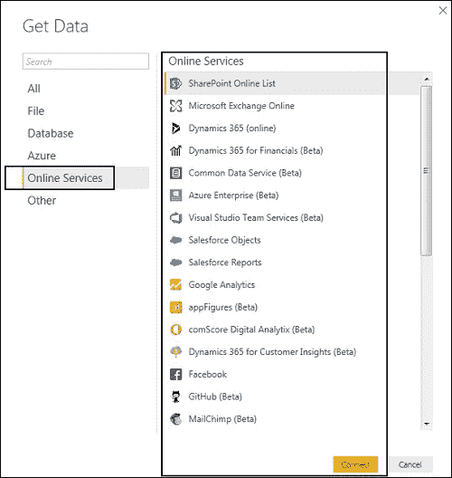

在屏幕左侧的 Power BI 中，有以下三个选项卡

*   报告
*   数据
*   关系

当您导航到“报告”选项卡时，您可以看到为数据可视化选择的仪表板和图表。您可以根据需要选择不同的图表类型。在我们的示例中，我们从可用的可视化中选择了一个表类型。

让我们开始加载我们的 SkyTransport 数据集。

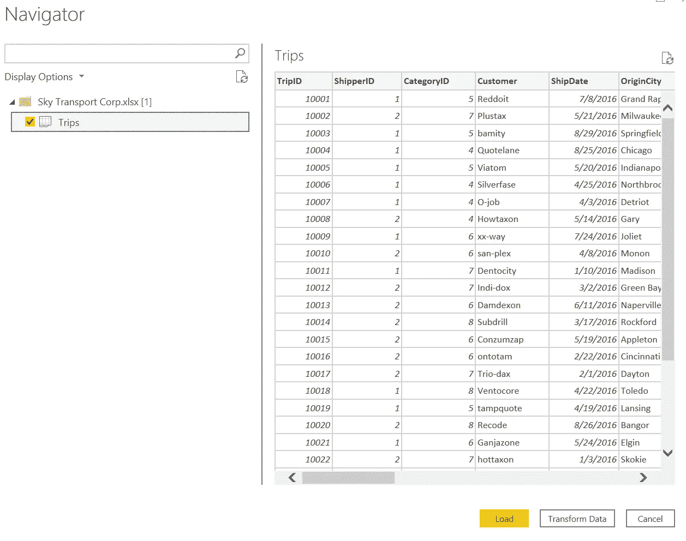

现在，当您转到 Data 选项卡时，您可以根据数据源中定义的关系看到所有数据。

可视化用于有效地呈现您的数据，并且是任何商业智能工具的基本构建块。Power BI 包含各种默认的数据可视化组件，包括简单的条形图、饼图和地图，以及复杂的模型，如瀑布、漏斗、仪表和许多其他组件。

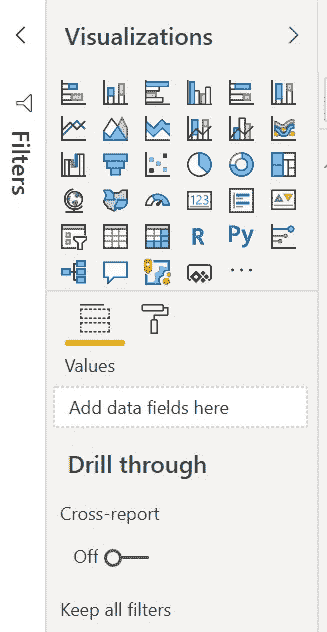

让我们开始可视化我们的天空运输数据集，以开发一个仪表板来显示天空运输的顶级简要概述。

# 1.总里程、收入、成本的关键绩效指标

我们将借助 Card 来表示总里程、收入和成本的 KPI。首先，我们单击可视化菜单中的卡片图标，然后我们将看到一张卡片出现在报告画布中。

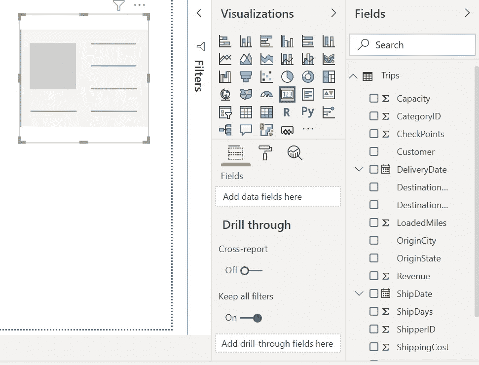

现在，从字段拖动所需的数据到可视化的添加数据字段列，然后用不同的颜色，字体，背景等编辑它。

# 2.按运输州列出的收入与里程

这里使用了一个簇状柱形图。从图中我们可以看出，IL 的收入和总里程数最高。而 IA 的收入和总里程数最低。

在按运输状态划分的总里程和收入的聚类柱形图中，我在轴字段中使用了原始状态列，在值中使用了总里程和收入。

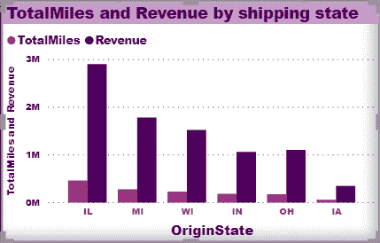

# 3.按运输城市列出的收入与里程

使用了簇状条形图。该图显示辛辛那提的收入最高。而密尔沃基的收入最低。在按运输城市划分的总里程和收入的聚类柱形图中，我在轴字段中使用了 OriginCity 列，在值中使用了总里程和收入。

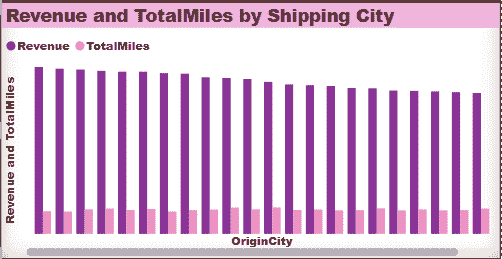

# 4.按运输州列出的旅行百分比

饼图用来表示出行百分比。从图中可以清楚地看出，IL 的出行百分比最高，IN 的出行百分比最低。

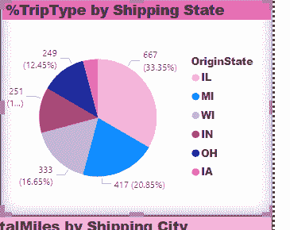

# 5.收入里程与总里程

收入和总里程通过连续条形图显示，分别为 100 万和 900 万英里。

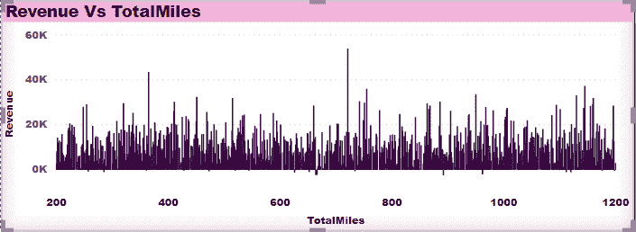

# 6.按行程类型列出的总行程

使用了环形图。在这里，总行程是根据行程类型定义的，这样我们就可以知道有多少国内、国际和内部行程。

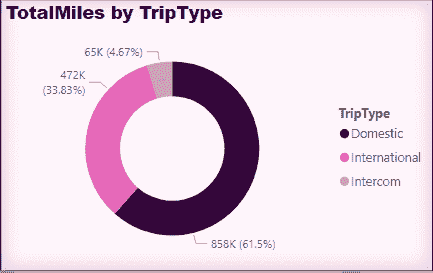

# 7.文字框

最后但并非最不重要的是，我们将添加一个文本框到仪表板，使其更具互动性。

现在，我们完整的行程分析报告看起来像下面提到的截图。

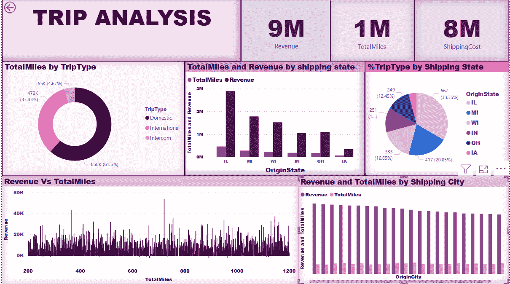

行程分析仪表板

# 分析结果

从上面的图像中，我们推断:

1.IL 收入最高，总里程数也最多。而根据运输状态，IA 的收入和总里程数最低。

2.辛辛那提的收入最高。而密尔沃基的收入最低。

3.总里程、收入和成本的 KPI 分别为 100 万、900 万和 800 万。

4.IL 的出行比例最高，IN 的出行比例最低。

5.最常使用的旅行类型是国内旅行，最少使用的是内部通话，因此在总共 2000 次旅行中，国内旅行的比例最大，占总旅行的 60%(1200 次旅行)，其次是国际旅行 35% (700 次旅行)和内部通话 5% (100 次旅行)

> 感谢@Amit Bose 和@iNeuron 分享知识。

感谢您阅读文章！！！！！！！！！！！！！！！！！！！！！！！！！！！！！！！！！！！！