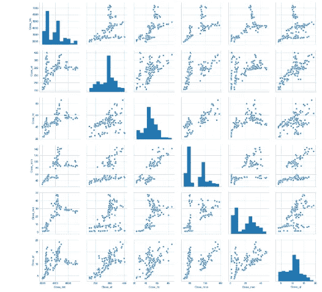

# 让我们绘图:)

> 原文：<https://medium.com/analytics-vidhya/lets-plot-d06dd025e911?source=collection_archive---------19----------------------->

数据可视化

*绘制数值变量。*

绘制数据有助于我们快速理解数据&有助于我们看到正常分析中看不到的模式。

让我们快速回顾一下 seaborn 图书馆，以制作出令人惊叹的情节。

在本节中，我们将如何:

*   可视化单变量分布。
*   可视化二元分布。

Seaborn 是一个构建在 matplotlib 之上的 python 库。Seaborn 创造了更吸引人的情节&通常也更简洁。准备好行动了吗？

**可视化单变量分布:**

首先&最重要的是导入库并读取数据，

H istogram

直方图和密度图沿 y 轴显示变量的频率，sns.distplot()函数绘制密度曲线。

您也可以绘制所谓的 rug plot，它将实际数据点绘制成小竖条。rugplot 只是被指定为 distplot()的一个参数。

通过指定 hist=Fals，可以创建简单的密度图(没有直方图)

Seabborn 在幕后使用 matplotlib，所以大部分功能仍然适用。

接下来，让我们看看次要情节，它们起作用了

B oxPlot

箱线图是一种可视化单变量数据的好方法，因为它们代表了不同的百分位数(25、50 等)和 IRQ(四分位数间距)。

**可视化二元分布:**

二元分布可以分别称为 x 轴和 y 轴上的两个一元分布。它们帮助我们观察两个变量之间的关系。

它们也被称为*节理。*它们是由“sns.jointplot()”创建的，让我们检查一下代码。

请注意，两种分布都严重偏斜，所有点似乎都集中在一个区域。这是因为 matplotlib 试图在有限的地块空间中容纳一些极端的利润和销售值。

让我们尝试一些条件，使情节更干净。

我们还可以调整 jointplot()的参数，使图形更具可读性。例如，指定 kind=Hex 将创建一个“hexbin”图。

该图的右下区域表示销售额高但利润低的订单，即，即使商店获得高收入，订单仍然亏损。这是企业想要避免的订单类型。

P 抽签两两关系

有时，绘制多个数值变量之间成对关系非常有用。为了说明这一点，让我们看看一些加密货币的价格，如比特币、以太坊、monero、neo、quantum 和 ripple。

现在，密码爱好者会知道这些货币的价格彼此不同。如果比特币上涨，其他人可能也会跟着上涨，等等。

现在，假设你想交易一些货币。给定一组加密货币，你将如何决定何时买入/卖出哪一种？这将有助于分析过去的数据，并确定这些货币的一些趋势。

合并文件:

现在，因为我们有许多数字变量，让我们看同样的成对散点图

我们还可以检查货币之间的相互关系

上面的数据框架被称为相关矩阵，它帮助我们识别各种变量之间的相关性，例如量子和以太坊高度相关(. 791)。

吃地图

热图是可视化关联矩阵的好方法。

因为学习是一个连续的曲线，我们必须永不停止！

下一集再见！