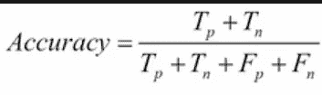
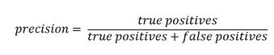
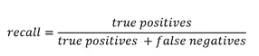
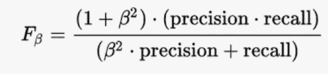
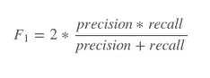
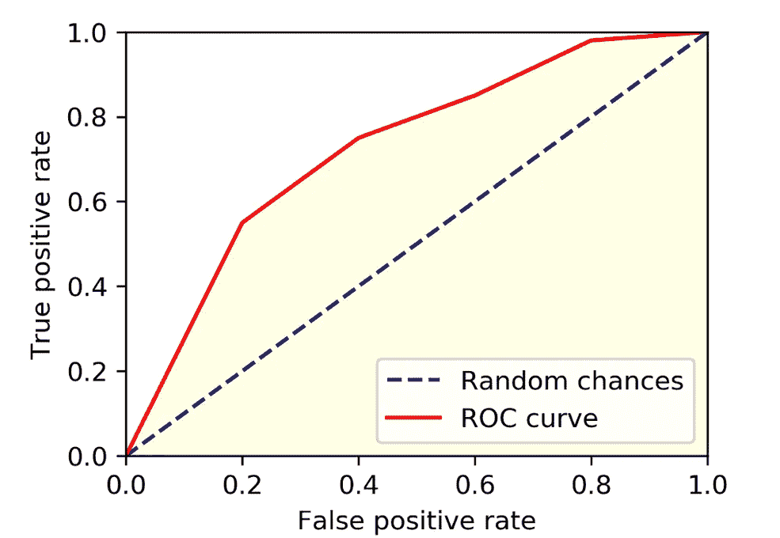
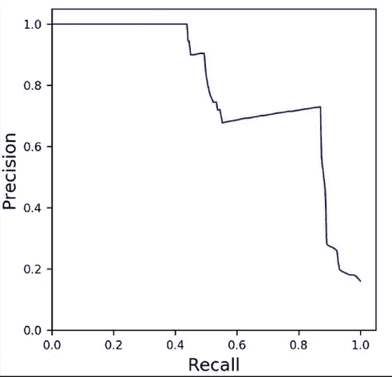

# 让我们谈谈分类问题中的度量

> 原文：<https://medium.com/analytics-vidhya/lets-talk-about-metrics-in-classification-problems-278f5dee6b92?source=collection_archive---------26----------------------->

任何刚开始学习机器学习的人通常对典型的机器学习项目的工作流程知之甚少。我见过人们严格关注他们正在创建的机器学习模型，很少花时间关注机器学习的其他方面。

好吧，不要误解我，为任务选择正确的模型非常重要，但我想传达的是**还有其他同样重要的方面，比如正确的特征选择，为模型选择正确的优化器，或者使用正确的度量**来获得模型所显示的结果本质的正确概念。

今天，我将只谈论分类问题中使用的不同类型的度量。这将会是一个有点长的阅读，但是对我来说，我会尽我所能使主题变得有趣，因为选择正确的度量在解释结果中起着重要的作用。

# 为什么是指标？

假设有一个数据集用于二进制分类。里面有 1000 个例子。一级 900 英镑，二级 100 英镑。

这是一个不平衡数据集的例子，因为模型可能对特定的类有偏见。假设你做了一个模型，结果总是给 A 类一个标签。如果你根据这个结果计算**准确率**，你会得到 90%。这是非常误导性的，因为该模型实际上没有学到任何东西，只是给出了有利于 A 类的输出。**这并不比总是给出 A 类输出的简单 for 循环好多少。**

因此，这可能会让您了解问题中正确的度量选择有多重要。当我根据需要解释每种类型的指标时，我会给出更多的例子。

让我们现在开始。

# 1.准确性得分

这是我们拥有平衡数据集时最常用的指标之一。

**平衡数据集？**

平衡数据集是包含相等或几乎相等数量的来自正类和负类的样本的数据集。如果其中一个类的样本数量多于另一个，那么数据会偏向其中一个类，就像我之前提到的例子一样。

现在让我们看看计算准确度分数的公式。

Tp:真阳性(正确的 A 类预测)

Tn:真阴性(正确的 B 类预测)

Fp:假阳性(错误的 A 类预测)

Fn:假阴性(错误的 B 类预测)

**由于准确度分数简单地计算了所做预测总数的总正确预测，因此它适用于数据集平衡的情况。**

# 2.精确度和召回率

精确度和召回率是完全不同的度量标准。**我将它们放在一起的原因是，有时我们必须根据我们希望从模型中得到的结果在两者之间进行选择。**

算术地

这些符号的含义与前面提到的相同。

*   精度是真阳性和假阳性之和。通过观察，我们可以看到 precision 对 a 类的错误分类更感兴趣。例如，让我们考虑一个常见的垃圾邮件检测示例。该模型预测邮件不是垃圾邮件(误报)，但它实际上不是垃圾邮件。这是一个危急的情况，因为用户可能会错过一些重要的邮件。所以我们希望假阳性非常少。在这种情况下，我们可以允许更多的误报(垃圾邮件被标记为非垃圾邮件)，因此我们使用 precision。
*   回忆被表示为真肯定和真否定之和的真肯定。在这里，让我们说，我们正在处理一个模型，预测这个人是否有 COVID 病毒。**这里的关键案例是假阴性(当一个人没有被诊断为 COVID 时，被认为是健康的)，因为它可能会危及生命**。因此，在这种情况下，我们希望假负数非常低。所以我们用回忆。

因此，通过这两个例子，什么时候使用精确，什么时候使用回忆，已经变得非常清楚了。这将有助于理解我们稍后会看到的精确回忆曲线。

但是当我们想考虑这两种情况时，就有任务了。所以让我们看看在这种情况下我们能做些什么。

# 3.F-beta 分数

F-beta 是精确度和召回率的累积指标之一。人们通常称之为 F1 分数。但它只是β= 1 时的 F-β分数。

F-beta 分数的公式如下

当我们保持β值为 1 时，公式变为

如果你仔细观察**，这是精确和回忆**的调和平均值的表示。

当我们想提高回忆的重要性时，我们可以增加β的值。另一方面，如果我们想提高精确度，我们也可以使β的值小于 1。

# 4.ROC 曲线和 AUC

让我们考虑一个二元分类的例子。通常在输出上我们有一个概率分数。这取决于我们在两个类别中选择作为预测输出的概率。

**ROC 曲线使用不同的阈值来绘制真阳性率和假阳性率的关系**。因此，它根据 0 到 1 之间的不同阈值绘制结果。

该图类似于下面给出的图，并且根据训练的模型略有不同。

ROC 曲线下的面积代表 AUC。曲线下的面积应该大于随机形成的三角形。这是因为**否则模型的表现会比随机猜测差，这是非常糟糕的。**

真阳性率计算为真阳性的数量除以真阳性的数量和假阴性的数量之和。它描述了当实际结果是肯定的时，模型在预测肯定类别方面有多好。

如果我们试图解释这个图，我们越接近 Y 轴上的 1 越好。但是为了得到它们，我们必须以假阳性率为代价。

> 应该设置阈值的正确位置是领域专业知识的问题，并且因情况而异

# 5.精确召回曲线(PR 曲线)

顾名思义，精确曲线有助于创建一个可视化的精度和召回。

它有助于做出明智的决策，在精确度和召回率之间进行权衡。

同样，这取决于用例，正如我在前面的精度和召回讨论中解释的那样。

# 结论

这些是机器学习分类中使用的少数指标，根据使用情况，我们必须选择正确的指标。我想再次强调，使用机器学习解决问题不仅仅是创建一个模型。

我们使用机器学习的主要原因是因为我们想要解决一个问题，我们使用的指标可以帮助我们提供关于我们离预期结果有多近的见解。