# 让我们来谈谈指针..

> 原文：<https://medium.com/analytics-vidhya/lets-talk-about-pointers-2db8e149f4ba?source=collection_archive---------30----------------------->

# I 简介:

指针是一个变量，它保存一个内存地址作为它的值。它主要存储另一个变量的地址。众所周知，当我们在程序中声明一个变量时，一个空闲的内存地址会自动分配给这个变量。指针主要存储分配给变量的起始内存地址。

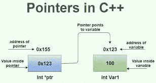

## 声明指针:

为了声明一个指针，我们在数据类型和变量名之间使用了一个星号。

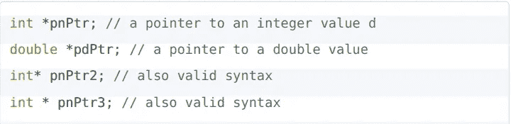

## 指针变量的大小:

所有不同的指针变量都有相同的大小，而不管它存储的地址的变量的数据类型。在 64 位存储器的情况下，它是 8 字节。

## 空指针:

当一个指针不指向任何东西时，它被称为空指针。我们可以通过将一个指向地址 0 的指针赋值为`int* ptr = 0`来创建一个空指针

## 操作员地址(&):

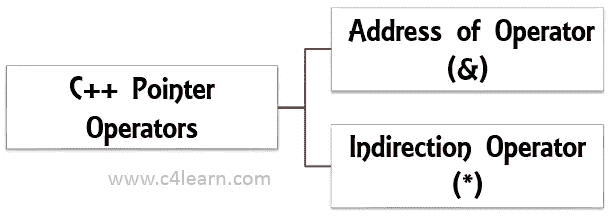

指针操作符分为两类

Address-Of 运算符是一元运算符，返回其操作数的地址。例如——当我们写`int x=10`或简单地写`x=10`时，它在内存中创建一个有起始地址的 4 字节块，指针基本上存储那个起始地址……所以当我们键入`&x`时，它返回十六进制数系统[中的起始地址。](https://www.tutorialspoint.com/hexadecimal-number-system)

以下是如何使用地址运算符的示例:

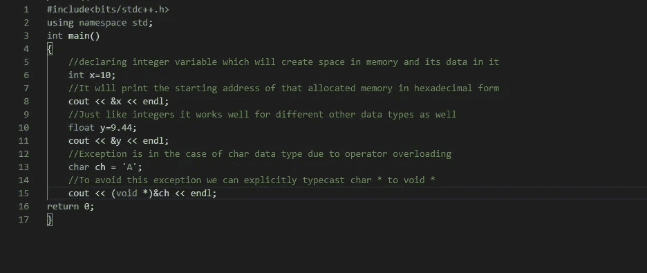

使用地址运算符打印变量的起始地址

下面是显示 int、float 和 character 变量地址的输出

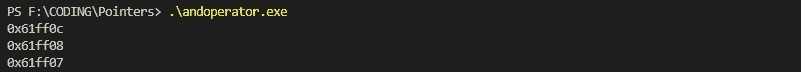

十六进制形式的 x、y 和 ch 的地址

例外:虽然 address-of 操作符打印所有变量的起始地址，但是如果是 char 变量*，它打印的是 char 本身，而不是它的地址，这是由于* `*<<*` *的操作符重载。为了处理这个异常，我们显式地输入 cast* `*char* to void**` *，然后它打印地址。*

## 给指针赋值:

有两种方法可以同时声明和赋值，或者我们可以在不同的时间声明和赋值。

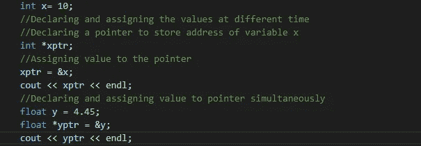

它给出了以下输出:

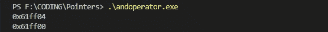

## 取消引用运算符(*):

它用于查找指针所指向的变量的值，即指针所存储的地址。操作符本身可以读作*“*所指向的值

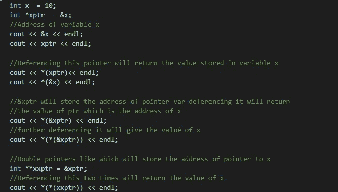

理解解引用运算符的使用

上面的代码给出了以下输出:

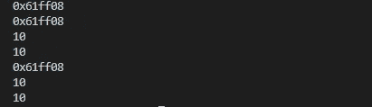

## 参考变量:

引用变量只是内存中变量的另一个名字。它们通过在定义中使用&符号来定义。在使用它们之前，必须对它们进行初始化，因为它们没有自己的存储器，它们只是现有变量的另一个名称。例如:

`int x;`

`int &y = x;`

这里 y 只是变量 x 的另一个名字

指针和引用变量的区别:

>引用变量不能初始化为 null，就像 null 指针的情况一样。

>引用变量不能被重新分配给任何其他变量。

>它必须在创建时进行，不像指针可以随时初始化。

## 使用指针通过引用传递:

它用于将变量的引用作为参数传递给函数。当我们直接传递值时，它不能改变主函数中变量的值。

下面的代码将展示如何使用指针通过引用传递:

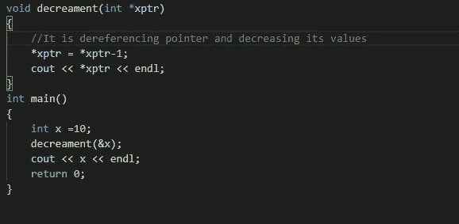

如何将指针作为参数传递

上面代码的输出:

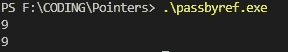

通过引用传递的工作

*希望它能帮助你理解指针*

感谢您宝贵的时间..

*快乐编码……*

`Pointer`T3`tech`