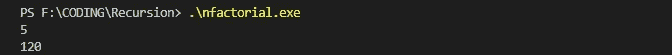

# 让我们来谈谈递归

> 原文：<https://medium.com/analytics-vidhya/lets-talk-about-recursion-8750aaaba965?source=collection_archive---------15----------------------->

# **递归介绍**:

这是一种基于相同问题的较小实例的解决方案来找到问题的解决方案的方法。这里我们把主问题分成更小的子问题，解决那些子问题，并把它们的解组合起来，得到主问题的解。

递归介绍

# 递归算法的组成部分:

1。基本情况:这是我们必须停止递归且我们预先知道其值步骤。因此，在编写任何递归算法时，第一步是找出它的基本情况。例如:求一个数的阶乘时，基本情况是`fact(1)=1`因为(1！=1).

2。递归调用:这里我们继续把问题分成子问题，直到我们到达基本情况。一旦我们到达了基本情况，我们就开始组合所有子问题的解决方案，从而得到主问题的解决方案。例如:在计算一个数的阶乘时，递归调用是`fact(n)=n*fact(n-1)`

说明递归调用

# 实现递归算法:

在下面代码的帮助下，我试图展示一个递归算法的实现，同时寻找一个数的阶乘。

寻找数字的阶乘

上面的代码给出了以下输出

## 上述代码的空间和时间复杂度:

空间复杂度是 O(N ),因为它使用 N 个成员的递归调用堆栈，其中每个成员都有恒定数量的变量。

时间复杂度也是 O(N ),因为我们正在进行 N 次调用，并且在每次调用中，我们执行两个常量操作。一个是将两个常数相乘，另一个是检查基本情况。

## 递归的一个经典问题:

河内塔:这里我们将有三根棒和 n 个圆盘。这个难题的目标是将整个堆叠移动到另一个棒上，遵守下面的简单规则:
1)一次只能移动一个圆盘。
2)每次移动都包括从一个堆叠中取出上面的磁盘，并将其放在另一个堆叠的顶部，即只有当磁盘是堆叠中最上面的磁盘时才能移动。
3)不得将磁盘放在较小的磁盘上。

解决方案:我们可以简单地将问题分解成更小的子问题。使用递归，我们可以显示我们应该采取什么步骤来实现目标。

Src:谷歌图片

求解汉诺塔的 C++代码

上面的代码给出了以下输出:

示出了应该执行操作的步骤

文章结尾

谢谢读者

希望这有所帮助:)

快乐编码