# 让我们来谈谈 SQL —第 2 部分

> 原文：<https://medium.com/analytics-vidhya/lets-talk-about-sql-part-2-f2bc7eba88eb?source=collection_archive---------19----------------------->

SELECT、FROM、JOIN 和 WHERE 语句


我关于 SQL 的第一篇文章是对关系数据库、查询和 SQL 是什么的高度概括。你可以在这里阅读。

概括地说，在上一篇文章中，我提供了一个示例，我们要求数据库在 customer 表中查找名称“Mutt Barkely ”,然后将该行中的 CustomerID 与 order 表中的 CustomerID 进行匹配，并返回任何匹配的 orderID。

用 SQL 编写:

```
SELECT OrderId
FROM Orders
JOIN Customers on Customers.CustomerID = Orders.CustomerID
WHERE Customers.Name = ‘Mutt Barkley’
```

在本文中，我们将使用从《纽约时报》获得的数据来探究关键字 SELECT、from、JOIN 和 WHERE。原代码可以在这里查看[。所以，让我们开始吧！](https://github.com/aspotter99/SQL_talk)

**SELECT —** 这是查询中的第一个关键字，表示我们正在请求数据库检索一些信息。第一个关键字标识要检索的字段。请注意，列出了列名，但字段是保存数据的实际单元格。

**FROM —** 这通常是查询中的第二个关键字，它表示我们要求数据库从中检索信息的表。这标识了用于检索用 SELECT 标识的字段的表。

只使用 SELECT 和 FROM，就可以查询数据库！因此，在进入 JOIN 和 WHERE 子句之前，让我们看一些非常简单的查询。我根据纽约时报的数据创建了一个 SQLite 数据库。该数据库有 5 个表:

1.  死亡
2.  面具 _ 使用
3.  县
4.  州
5.  美国

如果我想要查看 counties 表中的所有数据，我可以使用星号( ***** )来表示我想要返回所有字段。这将被写成:

```
SELECT *
FROM counties
```

该查询将返回:

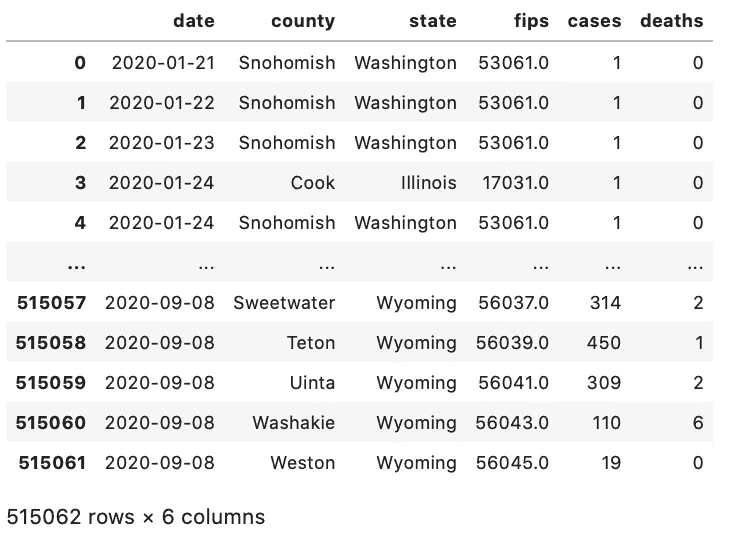

查询结果！

我们看到 counties 表有 6 列:

1.  日期
2.  县
3.  状态
4.  联邦信息处理标准
5.  案例
6.  死亡

但是，还有第七列没有标记——这是一个行索引。在底部，我们得到返回的结果表的形状。在我们的例子中，我们有 515，062 行和 6 列(3，090，372 个字段)。相当整洁！但是，您不太可能真的想看到整个数据表。

我们可以使用 SELECT 子句指明我们希望返回哪些列。例如，如果我们只关心国家和案件呢？SQL 将如下所示:

```
SELECT state, cases
FROM counties
```

该查询将返回:

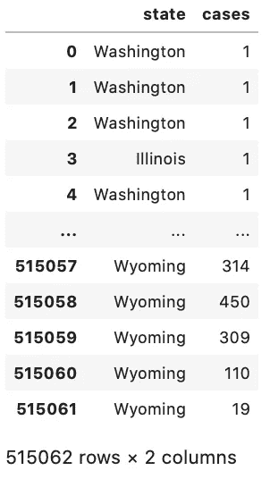

仍然有索引，但是现在只返回 state 和 case 列

我们现在只有州名和病例数。请注意，行数(515，062)没有变化，只有列数没有变化。这是因为我们的查询只通过使用 SELECT 关键字减少了列。同样，简洁，但可能不是所有的帮助。

如果我只想知道表中有哪些州呢？我该如何质疑呢？很高兴你问了！为了返回列中的唯一值，我们使用关键字 DISTINCT。让我们试一试。

```
SELECT DISTINCT state
FROM counties
```

该查询将返回:

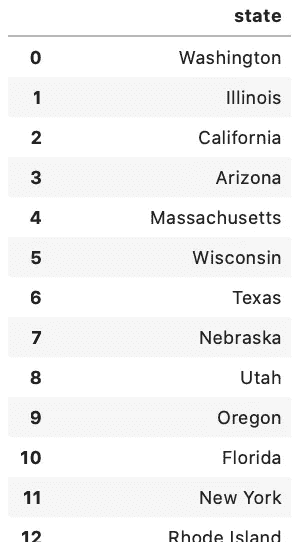

部分结果，查询将在 state 列中给出每个唯一的条目

该查询返回 55 行(数据包括美国领土和哥伦比亚特区)。您可以使用 distinct 获得任意列组合，但是请注意，这将给出所有列组合都是 distinct 的行。换句话说，如果不止一个州有一个尤马县，那么对于每个有尤马县的州，尤马都会出现在 County 列*中。*

```
SELECT DISTINCT state, county
FROM counties
```

退货:

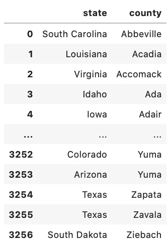

部分结果，则返回每个唯一的组合

新查询有 3257 行—我们看到重复的州名(例如，德克萨斯州)和重复的县名(例如，Yuma)，但是没有州和县的重复组合。科罗拉多州和亚利桑那州都有一个尤马县，我们看到只有爱达荷州有一个阿达县。但是，如果您只对特定的状态感兴趣呢？这让我们想到了 WHERE 关键字。

**WHERE —** 该关键字充当过滤器，标识查询中要返回的行必须满足的特定条件。

回到我们的郡桌。如果我只想返回德克萨斯州唯一的县，该怎么办？我仍然需要我的 SELECT、DISTINCT 和 FROM 关键字，但是现在，我需要在我的过滤器中添加。我们的查询将如下所示:

```
SELECT DISTINCT state, county
FROM counties
WHERE state = ‘Texas’
```

退货:

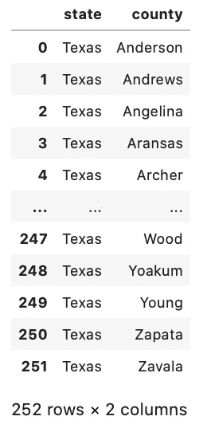

返回德克萨斯州每个唯一的县名

我们的查询结果显示，我们的数据在德克萨斯州有 252 个不同的县！我们可以对任何列进行过滤，甚至是那些没有从我们的选择中返回的列。让我们试一试。

```
SELECT DISTINCT state, county
FROM county
WHERE deaths = ’10’
```

退货:

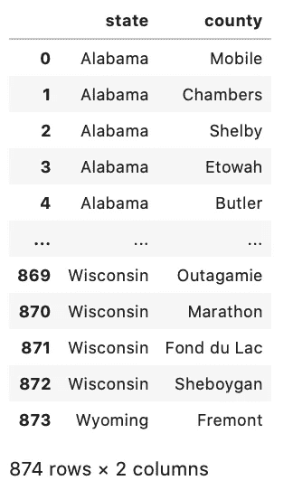

我们没有要求检索死亡数据列，但是我们对其进行了过滤，这样我们的结果只显示死亡人数正好为 10 的县

如果我们希望根据多个标准进行筛选，该怎么办？我们也能做到！让我们看看德克萨斯州有多少个县报告了 10 例死亡。

```
SELECT DISTINCT state, county, deaths
FROM counties
WHERE state = ‘Texas’ AND deaths = ’10’
```

退货:

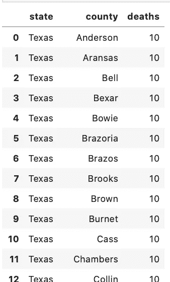

部分结果-查询返回 58 行

完整的结果显示，德克萨斯州的 58 个县报告了 10 例死亡。如果我想知道有多少次县报告的死亡人数少于 5 人，或者多于 500 人，该怎么办？我们可以组合运算符来获得不同的过滤器。

```
SELECT DISTINCT state, county, deaths
FROM counties
WHERE state = ‘Texas’ AND (deaths < 5 OR deaths > 500)
```

在这里，我们必须将第二个条件(死亡人数)放在括号中，因为我们希望在死亡数列中合并 Texas 和 2 个条件。

结果:

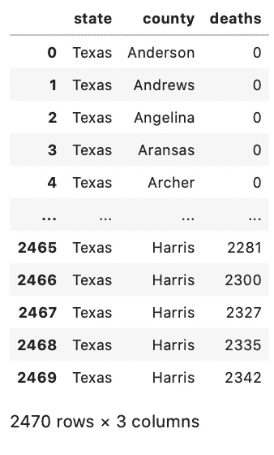

死亡人数少于 5 人或多于 500 人的德州县

哈里斯郡怎么了？让我们看看包含的所有列(还记得在我们的第一个查询中，我们使用星号返回表中的所有列)。

```
SELECT *
FROM counties
WHERE state = ‘Texas’ and (deaths < 5 or deaths < 50)
```

返回

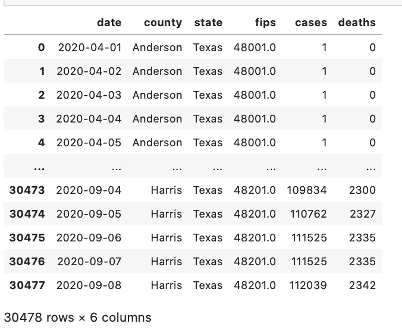

啊，所以我们看到这是每天报告的累计死亡总数。有道理。如果我只对特定日期的死亡人数感兴趣怎么办？我们也可以过滤。

```
SELECT *
FROM counties
WHERE state = ‘Texas’
AND deaths > ‘500’
AND date = ‘2020–09–07’
```

退货:

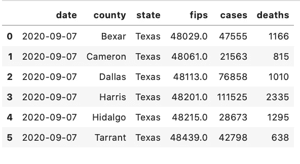

因此，9 月 7 日，德克萨斯州的 6 个县(贝克萨尔、卡梅伦、达拉斯、哈里斯、伊达尔戈和塔兰特)报告了超过 500 例死亡。

只需一个表和三个关键字，您就可以通过查询找到一些有趣的东西。但是，让我们现实一点，我们使用关系数据库的全部原因是我们只需要记录信息一次。在现实世界中，我们不太可能查询单个表。这就是连接发挥作用的地方。我将在以后的文章中讨论连接，因为有很多内容要介绍，但是就我们的目的而言，我们将只讨论一种类型的连接，即内部连接。

**JOIN—**JOIN 关键字用于连接两个表。在大多数 SQL 程序中，默认的连接是内部连接。内部联接只是返回两个表中特定字段匹配的请求行。

如果你和我一样，你需要一个视觉来理解我们正在谈论的东西。通常我们看到这表示为一个文氏图，我们能够理解内部连接返回重叠部分中的记录，就像这样

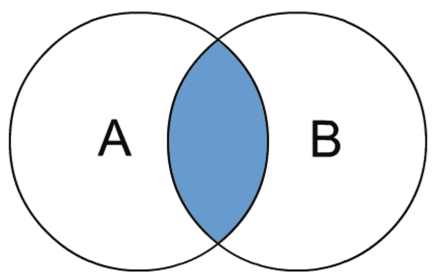

我更喜欢用实际的数据表来看。我的查询将要求 counties 表中的“state”、“county”、“countyfp”列和 mask_use 表中的“countyfp”、“FREQUENTLY”、“ALWAYS”列。我们希望返回的行与两个表中的“countyfp”列相匹配。

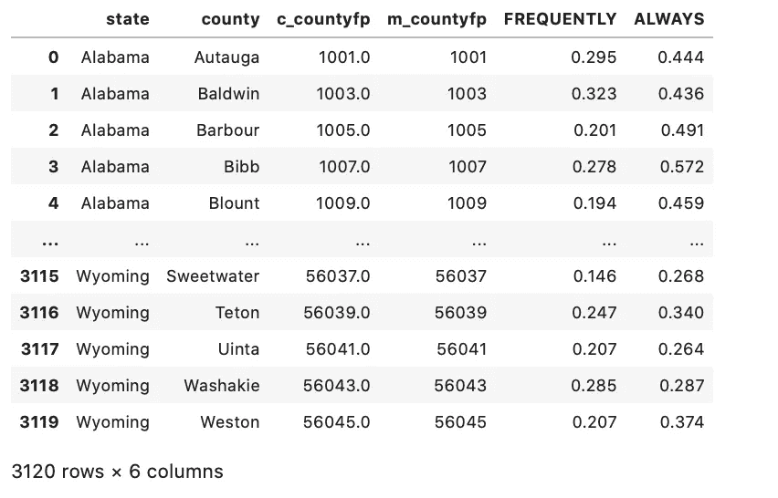

类似于过滤器(WHERE 子句)，我可以连接未被选中的列。

```
SELECT state, county, FREQUENTLY, ALWAYS
FROM counties
JOIN mask_use on counties.fips = mask_use.countyfp
```

注意:“频繁”和“总是”都是大写的，以便更容易看出它们来自 mask_use 表。另请注意，在原始数据表中，fips 代码的标签不同。counties 表使用 fips，而 mask_use 使用 countyfp。

退货:

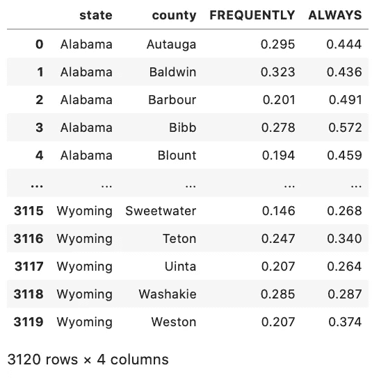

好玩！让我们把这些放在一起，看看在 2020 年 9 月 7 日报告死亡人数超过 500 人的县中，经常或总是使用口罩的人占多大比例。

```
SELECT date, state, county, deaths, FREQUENTLY, ALWAYS
FROM counties
JOIN mask_use on fips = countyfp
WHERE state = ‘Texas’
AND deaths > ‘500’
AND date = ‘2020–09–07’
```

退货:

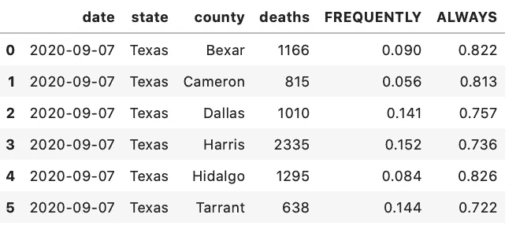

结合县和口罩 _ 使用表发现德州人是相当不错的掩蔽！

我们成功地从一个表中提取了关于口罩使用的信息，并通过匹配 fips 代码(指示国家),过滤了德克萨斯州、死亡人数和具体日期，将其与第二个表进行了匹配！干得好！

只使用四个关键字(SELECT、FROM、JOIN、WHERE ),就可以开始查询了！本系列的下一篇文章将研究聚合函数——像最小值、最大值、AVG 这样的项目——在返回值之前评估项目组。