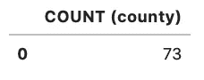
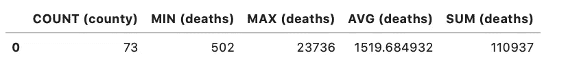
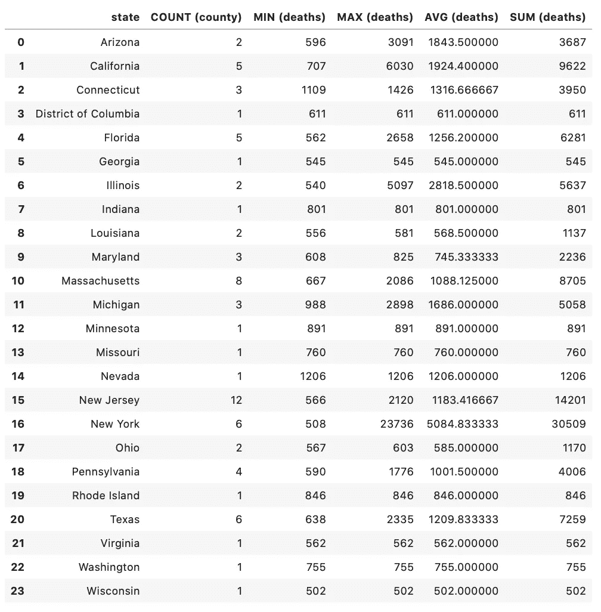
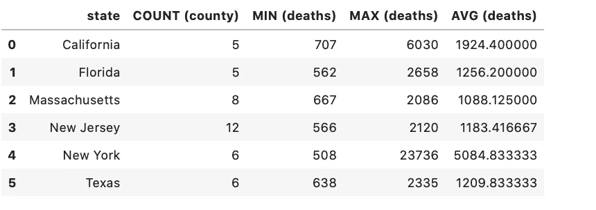
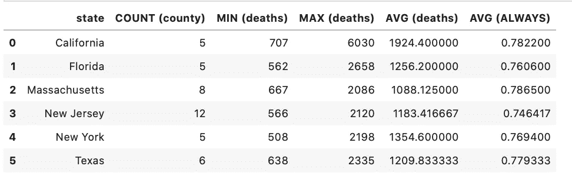
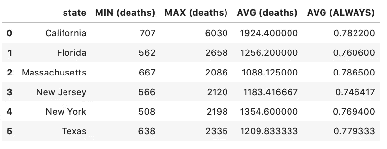
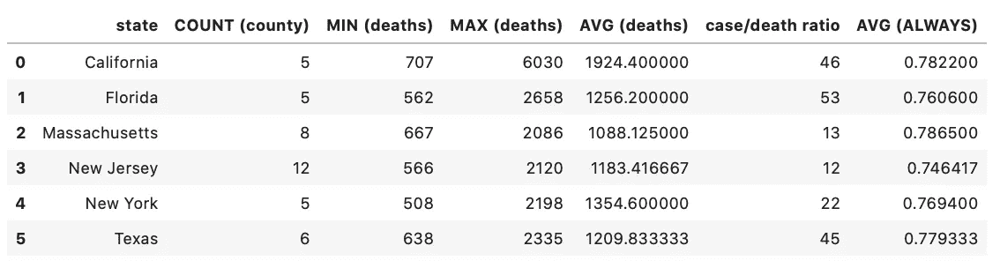

# 让我们来谈谈 SQL —第 3 部分

> 原文：<https://medium.com/analytics-vidhya/lets-talk-about-sql-part-3-a89010cb86f2?source=collection_archive---------22----------------------->

基本聚合函数


这是 SQL 系列文章的第三篇。

我关于 SQL 的第二篇文章概述了 SELECT、FROM、WHERE 和 JOIN。你可以在这里阅读。

概括地说，在上一篇文章中，我带您构建了一个简单的查询，该查询从两个表中选择列并过滤条件

用 SQL 编写:

```
SELECT date, state, county, deaths, FREQUENTLY, ALWAYS
FROM counties
JOIN mask_use on fips = countyfp
WHERE state = ‘Texas’
AND deaths > ‘500’
AND date = ‘2020–09–07’
```

在本帖中，我们将再次使用从《纽约时报》获得的数据来探索一些基本的聚合函数。原代码可以在这里查看[。所以，我们开始吧！](https://github.com/aspotter99/SQL_talk)

你的第一个问题可能是“什么是聚合函数？”非常简单，聚合函数从一组值中返回一个值。所有聚合函数中最简单的是 COUNT。

**COUNT—**COUNT 关键字将返回符合条件的行数。

让我们回到上一篇文章中的 NYT 数据。如果我只想知道 9 月 7 日报告 500 或更多死亡病例的县的数量，该怎么办？COUNT 关键字将返回这个值。

```
SELECT COUNT (county)
FROM counties
WHERE deaths >= ‘500’
AND date = ‘2020–09–07’
```

该查询返回:



简单。郡数。

9 月 7 日，73 个县报告了 500 或更多的死亡人数。如果我想知道 9 月 7 日报告的最小死亡人数，或者最大或平均死亡人数，也许我想知道总人数，怎么办？SQL 已经内置了这些功能！

**MIN —** 关键字 MIN 将从满足您的条件的行中返回最小值。

**MAX —** 关键字 MAX 将从满足您的条件的行中返回最大值。

**AVG —** 关键字 AVG 将返回符合条件的行的平均值。

**SUM —** 关键字 SUM 将返回符合条件的行中所有值的总和。

让我们来看看这些是如何运作的。我将进行查询，以找到 9 月 7 日报告死亡人数为 500 或更多的县中的县数(计数)、报告的最低死亡人数(最小)、最高死亡人数(最大)和报告的平均死亡人数。

```
SELECT COUNT (county), MIN (deaths), MAX (deaths), AVG (deaths), SUM (deaths)
FROM counties
WHERE deaths >= ‘500’
AND date = ‘2020–09–07’
```

退货:



看看所有这些汇总数据！

不错！我们看到在 9 月 7 日报告死亡人数 500 人及以上的 73 个县中，单个县死亡人数最低为 502 人，最高为 23736 人，那 73 个县平均死亡人数为 1519.685 人。

让我们更进一步，因为虽然这很有趣，但在任何真实世界的情况下都不是那么有用。如果我想查看所有相同的数据(计数、最小值、最大值、平均值和总和)，但又想查看这些数据是如何按州分类的，该怎么办？这就是 GROUP BY 子句发挥作用的地方。

**分组依据—** 分组依据关键字说明应如何执行聚合计算。

使用 GROUP BY，我们将按州汇总我们的数据。这听起来很奇妙，但是我们所做的只是告诉 SQL 我们希望对具有相同状态的行执行相同的计算。

```
SELECT state, COUNT (county), MIN (deaths), MAX(deaths), 
AVG (deaths), SUM (deaths)
FROM counties
WHERE deaths >= ‘500’
AND date == ‘2020–09–07’
GROUP BY state
```

退货:



使用 GROUP BY，我们可以看到各个州的数据。

现在我们得到一些更有用的东西-通过这个查询，我们可以看到新泽西州有最多的县报告 500 或更多的死亡人数(12)，纽约州有最多的县报告死亡人数(23，736)。

我们还可以使用 HAVING 子句使用聚合函数来过滤数据。请记住，在上一篇文章中，WHERE 被用作一个过滤器，它识别字段中的特定条件，以确定是否返回一行。例如，上面的查询有一个 WHERE 子句来指定我们感兴趣的死亡人数(500 或更多)和我们想要查看的具体日期(2020 年 9 月 7 日)。这与 HAVING 子句有一个显著的不同—数据将在聚合函数上进行筛选。

**HAVING—**HAVING 关键字对**聚合的**数据进行过滤。

这是一个很大的单词，让我们来看看在行动中有。我将使用与上面相同的查询，但是将添加一个 HAVING 子句，只返回有超过五个县报告 500 或更多死亡的州。

```
SELECT state ,COUNT (county) ,MIN (deaths) ,MAX (deaths) ,AVG (deaths)
FROM counties
WHERE deaths >= ‘500’
AND date = ‘2020–09–07’
GROUP BY state
HAVING COUNT (county) >= 5
```

退货:



太棒了。数据仍按州分类，但现在只返回拥有 5 个或更多县的州。

2020 年 9 月 7 日，正好有 6 个州有 5 个或更多的县报告了 500 例或更多的死亡病例。如果我们想在这个查询中添加 mask_use，就像我们在第二课中做的那样，该怎么办呢？我们可以再次使用一个连接来获取 mask_use 表，并且我们可以使用相同的聚合器！因此，我们将添加 mask_use 表中的列，以找到报告说他们总是使用口罩的人的平均百分比。

```
SELECT state, COUNT (county), MIN (deaths), MAX (deaths), AVG (deaths), AVG (ALWAYS)
FROM counties
JOIN mask_use ON fips = countyfp
WHERE deaths >= ‘500’
AND date = ‘2020–09–07’
GROUP BY state
HAVING COUNT (county) >= 5
```

退货:



看看我们，跨多个表聚合数据！

就像 WHERE 一样，您可以对不在 SELECT 子句中的列使用 HAVING 子句。

```
SELECT state, MIN (deaths), MAX (deaths), AVG (deaths), AVG (ALWAYS)
FROM counties
JOIN mask_use ON fips = countyfp
WHERE deaths >= ‘500’
AND date = ‘2020–09–07’
GROUP BY state
HAVING COUNT (county) >= 5
```

退货:



您不必在 SELECT 子句中筛选项目！

查询仍然根据县的数量进行过滤，但是我们的结果中没有列出这些县。

除了使用关键字(计数、最小值、最大值、AVG、总和)之外，您还可以使用普通数学运算符创建计算字段。例如，如果我们想看到病例与死亡的比率，我们该怎么写呢？我们将创建一个值为“死亡/病例”的新列。

```
SELECT state, COUNT (county), MIN (deaths), MAX (deaths), 
AVG (deaths), SUM (cases)/SUM (deaths) as ‘case/death ratio’, 
AVG (ALWAYS)
FROM counties
JOIN mask_use ON fips = countyfp
WHERE deaths <= ‘500’
AND date = ‘2020–09–07’
GROUP BY state
HAVING COUNT (county) >= 5
```

退货:



只需几个聚合函数，您就可以对数据集有一些真正的了解！

如您所见，聚合函数真的可以帮助我们了解数据集中发生了什么！现在，您已经拥有了一些基本但强大的查询工具。在下一期文章中，我们将讨论一下子查询！我希望你和我一样兴奋！